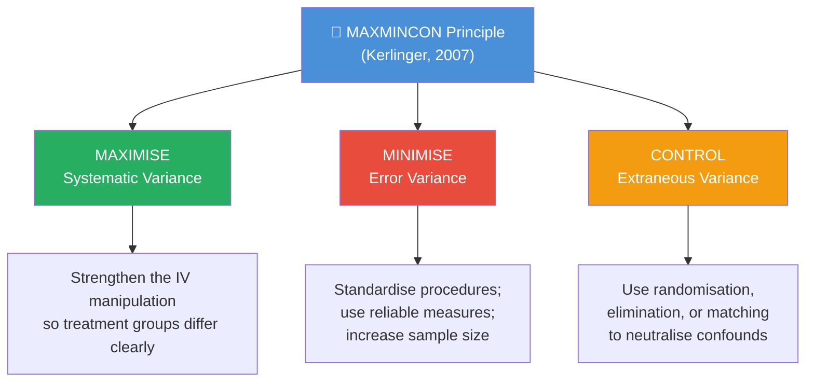

# Research Design: Meaning, Function, and Basic Terminology

## Overview

Every research study needs a blueprint — a detailed plan that guides the investigator from the first research question to the final statistical conclusion. This blueprint is the **research design**. A well-crafted research design answers two fundamental questions: *How will we find answers to our research problem?* and *How will we control the sources of variation that could distort our findings?* This unit introduces the foundational concepts of research design before focusing on the widely used **Single Factor Design**.

---

**Source PDFs:**
- 📄 [Block-3/Unit-1.pdf – Pages 6–8](/pdfs/MPC-005%20Research%20Methods/Block-3/Unit-1.pdf)
- 📚 MPC-005 Research Methods, Block 3

---

## 1.2 Meaning of Research Design

Research design is formally defined as:

> **"The plan, structure, and strategy of investigation conceived so as to obtain answers to research questions and to control variance."** — Kerlinger (2007)

Let us break this three-part definition:

| Component | What it Means | Practical Example |
|-----------|--------------|-------------------|
| **Plan** | The overall scheme/program of research | Deciding to study the effect of sleep deprivation on memory |
| **Structure** | Outline of the research design; the paradigm of variable operation | Assigning 60 participants to 3 sleep-deprivation conditions |
| **Strategy** | Methods to gather and analyse data; how objectives will be reached | Using recall tests scored by blind raters; analysing with ANOVA |

Thyer (1993) adds a practical dimension: a research design specifies (a) how variables will be operationalised, (b) how a sample will be selected, (c) how data will be collected for hypothesis testing, and (d) how results will be analysed.

In brief: **a research design is a plan adopted by the researcher to answer a research question.**

### Why Does Design Matter?

Without a sound design:
- Results may be attributable to **extraneous variables** rather than the independent variable
- Findings may lack **internal validity** (did our manipulation cause the effect?) and **external validity** (do findings generalise?)
- Statistical conclusions may be misleading due to uncontrolled **error variance**

A poorly designed study wastes resources and may produce conclusions that mislead policy, clinical practice, or theory development.

---

## 1.3 Function of Research Design

Kerlinger (2007) identified **two basic purposes** of research design:

1. **Provide answers to research questions** — The design specifies exactly what data to collect and how to analyse it to test hypotheses.
2. **Control variance** — The design maximises sensitivity by managing different sources of variation.

### The MAXMINCON Principle

The statistical heart of research design is the **MAXMINCON Principle**, which governs three types of variance:

| Variance Type | Definition | Control Strategy |
|---------------|-----------|-----------------|
| **Systematic Variance** | Variability in DV *due to the IV manipulation* — the signal we want | **Maximise** by designing strong, meaningful treatment differences |
| **Extraneous Variance** | Variability due to variables other than the IV that may influence the DV | **Control** via randomisation, elimination, or matching |
| **Error Variance** | Variability from uncontrollable factors (measurement error, individual differences not accounted for) | **Minimise** through standardisation and reliable instruments |

**Indian Context:** The MAXMINCON principle is directly applicable in NIMHANS research protocols. For instance, a study on yoga-based interventions for anxiety must maximise the yoga vs. no-yoga difference (clear protocol), control for prior meditation experience (matching), and minimise measurement noise (standardised questionnaires like STAI administered under identical conditions).

---

## 1.4 Basic Terminology in Research Design

Before studying specific designs, mastering the core vocabulary is essential. These terms appear constantly in research reports, IGNOU exam questions, and journal articles.

### i) Factor

The **independent variable** of an experiment is known as a **factor**. An experiment always has at least one factor.

- In a study of the effect of **caffeine** on alertness → *caffeine* is the factor
- In a study of the effect of **teaching method** on achievement → *teaching method* is the factor

### ii) Level

A **level** is a particular *value* of an independent variable. An independent variable has at least two levels (otherwise, there is no comparison to make).

**Example:** If the factor is *reward*, it might have two levels:
- Level 1 → Reward present
- Level 2 → Reward absent (control)

If the factor is *study strategy*, it might have three levels:
- Level 1 → Rereading
- Level 2 → Highlighting
- Level 3 → Self-testing

### iii) Treatment

A **treatment** refers to a *particular set of experimental conditions*. In a 2 × 2 factorial experiment, subjects are assigned to 4 treatments (all combinations of 2 factors × 2 levels each).

**Quick Summary Table:**

| Term | Definition | Example |
|------|-----------|---------|
| Factor | Independent variable | Teaching method |
| Level | Specific value of the IV | Method A, Method B, Method C |
| Treatment | A specific experimental condition | Students taught by Method B |

---

## Memory Aids 🧠

### MAXMINCON Mnemonic
**"MAX the Signal, MIN the Noise, CONtrol the Confounds"**

Or remember it as a research mantra:
- **MAX**imise → Make your IV strong enough to create real differences
- **MIN**imise → Reduce random fluctuations (error) through standardisation
- **CON**trol → Eliminate/neutralise competing explanations

### Factor-Level-Treatment Chain
**"FLT = Factory Line Test"**
- **F**actory = **F**actor (the IV — what you're testing)
- **L**ine = **L**evel (specific values of the factory setting)
- **T**est = **T**reatment (the actual condition each subject experiences)

---

## 🎓 Self-Assessment Questions

**Level 1 — Recall**
1. Write the formal definition of research design as given by Kerlinger (2007). What are the three components (plan, structure, strategy)?
2. What does MAXMINCON stand for, and what are the three types of variance it addresses?
3. Define factor, level, and treatment. Give a single example that illustrates all three.

**Level 2 — Application**
4. A researcher studies the effect of noise level (quiet, moderate, loud) on reading comprehension. Identify: (a) the factor, (b) the levels, (c) a possible extraneous variable, and (d) how the MAXMINCON principle should guide the design.
5. Two students argue about research design: Student A says "Just collect lots of data and analyse it." Student B says "You need a design before you collect a single data point." Who is right, and why?

**Level 3 — Analysis (IGNOU Exam Style)**
6. A researcher claims their study proves that mindfulness reduces depression. However, they only measured depression after the mindfulness program began (no pre-test), and participants chose whether to join the program. Identify the design flaws in terms of variance control using MAXMINCON.

---

## 📚 External Resources

### Essential Reading
- 🔗 [Wikipedia: Research Design](https://en.wikipedia.org/wiki/Research_design) — Comprehensive overview of types and functions of research design
- 🔗 [Wikipedia: Analysis of variance (ANOVA)](https://en.wikipedia.org/wiki/Analysis_of_variance) — Key statistical technique linked to research design
- 🔗 [Simply Psychology: Research Design](https://www.simplypsychology.org/research-methods.html) — Accessible overview of research design concepts

### Educational Videos
- 🎬 [Research Design Overview — Crash Course Statistics](https://www.youtube.com/watch?v=QBKN0rDxZBc) — Clear introduction to research design fundamentals
- 🎬 [Experimental Design — Khan Academy](https://www.khanacademy.org/math/statistics-probability/designing-studies/experiments-stats/v/introduction-to-experimental-design) — Step-by-step experimental design explanation

### Academic Resources
- 📖 Kerlinger, F.N. (2007). *Foundations of Behavioural Research* (10th reprint). Delhi: Surjeet Publications. — Primary textbook for this unit
- 📖 Thyer, B.A. (1993). Single-System research design. In R.M. Grinnell (ed.), *Social Work, Research and Evaluation* (4th ed.). Itasca, Illinois: F.E. Peacock Publishers.

### Recent Research (2020–2025)
- 🔬 Lakens, D. (2022). Sample size justification. *Collabra: Psychology*, 8(1), 33267. — Modern perspective on designing studies with adequate power
- 🔬 Simmons, J. P., Nelson, L. D., & Simonsohn, U. (2021). Pre-registration: Why and how. *Journal of Consumer Psychology*, 31(1), 151–162. — How pre-registration strengthens research design

### Indian Context Resources
- 🔗 [ICSSR Research Methods Guidelines](https://icssr.org) — Indian Council of Social Science Research guidelines on research methodology
- 🔗 [NIMHANS Research Protocols](https://nimhans.ac.in) — Examples of research design in Indian clinical psychology settings

---

## 🔗 Cross-References

- ➡️ **Next:** [Single Factor Design — Between Group Designs](/mpc-005/block-3/single-factor-between-group-designs)
- ➡️ **See also:** [Validity and Threats to Internal Validity](/mpc-005/block-2/threats-to-internal-external-validity) — Understanding how design choices affect validity
- ➡️ **Related:** [Experimental Research and Field Experiments](/mpc-005/block-2/experimental-research-field-experiments) — Broader experimental design context

---

*Research design is not bureaucratic paperwork — it is the intellectual architecture that transforms curiosity into reliable knowledge. A strong design is the single most important decision a researcher makes.*
