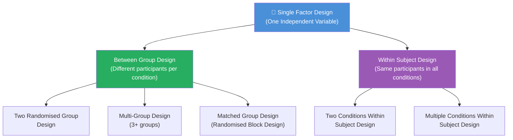
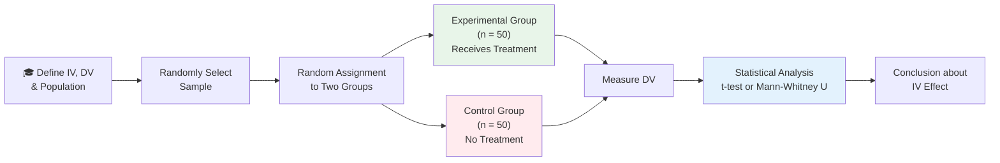

# Single Factor Design: Between Group Designs

## Overview

When a researcher manipulates exactly **one independent variable (factor)**, they are using a **Single Factor Design**. This is the foundational architecture of experimental psychology. Within single factor designs, the most widely used category is the **Between Group Design**, where different participants receive different treatment conditions. This file covers the three main types of between group designs: (1) Two Randomised Group Design, (2) Multi-Group Design, and (3) Matched Group Design.

---

**Source PDFs:**
- 📄 [Block-3/Unit-1.pdf – Pages 7–11](/pdfs/MPC-005%20Research%20Methods/Block-3/Unit-1.pdf)
- 📚 MPC-005 Research Methods, Block 3

---

## 1.5 Single Factor Design — Introduction

A **single factor design** employs only one independent variable. Despite its apparent simplicity, it is the cornerstone of rigorous experimental research. Single factor designs split into two major branches:

In **between group designs**, subjects are assigned at random to different treatment conditions and the effect of different conditions is compared. A subject receives *only one* treatment — they belong to only one group.

---

## Type 1: Two Randomised Group Design

This is the simplest between group design: one **experimental group** (receives the treatment/intervention) and one **control group** (does not receive the treatment).

### How It Works — Step by Step

### Worked Example: Knowledge of Results & Learning

A researcher wants to know: *Does knowledge of results (feedback) improve the rate of learning of school students?*

1. **Define variables:**
   - IV (Factor): Knowledge of results (2 levels: present vs. absent)
   - DV: Rate of learning (test score improvement over sessions)
2. **Sample:** 100 students randomly selected from a city
3. **Random Assignment:** 50 → Experimental Group, 50 → Control Group
4. **Procedure:**
   - Experimental Group → receives detailed feedback after each task
   - Control Group → no feedback
5. **Statistical Test:** Independent samples *t*-test (or Mann-Whitney U if assumptions violated)
6. **Conclusion:** If experimental group learns significantly faster → knowledge of results facilitates learning

### Methods of Random Assignment

Proper randomisation ensures the two groups are equivalent at baseline:

| Method | Procedure | Best For |
|--------|-----------|---------|
| **Table of Random Numbers** | Assign subjects numbers; use random number table to allocate | Large samples |
| **Alphabetical Alternation** | List names alphabetically; assign 1st to E, 2nd to C, 3rd to E... | Simple, quick |
| **Slip Method** | Write names on slips, fold, place in box; draw and alternate assignment | Classroom studies |
| **Computer Randomisation** | Software (SPSS, R, Randomizer.org) generates random allocations | Research studies |

**Key Assumption:** After random assignment, the two groups should *not differ significantly* on any relevant background variable (age, IQ, prior experience). If they do, randomisation may have been inadequate or the sample is too small.

### Statistical Tests for Two-Group Design

| Condition | Recommended Test |
|-----------|-----------------|
| Normal distribution, interval/ratio DV | Independent samples *t*-test |
| Non-normal distribution or ordinal DV | Mann-Whitney U test |
| Comparing proportions | Chi-square test |

**Indian NEET/JEE Analogy:** The two-group design is like comparing two batches of students — one that uses a new study technique and one that uses traditional methods. Random assignment ensures the groups were academically equivalent before the intervention started.

---

## Type 2: Multi-Group Design (More Than Two Randomised Groups)

When researchers need to compare *more than two conditions* of an IV, they use the **multi-group design** (also called a one-way experimental design).

### Structure

- 2+ experimental groups AND a control group, OR
- 3-4 experimental groups only (when no true "no treatment" baseline is meaningful)

### Worked Example: Schedule of Reinforcement & Verbal Learning

Four groups study the same verbal task:

| Group | Condition | Reinforcement Schedule |
|-------|-----------|----------------------|
| G₁ (Experimental) | Fixed Ratio | Every response reinforced |
| G₂ (Experimental) | Fixed Interval | Reinforcement at regular time intervals |
| G₃ (Experimental) | Variable Interval | Reinforcement at random intervals |
| G₄ (Control) | No Reinforcement | No reinforcement |

After the learning trials, all groups are tested and mean scores compared using **One-Way ANOVA**.

### Worked Example: Teaching Methods

An experimenter tests 4 teaching methods with 100 students (25 per group):

- Group A: Method A (lecture-based)
- Group B: Method B (discussion-based)
- Group C: Method C (problem-based learning)
- Group D: Method D (flipped classroom)

All groups take the same achievement test. Analysis reveals which method produced the highest mean score — and post-hoc tests (Duncan Range Test, Tukey's HSD) identify which specific pairs of groups differ.

### Statistical Tests for Multi-Group Design

| Analysis | When to Use |
|----------|-------------|
| **One-Way ANOVA** | Comparing means across 3+ groups (parametric) |
| **Duncan Multiple Range Test** | Post-hoc pairwise comparisons after significant ANOVA |
| **Kruskal-Wallis test** | Non-parametric alternative to one-way ANOVA |
| **Tukey's HSD** | Post-hoc comparisons controlling family-wise error rate |

**Why Not Run Multiple t-Tests?**
If you run 3 separate *t*-tests on 3 groups, each at α = .05, the probability of at least one false positive (Type I error) exceeds 14%. ANOVA preserves the experiment-wise error rate at α = .05.

---

## Type 3: Matched Group Design (Randomised Block Design)

Also known as the **Randomised Block Design** (Edwards, 1968), this approach addresses a limitation of pure random assignment: by chance, groups might still differ on an important variable. Matching *deliberately* equates the groups on a key variable *before* random assignment.

### The Matching Logic

1. **Identify the matching variable** — must correlate with the DV but be distinct from the IV
2. **Pre-test all subjects** on the matching variable
3. **Form pairs/sets** of subjects with similar scores
4. **Randomly assign** one member of each pair to each group
5. **Administer treatments** and measure the DV

### Key Rule for Matching Variable Selection

> "The matching variable should have high correlation with the dependent variable." — MPC-005 Unit-1

If matching is done on a variable weakly related to the DV, you gain little precision but lose degrees of freedom — a bad trade.

### Method A: Matching by Pairs

**Example: Two Teaching Methods and Mathematical Achievement**

1. Matching variables: IQ + prior math achievement
2. All 60 students take a baseline math achievement test
3. Students scoring 80 are paired together: one → Method A group, one → Method B group
4. Both groups are taught (one group per method) and retested
5. **Analysis:** Paired *t*-test (or Wilcoxon signed-rank test)

### Method B: Matching by Mean and Standard Deviation

When person-to-person pairing is impractical, researchers match the groups so they have equivalent means and SDs on the matching variable.

**Example:**
- Matching variable: IQ scores
- Group 1: Mean IQ = 105.3, SD = 12.1
- Group 2: Mean IQ = 105.7, SD = 11.9
- The groups are now roughly equivalent in intelligence before the treatment begins

### Comparison: Randomised vs. Matched Group Design

| Feature | Two Randomised Groups | Matched Group Design |
|---------|----------------------|---------------------|
| How groups are formed | Pure random assignment | Pre-test → pair → random assignment |
| Controls for | Chance differences (probabilistically) | Known confound (systematically) |
| Sample size needed | Larger (to rely on randomisation) | Can be smaller (matching increases precision) |
| Best when... | Matching variable is unknown or unavailable | Key correlate of DV is known and measurable |
| Statistical test | Independent *t*-test / ANOVA | Paired *t*-test / Repeated measures ANOVA |
| Degrees of freedom | Higher | Lower (cost of matching) |

**Indian Context:** In UPSC/administrative research on policy effectiveness, matched group designs are preferred when comparing districts or schools — units that vary naturally on socioeconomic status. Matching on baseline economic indicators before testing a new policy intervention controls for pre-existing disparities.

---

## Memory Aids 🧠

### "RMM" — Three Between-Group Types
**"Random, More, Match"**
- **R**andom two groups → Two Randomised Group Design
- **M**ore groups → Multi-Group Design
- **M**atch → Matched Group Design

### Matching Decision Rule
**"CORR = Match is Worth It"**  
If the matching variable **COR**relates with the DV → use matching. If correlation is low → skip matching (you'll lose df without gaining precision).

---

## 🎓 Self-Assessment Questions

**Level 1 — Recall**
1. What is a single factor design? When is it used?
2. What is the difference between experimental group and control group in a two randomised group design?
3. Name the two matching methods in matched group design. When is each preferred?

**Level 2 — Application**
4. A psychologist studies the effect of three types of therapy (CBT, DBT, supportive counselling) on depression scores. (a) What type of design is this? (b) What statistical test should be used? (c) What post-hoc test would reveal which specific therapies differ?
5. A researcher matches students on their previous exam scores before assigning them to "spaced practice" or "massed practice" conditions. What type of design is this? Why might it be more powerful than a purely randomised two-group design?

**Level 3 — Analysis (IGNOU Exam Style)**
6. An educational psychologist wants to compare four teaching strategies (A, B, C, D) for a class of 80 students. Design the complete study: specify random assignment procedure, treatment conditions, DV measurement, appropriate statistical test, and how you would control extraneous variables.

---

## 📚 External Resources

### Essential Reading
- 🔗 [Wikipedia: Randomized controlled trial](https://en.wikipedia.org/wiki/Randomized_controlled_trial) — The gold standard between-group design in clinical research
- 🔗 [Wikipedia: Blocking (statistics)](https://en.wikipedia.org/wiki/Blocking_(statistics)) — Statistical explanation of matched/randomised block designs
- 🔗 [Simply Psychology: Experimental Design](https://www.simplypsychology.org/experimental-designs.html) — Clear comparison of between-subject and within-subject approaches

### Educational Videos
- 🎬 [Between-Subjects vs Within-Subjects Design — Research By Design](https://www.youtube.com/watch?v=iRBmjQh3B0w) — Clear visual explanation of design types
- 🎬 [Randomised Controlled Trials Explained — Cochrane](https://www.youtube.com/watch?v=hEMNKLBMojo) — How randomisation works in practice

### Academic References
- 📖 Kerlinger, F.N. (2007). *Foundations of Behavioural Research* (10th reprint). Delhi: Surjeet Publications.
- 📖 Edwards, A.L. (1968). *Experimental Design in Psychological Research*. New York: Holt, Rinehart & Winston. — Original source for Randomised Block Design terminology
- 📖 McBurney, D.H. & White, T.L. (2007). *Research Methods* (7th ed.). Delhi: Thomson Wadsworth.

### Recent Research (2020–2025)
- 🔬 Schulz, K.F., & Grimes, D.A. (2020). Randomisation in clinical trials: Seizing the unknown. *Lancet Series on Research Methods*. — Modern randomisation strategies
- 🔬 Imai, K., King, G., & Stuart, E.A. (2021). Misunderstandings between experimentalists and observationalists about causal inference. *Journal of the Royal Statistical Society*, 171(2), 481–502. — Why proper matching matters
- 🔬 Rubin, D.B. (2022). Causal inference using potential outcomes. *Journal of the American Statistical Association*, 100(469), 322–331. — Foundational theory underlying between-group designs

### Online Tools
- 🔗 [Randomizer.org](https://www.randomizer.org) — Free tool for random assignment of participants to groups
- 🔗 [G*Power Software](https://www.psychologie.hhu.de/arbeitsgruppen/allgemeine-psychologie-und-arbeitspsychologie/gpower) — Calculate sample size requirements for between-group designs

---

## 🔗 Cross-References

- ⬅️ **Previous:** [Research Design: Meaning, Function, and Terminology](/mpc-005/block-3/research-design-meaning-function-terminology)
- ➡️ **Next:** [Single Factor Design — Within Subject Designs](/mpc-005/block-3/single-factor-within-subject-designs)
- ➡️ **Related:** [Types of Experimental Research Designs](/mpc-005/block-2/types-experimental-research-designs) — Broader classification of experimental approaches
- ➡️ **Related:** [Threats to Internal and External Validity](/mpc-005/block-2/threats-to-internal-external-validity) — How design choices protect against validity threats

---

*Between group designs are the methodological backbone of experimental psychology. Mastering when and how to use two-group, multi-group, and matched designs positions you to both conduct rigorous research and critically evaluate the research you encounter as a practitioner.*
