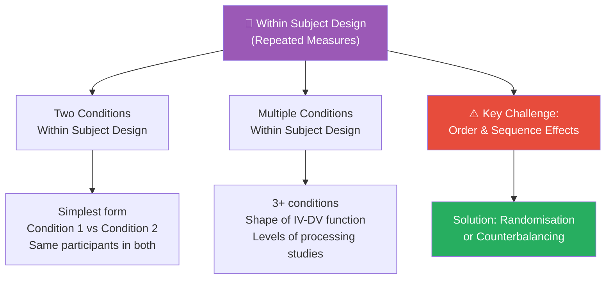
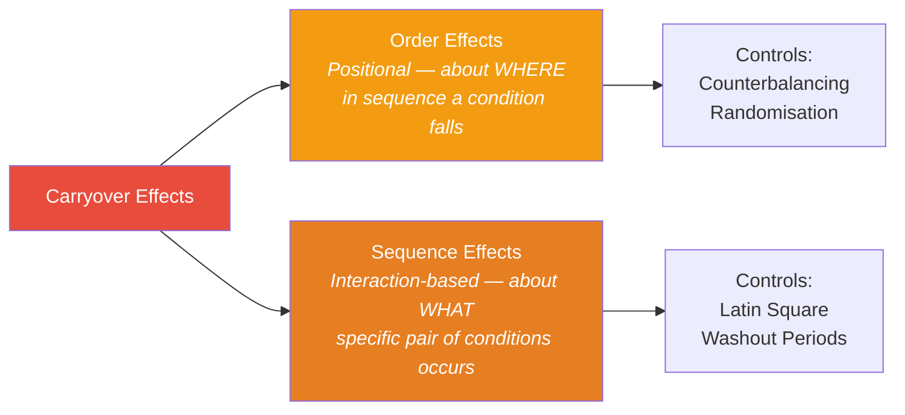
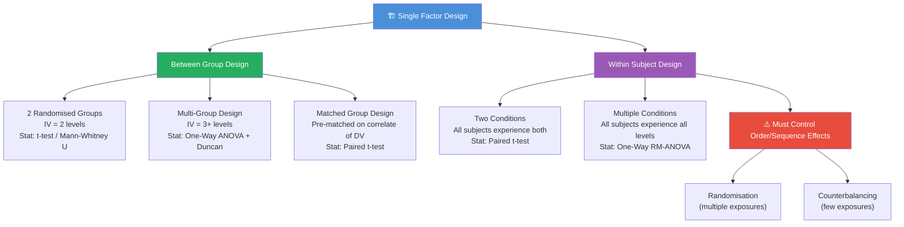

# Single Factor Design: Within Subject (Repeated Measures) Designs

## Overview

While between group designs use *different* participants in each condition, **within subject designs** use the *same* participants across *all* conditions. This elegant approach eliminates individual differences as a source of error, dramatically increasing statistical power. However, it introduces its own challenges — most critically, **carryover effects**, **order effects**, and **sequence effects** that must be controlled through counterbalancing or randomisation. This file completes the Single Factor Design by covering within subject approaches and directly comparing them with between group designs.

---

**Source PDFs:**
- 📄 [Block-3/Unit-1.pdf – Pages 11–14](/pdfs/MPC-005%20Research%20Methods/Block-3/Unit-1.pdf)
- 📚 MPC-005 Research Methods, Block 3

---

## Within Subject Design — Core Concept

**Within subject design** (also called **repeated measures design**) is one where:
- The **same individual** is exposed to **multiple treatment conditions** (at different times)
- Their scores after each treatment are compared

The logic: since each person serves as their own control, individual differences in personality, ability, or background are *automatically controlled*. You compare the person under Condition 1 vs. the same person under Condition 2.

**Simple Example:**
A researcher studies the effect of **three colours** (red, green, yellow) on **reaction time**. Instead of needing 30 subjects (10 per colour), they can use 10 subjects and expose each to all three colours. Each participant's reaction time under each colour is recorded and compared.

---

## Types of Within Subject Design

Within subject designs divide into two categories based on number of conditions:

---

## Type 1: Two Conditions Within Subject Design

The **simplest** within subject design: two conditions (Condition 1 and Condition 2), with every subject experiencing **both** conditions.

**Example: Reaction time to Red vs. Green**
- 10 subjects selected
- Each subject responds to both red light and green light
- Reaction times are recorded for each
- Paired *t*-test compares mean reaction times across the two colours

**Why It's Less Common Than Expected:**
Despite its simplicity, this design is *underused* in practice because:
1. Many experiments involve **more than two conditions** — making a multiple-condition design more efficient
2. **Carryover effects** from one condition can contaminate performance in the second

---

## Type 2: Multiple Conditions Within Subject Design

Psychology experiments frequently need to compare **several treatments or levels** of an IV. Multiple conditions within subject design allows this with the same participants across all conditions — providing greater statistical precision.

### Classic Example: Levels of Processing (Craik & Tulving, 1975)

This landmark study beautifully illustrates the multiple conditions within subject design:

**Research Question:** Do different processing strategies affect word memory?

**Design:**
- Same subjects processed words using three strategies (three conditions):

| Condition (Treatment) | Strategy | Question Asked Before Each Word |
|----------------------|----------|-------------------------------|
| T₁ | Visual/Structural | "Is the word in CAPITAL LETTERS?" |
| T₂ | Acoustic/Phonemic | "Does the word rhyme with TRAIN?" |
| T₃ | Semantic/Meaning | "Does the word fit in this sentence?" |

**Table 1.1: Subject × Treatment Matrix**

| Subjects | T₁ (Visual) | T₂ (Acoustic) | T₃ (Semantic) |
|----------|-------------|--------------|--------------|
| 1 | S₁ | S₁ | S₁ |
| 2 | S₂ | S₂ | S₂ |
| 3 | S₃ | S₃ | S₃ |
| ... | ... | ... | ... |
| N | Sₙ | Sₙ | Sₙ |

Every subject (S) appears in every treatment column — the hallmark of within subject design.

**Results:**

| Processing Level | Recognition Rate |
|-----------------|-----------------|
| Visual (structural) | 18% |
| Acoustic (phonemic) | 70% |
| Semantic (meaning) | 96% |

**Conclusion:** Deeper processing → better memory. The experiment elegantly demonstrated the levels-of-processing framework using a within subject design, because the same subjects could experience all three processing strategies.

**Another Use Case — Psychophysical Functions:**
When a researcher wants to know how *sensation* relates to *stimulus intensity* (e.g., how perceived brightness increases with light intensity), they present each intensity level to the same subjects and plot the function. Using different subjects for each intensity would require massive samples; within subject design makes this efficient.

---

## Controlling Order and Sequence Effects

The Achilles' heel of within subject design is **carryover**: when experiencing Condition A first changes how a participant performs in Condition B.

### Two Types of Carryover Effects

**Order Effects** (McBurney & White, 2007):
> "Those that result from the *ordinal position* in which the condition appears in an experiment, regardless of the specific condition experienced."

Examples of order effects:
- **Fatigue**: Subjects are more tired by the 3rd condition, regardless of what it is
- **Practice**: Subjects perform better on later conditions due to experience
- **Sensitisation**: Earlier conditions make subjects more alert to what's being tested

**Sequence Effects** (McBurney & White, 2007):
> "Those that depend on an *interaction between specific conditions* of the experiment."

Examples of sequence effects:
- **Contrast effects**: A moderate weight feels lighter after a heavy weight (assimilation/contrast)
- **Adaptation**: A loud noise seems less loud if preceded by an even louder noise
- **Specific carryover**: Drug A from Condition 1 is still in the bloodstream during Condition 2

### Control Method 1: Randomisation

When each condition is presented **several times** to each subject, the sequence can be randomised to balance out order effects.

**Example (4 conditions, each presented twice):**
- Subject 1: BCAD, ADCB
- Subject 2: CDBA, BADC
- Subject 3: ADBC, CBDA

With enough subjects and random sequences, order effects average out across the experiment.

### Control Method 2: Counterbalancing

When conditions can only be presented **a few times** each, counterbalancing systematically assigns different subjects to different orders so that each condition appears in each ordinal position an equal number of times.

**Example (3 conditions: A, B, C):**

**Reverse Counterbalancing (simplest):**
- Half the subjects: A → B → C
- Other half: C → B → A

**Complete Counterbalancing (all possible orders):**

| Group | Order |
|-------|-------|
| Group 1 | A, B, C |
| Group 2 | A, C, B |
| Group 3 | B, A, C |
| Group 4 | B, C, A |
| Group 5 | C, A, B |
| Group 6 | C, B, A |

With 3 conditions, there are 3! = 6 possible orders. Complete counterbalancing ensures each order is used, so every condition appears first, second, and third an equal number of times.

**Latin Square Counterbalancing** (for larger numbers of conditions):

| | Position 1 | Position 2 | Position 3 | Position 4 |
|-|-----------|-----------|-----------|-----------|
| Group 1 | A | B | D | C |
| Group 2 | B | C | A | D |
| Group 3 | C | D | B | A |
| Group 4 | D | A | C | B |

Each condition appears in each position exactly once — a computationally elegant solution.

**Indian UPSC/IGNOU Exam Tip:** Questions often ask: "What is the difference between order effects and sequence effects, and how do you control them?" Remember: *order = position; sequence = specific pair. Control: counterbalancing for order, Latin square or washout for sequence.*

---

## Comparing Between Group and Within Subject Designs

This is a fundamental comparison that appears frequently in IGNOU MAPC examinations.

| Feature | Between Group Design | Within Subject Design |
|---------|---------------------|----------------------|
| **Participants per group** | Different participants | Same participants |
| **Treatment assignment** | Each subject → 1 treatment only | Each subject → all treatments |
| **Individual difference control** | Via randomisation (probabilistic) | Automatically eliminated (each person is own control) |
| **Statistical power** | Lower (individual differences inflate error variance) | Higher (individual differences removed from error term) |
| **Sample size needed** | Larger | Smaller (more efficient) |
| **Main threat** | Chance imbalance between groups | Carryover, order, sequence effects |
| **Control strategy** | Randomisation / matching | Counterbalancing / randomisation of order |
| **Best for** | Irreversible treatments; learning/practice effects likely | Short, reversible treatments; rare/special populations |

### When to Use Which?

**Prefer Between Group Design when:**
- Treatment has permanent/irreversible effects (e.g., surgery, learning a skill — can't "unlearn")
- High likelihood of practice or carryover effects from one condition to the next
- The IV involves a long time period (longitudinal study)
- Demand characteristics: if subjects experience all conditions, they might guess the hypothesis

**Prefer Within Subject Design when:**
- Small number of subjects available
- Subjects are available for extended experimentation
- Number of treatment conditions is small (to minimise carryover risk)
- Eliminating individual differences is crucial for detecting small effects

**Clinical Analogy:** 
Testing two pain medications: if you use between-group design, you need 200 patients (100 per drug). If you use within-subject design with a washout period between drugs, you need only 100 patients — and you have greater power to detect differences because each patient's baseline pain level is controlled. *However*, if Drug A affects the body in ways that persist into the Drug B period, sequence effects contaminate your results.

---

## Summary: Single Factor Design — Complete Picture

---

## Memory Aids 🧠

### "WIRE" — Within Subject Design Advantages
**"WIRE in every socket"** — same participants (WIRE) plugged into every condition:
- **W**ork with fewer participants
- **I**ndividual differences eliminated
- **R**epeated testing increases precision
- **E**fficiency in data collection

### Order vs. Sequence — The "Traffic Light" Metaphor
- **Order effect** = It matters whether you're the 1st, 2nd, or 3rd car (position matters, regardless of which car)
- **Sequence effect** = What happened to the car *right before you* at the light affects *your* behaviour (the specific pair matters)
- **Counterbalancing** = Rotating through the lanes so every car gets every position

### "REPS" — When to Choose Repeated Measures (Within Subject)
- **R**are or small group of participants
- **E**fficiency is important (reduce sample size)
- **P**ermanent or irreversible effects NOT expected
- **S**hort treatment conditions with washout possible

---

## 🎓 Self-Assessment Questions

**Level 1 — Recall**
1. Define within subject design. Why is it also called "repeated measures design"?
2. What is the difference between order effects and sequence effects? Give one example of each.
3. Describe reverse counterbalancing with an example of three conditions (A, B, C).

**Level 2 — Application**
4. A researcher wants to test the effect of three background music types (no music, classical, pop) on reading comprehension in university students. (a) Should they use a within subject or between group design? Justify. (b) If within subject, how should they counterbalance? (c) What statistical test is appropriate?
5. The Craik and Tulving (1975) levels-of-processing experiment is often cited as a classic within subject design. Why would a between-group design have been less appropriate for this study?

**Level 3 — Analysis (IGNOU Exam Style)**
6. A student argues: "Within subject designs are always better because you need fewer participants and you eliminate individual differences." Critically evaluate this claim. Under what circumstances would a between group design be preferable despite requiring more participants?

---

## 📚 External Resources

### Essential Reading
- 🔗 [Wikipedia: Repeated measures design](https://en.wikipedia.org/wiki/Repeated_measures_design) — Comprehensive overview of within subject designs
- 🔗 [Wikipedia: Counterbalancing](https://en.wikipedia.org/wiki/Counterbalancing_(psychology)) — Explanation of counterbalancing techniques in psychology
- 🔗 [PsychologyConcepts: Within-Subjects Design](https://www.psychologyconcepts.com/within-subjects-design/) — Accessible overview with examples

### Educational Videos
- 🎬 [Within-Subjects Design Explained — Statistics How To](https://www.youtube.com/watch?v=BKBGl0kXTZM) — Clear walkthrough of repeated measures logic
- 🎬 [Counterbalancing in Psychology Experiments — Research Methods](https://www.youtube.com/watch?v=VWxq5CKSWo4) — Visual explanation of counterbalancing strategies

### Academic References
- 📖 McBurney, D.H. & White, T.L. (2007). *Research Methods* (7th ed.). Delhi: Thomson Wadsworth. — Primary source for order/sequence effect definitions
- 📖 Kerlinger, F.N. (2007). *Foundations of Behavioural Research* (10th reprint). Delhi: Surjeet Publications.

### Classic Research
- 🔬 Craik, F.I.M., & Tulving, E. (1975). Depth of processing and the retention of words in episodic memory. *Journal of Experimental Psychology: General*, 104(3), 268–294. — The landmark levels-of-processing study discussed in this unit
- 🔬 Maxwell, S.E., & Delaney, H.D. (2004). *Designing Experiments and Analyzing Data* (2nd ed.). Lawrence Erlbaum. — Comprehensive treatment of within and between designs

### Recent Research (2020–2025)
- 🔬 Matuschek, H., Kliegl, R., Vasishth, S., Baayen, H., & Bates, D. (2020). Balancing Type I error and power in linear mixed models. *Journal of Memory and Language*, 94, 305–315. — Modern statistical approaches for repeated measures data
- 🔬 Singmann, H., & Kellen, D. (2019). An introduction to mixed models for experimental psychology. In D.H. Spieler & E. Schumacher (Eds.), *New Methods in Cognitive Psychology*. Routledge. — Mixed models as alternative to traditional RM-ANOVA

### Online Tools
- 🔗 [Latin Square Generator](https://www.statmethods.net) — Generate counterbalanced Latin square sequences
- 🔗 [G*Power for Repeated Measures](https://www.psychologie.hhu.de/arbeitsgruppen/allgemeine-psychologie-und-arbeitspsychologie/gpower) — Calculate sample size for within subject designs

---

## 🔗 Cross-References

- ⬅️ **Previous:** [Single Factor Design — Between Group Designs](/mpc-005/block-3/single-factor-between-group-designs)
- ➡️ **Next:** [Factorial Design: Meaning and Concepts](/mpc-005/block-3/factorial-design-meaning-concepts) — Next unit in Research Methods
- ➡️ **Related:** [Threats to Internal and External Validity](/mpc-005/block-1/validity-types-threats) — Carryover and order effects as threats to internal validity
- ➡️ **Related:** [Reliability in Psychological Research](/mpc-005/block-1/reliability-concepts-methods) — Statistical precision connects to design choice

---

*The elegance of within subject design lies in the simple insight that your best control group is the participant themselves — but this power comes with the responsibility to carefully manage the order in which participants encounter conditions. Master counterbalancing, and you master one of psychology's most powerful methodological tools.*
