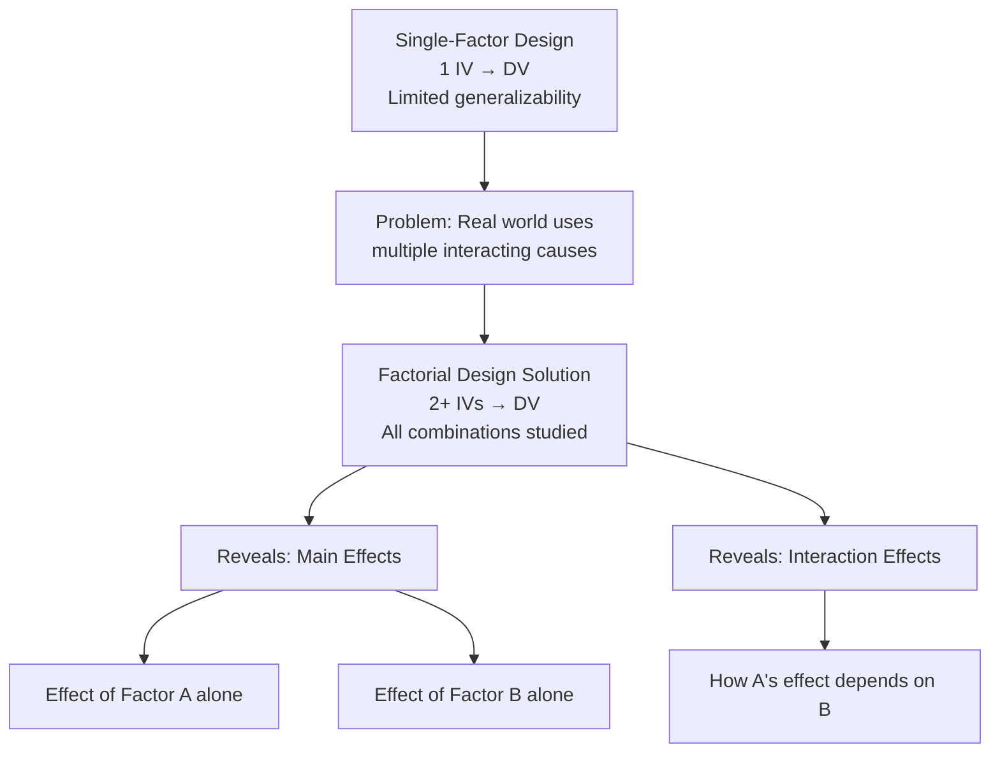
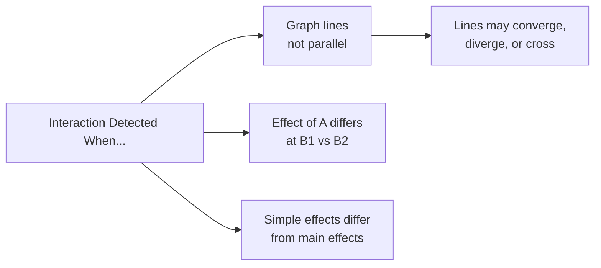

# Factorial Design: Meaning, Core Concepts, and Terminology

## Introduction

When psychologists study human behaviour, they rarely encounter phenomena driven by a single isolated cause. Emotions, cognition, learning, and performance are shaped by the simultaneous interplay of multiple variables. A student's exam score depends not only on study time, but also on anxiety levels, sleep quality, and motivation. Studying each factor in isolation produces an incomplete — and sometimes misleading — picture.

**Factorial design** is the solution. It is an experimental design that allows researchers to study the effects of **two or more independent variables simultaneously**, including how those variables interact with each other. This unit introduces the meaning, terminology, and foundational logic of factorial designs.

:::info Source PDF
📄 [Block-3/Unit-2.pdf — Pages 16–26](/pdfs/MPC-005%20Research%20Methods/Block-3/Unit-2.pdf)  
📚 MPC-005 Research Methods
:::

---

## 2.2 Meaning of Factorial Design

A **factorial design** is a research design in which **two or more independent variables (factors) are studied simultaneously**, with every possible combination of the levels of each variable included in the design.

**Formal Definitions:**

- **McBurney & White (2007):** A factorial design is one in which two or more variables or factors are employed in such a way that all the possible combinations of selected values of each variable are used.
- **Singh (1998):** A design in which selected values of two or more independent variables are manipulated in all possible combinations so that their independent as well as interactive effects upon the dependent variable may be studied.

**Key insight:** In a single-factor experiment, only one independent variable is varied while all others are held constant. Factorial design removes this constraint — multiple factors are varied together, allowing the study of both **main effects** (each factor alone) and **interaction effects** (factors working together).

**Why factorial design matters:** Variables do not act independently in nature. They act in concert — sometimes reinforcing each other, sometimes cancelling each other out, sometimes creating entirely new effects that neither variable produces alone.

---

## 2.3 Terms Related to Factorial Design

Understanding factorial design requires clarity on six core terms:

### 2.3.1 Factor (Independent Variable)

A **factor** is any independent variable manipulated in the experiment. Factors can be:

1. **Directly manipulated** — The researcher controls the variable. Example: dosage of a drug (2mg, 4mg, 6mg administered by researcher).
2. **Selected through sampling** — The researcher cannot manipulate the variable; subjects are categorized by it. Example: age groups (young adults, middle-aged, elderly) selected by choosing participants.

**Example:** A researcher studies drug recovery. Factor A = Drug dosage (3 levels: 2mg, 4mg, 6mg); Factor B = Age group (3 levels: young, middle, elderly). Both are factors — one directly manipulated, one selected.

### 2.3.2 Levels

**Levels** are the specific values or conditions within each factor. A 2×3 factorial has Factor A with 2 levels and Factor B with 3 levels, creating 6 treatment combinations.

### 2.3.3 Main Effect

The **main effect** is the overall effect of one factor on the dependent variable, **averaged across all levels of the other factor(s)**.

Think of it as: "Ignoring everything else, what does Factor A do to the outcome?"

**Example:** In a study of diet and exercise on cholesterol:
- Main effect of exercise = average cholesterol reduction from exercise, regardless of diet
- Main effect of diet = average cholesterol reduction from diet, regardless of exercise

Main effect is calculated from **row means** or **column means** in the data table.

### 2.3.4 Interaction Effect

An **interaction** occurs when **the effect of one independent variable depends on the level of another independent variable**.

**McBurney & White (2007):** Interaction means when the effect of one independent variable depends on the level of another independent variable.

An interaction is the *variation* among the differences between means for different levels of one factor over different levels of the other factor.

**Cholesterol clinic example:**
- Exercise alone reduces cholesterol ✓ (main effect of exercise)
- Diet A alone reduces cholesterol ✓ (main effect of diet A)
- Diet B alone reduces cholesterol ✓ (main effect of diet B)
- Diet A + Exercise = combined benefit (additive) — No extra interaction
- **Diet B + Exercise = extra reduction BEYOND the sum of both main effects** — This is the **interaction effect**

Graphically: If lines representing different conditions are **not parallel** in a line graph, an interaction is present.

### 2.3.5 Types of Interaction

Three major types of interactions are recognized:

| Type | Definition | Example |
|------|-----------|---------|
| **Antagonistic** | Two IVs reverse each other's effect; main effects may be non-significant | Drug A increases alertness; Drug B increases alertness; but A+B causes sedation |
| **Synergistic** | Higher level of one IV enhances the effect of another IV | Caffeine + noise each improve alertness; together, they dramatically improve it |
| **Ceiling Effect** | Higher level of one IV reduces the differential effect of another | Both easy and hard tasks are performed at ceiling when motivation is very high |

All three are common in psychological research.

### 2.3.6 Randomization

**Randomization** is the process by which experimental units (participants) are **allocated to treatment conditions by a random process** — not by any subjective decision. Every participant must have an equal probability of being assigned to any condition.

**Purpose:** Controls for confounding variables and prevents systematic bias in group assignment.

### 2.3.7 Blocking

**Blocking** is the procedure of **grouping experimental units into homogeneous clusters** (blocks) before randomly allocating treatments within each block.

**Example:** If studying the effect of two teaching methods on learning, students may first be grouped (blocked) by prior GPA. Teaching methods are then randomly assigned within each GPA block. This controls for pre-existing differences in ability.

---

## Notation System: Reading Factorial Design Labels

Factorial designs are named using a **notation system** that indicates the number of levels of each factor:

| Notation | Meaning | Cells | Variables |
|----------|---------|-------|-----------|
| 2×2 | 2 factors, each with 2 levels | 4 | 2 IVs |
| 2×3 | 2 factors; one with 2, one with 3 levels | 6 | 2 IVs |
| 2×2×2 | 3 factors, each with 2 levels | 8 | 3 IVs |
| 3×3×4 | 3 factors; 3, 3, and 4 levels | 36 | 3 IVs |

The number of conditions (cells) equals the **product of all levels**: 2×3 = 6 cells; 2×2×3 = 12 cells.

---

## Classic Example: Tulving & Pearlstone (1965)

This landmark memory study elegantly illustrates factorial design:

**Factors:**
- Factor A (Word List Length): 3 levels — 12 words, 24 words, 48 words
- Factor B (Retrieval Cue): 2 levels — Cued recall (category names given), Free recall (no cues)
- Design: 3×2 = 6 conditions (cells)

| | 12 Words (A₁) | 24 Words (A₂) | 48 Words (A₃) | Row Mean |
|---|---|---|---|---|
| Cued Recall (B₁) | 10 | 13 | 19 | **14** |
| Free Recall (B₂) | 10 | 15 | 29 | **18** |
| Column Mean | **10** | **14** | **24** | |

**Reading the results:**
- **Main effect of A** (word list length): Column means (10, 14, 24) show longer lists → more words recalled overall
- **Main effect of B** (cue presence): Row means (14 vs 18) show free recall recall slightly more words overall — but this is misleading!
- **Interaction**: Look carefully — with 12 words, cued and free recall are identical (10 vs 10). With 48 words, free recall is dramatically better (19 vs 29). The effect of cues **depends on** how many words there are — that's interaction!

---

## Why Factorial Design Beats Single-Factor Studies

| Dimension | Single-Factor | Factorial Design |
|-----------|--------------|-----------------|
| Variables studied | 1 | 2 or more |
| Interaction effects | Cannot detect | Explicitly tested |
| Ecological validity | Low (artificial isolation) | Higher (mirrors real complexity) |
| Information per participant | Limited | Highly efficient |
| Generalizability | Narrow | Broader |

> **Key principle:** Factorial design provides *more complete information* than single-factor designs using the *same or fewer participants*.

---

## Indian Psychology Context

Factorial designs are widely used in Indian psychological research:

- **Academic performance studies:** Factors include teaching method × socioeconomic status × medium of instruction (Hindi/English)
- **NEET/JEE coaching:** Coaching type × anxiety level × sleep duration studied as interacting factors on exam performance
- **NIMHANS clinical studies:** Treatment modality × cultural background studied as factors in psychiatric outcomes
- **Rural-urban psychology:** Location (rural/urban) × gender × education level examined as factorial combinations

Interaction effects are particularly important in Indian contexts where cultural variables often moderate the effects of psychological interventions — a finding that challenges WEIRD-biased (Western, Educated, Industrialized, Rich, Democratic) generalizations.

---

## Memory Aid: FILM Mnemonic

**F**actors = Independent variables in the design  
**I**nteraction = Effect of A depends on level of B  
**L**evels = Values each factor takes  
**M**ain effect = Average effect of one factor, ignoring others  

---

## External Resources

### Wikipedia
- 🌐 [Factorial Experiment — Wikipedia](https://en.wikipedia.org/wiki/Factorial_experiment)
- 🌐 [Interaction (Statistics) — Wikipedia](https://en.wikipedia.org/wiki/Interaction_(statistics))
- 🌐 [Analysis of Variance (ANOVA) — Wikipedia](https://en.wikipedia.org/wiki/Analysis_of_variance)

### Educational Videos
- 🎥 [Factorial ANOVA — CrashCourse Statistics](https://www.youtube.com/watch?v=4Dnkvs4SZkI)
- 🎥 [Interaction Effects in Factorial Designs — Statistics Learning Centre](https://www.youtube.com/watch?v=oVgkHC87KSY)

### Research Papers
- 📄 Tulving, E., & Pearlstone, Z. (1966). Availability versus accessibility of information in memory for words. *Journal of Verbal Learning and Verbal Behavior, 5*(4), 381–391.
- 📄 Godden, D. R., & Baddeley, A. D. (1975). Context-dependent memory in two natural environments: On land and underwater. *British Journal of Psychology, 66*(3), 325–331.
- 📄 Kerlinger, F. N., & Lee, H. B. (2000). *Foundations of Behavioral Research* (4th ed.). Harcourt College.

### Online Resources
- 🔗 [Understanding Interaction Effects — UCLA Statistics](https://stats.oarc.ucla.edu/spss/seminars/interaction-effects/)
- 🔗 [Factorial Designs — Research Methods Knowledge Base](https://conjointly.com/kb/factorial-design/)
- 🔗 [Main Effects vs Interactions — Statistics How To](https://www.statisticshowto.com/interaction-effect/)
- 🔗 [ANOVA Factorial — NIST Engineering Statistics Handbook](https://www.itl.nist.gov/div898/handbook/prc/section4/prc427.htm)

---

## Self-Assessment Questions

**Level 1 — Recall**
1. Define factorial design in your own words. How does it differ from a single-factor design?
2. What is the difference between a main effect and an interaction effect?

**Level 2 — Understanding**
3. In a 2×3 factorial design, how many conditions (cells) are there? How many main effects can be tested?
4. A study examines the effects of sleep deprivation (deprived vs. rested) and caffeine (none, low, high) on reaction time. Identify: (a) the factors, (b) the levels of each factor, (c) the number of conditions, and (d) the number of possible main effects.

**Level 3 — Application**
5. A study finds that studying in silence improves performance for introverts but has no effect on extroverts. Studying with background music improves performance for extroverts but hurts introverts. Draw a graph of this pattern. What type of interaction does this represent?

**True/False (from PDF)**
- Factorial design is used to study the effect of one independent variable. [**False**]
- Interaction effect can be studied by single factor design. [**False**]
- The independent variables of an experiment are known as factors of the experiment. [**True**]
- The 2×2 design means two independent variables with two levels each. [**True**]

---

## Quick Reference: Key Terms

| Term | Definition |
|------|-----------|
| **Factorial Design** | Design with 2+ factors, all combinations studied |
| **Factor** | An independent variable in the experiment |
| **Level** | A specific value or condition of a factor |
| **Main Effect** | Effect of one factor averaged across all levels of others |
| **Interaction** | When effect of A depends on level of B |
| **Antagonistic Interaction** | IVs reverse each other's effect |
| **Synergistic Interaction** | IVs reinforce each other's effect |
| **Ceiling Effect Interaction** | One IV reduces the differential effect of another |
| **Randomization** | Random assignment of units to conditions |
| **Blocking** | Grouping homogeneous units before random assignment |

---

*Next: [Types of Factorial Design — Within, Between, and Mixed Designs →](/mpc-005/block-3/factorial-design-types-layouts)*
