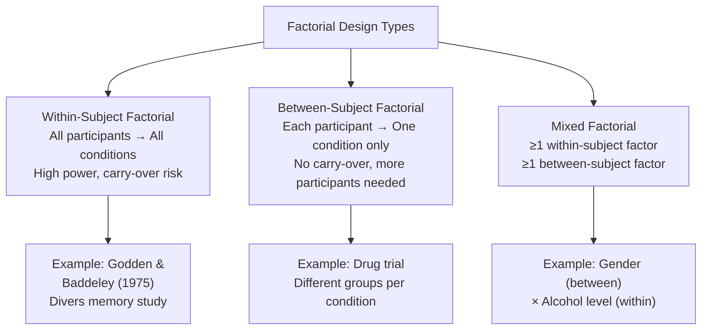
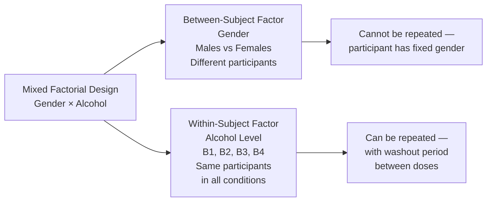

# Types of Factorial Design: Within-Subject, Between-Subject, and Mixed Designs

## Introduction

Once a researcher decides to use a factorial design, the next critical question is: **Should participants experience all conditions or only some?** This choice determines whether the design is a *within-subject*, *between-subject*, or *mixed* factorial design. Each has different implications for statistical power, participant burden, carry-over effects, and practical feasibility.

This unit explores all three types with classic psychological experiments, layout tables, and practical guidance for choosing the right design.

:::info Source PDF
📄 [Block-3/Unit-2.pdf — Pages 23–26](/pdfs/MPC-005%20Research%20Methods/Block-3/Unit-2.pdf)  
📚 MPC-005 Research Methods
:::

---

## 2.4.1 Layout of Factorial Design: A Visual Foundation

Before exploring the types, understanding the **standard layout** is essential.

### 2×2 Factorial Design Layout

The simplest factorial design: 2 factors, each with 2 levels = 4 cells.

| | **Factor A: Level A₁** | **Factor A: Level A₂** |
|---|---|---|
| **Factor B: Level B₁** | Cell A₁B₁ | Cell A₂B₁ |
| **Factor B: Level B₂** | Cell A₁B₂ | Cell A₂B₂ |

Each cell represents one experimental condition. The cell means are the foundation for calculating both main effects and interaction effects.

### 2×3 Factorial Design Layout

2 levels of Factor B, 3 levels of Factor A = 6 cells:

| | **A₁** | **A₂** | **A₃** | Row Mean |
|---|---|---|---|---|
| **B₁** | A₁B₁ | A₂B₁ | A₃B₁ | **Main Effect B₁** |
| **B₂** | A₁B₂ | A₂B₂ | A₃B₂ | **Main Effect B₂** |
| **Column Mean** | **Main Effect A₁** | **Main Effect A₂** | **Main Effect A₃** | Grand Mean |

- **Column means** → Main effect of Factor A (ignoring B)
- **Row means** → Main effect of Factor B (ignoring A)
- **Cell pattern** → Reveals interaction



---

## 2.5.1 Within-Subject Factorial Design

### Definition

In a **within-subject factorial design**, **every participant experiences every condition** — all combinations of all factor levels. This is also called a **repeated-measures factorial design**.

### Classic Study: Godden & Baddeley (1975)

This landmark study on context-dependent memory used a perfect within-subject factorial design.

**Research question:** Does memory performance improve when the context at recall matches the context during learning?

**Participants:** Deep-sea divers (a highly specialized, motivated sample)

**Factors:**
- **Factor A** (Learning Place): 2 levels — On the Beach (A₁) vs. Under Sea (A₂)
- **Factor B** (Testing Place): 2 levels — On the Beach (B₁) vs. Under Sea (B₂)

**Conditions created (2×2 = 4):**
1. **A₁B₁**: Learned on beach → Recalled on beach (Matching context)
2. **A₁B₂**: Learned on beach → Recalled under sea (Mismatching context)
3. **A₂B₁**: Learned under sea → Recalled on beach (Mismatching context)
4. **A₂B₂**: Learned under sea → Recalled under sea (Matching context)

**Key design feature:** Every diver participated in all four conditions. The word lists were randomly assigned to conditions and the order of testing was randomized to control for carry-over effects.

### Layout Table: Within-Subject Design

| | **A₁ (Learning: Beach)** | **A₂ (Learning: Under Sea)** |
|---|---|---|
| **B₁ (Testing: Beach)** | S₁, S₂, S₃, S₄, S₅, S₆ | S₁, S₂, S₃, S₄, S₅, S₆ |
| **B₂ (Testing: Under Sea)** | S₁, S₂, S₃, S₄, S₅, S₆ | S₁, S₂, S₃, S₄, S₅, S₆ |

Notice: **The same participants appear in every cell** — they experience all four conditions.

**Result of Godden & Baddeley (1975):** Divers recalled significantly more words when tested in the same environment where they had studied — supporting the *Encoding Specificity Principle*.

### Advantages of Within-Subject Factorial Design

| Advantage | Explanation |
|----------|-------------|
| **Statistical power** | Individual differences are controlled — same person is their own comparison |
| **Fewer participants needed** | Each participant contributes data to every cell |
| **Controls individual differences** | Person-level variables (IQ, anxiety) don't confound comparisons |
| **More observations per cell** | Richer data per condition |

### Disadvantages

| Disadvantage | Explanation |
|--------------|-------------|
| **Carry-over effects** | Experiences in one condition may affect subsequent conditions |
| **Order effects** | Earlier conditions may prime or fatigue participants for later ones |
| **Practice/fatigue effects** | Learning or exhaustion across conditions |
| **Not always feasible** | Some manipulations are irreversible (e.g., learning a fact cannot be un-learned) |

**Counteracting carry-over effects:** Randomizing or counterbalancing the order of conditions across participants.

---

## 2.5.2 Between-Subject Factorial Design

### Definition

In a **between-subject factorial design**, **each participant experiences only one condition** — one specific combination of factor levels. Different groups of participants are assigned to different cells.

### Layout Table: Between-Subject 2×2 Design

With 6 participants per cell in a 2×2 design, 24 total participants are needed:

| | **Factor A: A₁** | **Factor A: A₂** |
|---|---|---|
| **Factor B: B₁** | S₁, S₂, S₃, S₄, S₅, S₆ | S₁₃, S₁₄, S₁₅, S₁₆, S₁₇, S₁₈ |
| **Factor B: B₂** | S₇, S₈, S₉, S₁₀, S₁₁, S₁₂ | S₁₉, S₂₀, S₂₁, S₂₂, S₂₃, S₂₄ |

Each participant appears in **only one cell**.

### Example: Drug Treatment Study

A study examines two drugs (Drug A, Drug B) and two dosage levels (Low, High) on pain reduction.

- Group 1: Drug A, Low dose
- Group 2: Drug A, High dose
- Group 3: Drug B, Low dose
- Group 4: Drug B, High dose

Each patient receives only one treatment. This is necessary because giving all drugs to the same patient would be medically inappropriate and would confound results.

### Advantages of Between-Subject Design

| Advantage | Explanation |
|----------|-------------|
| **No carry-over effects** | Conditions don't contaminate each other |
| **Works for irreversible manipulations** | Participant can receive treatment only once |
| **Simpler participant protocol** | Each person has a shorter, simpler experience |
| **Appropriate when conditions are mutually exclusive** | E.g., gender, diagnosis, school type |

### Disadvantages

| Disadvantage | Explanation |
|--------------|-------------|
| **Requires more participants** | N × number of conditions participants needed |
| **Less statistical power** | Individual differences become error variance |
| **Random assignment challenges** | Must ensure groups are equivalent at baseline |

---

## 2.5.3 Mixed Factorial Design

### Definition

A **mixed factorial design** contains **at least one within-subject factor** and **at least one between-subject factor**. It is sometimes called a **split-plot design** in the statistical literature.

This design is used when:
- Some variables logically must be between-subject (e.g., gender, diagnosis, culture)
- Other variables can be repeated within participants (e.g., time, drug dose, condition)

### Classic Example: Gender × Alcohol × Risk-Taking

**Research question:** How do gender and alcohol level interact to affect risk-taking behavior while driving?

**Factors:**
- **Factor A** (Gender): 2 levels — Male (A₁) vs. Female (A₂) → **BETWEEN-subject** (a participant can only be one gender)
- **Factor B** (Alcohol Level): 4 levels — B₁, B₂, B₃, B₄ → **WITHIN-subject** (each participant tested at all 4 alcohol concentrations, in randomized order)

**Participants:** 10 total — 5 males, 5 females

### Mixed Factorial Layout

| | **B₁ (Alcohol Level 1)** | **B₂** | **B₃** | **B₄** |
|---|---|---|---|---|
| **A₁ (Male)** | S₁, S₂, S₃, S₄, S₅ | S₁, S₂, S₃, S₄, S₅ | S₁, S₂, S₃, S₄, S₅ | S₁, S₂, S₃, S₄, S₅ |
| **A₂ (Female)** | S₆, S₇, S₈, S₉, S₁₀ | S₆, S₇, S₈, S₉, S₁₀ | S₆, S₇, S₈, S₉, S₁₀ | S₆, S₇, S₈, S₉, S₁₀ |

- Males and females are **separate groups** (between-subject for gender)
- All participants experience all 4 alcohol levels (within-subject for alcohol)

**Possible findings:** Males may show a different pattern of increasing risk-taking with alcohol levels compared to females — this gender × alcohol interaction could only be detected with this mixed design.



---

## 2.4.3 Graphical Representation of Interaction

The graphical method is the most intuitive way to detect and communicate interaction effects.

### Reading Interaction Graphs

**Rule:** If lines in the graph are **not parallel**, an interaction is present.

**Three scenarios from the text (Task Complexity × Arousal Study):**

| Study | Data Pattern | Interpretation |
|-------|-------------|----------------|
| **Study I** (Task complexity only) | High arousal → Simple: 7.6s, Complex: 13.1s | Main effect of task complexity only |
| **Study II** (Arousal only) | Low arousal: 10.3s, High arousal: 10.4s | No effect of arousal alone |
| **Study III** (Both factors) | Simple task: Low 9.0s, High 6.2s; Complex task: Low 11.8s, High 14.4s | **Interaction!** High arousal helps simple tasks but hurts complex tasks |

**Why Study III shows interaction:** For simple tasks, high arousal improves performance. For complex tasks, high arousal hurts performance. The *direction* of arousal's effect reverses based on task complexity — the hallmark of interaction.

This pattern follows the **Yerkes-Dodson Law**: an inverted-U relationship between arousal and performance, with the optimal level depending on task complexity.

### Graphical Indicators of Interaction

```
No Interaction (Parallel lines):

Performance
  |   ——————————  Complex
  |  ——————————  Simple
  |________________
     Low    High
     Arousal

Interaction (Non-parallel lines, diverging):

Performance
  |              /Complex
  |            /
  |  ————————/Simple (flat)
  |______________
     Low    High
     Arousal

Interaction (Crossing lines):

Performance
  |  Simple\  /Complex
  |          \/
  |          /\
  |_____________
     Low    High
     Arousal
```

---

## 2.4.4 Importance of Interaction Effects

Understanding interactions is arguably more important than understanding main effects, for several reasons:

1. **Main effects can be misleading when interactions are present.** A main effect that looks impressive may completely disappear — or even reverse — at certain levels of another variable.

2. **Interactions reveal practical nuance.** "Method A is better than Method B" is far less informative than "Method A is better than Method B — but only for students with high prior knowledge."

3. **Interactions are the heart of moderation analysis.** When researchers ask "does the effect of X depend on Y?", they're asking about interactions.

4. **Simple effects analysis.** When interaction is significant, researchers analyze **simple effects** — the effect of one factor at each specific level of the other factor. Example: In a 2×2 design, find the effect of Factor A separately for B₁ and separately for B₂.

> **Practical example:** A study comparing two teaching methods for students of low vs. high intelligence. The researcher already knows high-IQ students learn faster — this main effect is not interesting. What's interesting: Does method effectiveness *interact* with intelligence? Perhaps Method 1 works better for slower learners but Method 2 works better for faster learners — a crucial interaction with practical educational implications.

---

## Comparison: Three Types of Factorial Designs

| Feature | Within-Subject | Between-Subject | Mixed |
|---------|---------------|----------------|-------|
| Participants per condition | Same participants | Different participants | Depends on factor |
| Carry-over effects | High risk | No risk | Partial risk |
| Statistical power | Highest | Lowest | Intermediate |
| Participants needed | Fewest | Most | Intermediate |
| Appropriate when | Reversible manipulations | Irreversible or impossible to repeat | Some factors fixed, others can repeat |
| Controls individual differences | Best | Weakest | Partial |
| Example variable | Task condition | Gender | Gender × Drug dose |

---

## Memory Aid: W-B-M Rule

**W**ithin = **W**hole sample in every condition  
**B**etween = **B**ig samples needed (separate groups)  
**M**ixed = **M**arriage of both — one factor each way  

---

## Indian Psychology Context

Mixed factorial designs are especially common in Indian psychological research:

- **NEET preparation studies:** Coaching method (between: different coaching institutes) × Study hours (within: across months) → Exam performance
- **Clinical psychology:** Diagnosis group (between: anxiety, depression, controls) × Therapy session (within: sessions 1–8) → Symptom reduction
- **Gender studies:** Gender (between) × Task complexity (within: easy/medium/hard) → Cognitive performance, addressing debates about gender differences in Indian educational contexts

---

## External Resources

### Wikipedia
- 🌐 [Repeated Measures Design — Wikipedia](https://en.wikipedia.org/wiki/Repeated_measures_design)
- 🌐 [Mixed Design Analysis of Variance — Wikipedia](https://en.wikipedia.org/wiki/Mixed_design_analysis_of_variance)
- 🌐 [Between-Subjects Design — Wikipedia](https://en.wikipedia.org/wiki/Between-subjects_design)

### Educational Videos
- 🎥 [Within vs. Between Subjects Designs — Research Methods](https://www.youtube.com/watch?v=Oy3UD-_EzSI)
- 🎥 [Mixed ANOVA Explained — SPSS Tutorial](https://www.youtube.com/watch?v=mHrmnlBzfaM)

### Research Papers
- 📄 Godden, D. R., & Baddeley, A. D. (1975). Context-dependent memory in two natural environments: On land and underwater. *British Journal of Psychology, 66*(3), 325–331.
- 📄 Yerkes, R. M., & Dodson, J. D. (1908). The relation of strength of stimulus to rapidity of habit-formation. *Journal of Comparative Neurology and Psychology, 18*(5), 459–482.
- 📄 Field, A. P., & Hole, G. (2002). *How to Design and Report Experiments*. Sage Publications.

### Online Resources
- 🔗 [Mixed ANOVA — Laerd Statistics](https://statistics.laerd.com/statistical-guides/repeated-measures-statistics-2.php)
- 🔗 [Within-Subject Design — Simply Psychology](https://www.simplypsychology.org/repeated-measures.html)
- 🔗 [Between-Subject Design — Simply Psychology](https://www.simplypsychology.org/independent-measures.html)
- 🔗 [Interaction Effects Visualization — Psychonomic Bulletin](https://link.springer.com/article/10.3758/s13423-017-1230-y)

---

## Self-Assessment Questions

**Level 1 — Recall**
1. In a within-subject factorial design, how many groups of participants are there?
2. What is the defining feature of a mixed factorial design?

**Level 2 — Understanding**
3. Why would a researcher choose a between-subject design over a within-subject design, even though it requires more participants?
4. Explain with a graph why parallel lines indicate no interaction, while non-parallel lines indicate interaction.

**Level 3 — Application**
5. A researcher wants to study the effects of (a) type of therapy (CBT vs. psychodynamic) and (b) number of sessions (4 vs. 8 vs. 12) on depression scores. Which type of factorial design would be most appropriate — within-subject, between-subject, or mixed? Justify your answer.

**Design Identification Practice:**

| Study | Design Type |
|-------|------------|
| Gender × Study method on exam scores | **Mixed** (gender=between, method=within) |
| Same participants under 3 noise conditions × 2 task types | **Within-subject** |
| 4 different therapy groups each tested at 3 time points | **Mixed** |
| Different drug groups (A, B, placebo) tested once | **Between-subject** |

---

*Previous: [← Factorial Design Basics](/mpc-005/block-3/factorial-design-meaning-concepts)*  
*Next: [Advantages, Limitations & Applications of Factorial Design →](/mpc-005/block-3/factorial-design-advantages-limitations)*
