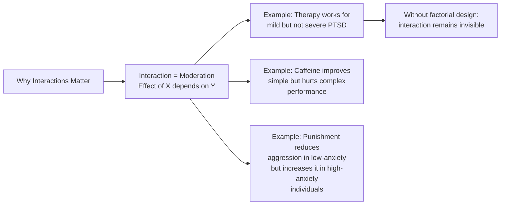
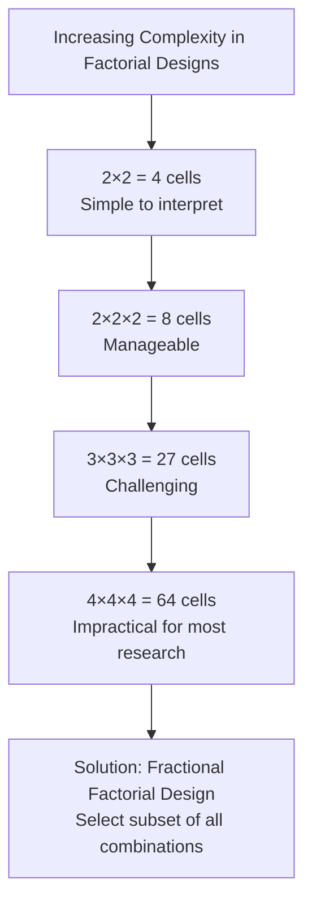
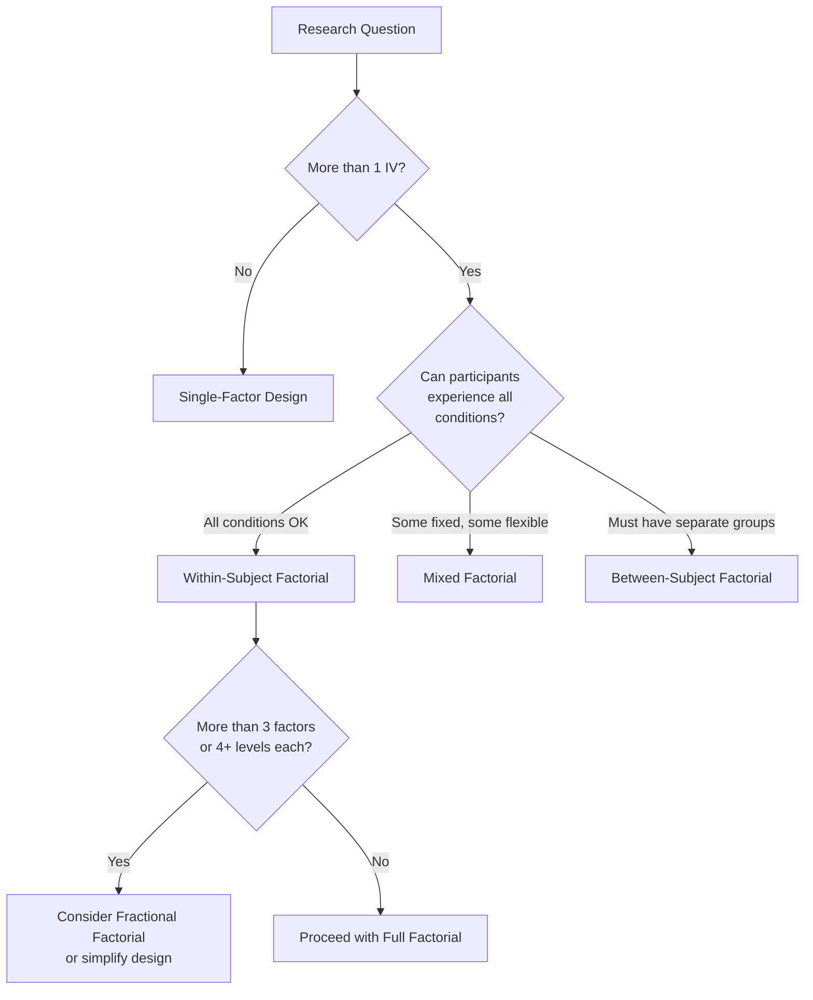

# Advantages, Limitations, and Applications of Factorial Design

## Introduction

Factorial designs represent one of the most powerful tools in the psychological researcher's toolkit. But like all research designs, they come with trade-offs. Understanding *when* to use factorial designs, *why* they are superior to single-factor alternatives in certain contexts, and *where* their limitations lie, is essential for both research design and critical evaluation of published studies.

This file covers the advantages and limitations of factorial designs as outlined in the PDF, and extends this with modern statistical perspectives, real-world applications in psychology and Indian research contexts, and a comprehensive revision guide.

:::info Source PDF
📄 [Block-3/Unit-2.pdf — Pages 25–26](/pdfs/MPC-005%20Research%20Methods/Block-3/Unit-2.pdf)  
📚 MPC-005 Research Methods
:::

---

## 2.6 Advantages of Factorial Design

The PDF identifies four core advantages. Each is expanded here with deeper explanation:

### 1. Simultaneous Study of Multiple Independent Variables

**PDF statement:** Factorial design enables the researcher to manipulate and control two or more independent variables simultaneously.

**Elaboration:** In real-world phenomena, behaviour rarely has a single cause. Consider attention in children: it's affected by sleep, nutrition, task engagement, noise level, and motivation — all simultaneously. A single-factor study that examines only "sleep vs. no sleep" misses how these factors interrelate.

Factorial design is the minimum requirement for capturing this multi-causal reality. It respects the natural complexity of psychological phenomena rather than artificially isolating variables.

**Clinical example:** A study of antidepressant effectiveness might study drug type × therapy modality × severity of depression. Only factorial design reveals whether Drug A works best for severe depression when combined with CBT but not with medication alone.

### 2. Interaction Effects Can Be Detected

**PDF statement:** By this design we can find out the independent or main effect of independent variables and interactive effect of two or more independent variables.

**Elaboration:** This is the most distinctive advantage of factorial design. No other common experimental design can detect interaction effects. An interaction occurs when the effect of one factor depends on the level of another — and this is extremely common in psychology.

**The danger of missing interactions:** If a researcher uses two separate single-factor studies — one for drug, one for therapy — and both show significant main effects, they might conclude "both work." But the factorial study might reveal that the drug actually *reduces* therapy effectiveness, or that they only work when combined. Separate single-factor studies cannot tell you this.

### 3. Greater Precision Than Single-Factor Design

**PDF statement:** Factorial design is more precise than single factor design (Kerlinger, 2007).

**Statistical explanation:** In factorial designs, error variance is partitioned into:
- Main effect variance for Factor A
- Main effect variance for Factor B  
- Interaction variance (A×B)
- Error variance (unexplained)

By accounting for the variance attributable to multiple factors and their interaction, the residual error variance is *reduced*, making statistical tests more powerful and precise.

**Analogy:** Imagine estimating your exam performance based only on "hours studied." Factorial design adds "sleep quality" and "anxiety level" — suddenly the prediction becomes much more precise because we've accounted for variables that were previously part of the error.

### 4. Greater External Validity and Generalizability

**PDF statement:** The experimental results of a factorial experiment are more comprehensive and can be generalised to a wider range due to the manipulation of several independent variables in one experiment.

**Elaboration:** A single-factor study is conducted under one specific context with all other variables held constant. A factorial design systematically varies multiple contextual factors, meaning the results apply across a broader range of conditions.

**Example:** A study on a teaching method that only tested with high-SES students in English-medium schools is poorly generalizable. A factorial study that varied teaching method × student SES × medium of instruction (Hindi/English) would have far broader applicability to Indian educational policy.

---

## 2.7 Limitations of Factorial Design

Every methodology has constraints. Factorial designs have two primary limitations:

### 1. Complexity With Many Factors

**PDF statement:** Sometimes, especially when we have more than three independent variables each with three or more levels to be manipulated together, the experimental setup and statistical analysis become very complicated.

**Mathematical reality:** The number of conditions grows exponentially:
- 2×2 = 4 conditions
- 2×2×2 = 8 conditions
- 3×3 = 9 conditions
- 3×3×3 = 27 conditions
- 4×4×4 = 64 conditions

With 64 conditions and 10 participants per condition, you need 640 participants just for the study! Statistical analysis (factorial ANOVA, post-hoc tests, simple effects analysis) also becomes computationally intensive and difficult to interpret.

**Higher-order interactions** (A×B×C×D) become nearly impossible to interpret meaningfully. A three-way interaction is already challenging; a four-way interaction is rarely interpretable in psychological terms.

**Practical recommendation:** Most psychological research uses two or three factors, with two to six levels on each factor. More complex designs are typically reserved for industrial research (e.g., engineering, agriculture) or large-scale epidemiological studies.

### 2. Difficulty in Finding Homogeneous Groups

**PDF statement:** In factorial experiments when the number of treatment combinations or treatments become large, it becomes difficult for the experimenter to select a homogeneous group.

**Elaboration:** For between-subject factorial designs, each cell needs participants who are equivalent in terms of background characteristics. With 16 or more cells, finding equivalent groups becomes increasingly difficult. 

**Example:** A 4×4 factorial study examining teaching method × student background requires 16 distinct, homogeneous sub-groups. In practice, getting 15 comparable participants in each of 16 cells (240 total) who are truly equivalent is nearly impossible.

**Additional limitations not in PDF (modern perspective):**

| Limitation | Explanation |
|------------|-------------|
| **Multiple comparison problem** | More tests = more false positives. Requires Bonferroni or FDR correction |
| **Unequal cell sizes** | If groups naturally differ in size, standard ANOVA assumptions are violated |
| **Missing data impact** | With many conditions, missing data in some cells creates analytic problems |
| **Power for interactions** | Detecting interaction effects typically requires larger samples than detecting main effects alone |
| **Cost and time** | More conditions = more resources, longer studies, higher participant burden |

---

## Statistical Analysis of Factorial Designs: An Overview

While detailed statistics are covered in MPC-006, an overview contextualizes the design:

### Factorial ANOVA

The primary analytical tool for factorial designs is **factorial ANOVA (Analysis of Variance)**. It partitions the total variance in the data into:

| Source | What It Tests |
|--------|--------------|
| **Main Effect A** | Does Factor A have an effect? |
| **Main Effect B** | Does Factor B have an effect? |
| **Interaction A×B** | Does the effect of A depend on B? |
| **Error (residual)** | Unexplained variance |

Each source of variance produces an **F-ratio** compared to a critical value from the F-distribution. A significant F means the variance from that source exceeds what would be expected by chance.

### Simple Effects Analysis

When interaction is significant, **simple effects analysis** is conducted: testing the effect of Factor A separately at each level of Factor B (and vice versa).

**Example (2×2 design):**
- Simple effect of A at B₁: Is there a difference between A₁ and A₂ for participants in B₁?
- Simple effect of A at B₂: Is there a difference between A₁ and A₂ for participants in B₂?

This unpacks the interaction and tells us *where* and *how* the factors interact.

---

## Decision Framework: When to Use Factorial Design

**Guidelines for choosing:**
- **Within-subject:** Use when conditions can be reversed, practice effects are controllable, and sample size is limited
- **Between-subject:** Use when conditions are irreversible, involve demographic variables (gender, diagnosis), or when carry-over is a major concern
- **Mixed:** Use when some factors are inherently between-subject and others can be repeated — the most common type in applied psychological research

---

## Real-World Applications of Factorial Design

### 1. Clinical Psychology
**Study:** Effect of therapy type (CBT, DBT, medication) × severity of disorder (mild, moderate, severe) on treatment outcomes

**Why factorial:** A therapy might work well for mild cases but be less effective for severe cases — this interaction is clinically critical and cannot be detected in single-factor studies.

### 2. Educational Psychology
**Study:** Teaching method (lecture, inquiry-based, flipped classroom) × student prior knowledge (low, medium, high) on learning outcomes

**Indian application:** Studies comparing English vs. Hindi medium × urban vs. rural background × coaching type on NEET/JEE performance. These are complex real-world questions that require factorial designs.

### 3. Health Psychology
**Study:** Exercise intensity (low, moderate, high) × diet type (Mediterranean, Indian traditional, Western) on cardiovascular markers

**Why factorial:** Exercise and diet interact — high-intensity exercise may be more beneficial with some diets than others.

### 4. Cognitive Psychology
**Study:** Sleep duration (4h, 6h, 8h) × task type (memory, attention, problem-solving) on cognitive performance

**Why factorial:** Sleep deprivation may impair memory more than attention — without factorial design, we'd never know this.

### 5. Industrial/Organizational Psychology
**Study:** Work environment (open office, private office, remote) × task complexity (routine, creative, problem-solving) × leadership style (directive, participative) on productivity

**Indian application:** BPO and IT companies in India use similar factorial frameworks to optimize team performance conditions.

---

## Summary: 2.8 Let Us Sum Up (from PDF)

From the original PDF:

> "Factorial designs are employed when one wants to study the independent and joint effect of two or more independent variables. There are different types of interaction such as antagonistic, synergistic and ceiling effect. Factorial designs may be conducted as within subject, between subject or they may be used in mixed experiments that have one within subject and one between subject variable."

**Key takeaways from the entire unit:**

1. Factorial design studies two or more IVs simultaneously in all combinations
2. Main effects = average effect of each factor; Interaction = how factors depend on each other
3. Interactions can be antagonistic, synergistic, or ceiling-effect
4. Three design types: within-subject (all conditions), between-subject (one condition per person), mixed (one of each)
5. Graphs help visualize interaction — non-parallel lines = interaction present
6. Main advantages: studies multiple IVs, detects interactions, more precise, more generalizable
7. Main limitations: complexity with many factors, homogeneity challenges

---

## Memory Aid: PACE Advantages, CHIP Limitations

**Advantages — PACE:**  
**P**recision — more precise than single-factor  
**A**ll factors together — studies multiple IVs simultaneously  
**C**ombined (interaction) effects revealed  
**E**xternalvalidity — results generalizable to wider range  

**Limitations — CHIP:**  
**C**omplexity increases exponentially with more factors  
**H**omogeneous groups become hard to find  
**I**nterpretation of 3+ way interactions nearly impossible  
**P**articipants needed are high for between-subject designs  

---

## Exam Tips: Common Questions and Answers

**Q: What is the main advantage of factorial design over single-factor design?**  
A: Factorial design allows detection of **interaction effects** — how the effect of one IV depends on the level of another IV. Single-factor design cannot reveal this.

**Q: What does a non-significant main effect with a significant interaction mean?**  
A: This is **antagonistic interaction** — the two IVs reverse each other's effects, so when averaged across levels, neither shows a main effect, but their combined pattern is significant.

**Q: When should simple effects analysis be done?**  
A: Only when the interaction is statistically significant. Simple effects analyze the effect of one factor at each specific level of the other.

**Q: Why is precision greater in factorial than single-factor design?**  
A: Because factorial design partitions variance into multiple sources (A, B, A×B, error), leaving less residual error, making F-ratios larger and tests more sensitive.

---

## External Resources

### Wikipedia
- 🌐 [Factorial Experiment — Wikipedia](https://en.wikipedia.org/wiki/Factorial_experiment)
- 🌐 [Analysis of Variance — Wikipedia](https://en.wikipedia.org/wiki/Analysis_of_variance)
- 🌐 [Moderation (Statistics) — Wikipedia](https://en.wikipedia.org/wiki/Moderation_(statistics))

### Educational Videos
- 🎥 [Advantages of Factorial Designs — Research Methods Tutorial](https://www.youtube.com/watch?v=4Dnkvs4SZkI)
- 🎥 [Two-Way ANOVA with Interaction — Khan Academy](https://www.youtube.com/watch?v=XnCFB2F-ow8)

### Research Papers
- 📄 Kerlinger, F. N., & Lee, H. B. (2000). *Foundations of Behavioral Research* (4th ed.). Harcourt College Publishers.
- 📄 McBurney, D. H., & White, T. L. (2007). *Research Methods* (7th ed.). Thomson Wadsworth.
- 📄 Lakens, D. (2013). Calculating and reporting effect sizes to facilitate cumulative science: A practical primer for t-tests and ANOVAs. *Frontiers in Psychology, 4*, 863.

### Online Resources
- 🔗 [Factorial Design — Research Methods Knowledge Base](https://conjointly.com/kb/factorial-design/)
- 🔗 [Interaction Effects — Statistics How To](https://www.statisticshowto.com/interaction-effect/)
- 🔗 [Simple Effects Analysis Tutorial](https://www.ibm.com/docs/en/spss-statistics/beta?topic=glm-simple-effects)
- 🔗 [Power Analysis for Factorial ANOVA — G*Power Guide](https://www.statstest.com/factorial-anova/)

---

## Self-Assessment Questions

**Level 1 — Recall**
1. List four advantages of factorial design over single-factor design.
2. What are the two main limitations of factorial design described in the PDF?

**Level 2 — Understanding**
3. Explain why "main effects can be misleading when an interaction is present." Give a hypothetical example.
4. Why does adding more factors to a design increase complexity so rapidly?

**Level 3 — Critical Analysis**
5. A researcher says: "I'll run two separate single-factor studies — one for drug type and one for therapy type — to see which works better for depression." What are the major problems with this approach compared to using a 2×2 factorial design?

**Level 4 — Design Application**
6. You are designing a study to examine whether mindfulness training works differently for students with high vs. low academic anxiety, and whether this varies across morning vs. evening training sessions. 
   - (a) What type of factorial design would you use?
   - (b) How many conditions would there be?
   - (c) What effects (main effects + interactions) could you test?

---

## Unit End Questions Review (from PDF)

The PDF's unit end questions serve as important exam practice:

1. **"What do you mean by factorial design? Explain with example."**  
   Answer should include: definition, notation system, a worked example (like Tulving & Pearlstone), and the distinction between main effects and interactions.

2. **"Differentiate with illustration the between-group factorial design and within-subject factorial design."**  
   Answer should include: definitions, layout tables, the Godden & Baddeley example for within-subject, advantages/disadvantages of each, and when to choose which.

3. **"Discuss the advantage and limitation of factorial design."**  
   Use the PACE + CHIP mnemonics and elaborate with examples.

4. **"What do you mean by interaction in factorial design? Discuss various types of interaction."**  
   Explain interaction with the non-parallel lines graphical method, and describe antagonistic, synergistic, and ceiling effect interactions with examples.

---

*Previous: [← Types of Factorial Design](/mpc-005/block-3/factorial-design-types-layouts)*  
*Next: [Quasi-Experimental Design: Meaning and Types →](/mpc-005/block-3/quasi-experimental-design-meaning-types)*
