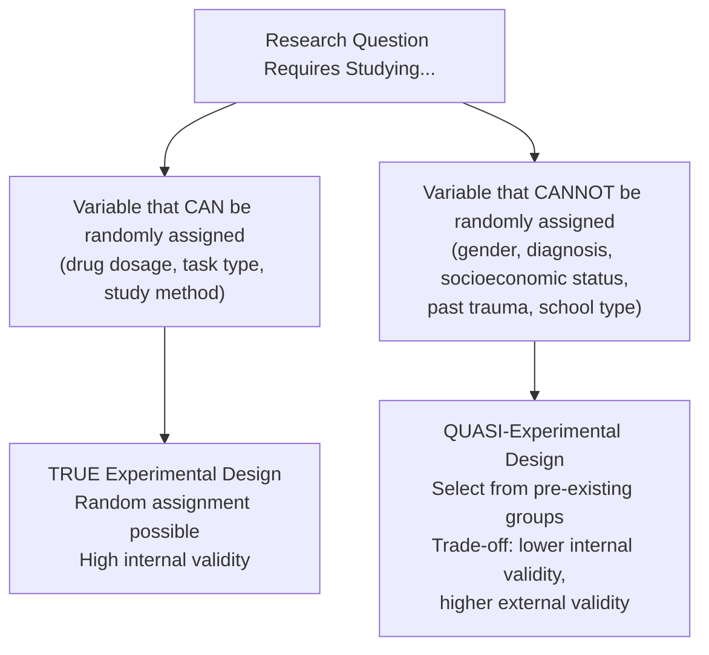
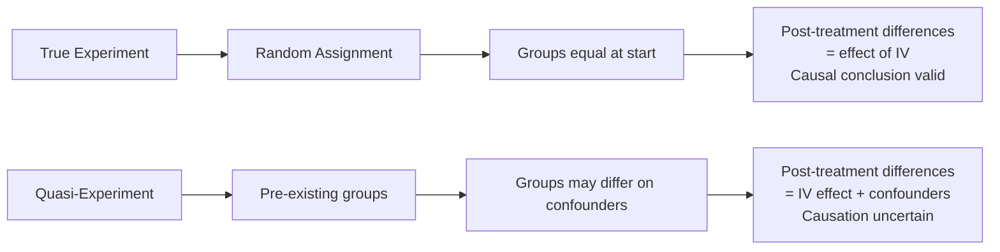

# Quasi-Experimental Design: Meaning, Definitions, and Comparison with True Experiments

## Introduction

Experimental research — with random assignment and researcher control over the independent variable — has long been considered the gold standard in scientific psychology. But a large portion of the questions that matter most in psychology simply cannot be studied with true experiments. We cannot randomly assign people to be male or female, to grow up in poverty or wealth, to experience childhood trauma, or to receive a drug during pregnancy.

This is where **quasi-experimental designs** come in. These designs allow researchers to study real-world phenomena — in classrooms, hospitals, communities, and organizations — while maintaining some semblance of experimental rigor. This unit examines what quasi-experimental design means, how experts have defined it, and how it differs fundamentally from true experimental design.

:::info Source PDF
📄 [Block-3/Unit-3.pdf — Pages 27–36](/pdfs/MPC-005%20Research%20Methods/Block-3/Unit-3.pdf)
📚 MPC-005 Research Methods
:::

---

## 3.2 Meaning of Quasi-Experimental Design

The word **quasi** derives from Latin, meaning *"as if"* or *"to a degree."* A quasi-experimental design therefore resembles an experiment — it has an independent variable, a dependent variable, and often control and experimental groups — but it **lacks at least one defining characteristic of a true experiment**.

The most commonly missing characteristic is **random assignment** of participants to conditions.

### Definitions from Multiple Authorities

| Author | Definition |
|--------|-----------|
| **McBurney & White (2007)** | A quasi-experiment is a research procedure in which the scientist must *select* subjects for different conditions from pre-existing groups. |
| **Broota (1989)** | All experimental situations in which the experimenter does not have full control over the assignment of experimental units randomly to the treatment conditions, or where the treatment cannot be manipulated. |
| **Singh (1998)** | A quasi-experimental design is one that applies an experimental interpretation to results that do not meet all the requirements of a true experiment. |
| **Shadish, Cook & Campbell (2002)** | A type of research design that lacks the element of random assignment. |

### The "Ex-Post Facto" Nature

Quasi-experimental designs are sometimes called **ex-post facto designs** — literally, "after the fact" experiments. The independent variable (e.g., gender, trauma exposure, educational program received) has **already occurred** before the researcher arrives. The researcher studies its effects on groups pre-formed by circumstance, not by random assignment.

**Example:** To study gender differences in verbal learning, a researcher cannot randomly assign participants to be male or female. Instead, they **select** participants from pre-existing groups and compare them. The "independent variable" (gender) is observed, not manipulated.

---

## 3.3 Difference Between Quasi-Experimental and True Experimental Design

| Feature | True Experimental Design | Quasi-Experimental Design |
|---------|-------------------------|--------------------------|
| **Random assignment** | Present | Absent |
| **Manipulation of IV** | Researcher fully controls IV | IV may be observed, not manipulated |
| **Control group** | Formally established via randomization | Comparison group, not true control |
| **Internal validity** | High | Lower |
| **External validity** | Often lower (lab setting) | Often higher (real-world setting) |
| **Causal inference** | Strong | Weaker — alternative explanations remain |
| **Feasibility** | Limited for many real-world questions | Applicable to field settings |
| **Ethical constraints** | More constrained | Often more ethically feasible |

### The Core Problem: Confounding Variables

In a true experiment, random assignment distributes all confounding variables **equally across groups**. Any difference in outcomes is therefore attributable to the IV.

In quasi-experimental designs, pre-existing groups may differ in many ways the researcher cannot control. We **cannot be certain** whether differences in outcome are due to the IV or to pre-existing differences between groups.

### Internal vs. External Validity Trade-Off

One of the most important insights in research methodology: **internal validity and external validity often trade off against each other**.

- **True experiments** maximize **internal validity** (we know the IV caused the DV) but often sacrifice **external validity** (lab settings don't mirror real life)
- **Quasi-experiments** sacrifice some **internal validity** but often have higher **external validity** (results come from real classrooms, workplaces, communities)

From the PDF's SAQ answers: *"The external validity of a quasi-experiment is higher than [that of] a true experiment."*

---

## Historical Context: Why Quasi-Experimental Design Emerged

By the 1960s–1970s, applied psychologists and policy evaluators faced a practical crisis: questions society needed answered could not be studied in a laboratory. Does this educational policy work? Does this community health program reduce substance abuse?

**Donald T. Campbell and Julian C. Stanley** (1966) systematized quasi-experimental methodology in their landmark *Experimental and Quasi-Experimental Designs for Research*, giving researchers a principled framework for field studies. Their work, extended by Shadish, Cook & Campbell (2002), remains the foundational reference for quasi-experimental methodology.

---

## Indian Psychology Context

Quasi-experimental designs are indispensable in Indian psychological research:

- **NEET coaching effectiveness:** Cannot randomly assign students to coaching — researchers compare pre-existing coached vs. uncoached groups
- **NIMHANS community interventions:** Mental health programs in villages use quasi-experimental pre-post designs where randomization is impossible
- **Gender and STEM performance:** Gender differences in academic fields require quasi-experimental designs
- **Reservation policy impact:** Studying SC/ST/OBC reservation effects on educational outcomes is inherently quasi-experimental
- **Disaster psychology:** Studying flood/earthquake psychological impact requires comparing affected vs. unaffected communities

Indian researchers must be particularly thoughtful about **selection bias**, as socioeconomic, caste, regional, and linguistic differences often correlate powerfully with quasi-experimental grouping variables.

---

## Memory Aid: QUASI Acronym

**Q**uestions that cannot be experimentally manipulated  
**U**se pre-existing groups instead of random assignment  
**A**ssociation can be studied, causation is uncertain  
**S**election bias is the primary threat to internal validity  
**I**ncreased external validity (real-world settings)  

---

## External Resources

### Wikipedia
- 🌐 [Quasi-Experiment — Wikipedia](https://en.wikipedia.org/wiki/Quasi-experiment)
- 🌐 [Internal Validity — Wikipedia](https://en.wikipedia.org/wiki/Internal_validity)
- 🌐 [External Validity — Wikipedia](https://en.wikipedia.org/wiki/External_validity)

### Educational Videos
- 🎥 [Quasi-Experimental Design — Crash Course Statistics](https://www.youtube.com/watch?v=rNP0Hg87V5Y)
- 🎥 [True Experiments vs. Quasi-Experiments Explained](https://www.youtube.com/watch?v=hFJ7-KJaFOo)

### Research Papers
- 📄 Campbell, D. T., & Stanley, J. C. (1966). *Experimental and Quasi-Experimental Designs for Research*. Rand McNally.
- 📄 Shadish, W. R., Cook, T. D., & Campbell, D. T. (2002). *Experimental and Quasi-Experimental Designs for Generalized Causal Inference*. Houghton Mifflin.
- 📄 Cook, T. D., & Campbell, D. T. (1979). *Quasi-Experimentation: Design and Analysis Issues for Field Settings*. Rand McNally.

### Online Resources
- 🔗 [Quasi-Experimental Research — Simply Psychology](https://www.simplypsychology.org/quasi-experiment.html)
- 🔗 [Threats to Internal Validity — Research Methods Knowledge Base](https://conjointly.com/kb/internal-validity/)
- 🔗 [Quasi-Experiments vs. True Experiments — Verywell Mind](https://www.verywellmind.com/what-is-a-quasi-experiment-2795507)
- 🔗 [Campbell & Stanley Framework Overview](https://nces.ed.gov/pubs2003/2003153.pdf)

---

## Self-Assessment Questions

**Level 1 — Recall**
1. What does the term "quasi" mean, and how does this apply to quasi-experimental design?
2. According to Shadish, Cook & Campbell (2002), what is the defining element missing in quasi-experimental designs?

**Level 2 — Understanding**
3. Why are quasi-experimental designs sometimes called "ex-post facto" designs? Give an example.
4. Explain the trade-off between internal validity and external validity in comparing true experiments with quasi-experiments.

**Level 3 — Application**
5. A researcher wants to study whether violent video games increase aggression in children. Design (a) a true experiment and (b) a quasi-experiment to study this. What are the key advantages and disadvantages of each approach?

**True/False (from PDF):**
- Trait anxiety is a quasi-experimental variable. [**True**]
- Quasi-experimental designs have high internal validity. [**False**]
- Quasi-experiments may be performed when a true experiment would be impossible. [**True**]
- In quasi-experiments there is a lack of random assignment. [**True**]
- These designs are not useful in psychological research. [**False**]

---

*Next: [Types of Quasi-Experimental Design →](/mpc-005/block-3/quasi-experimental-design-specific-types)*
