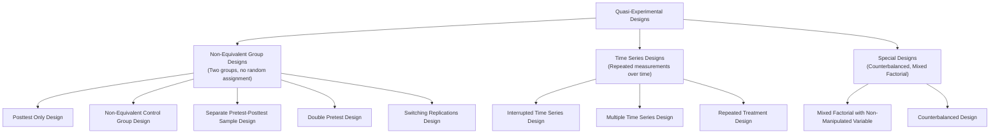
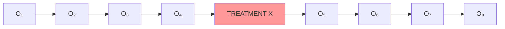

# Types of Quasi-Experimental Design: Non-Equivalent Groups, Time Series, and More

## Introduction

The strength of quasi-experimental research lies in its diversity. No single quasi-experimental design is universally appropriate. Different research questions, settings, available data, and ethical constraints call for different designs, each with its own logic, internal validity profile, and interpretive challenges.

This unit provides comprehensive coverage of the 10 quasi-experimental design types presented in the PDF, with design diagrams, worked examples, validity analysis, and practical guidance for when to use each.

:::info Source PDF
📄 [Block-3/Unit-3.pdf — Pages 30–35](/pdfs/MPC-005%20Research%20Methods/Block-3/Unit-3.pdf)
📚 MPC-005 Research Methods
:::

---

## Overview: The Quasi-Experimental Design Family



**Notation key:**
- **O** = Observation/measurement
- **X** = Treatment/intervention
- **G₁, G₂** = Groups
- Lines between measurements indicate the same group measured multiple times

---

## 3.4.1 Non-Equivalent Group, Posttest Only Design

### Design Structure

```
G₁    X    O₁   (Treatment group — measured after treatment)
G₂         O₂   (Comparison group — measured, no treatment)
```

### Description

The simplest quasi-experimental design: two pre-existing groups, one receives treatment, both are measured **only after** the treatment. No pre-treatment baseline measurement is taken.

**Example from PDF:** One class of students receives reading instruction via a *whole language program* while another class receives a *phonics-based program*. After 12 weeks, a reading comprehension test is administered to both groups.

### Weakness

The fundamental flaw: **we don't know if the groups were equivalent before the study began.** If the phonics group performs better, we cannot determine whether this is because:
- The phonics program is better, OR
- The phonics group students were already better readers from the start

### Validity Assessment

| Threat | Status | Notes |
|--------|--------|-------|
| Selection bias | ❌ Not controlled | Groups may differ at baseline |
| History | ❌ Not controlled | Different events may affect groups differently |
| Instrumentation | ✅ Controlled | Same test for both groups |
| Maturation | ❌ Not controlled | Groups may mature at different rates |

**Internal validity:** Very weak — one of the weakest quasi-experimental designs.

**When to use:** Only as a preliminary study, when pre-test data is genuinely impossible to collect, or when the research question is purely descriptive.

---

## 3.4.2 Non-Equivalent Control Group Design (NECG)

### Design Structure

```
G₁    O₁    X    O₂   (Experimental group: pretest → treatment → posttest)
G₂    O₃         O₄   (Control group: pretest → no treatment → posttest)
```

### Description

The most commonly used quasi-experimental design. Both groups are measured **before and after** the treatment, but groups are assigned by convenience rather than randomization. Pre-test scores allow some assessment of baseline equivalence.

**Example from PDF:** A researcher studies the effect of a special training program on grade point average (GPA) of 10th-grade students. The school does not permit the experimenter to reorganize classes, so two naturally occurring sections of Grade X from the same school are used. Section A receives training; Section B serves as the control.

```
G₁ (Section A)    O₁ (GPA start)    X (Training)    O₂ (GPA end)
G₂ (Section B)    O₃ (GPA start)         —           O₄ (GPA end)
```

### Interpretation Challenge

Even with pre-test data, if sections differ on pre-test scores, we face a **regression-to-the-mean** problem and cannot be sure that post-test differences are caused by training. Students in Section A may have been inherently more motivated, intelligent, or from higher socioeconomic backgrounds.

### How to Strengthen NECG

- Choose comparison groups that are as similar as possible to the treatment group
- Use **statistical matching** or **propensity score matching** to make groups more comparable
- Report pre-test differences and test whether they are statistically significant
- Use **ANCOVA** (Analysis of Covariance) to statistically control for pre-test differences

### Validity Assessment

| Threat | Status |
|--------|--------|
| Selection bias | ⚠️ Partially addressed by pre-test, not eliminated |
| History | ⚠️ If both groups are in same school/context, partially controlled |
| Maturation | ⚠️ Partially controlled if groups are similar in age |
| Regression to mean | ❌ Problematic if groups selected based on extreme scores |

---

## 3.4.3 The Separate Pretest-Posttest Sample Design

### Design Structure

```
G₁    O₁                   (Organization 1: pretest sample)
G₁         X    O₂         (Organization 1: posttest sample, different people)
G₂    O₃                   (Organization 2: pretest sample)
G₂              O₄         (Organization 2: posttest sample, different people)
```

### Description

The key feature: **the people measured at pretest are different from those measured at posttest**, even within the same organization or group. This is used when the same individuals cannot be tracked from pre to post — for example, because customers cycle through an organization regularly.

**Example from PDF:** A customer satisfaction program is implemented in Organization 1; Organization 2 serves as control. Before the program, customer satisfaction is measured in both organizations. After the program, satisfaction is measured again — but these are **different customers** from the ones measured initially. Only group averages (not individual change scores) can be compared.

### Non-Equivalence Problem

Non-equivalence exists at **two levels**:
1. Between organizations (the two groups may differ)
2. **Within** each organization between pretest and posttest samples (different people)

This design is best applied when individual tracking is genuinely impossible and when the sampling procedure at both time points is consistent.

---

## 3.4.4 The Double Pretest Design

### Design Structure

```
G₁    O₁    O₂    X    O₃   (Treatment group: two pretests → treatment → posttest)
G₂    O₄    O₅         O₆   (Control group: two pretests → no treatment → posttest)
```

### Description

A significantly stronger design than the basic NECG. Two baseline measurements are taken **before** the treatment, allowing the researcher to assess whether the groups are changing at similar rates before the intervention begins.

**The key insight:** If the two groups are maturing at different rates even before the treatment, we will see differences between O₁→O₂ and O₄→O₅. If those preliminary trends are similar, we have stronger evidence that post-treatment differences are genuinely due to the treatment.

**Addresses:** Selection-maturation threats — one of the most serious internal validity threats in the simple NECG design.

**Example:** A researcher studying the effect of a nutrition intervention on children's cognitive performance takes two baseline measurements 6 weeks apart before the program starts. If both the intervention and control groups show similar cognitive growth from O₁ to O₂, the researcher has much stronger grounds for attributing O₂→O₃ differences to the nutrition program.

### Why This Is "Very Strong" (from PDF)

The double pretest explicitly controls for selection-maturation threats — the possibility that the treatment and control groups were already diverging in performance before the treatment was introduced. No single-pretest design can address this concern.

---

## 3.4.5 The Switching Replications Design

### Design Structure

**Phase 1:**
```
G₁    O₁    X    O₂   (Group 1 receives treatment; Group 2 is control)
G₂    O₃         O₄
```
**Phase 2:**
```
G₁    O₅         O₆   (Group 1 is now control)
G₂    O₇    X    O₈   (Group 2 now receives treatment)
```

### Description

One of the strongest quasi-experimental designs. The groups **switch roles** between phases — the original treatment group becomes the control, and the original control group receives the treatment. This gives **two independent implementations** of the program.

**Advantages (from PDF):**
- Strong internal validity
- Enhanced external validity — if the same treatment effect appears in both implementations, it generalizes more broadly
- Both groups ultimately receive the treatment (ethical benefit — no group is permanently denied a potentially beneficial intervention)

**Example:** School A uses a new math curriculum first (while School B continues standard curriculum), then they switch. If both schools show improved scores after receiving the new curriculum, the evidence for its effectiveness is much stronger than a one-group comparison.

---

## 3.4.6 Mixed Factorial Design with One Non-Manipulated Variable

### Design Structure

A **mixed factorial design** where at least one factor is a quasi-experimental (non-manipulated) variable, usually a participant characteristic like gender, diagnosis, or age group.

**Example from PDF:** Keogh and Witt (2001) studied whether caffeine influences pain perception differently in men and women.

- 25 men and 25 women participated
- Each person attended **two sessions**: one with caffeinated coffee, one with decaffeinated coffee (randomized order)
- Participants placed their non-dominant hand in ice water and indicated the threshold for pain

**Design layout:**

| | Decaffeinated | Caffeinated |
|---|---|---|
| Women (W₁–W₂₅) | Same participants | Same participants |
| Men (M₁–M₂₅) | Same participants | Same participants |

- **Between-subject variable (quasi-experimental):** Gender — cannot be randomly assigned
- **Within-subject variable (experimental):** Caffeine level — randomly ordered for each participant

This is quasi-experimental because **gender is a pre-existing variable** that cannot be manipulated — we select males and females, we don't assign them.

---

## 3.4.7 Interrupted Time Series Design

### Design Structure

```
O₁  O₂  O₃  O₄  [X]  O₅  O₆  O₇  O₈
```

*Multiple pre-intervention measurements → Treatment → Multiple post-intervention measurements*

### Description

Time series designs **allow the same group to be compared over time**, by examining the trend of data before and after an experimental manipulation (McBurney & White, 2007).

The key feature is **multiple measurements before and after** the treatment — not just one pre and one post. This allows the researcher to:
1. Establish a **pre-treatment trend** (was improvement already happening?)
2. Detect whether the treatment caused a **sudden change** in the trend
3. Assess **long-term effects** — does the improvement last?

**How it differs from simple pretest-posttest:** The pretest-posttest design takes one measurement before and one after. The time series design takes many measurements both before and after, providing a much richer picture of change.

**Example:** Studying the long-term effect of a mindfulness training program on employee burnout. Burnout is measured monthly for 6 months before the program (O₁–O₆), the program is implemented (X), and then measured monthly for 6 more months after (O₇–O₁₂).



**Interpreting results:**
- If the pre-treatment trend shows gradual improvement and post-treatment shows a sudden jump, the treatment caused it
- If improvement was already trending upward before treatment, the treatment effect is weaker
- If post-treatment scores show a different pattern from the pre-treatment trend, the treatment had an effect

---

## 3.4.8 Multiple Time Series Design

### Design Structure

```
G₁  O₁ O₂ O₃ O₄ O₅  [X]  O₆ O₇ O₈ O₉ O₁₀   (Treatment group)
G₂  O₁ O₂ O₃ O₄ O₅       O₆ O₇ O₈ O₉ O₁₀   (No-treatment comparison group)
```

### Description

The multiple time series design adds a **comparison group** to the interrupted time series design. Two groups are tracked over time — one receives the treatment, one does not. The comparison group's time series serves as a control for **history effects** — events occurring during the study period that might have affected the outcome regardless of the treatment.

**From PDF:** "The addition of a comparison group for which the same series of measures is available, but which is not exposed to the treatment whose effects are being studied, can be useful in clarifying the relationship between the treatment and any change in the series of behavioural measures being used."

**Example:** Studying the effect of a state-wide road safety campaign on accident rates. Accident rates are tracked monthly in the state that received the campaign (G₁) and in a neighboring comparison state (G₂). If both states show a decline, it may be due to broader trends (e.g., better weather, economic factors). If only the campaign state shows a decline, the campaign likely caused it.

---

## 3.4.9 Repeated Treatment Design

### Design Structure

```
O₁  [X]  O₂    Withdraw X    O₃  [X]  O₄
```

*Pretest → Treatment → Posttest → Treatment withdrawn → Pretest → Treatment reintroduced → Posttest*

### Description

The treatment is **introduced, withdrawn, and then reintroduced** (McBurney & White, 2007). The rationale is: if the DV improves when treatment is introduced and returns toward baseline when treatment is withdrawn, and improves again when reintroduced, we have strong evidence that the treatment caused the change.

**This is essentially a within-subject, within-design replication.**

**Example from PDF:** A ban on alcohol consumption in the Toda community in Tamil Nadu. The ban is implemented, productivity is measured to have improved (O₂). If the ban is later lifted and productivity drops (O₃), and reinstated and productivity rises again (O₄), the evidence for the ban's effectiveness is compelling.

**Also called:** ABA design or ABAB design in behavior modification research.

**Clinical application:** Widely used in single-case experimental designs in clinical psychology — studying whether a behavioral intervention changes the target behavior by repeatedly introducing and withdrawing it.

**Limitation:** Not appropriate if:
- The treatment effect is irreversible (e.g., once a skill is learned, removing teaching doesn't erase the skill)
- Withdrawing the treatment would be unethical (e.g., withdrawing life-saving medication)

---

## 3.4.10 Counterbalanced Design

### Design Structure

Groups receive treatments in different orders, with each treatment appearing exactly once per row (group) and once per column (occasion):

| Group | Occasion 1 | Occasion 2 | Occasion 3 | Occasion 4 | Measure |
|-------|-----------|-----------|-----------|-----------|---------|
| A | X₁ | X₂ | X₃ | X₄ | O |
| B | X₂ | X₄ | X₁ | X₃ | O |
| C | X₃ | X₁ | X₄ | X₂ | O |
| D | X₄ | X₃ | X₂ | X₁ | O |

Also known as a **Latin Square design** or **crossover design** (Cochran & Cox, 1957). Named "counterbalanced" by Underwood (1949).

### Description

Each treatment appears exactly once in each row and each column. This ensures that every treatment is tested at every position (first, second, third, fourth), controlling for **order effects** and **carry-over effects**.

**Validity strengths (from PDF):** Variables like maturation, selection, and experimental mortality posing threats to internal validity are well controlled by the counterbalanced design.

**Example:** Testing four different fonts (X₁, X₂, X₃, X₄) on reading speed. Four groups of participants read text in each font in a counterbalanced order. This ensures that differences in reading speed are due to the font, not to practice (getting better at reading tasks) or fatigue (getting worse over time).

---

## Quick Comparison of All 10 Design Types

| Design | Groups | Pre-test | Post-test | Treatment | Internal Validity |
|--------|--------|---------|---------|-----------|------------------|
| Posttest Only | 2 | None | Yes | 1 group | Very weak |
| Non-Equivalent Control Group | 2 | Yes | Yes | 1 group | Moderate |
| Separate Pre-Post Sample | 2 | Yes (different people) | Yes (different people) | 1 group | Moderate |
| Double Pretest | 2 | 2× | Yes | 1 group | Moderately strong |
| Switching Replications | 2 | Yes | Yes | Both (different phases) | Strong |
| Mixed Factorial | 2+ | Within-subject | Within-subject | Varies | Moderate |
| Interrupted Time Series | 1 | Multiple | Multiple | 1 group | Moderately strong |
| Multiple Time Series | 2 | Multiple | Multiple | 1 group | Strong |
| Repeated Treatment | 1 | Yes | Multiple | Repeated | Moderately strong |
| Counterbalanced | 4+ | Across groups | Across groups | All treatments | Strong |

---

## Memory Aid: 10 Designs in Groups

**Non-Equivalent Group Designs (5):** POST, NECG, SEPARATE, DOUBLE, SWITCH  
**Time Series Designs (3):** INTERRUPTED, MULTIPLE, REPEATED  
**Special Designs (2):** MIXED, COUNTER  

Mnemonic: **"Post Now, Switch Double; Interrupted Multiples Repeat; Mix Counter"**

---

## External Resources

### Wikipedia
- 🌐 [Interrupted Time Series — Wikipedia](https://en.wikipedia.org/wiki/Interrupted_time_series)
- 🌐 [Crossover Study — Wikipedia](https://en.wikipedia.org/wiki/Crossover_study)
- 🌐 [Non-Equivalent Group Design — Wikipedia](https://en.wikipedia.org/wiki/Non-equivalent_groups_design)

### Educational Videos
- 🎥 [Quasi-Experimental Designs Overview — Research Methods](https://www.youtube.com/watch?v=rNP0Hg87V5Y)
- 🎥 [Interrupted Time Series Analysis — Tutorial](https://www.youtube.com/watch?v=v4BKy_GUrm0)

### Research Papers
- 📄 Campbell, D. T., & Stanley, J. C. (1966). *Experimental and Quasi-Experimental Designs for Research*. Rand McNally.
- 📄 Cook, T. D., & Campbell, D. T. (1979). *Quasi-Experimentation: Design and Analysis Issues for Field Settings*. Rand McNally.
- 📄 Cochran, W. G., & Cox, G. M. (1957). *Experimental Designs* (2nd ed.). Wiley.

### Online Resources
- 🔗 [Non-Equivalent Control Group Design — Research Methods KB](https://conjointly.com/kb/non-equivalent-groups-design/)
- 🔗 [Interrupted Time Series — The Analysis Factor](https://www.theanalysisfactor.com/interrupted-time-series/)
- 🔗 [ABA Design in Behavior Analysis](https://www.ncbi.nlm.nih.gov/pmc/articles/PMC1310940/)
- 🔗 [Latin Square Design — Statistics How To](https://www.statisticshowto.com/latin-square-design/)

---

## Self-Assessment Questions

**Level 1 — Recall**
1. What is the key difference between the Non-Equivalent Control Group Design and the Posttest Only Design?
2. In the Repeated Treatment Design, why is the treatment withdrawn midway through the study?

**Level 2 — Understanding**
3. Why is the Double Pretest Design stronger than the standard NECG design? What specific threat does it address?
4. How does the Multiple Time Series Design improve on the Interrupted Time Series Design?

**Level 3 — Design Selection**
5. For each scenario below, identify the most appropriate quasi-experimental design and justify your choice:

   a) A government implements a road safety awareness campaign in one state. You want to assess whether it reduced accidents, but cannot randomly assign states to receive or not receive the campaign.

   b) You want to compare two different management training programs across four departments, but each department can only implement one program at a time due to scheduling.

   c) A hospital introduces a new patient handoff protocol. You want to determine if it reduces medication errors, but cannot randomly assign wards to use the new protocol.

---

*Previous: [← Quasi-Experimental Design Basics](/mpc-005/block-3/quasi-experimental-design-meaning-types)*
*Next: [Advantages & Limitations of Quasi-Experimental Design →](/mpc-005/block-3/quasi-experimental-advantages-limitations)*
