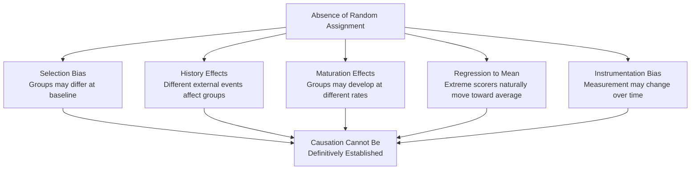
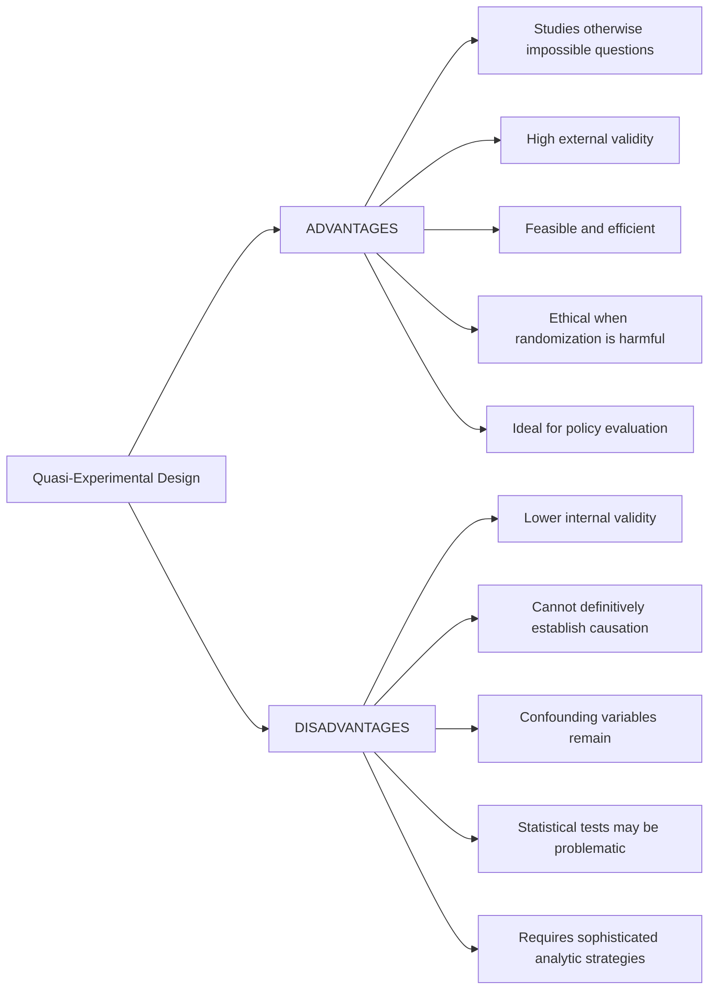

# Advantages, Limitations, and Applications of Quasi-Experimental Design

## Introduction

Quasi-experimental designs occupy a critical middle ground in research methodology — between purely observational studies and full experimental designs. Understanding their advantages and limitations is essential not only for designing good research, but for critically evaluating the evidence base in applied psychology, education, policy, and clinical practice.

This file covers the advantages and disadvantages of quasi-experimental designs as presented in the PDF, and extends this analysis with modern methodological perspectives, practical applications in Indian psychology, and a comprehensive exam preparation guide.

:::info Source PDF
📄 [Block-3/Unit-3.pdf — Pages 34–36](/pdfs/MPC-005%20Research%20Methods/Block-3/Unit-3.pdf)
📚 MPC-005 Research Methods
:::

---

## 3.5 Advantages of Quasi-Experimental Design

### 1. Enables Research on Variables That Cannot Be Randomly Assigned

**Core advantage:** Quasi-experimental designs make it possible to study independent variables that are ethically, logistically, or physically impossible to manipulate.

**Examples:**
- **Gender differences:** Cannot randomly assign people to be male or female
- **Maternal alcohol use during pregnancy:** Randomizing pregnant women to drink alcohol would be highly unethical. Instead, researchers ask about alcohol use and group participants accordingly
- **Childhood abuse, trauma, or neglect:** Cannot ethically expose children to abuse to create experimental groups
- **Socioeconomic status:** Cannot randomly assign families to poverty or affluence
- **Cultural/religious background:** Cannot reassign cultural identities
- **Neurological conditions:** Cannot randomly give people ADHD, depression, or autism

**From the PDF:** "If we study the effect of maternal alcohol use when the mother is pregnant, we know that alcohol does harm embryos. A strict experimental design would include that mothers were randomly assigned to drink alcohol. This would be highly illegal because of the possible harm the study might do to the embryos. So what researchers do is to ask people how much alcohol they used in their pregnancy and then assign them to groups."

### 2. Higher External Validity and Ecological Validity

Because quasi-experiments take place in **natural settings** — real classrooms, workplaces, communities, hospitals — rather than controlled laboratories, their results are more likely to reflect actual human behavior in the real world.

**Laboratory experiments** often suffer from:
- Demand characteristics (participants know they're being studied and behave differently)
- Artificial tasks that don't mirror real-world complexity
- Homogeneous participant samples (often university students)
- Limited duration (cannot study long-term effects)

**Quasi-experiments in natural settings** avoid these problems. The findings can be more directly applied to real-world interventions and policy.

### 3. Feasibility and Efficiency

- **Reduced time and resources:** Without extensive pre-screening and randomization protocols, quasi-experiments can be set up more quickly and at lower cost than true experiments
- **Access to existing groups:** Researchers can study naturally occurring groups (classrooms, wards, communities) without the logistical challenge of creating experimental groups from scratch
- **Longitudinal feasibility:** Quasi-experimental designs — especially time series designs — are particularly well-suited to **longitudinal research** involving longer time periods and multiple environments

### 4. Complementary to Case Studies

Quasi-experimental designs are often integrated with **individual case studies**. The statistical data generated by a quasi-experiment can reinforce and quantify the patterns observed in case study narratives. This mixed-methods synergy provides both depth (case study) and breadth (quasi-experiment).

### 5. Applicable to Policy Evaluation

One of the most important practical advantages is that quasi-experimental designs are the **primary method for evaluating real-world policies and programs** — the naturally occurring independent variable is a policy change, and the researcher measures outcomes before and after.

**Examples:**
- Evaluating whether a new seat belt law reduced traffic fatalities
- Assessing whether a government nutrition program reduced child malnutrition
- Measuring whether a police training program reduced use-of-force incidents
- Determining whether a new curriculum improved student outcomes

---

## 3.5 Disadvantages of Quasi-Experimental Design

### 1. Threats to Internal Validity

The core limitation is that **random assignment is absent**, which means confounding variables may not be equally distributed across groups. Without randomization, we cannot be certain that observed post-treatment differences are caused by the independent variable.

**Campbell & Stanley's (1966) threats to internal validity particularly relevant to quasi-experiments:**

| Threat | Description | Example |
|--------|-------------|---------|
| **Selection** | Pre-existing differences between groups | Students in the "new curriculum" school may have been higher achievers to begin with |
| **History** | Events occurring during the study that affect outcomes | A news story about drugs aired during a drug education program study |
| **Maturation** | Participants naturally change over time, regardless of treatment | Children get better at reading over time — hard to separate from program effects |
| **Testing** | Practice effects from repeated measurement | Pre-test experience helps on post-test, mimicking treatment effect |
| **Regression to Mean** | Extreme scores naturally move toward the average on retesting | Selecting worst-performing schools for an intervention makes improvement look better than it is |
| **Attrition** | Participants who drop out differ systematically from those who remain | Participants who improve may be more likely to continue; dropouts worsen results |

### 2. Weak Causal Inference

**From PDF:** "Because randomisation is absent, some knowledge about the data can be approximated, but conclusions of causal relationships are difficult to determine due to a variety of extraneous and confounding variables that exist in a social environment."

**Statistical tests can become meaningless** if the assumptions underlying them (group equivalence, randomization) are violated. A statistically significant difference between groups does not establish causation if selection bias is plausible.

**The core causal problem:** Even if a quasi-experiment shows that the treatment group improved more than the comparison group, we cannot rule out the possibility that:
- The treatment group was already improving faster before the treatment
- The treatment group received other beneficial interventions simultaneously
- The comparison group experienced adverse events unrelated to the study

### 3. Difficulty Ruling Out Confounds

**From PDF:** "Moreover, even if these threats to internal validity are assessed, causation still cannot be fully established because the experimenter does not have total control over extraneous variables."

Researchers can use statistical techniques (ANCOVA, propensity score matching, regression discontinuity analysis) to partially account for confounds, but these methods are approximations. They can reduce but never eliminate the fundamental problem of non-equivalence.

### 4. Generalizability Challenges

While quasi-experiments often have higher external validity within their specific context, their generalizability can be limited if the specific setting, population, or historical moment is unusual. A natural experiment triggered by a unique policy change in one state may not generalize to other states with different demographics or contexts.

---

## Summary Comparison: Advantages vs. Disadvantages

---

## 3.6 Let Us Sum Up (from PDF)

The PDF's summary captures the key points of the entire unit:

> "Quasi experiments may be performed when a true experiment is not possible. The main difference between true experimental design and quasi experimental design is random assignment of subject in groups. In quasi experimental design researcher does not have control over the assignment of subject to condition. There are different types of quasi experimental design. Some design involve two groups and other have single group. The main advantage of quasi experimental design is that these can be used when randomisation of the group is impossible and/or impractical. Because of the lack of random assignment the internal validity of quasi experimental design is very low. In these designs there are possibility of selection bias because the participants are not randomly assigned."

**Key insight from the PDF's conclusion:** "Disadvantages aside, as long as the shortcomings of the quasi experimental design are recognised, these studies can be a very powerful tool, especially in situations where 'true' experiments are not possible."

---

## Modern Extensions: Strengthening Quasi-Experiments

Contemporary methodology has developed several techniques to strengthen causal inference in quasi-experimental studies:

### Propensity Score Matching (PSM)
Participants in treatment and control groups are matched on a computed probability (propensity score) of receiving the treatment, based on their observable characteristics. This creates more comparable groups statistically.

### Regression Discontinuity Design (RDD)
Used when treatment is assigned based on a cutoff score (e.g., students above a GPA threshold receive a scholarship, those below do not). The comparison just above and just below the cutoff is nearly experimental in its logic.

### Difference-in-Differences (DiD)
Compares the change in outcomes over time between a treatment group and a control group. Controls for stable baseline differences between groups.

### Instrumental Variable (IV) Analysis
Uses a third variable (instrument) that influences treatment assignment but has no direct effect on the outcome — to estimate causal effects despite confounding.

These modern methods have substantially improved the credibility of quasi-experimental research in economics, epidemiology, and applied psychology.

---

## Applications in Indian Psychology

### Clinical and Community Psychology
- **NIMHANS community mental health programs:** Pre-post evaluations of village-level mental health interventions using interrupted time series designs
- **Suicide prevention programs:** Evaluating post-intervention suicide rates in districts using multiple time series design with neighboring districts as comparison
- **School mental health:** Comparing emotional wellbeing before and after counseling programs in government schools using NECG design

### Educational Psychology
- **Midday Meal Scheme (MDM) evaluation:** Studying attendance, cognitive performance, and nutritional status before and after implementation — natural experiment created by phased rollout across districts
- **Digital learning initiatives:** Comparing learning outcomes in schools with and without digital infrastructure, using pretest data to control for baseline differences
- **NEET preparation:** Evaluating coaching effectiveness using double pretest designs with comparable coaching and non-coaching cohorts

### Public Health Psychology
- **Alcohol prohibition studies:** Repeated treatment design — Tamil Nadu's periodic prohibition policies create natural opportunities to study the before/after/before effects of alcohol availability on health and social outcomes (directly referenced in the PDF example)
- **Tobacco warning label changes:** Interrupted time series design to study impact of new warning labels on attitudes and behavior

### Organizational Psychology
- **IT sector interventions:** Evaluating mindfulness or stress-reduction programs using switching replications design in large software companies
- **Bank employee training:** Counterbalanced designs comparing different customer service training programs across branches

---

## Exam Preparation: Key Points and Common Questions

### High-Yield Facts for IGNOU Exams

1. **Quasi means:** "as if" or "to a degree"
2. **Missing element:** Random assignment of participants to conditions
3. **Also called:** Ex-post facto design
4. **Key advantage:** Can study variables that cannot be ethically or practically manipulated
5. **Key disadvantage:** Lower internal validity; cannot definitively establish causation
6. **Internal validity:** Lower than true experiments
7. **External validity:** Higher than true experiments (real-world settings)
8. **Strongest designs:** Switching replications, multiple time series, double pretest, counterbalanced
9. **Weakest design:** Posttest only (non-equivalent group)
10. **Selection bias:** Primary threat to internal validity in quasi-experiments

### Common Exam Questions

**Q: Define quasi-experimental design. How does it differ from true experimental design?**
Key points: Definition, "as if" meaning, absence of random assignment, ex-post facto nature, internal vs. external validity trade-off, examples of variables that necessitate quasi-experimental approach.

**Q: What are the advantages of quasi-experimental design?**
Use: studies variables impossible to manipulate randomly, higher ecological validity, more feasible and ethical, applicable to policy evaluation, useful for longitudinal research, integrated with case studies.

**Q: What are the disadvantages of quasi-experimental design?**
Use: threats to internal validity (selection, history, maturation, regression to mean), statistical tests may be problematic, causation cannot be firmly established, confounds remain.

**Q: Discuss with example the non-equivalent control group design.**
Include: design notation, the Grade X GPA example from PDF, why groups may not be equivalent despite same school, the fundamental limitation, how ANCOVA or matching can partially address this.

**Q: What are the various types of quasi-experimental designs?**
Name and briefly describe all 10: Posttest only, NECG, Separate pretest-posttest, Double pretest, Switching replications, Mixed factorial, Interrupted time series, Multiple time series, Repeated treatment, Counterbalanced. Group into non-equivalent group, time series, and special designs.

---

## Memory Aid: Advantages and Disadvantages

**Advantages — FEEL:**
**F**easible when randomization is impossible  
**E**cological validity is high  
**E**thical for sensitive research  
**L**ongitudinal and policy research ideal  

**Disadvantages — CIC:**
**C**ausation cannot be definitively established  
**I**nternal validity is low  
**C**onfounding variables remain a threat  

---

## External Resources

### Wikipedia
- 🌐 [Quasi-Experiment — Wikipedia](https://en.wikipedia.org/wiki/Quasi-experiment)
- 🌐 [Regression Discontinuity Design — Wikipedia](https://en.wikipedia.org/wiki/Regression_discontinuity_design)
- 🌐 [Propensity Score Matching — Wikipedia](https://en.wikipedia.org/wiki/Propensity_score_matching)

### Educational Videos
- 🎥 [Advantages and Disadvantages of Quasi-Experiments](https://www.youtube.com/watch?v=hFJ7-KJaFOo)
- 🎥 [Natural Experiments and Causal Inference — MedSchoolCoach](https://www.youtube.com/watch?v=WKxKrjNyQT0)

### Research Papers
- 📄 Shadish, W. R., Cook, T. D., & Campbell, D. T. (2002). *Experimental and Quasi-Experimental Designs for Generalized Causal Inference*. Houghton Mifflin.
- 📄 Dunning, T. (2012). *Natural Experiments in the Social Sciences: A Design-Based Approach*. Cambridge University Press.
- 📄 Rosenbaum, P. R. (2017). *Observation and Experiment: An Introduction to Causal Inference*. Harvard University Press.

### Online Resources
- 🔗 [Quasi-Experimental Research — Simply Psychology](https://www.simplypsychology.org/quasi-experiment.html)
- 🔗 [Threats to Internal Validity — Trochim Research Methods](https://conjointly.com/kb/internal-validity/)
- 🔗 [Difference-in-Differences — World Bank Development Blog](https://blogs.worldbank.org/impactevaluations/difference-differences)
- 🔗 [Propensity Score Matching Overview — Statistical Horizons](https://statisticalhorizons.com/propensity-scores/)

---

## Self-Assessment Questions

**Level 1 — Recall**
1. List four advantages of quasi-experimental design mentioned in the PDF.
2. What is the primary internal validity threat in quasi-experimental designs?

**Level 2 — Understanding**
3. Why does the absence of random assignment make statistical tests "potentially meaningless" in some quasi-experiments?
4. Explain the paradox: quasi-experiments often have *lower* internal validity but *higher* external validity than true experiments.

**Level 3 — Critical Analysis**
5. A government claims that their road safety program (implemented 2 years ago) reduced traffic deaths by 30%. As a research methods expert, what questions would you ask to evaluate whether this is a valid causal claim? What alternative explanations would you consider?

**Level 4 — Integration**
6. You are asked to evaluate a quasi-experimental study that found students who attended a private coaching center scored 15% higher on NEET than students who did not attend coaching. What are the three most serious threats to the internal validity of this finding? How might you design a better quasi-experiment to address these threats?

---

*Previous: [← Types of Quasi-Experimental Design](/mpc-005/block-3/quasi-experimental-design-specific-types)*
