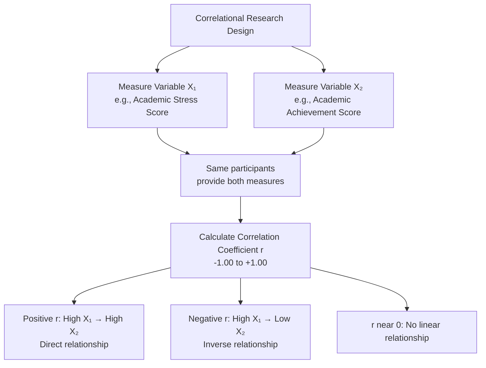
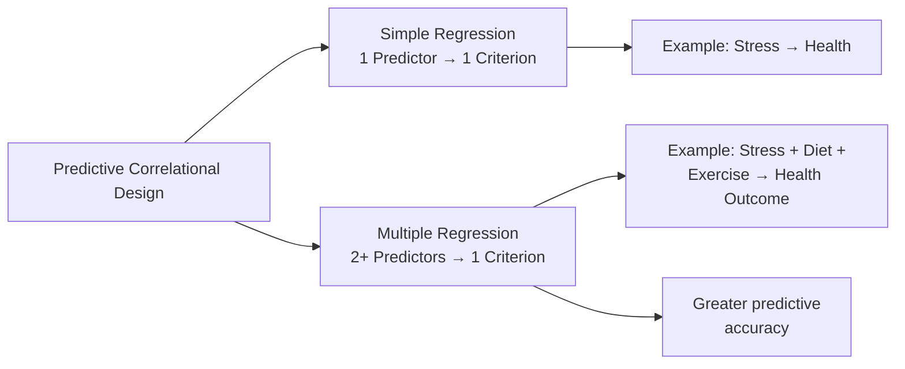
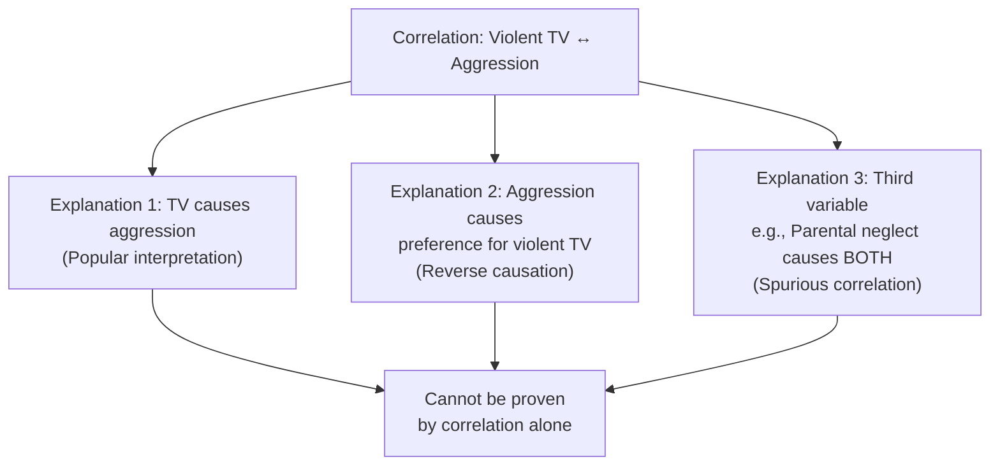

# Correlational Research Design: Meaning, Types, and Applications

## Introduction

Not every research question in psychology can be answered by manipulating variables and running controlled experiments. Consider these questions:

- Does general intelligence predict scholastic achievement?
- Is there a relationship between the size of the skull and IQ?
- Do children exposed to violent television shows become more aggressive?

In none of these cases can researchers ethically or practically *manipulate* the independent variable. They cannot assign children to "watch violent TV" or "don't watch violent TV" groups and wait years to see who becomes aggressive. They cannot surgically alter skull size.

For such questions, **correlational research design** is the tool of choice. It studies the *natural relationship* between variables as they exist — without any experimental manipulation.

:::info Source PDF
📄 [Block-3/Unit-4.pdf — Pages 37–47](/pdfs/MPC-005%20Research%20Methods/Block-3/Unit-4.pdf)  
📚 MPC-005 Research Methods
:::

---

## 4.2 Definition of Correlational Research Design

**Correlational research design** is based on the assumption that reality is best described as a **network of interacting and mutually causal relationships** — everything affects and is affected by everything else. The goal is not to find linear, one-way causation, but to map how variables *relate* to one another.

**Key definitions:**

- **Singh (1998):** Correlational design is one in which the researcher collects two or more sets of data from the same group of subjects so that the relationship between the two subsequent sets of data can be determined.
- **McBurney & White (2007):** Correlational research design is one which studies relationships among variables, none of which may be the actual cause of the other.

**Core elements of correlational design:**
1. **Two or more quantitative variables** measured from the same participants
2. **No manipulation** of any variable by the researcher
3. **Statistical association** between variables is computed
4. **No random assignment** to conditions

The design can be diagrammed as:

```
Variable X₁     Variable X₂
O₁  ←→  P₁
O₂  ←→  P₂
O₃  ←→  P₃
...         ...
Oₙ  ←→  Pₙ
```

The symbol **r** represents the correlation between observations (O₁...Oₙ) of X₁ and (P₁...Pₙ) of X₂.



---

## 4.3 Types of Correlational Research Design

Correlational designs fall into two broad categories:

### Category 1: Measuring the Degree of Association

#### A. Association Between Two Variables (Bivariate Correlation)

The simplest form — one correlation coefficient *r* captures the relationship between exactly two variables.

**Example:** A researcher selects 100 college students and measures:
- Academic stress (via questionnaire)
- Academic achievement (via test)

A correlation coefficient *r* is computed from these 100 pairs of scores.

**Interpreting the coefficient:**

| Value of r | Meaning |
|------------|---------|
| +1.00 | Perfect positive relationship — high stress always predicts high achievement |
| +0.50 to +0.90 | Moderate to strong positive relationship |
| 0.00 | No linear relationship |
| -0.50 to -0.90 | Moderate to strong inverse relationship |
| -1.00 | Perfect negative relationship — high stress always predicts low achievement |

**Positive (direct) relationship:** High X₁ → High X₂. Example: More study hours → Higher grades.

**Negative (inverse) relationship:** High X₁ → Low X₂. Example: Higher academic stress → Lower academic achievement.

**Important:** The absolute value of *r* indicates *strength*; the sign indicates *direction*.

#### B. Association Among More Than Two Variables (Multivariate Correlation)

Real-world outcomes rarely have a single predictor. Academic achievement is influenced by stress, study habits, intelligence, sleep, motivation, and socioeconomic status simultaneously.

**Multiple correlation:** Measures the association between one outcome variable and several predictor variables combined.

**Example:** Researchers measure academic stress, study habits, and intelligence in the same group of students, then examine how all three relate simultaneously to academic achievement.

Advanced techniques for multivariate correlation include:
- **Partial correlation:** Correlation between two variables after removing the influence of a third
- **Multiple correlation (R):** Correlation between one DV and multiple IVs combined
- **Structural Equation Modelling (SEM):** Tests complex networks of relationships

---

### Category 2: Prediction (Regression-Based Correlational Design)

If a correlation exists between two variables, and we know a participant's score on one variable, we can *predict* their score on the other.

**Key terminology in predictive designs:**

| Term | Definition |
|------|-----------|
| **Predictor variable** | The variable used to make a forecast; analogous to IV |
| **Criterion variable** | The variable being predicted; analogous to DV |

**Simple regression:** One predictor, one criterion.

**Example:** Stress level → predicts → Future health status. If we know a person's stress score today, regression analysis lets us estimate their health score at a future time point.

**Multiple regression:** Multiple predictors, one criterion. Dramatically improves prediction accuracy.

**Example:** Predicting future health from:
- Predictor 1: Current stress level
- Predictor 2: Health behaviour score
- Predictor 3: Past health status
→ Criterion: Future health status

Three predictors combined give more accurate prediction than any single predictor alone.



---

## 4.4 Evaluation of Correlational Design

### 4.4.1 Advantages

| Advantage | Explanation |
|-----------|-------------|
| **Uses available data** | Existing records, test scores, survey data can be analyzed without new experiments |
| **Foundation for future research** | Correlational findings generate hypotheses for later experimental testing |
| **Avoids pretest sensitization** | Usually no repeated testing; participants not alerted to what's being measured |
| **Realistic measurement** | Measures behaviour as it naturally occurs; high ecological validity |
| **Avoids non-representative context** | No artificial laboratory setting; real-world data used |
| **Large, carefully chosen samples possible** | Can use survey data with thousands of participants |
| **Permits partial control via statistics** | Hierarchical regression, path analysis, SEM can statistically control for third variables |
| **Ethically necessary** | When manipulation would be harmful, illegal, or impossible |

### 4.4.2 Disadvantages

The major — and critical — disadvantage is: **correlation does not imply causation.**

**Classic example from the PDF:** A positive correlation is found between children's exposure to violent TV and playground aggression. Can we conclude that violent TV *causes* aggression?

**No.** Three alternative explanations exist:

1. **Third variable problem:** Parental neglect may cause *both* — neglectful parents leave children watching TV all night (violent shows), and those children have also learned from parental abuse that violence is acceptable. Parental neglect drives both variables.

2. **Reverse causation:** Aggressive children may *prefer* watching violent TV — not that TV makes them violent, but that their violent disposition leads them to select violent content.

3. **Confounding:** Genetic disposition to aggression and sensation-seeking may predispose both TV preferences and aggressive behaviour.



**Directional problem:** In correlational studies, the designation of one variable as "predictor" and another as "criterion" is *arbitrary*. Unlike experiments, we did not manipulate anything — so we cannot establish which came first.

**Consequence:** The **internal validity** of correlational designs is very low. They cannot establish cause-and-effect.

---

## 4.5 Quality Standards for Correlational Research

When evaluating a correlational study, several standards should be applied:

| Standard | Explanation |
|----------|-------------|
| **Theory-driven variable selection** | Variables should be chosen based on sound theory, not convenience |
| **Linearity assumption** | Standard Pearson correlation assumes a linear relationship between variables |
| **Multicollinearity check** | When multiple predictors are used, they should not be excessively correlated with each other |
| **Outlier handling** | Extreme scores can distort correlation coefficients; must be identified and addressed |
| **Restricted range check** | If the range of scores is artificially limited, correlation underestimates the true relationship |
| **Missing data handling** | Missing data must be explicitly addressed |
| **Statistical control of third variables** | Hierarchical regression, path analysis, and SEM can partial out the influence of confounds |

**Best practice:** The most important quality indicator is the **controls the researcher implements** to account for extraneous variable influence — since random assignment is not available.

**Advanced techniques that strengthen correlational inference:**
- **Hierarchical multiple regression:** Enters control variables first, then tests predictors of interest
- **Path analysis:** Tests directional relationships in a causal model
- **Structural Equation Modelling (SEM):** Tests complex theoretical models with latent variables

These do not *prove* causation but help *rule out* certain causal explanations.

---

## Indian Psychology Context

Correlational designs are among the most commonly used methodologies in Indian psychological research:

- **NEET/JEE performance:** Correlations between anxiety scores, study hours, coaching institute quality, and exam outcomes studied without experimental manipulation
- **Mental health surveys:** NIMHANS and ICSSR-funded studies correlate socioeconomic status, urbanicity, and family structure with depression/anxiety scores
- **Academic stress research:** Extensive correlational literature on Indian college students, examining relationships between parental pressure, self-efficacy, and academic burnout
- **Health psychology:** Correlations between adherence to traditional Ayurvedic practices and stress biomarkers studied using naturally occurring groups

**Indian research limitation:** Indian correlational studies often face the third variable problem with socioeconomic status — most psychological variables (stress, achievement, health) are correlated in India partly because they share SES as a common cause. This makes proper statistical control (partial correlation, hierarchical regression) especially important.

---

## Memory Aid: CARD Mnemonic

**C**orrelation studies relationships — not causes  
**A**ssociation between two or more quantitative variables  
**R**egression uses correlation for prediction  
**D**irection and degree captured by coefficient r  

---

## External Resources

### Wikipedia
- 🌐 [Correlation and Dependence — Wikipedia](https://en.wikipedia.org/wiki/Correlation)
- 🌐 [Pearson Correlation Coefficient — Wikipedia](https://en.wikipedia.org/wiki/Pearson_correlation_coefficient)
- 🌐 [Regression Analysis — Wikipedia](https://en.wikipedia.org/wiki/Regression_analysis)

### Educational Videos
- 🎥 [Correlation vs. Causation — CrashCourse Statistics](https://www.youtube.com/watch?v=ROpbdO-gRUo)
- 🎥 [Pearson Correlation Explained — Statistics Learning Centre](https://www.youtube.com/watch?v=11T9qOZmNSs)

### Research Papers
- 📄 Rohrer, J. M. (2018). Thinking clearly about correlations and causation: Graphical causal models for observational data. *Advances in Methods and Practices in Psychological Science, 1*(1), 27–42.
- 📄 McBurney, D. H., & White, T. L. (2007). *Research Methods* (7th ed.). Thomson Wadsworth.
- 📄 Singh, A. K. (1998). *Tests, Measurement and Research Methods in Behavioural Sciences* (3rd ed.). Bharati Bhawan.

### Online Resources
- 🔗 [Correlation Coefficient — Statistics How To](https://www.statisticshowto.com/probability-and-statistics/correlation-coefficient-formula/)
- 🔗 [Spurious Correlations — Tyler Vigen](https://www.tylervigen.com/spurious-correlations)
- 🔗 [Path Analysis — Statistics Online Support](https://www.statisticssolutions.com/path-analysis/)
- 🔗 [Correlation vs Causation Guide — Simply Psychology](https://www.simplypsychology.org/correlation.html)

---

## Self-Assessment Questions

**Level 1 — Recall**
1. Define correlational research design according to Singh (1998) and McBurney & White (2007).
2. What are the two broad categories of correlational designs?

**Level 2 — Understanding**
3. In the academic stress–achievement example, if r = –0.65, what does this mean? What does it NOT tell you?
4. Explain the "third variable problem" using the violent TV and aggression example.

**Level 3 — Application**
5. A study finds a strong positive correlation (r = +0.78) between the number of books in a child's home and their reading ability. List three alternative explanations for this correlation beyond "having books causes better reading."

**True/False (from PDF)**
- Correlational design is a quantitative design of research. [**True**]
- Causal comparative research design is an experimental design. [**False**]
- Correlational design avoids the threat of non-representative sample of participation. [**True**]

**Fill in the Blanks (from PDF)**
- Correlational design studies the ________ between the variables. [*relationship*]
- Coefficient of correlation expresses the ________ and ________ of relationship between variables. [*degree, direction*]

---

*Next: [Causal Comparative Research Design →](/mpc-005/block-3/causal-comparative-research-design)*
