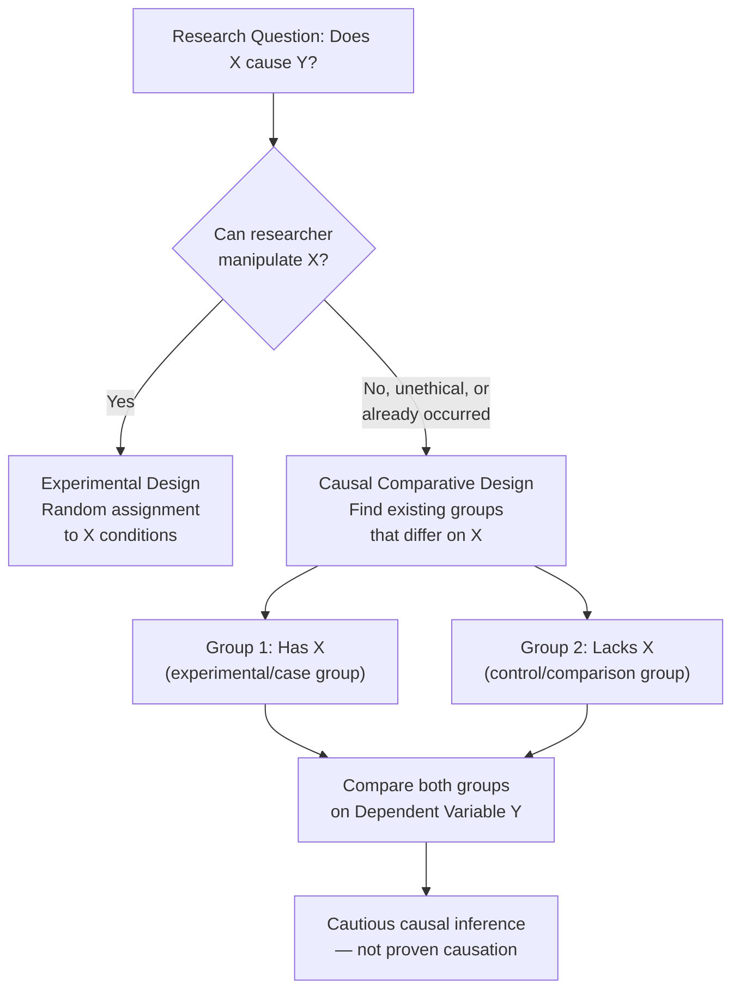
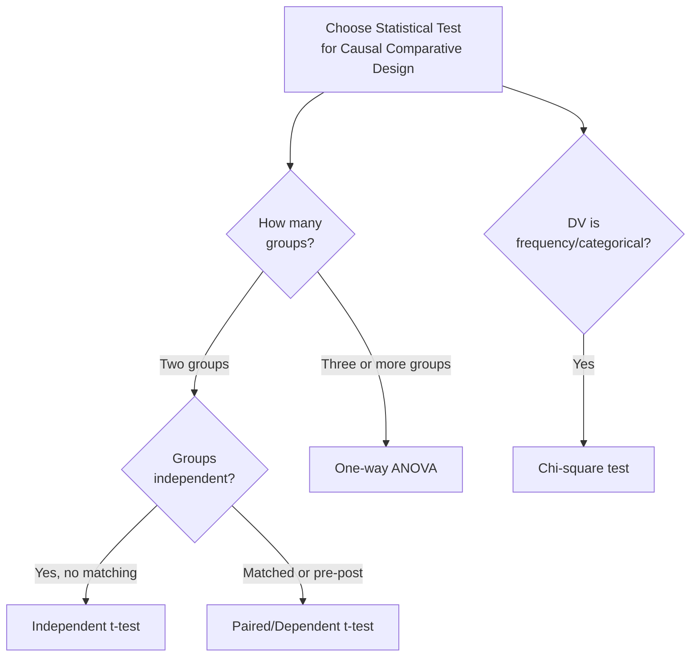

# Causal Comparative Research Design: Meaning, Process, and Data Analysis

## Introduction

Imagine a researcher wants to study the *effect of gender on aggression*. The independent variable — gender — cannot be manipulated. Participants already *are* male or female. The researcher cannot randomly assign people to be male or female and then observe the consequences. Similarly, studying the effect of "having experienced childhood trauma" on adult mental health requires comparing two naturally formed groups: those who experienced trauma and those who did not.

When experimental manipulation is impossible, unethical, or has already occurred, **causal comparative research design** (also called **ex-post-facto design**) provides a systematic way to study group differences and cautiously explore potential causal relationships.

:::info Source PDF
📄 [Block-3/Unit-4.pdf — Pages 41–47](/pdfs/MPC-005%20Research%20Methods/Block-3/Unit-4.pdf)  
📚 MPC-005 Research Methods
:::

---

## 4.6 Causal Comparative Research Design: Definition

**Causal comparative research design** is used when:
- The researcher is **unable to control the independent variable** (it has already occurred or cannot be manipulated)
- Manipulation would be **unethical** (e.g., inducing childhood trauma)
- Manipulation is **practically impossible** (e.g., changing gender, ethnicity, diet tradition)

**Core procedure:**
1. **Identify a group that already has the independent variable** (the experimental/case group)
2. **Select a comparable group that lacks the independent variable** (the control/comparison group)
3. **Compare the two groups on the dependent variable**

**Example — Calculator use and math performance:**
A researcher cannot randomly assign math classes to "use calculators" or "not use calculators" because classes already exist. Instead:
- Group 1: Students from classes that already use calculators
- Group 2: Students from classes that do not use calculators
- Compare both groups at year-end on final math grades

This is a classic causal comparative study.

---

## The Basic Design Structure

### Two-Group Causal Comparative Design

The simplest structure:

| Group | Independent Variable | Dependent Variable |
|-------|---------------------|-------------------|
| Experimental Group | Has the IV (e.g., uses calculators) | Measured (e.g., math grade) |
| Control Group | Lacks the IV (e.g., no calculators) | Measured (e.g., math grade) |

### Multi-Group Causal Comparative Design

The researcher may compare **more than two groups** that differ on a variable:

**Example:** Grade placement (IV) and participation in extra-curricular activities (DV):
- Group 1: Students in grades 1–3
- Group 2: Students in grades 4–6
- Group 3: Students in grades 7–9
- Group 4: Students in grades 10–12

All four groups are compared on their amount of extra-curricular participation.

**Important:** In all variations, groups were **formed before** the study began — the researcher did not create them.

---

## Key Characteristics

| Feature | Causal Comparative |
|---------|-------------------|
| Manipulation of IV | **No** — IV has already occurred |
| Random assignment | **No** — groups pre-exist |
| Control over conditions | **Limited** |
| Causal claim strength | **Suggestive, not proven** |
| Direction of inquiry | **Retrospective** — looks backward at "what happened" |
| Also called | Ex-post-facto design ("after the fact") |

**Why "suggestive" causation?** The design compares existing groups on an outcome, but since the researcher did not create the groups, many alternative explanations remain. The causal relationship is *implied*, not *demonstrated*.

**Example from PDF:** A researcher studies the effect of self-concept on reading achievement. Two groups are identified — high self-esteem and low self-esteem. If the high self-esteem group has higher reading achievement, did self-esteem *cause* reading achievement, or did reading achievement *cause* self-esteem? Both are equally plausible from correlational data alone.

---

## 4.9 Data Analysis for Causal Comparative Research Design

The choice of statistical test depends on the number of groups and the nature of the dependent variable:

### When Comparing Two Independent Groups: Independent t-test

Used when:
- Two groups are compared
- No matching or control procedures have been used
- Groups are independent of each other

**Example:** Do students using calculators score differently on math tests than those without calculators? Compare means of two independent groups with an **independent-samples t-test**.

### When Groups Are Matched or Pre-Post Design: Dependent t-test (Paired t-test)

Used when:
- An extraneous variable has been controlled by matching participants
- Pre-test and post-test scores from the same participants are compared

**Example:** Students are matched on IQ before being placed in calculator vs. no-calculator groups. Use a **paired t-test** to account for the matching.

### When Comparing Three or More Groups: One-Way ANOVA

Used when:
- Three or more groups are being compared
- Shows whether means differ significantly across all groups

**Example:** Comparing extra-curricular participation across four grade levels. Use **one-way ANOVA**.

### When Dependent Variable is Categorical (Frequencies): Chi-Square Test

Used when:
- The dependent variable is expressed as frequencies or proportions, not continuous scores

**Example from PDF:** A social studies teacher compares students' political party preferences (Democratic vs. Republican) with the proportions of registered voters in the district. This requires a **chi-square test of independence**.

---

## 4.7 Comparing Causal Comparative and Correlational Designs

### 4.7.1 Similarities

| Similarity | Explanation |
|------------|-------------|
| **Both non-experimental** | Neither design involves manipulation of the IV by the researcher |
| **No random assignment** | Variables are observed as they naturally occur |
| **Same confound-control techniques** | Both use matching or quota sampling to control extraneous variables |
| **Attribute variables used as IVs** | Both use characteristics of persons (gender, diagnosis, socioeconomic status) as IVs |
| **Descriptive component** | Both describe conditions that already exist |

### 4.7.2 Differences

| Feature | Correlational Design | Causal Comparative Design |
|---------|---------------------|--------------------------|
| **Unit of analysis** | Single group; looks for relationships within the group | Two or more groups; looks for differences *between* groups |
| **Variable type (IV)** | Quantitative only (e.g., IQ score, stress score) | Must include at least one **categorical** variable (e.g., gender: M/F) |
| **Goal** | Establish association/relationship | Establish group differences |
| **Predictor terminology** | Uses "predictor variable" and "criterion variable" | Does not use these terms |
| **Statistical method** | Correlation coefficient, regression | t-test, ANOVA, chi-square |
| **Evidence for causation** | Cannot establish cause | Can suggest cause; still does not prove it |

**Core distinction:** Correlational research looks for *relationships within one group*. Causal comparative research looks for *differences between groups*.

---

## 4.8 Comparing Causal Comparative and Experimental Design

| Feature | Experimental Design | Causal Comparative Design |
|---------|--------------------|--------------------------| 
| **IV manipulation** | Researcher manipulates IV | IV already occurred; researcher cannot manipulate |
| **Group formation** | Researcher randomly assigns participants to groups | Groups already exist before study begins |
| **Random assignment** | Yes — controls confounding | No — confounding remains a threat |
| **Causal inference** | Strong — can establish cause-effect | Weak — can only suggest causation |
| **Control** | High — researcher controls conditions | Low — conditions already set |
| **Temporal direction** | Prospective — cause before effect | Often retrospective — effect already occurred |
| **Internal validity** | High | Lower |
| **Feasibility** | Sometimes impossible or unethical | Works when experiment not possible |

**Bottom line:** Experimental design provides the strongest evidence for causation; causal comparative design provides practical answers when experimentation is not possible.

---

## 4.10 Evaluation of Causal Comparative Design

### 4.10.1 Advantages

| Advantage | Explanation |
|-----------|-------------|
| **Studies ethically sensitive variables** | Can study effects of gender, trauma, poverty, disease — variables that cannot be ethically manipulated |
| **Studies irreversible variables** | Variables like "having had a stroke" or "childhood abuse" cannot be experimentally induced |
| **Lower cost than experiments** | No need to create treatment conditions; uses existing groups |
| **Identifies research-worthy variables** | Promising findings from causal comparative studies guide future experimental investigations |
| **Facilitates decision-making** | Provides useful data for policy and clinical decisions when experiments aren't feasible |
| **Realistic setting** | Studies real groups in real contexts — high ecological validity |

### 4.10.2 Limitations

| Limitation | Explanation |
|------------|-------------|
| **Limited control** | Since IV occurred before the study, researcher cannot control conditions or confounders |
| **Causation uncertain** | The alleged cause may actually be the effect (reverse causation), or a third variable may cause both |
| **No random assignment** | Groups may differ on many other variables besides the IV; these differences may explain the DV |
| **Direction of causality unclear** | Cannot determine which variable came first |
| **Third variable problem** | Unmeasured variables may explain the observed group differences |

**Classic example of the third variable problem:** A researcher finds high-self-esteem students have higher reading achievement. Did self-esteem *cause* achievement, or did achievement *cause* self-esteem? Or did a third variable — parental encouragement — cause both self-esteem and achievement?

Because neither self-esteem nor reading achievement was manipulated, and because participants were not randomly assigned, **we cannot determine the direction of causation**.

---

## Threats to Internal Validity in Causal Comparative Research

Since random assignment is absent, causal comparative designs are vulnerable to:

| Threat | Description |
|--------|-------------|
| **Selection bias** | Pre-existing differences between groups (not just the IV) affect the DV |
| **Confounding variables** | Variables correlated with both the IV (group membership) and DV distort results |
| **Reverse causation** | The presumed "cause" may actually be the "effect" |
| **Regression to the mean** | Groups selected on extreme scores will tend to move toward the average on retesting |

**Controlling threats:**
- **Matching:** Pair participants from different groups on key confounding variables
- **Statistical control:** Use ANCOVA to partial out known confounders
- **Quota sampling:** Ensure groups are comparable on key demographic variables
- **Careful theory-driven hypothesis formulation:** Reduces the space of plausible alternative explanations

---

## Indian Psychology Context

Causal comparative designs are extensively used in Indian psychological and educational research:

- **Gender and educational outcomes:** Comparing male vs. female students on academic performance, without manipulating gender
- **Urban vs. rural mental health:** Comparing depression/anxiety rates between urban and rural populations without experimental assignment
- **Reservation policy research:** Comparing academic outcomes of students from different reservation categories (SC/ST/OBC/General)
- **Vegetarian vs. non-vegetarian diet and mental health:** Directly mentioned in the PDF as an example — ethically impossible to manipulate diet for research; use existing dietary groups
- **Coaching vs. non-coaching impact on NEET/JEE:** Comparing students who attended coaching institutes with those who self-studied — groups pre-exist, making this a causal comparative study

**Indian ethical context:** Many variables central to Indian psychology (caste, religion, diet tradition, joint vs. nuclear family structure) cannot be ethically manipulated, making causal comparative designs especially important in Indian research.

---

## Memory Aid: CAGE Mnemonic for Causal Comparative

**C**omparison of groups that already differ  
**A**lready-formed groups — no random assignment  
**G**roups compared on dependent variable  
**E**thical or impossible cases where experiment won't work  

---

## External Resources

### Wikipedia
- 🌐 [Causal Comparative Research — Wikipedia](https://en.wikipedia.org/wiki/Ex_post_facto_study)
- 🌐 [Independent Samples T-test — Wikipedia](https://en.wikipedia.org/wiki/Student%27s_t-test)
- 🌐 [One-Way ANOVA — Wikipedia](https://en.wikipedia.org/wiki/One-way_analysis_of_variance)

### Educational Videos
- 🎥 [Causal Comparative Research Design — Research Methods](https://www.youtube.com/watch?v=OQMn6KJWFWA)
- 🎥 [Ex Post Facto Research Explained — Educational Research](https://www.youtube.com/watch?v=KDp1tiUsZw8)

### Research Papers
- 📄 Kerlinger, F. N. (1986). *Foundations of Behavioral Research* (3rd ed.). Holt, Rinehart & Winston.
- 📄 Campbell, D. T., & Stanley, J. C. (1966). *Experimental and Quasi-Experimental Designs for Research*. Rand McNally.
- 📄 Cherulnik, P. D. (2001). *Methods for Behavioral Research: A Systematic Approach*. Sage Publications.

### Online Resources
- 🔗 [Causal Comparative Research — Simply Psychology](https://www.simplypsychology.org/ex-post-facto.html)
- 🔗 [Ex-Post-Facto Design — Research Methods Knowledge Base](https://conjointly.com/kb/ex-post-facto-research/)
- 🔗 [T-test vs ANOVA — Statistics How To](https://www.statisticshowto.com/probability-and-statistics/t-test/)
- 🔗 [Chi-Square Test of Independence — Penn State Statistics](https://online.stat.psu.edu/stat415/lesson/8/8.1)

---

## Self-Assessment Questions

**Level 1 — Recall**
1. What is causal comparative research design? Why is it also called "ex-post-facto" design?
2. What statistical test is used when comparing two independent groups in a causal comparative study?

**Level 2 — Understanding**
3. Why can causal comparative research only "suggest" rather than "prove" causation?
4. When would you use ANOVA instead of a t-test in a causal comparative study?

**Level 3 — Application**
5. A researcher wants to study whether students who attended coaching institutes for NEET perform better than those who self-studied. Design a causal comparative study: identify the IV, DV, groups, and appropriate statistical test.

**True/False (from PDF)**
- Causal comparative research design is an experimental design. [**False**]
- Causal comparative research design attempts to identify a causative relationship between an independent variable and dependent variable. [**True**]
- In causal comparative design, researcher manipulates the independent variable. [**False**]

**Fill in the Blanks (from PDF)**
- Causal comparative research looks at ________ between the groups. [*comparison*]
- Correlational design and causal comparative design both are ________ research designs. [*non-experimental*]
- When it is possible to manipulate the independent variable then we use ________ design. [*experimental*]

---

*Previous: [← Correlational Research Design](/mpc-005/block-3/correlational-research-design-meaning-types)*  
*Next: [Comparing Research Designs: Correlational, Causal Comparative, and Experimental →](/mpc-005/block-3/comparing-research-designs-correlational-causal-comparative)*
