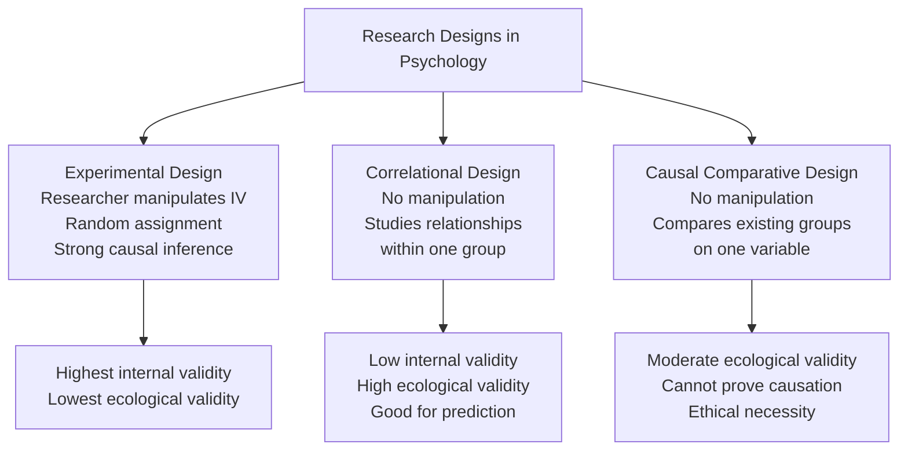
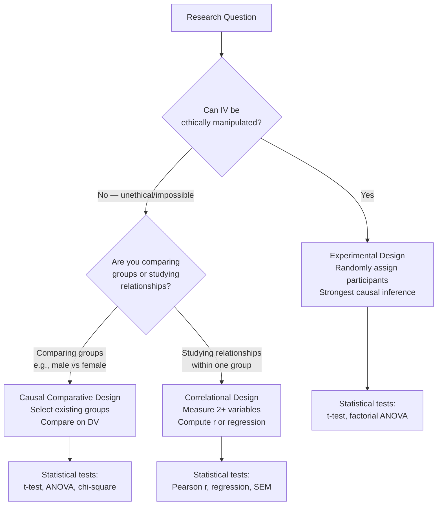

# Comparing Research Designs: Correlational, Causal Comparative, and Experimental

## Introduction

The three major research designs in psychology — experimental, correlational, and causal comparative — are not competitors but **complementary tools**, each suited to different research questions. Understanding how they compare helps researchers choose the right design for a given problem and helps critical readers evaluate the strength of evidence a study provides.

This file synthesises the comparison content from Unit-4 and situates all three designs within a broader framework of research methodology. It is especially important for exam preparation, as comparison questions are among the most frequently asked in MAPC examinations.

:::info Source PDF
📄 [Block-3/Unit-4.pdf — Pages 43–46](/pdfs/MPC-005%20Research%20Methods/Block-3/Unit-4.pdf)  
📚 MPC-005 Research Methods
:::

---

## The Three Designs at a Glance



---

## 4.7 Similarities: Correlational vs. Causal Comparative

Both correlational and causal comparative designs share several fundamental features because they are both **non-experimental**:

| Similarity | Explanation |
|------------|-------------|
| **No IV manipulation** | Neither design involves the researcher controlling or manipulating the independent variable |
| **No random assignment** | Because there is no manipulation, there is no random assignment of participants to conditions |
| **Attribute variables as IVs** | Both typically use characteristics of persons (age, gender, diagnosis, education level) that cannot be assigned by the researcher |
| **Same control techniques** | Both use matching and quota sampling to control confounding extraneous variables |
| **Descriptive dimension** | Both describe conditions that already exist in the natural world |
| **Weaker causal inference** | Neither can definitively establish cause-and-effect the way experiments can |

---

## 4.7.2 Differences: Correlational vs. Causal Comparative

Despite their shared non-experimental nature, the two designs differ fundamentally in their logic and structure:

| Dimension | Correlational Design | Causal Comparative Design |
|-----------|---------------------|--------------------------|
| **Unit of analysis** | Single group of participants | Two or more distinct groups |
| **Focus** | *Relationships* within a group | *Differences* between groups |
| **Variable scaling** | All variables must be **quantitative** (continuous) | Must include at least one **categorical** variable (e.g., gender, diagnosis) |
| **Predictor terminology** | Uses "predictor variable" and "criterion variable" | Does not use predictor/criterion terminology |
| **Statistical methods** | Pearson r, multiple regression, SEM | t-test, ANOVA, chi-square |
| **Evidence for causality** | Very weak — only association | Somewhat stronger — compares groups |
| **Data collection** | All from same group on multiple variables | Separate data from each group on DV |

**Key conceptual distinction:**  
- **Correlational:** "Is there a relationship between stress and health *within* a group of 100 people?"  
- **Causal comparative:** "Do students who attended coaching institutes differ from those who didn't, *on* exam performance?"

---

## 4.8 Differences: Causal Comparative vs. Experimental Design

This comparison is perhaps the most important for understanding what causal comparative design can and cannot tell us:

| Feature | Experimental Design | Causal Comparative Design |
|---------|--------------------|--------------------------| 
| **IV manipulation** | Researcher actively manipulates IV | IV has already occurred; researcher is a passive observer |
| **Group formation** | Researcher creates groups via random assignment | Groups already exist before study begins |
| **Random assignment** | Yes — equalizes confounds across groups | No — groups may differ on many variables beyond the IV |
| **Temporal direction** | Prospective — manipulate, then measure effect | Often retrospective — effect has occurred; trace backward to cause |
| **Internal validity** | Very high — can establish cause-effect | Low to moderate — alternative explanations remain |
| **External validity** | Sometimes lower (artificial settings) | Often higher (real-world groups in natural settings) |
| **Control** | High — researcher controls all conditions | Low — conditions set before study began |
| **Ethical constraints** | Cannot manipulate harmful variables | Specifically useful for ethically sensitive variables |
| **Evidence for causation** | Strong and direct | Weak and indirect |

**Both attempt to establish cause-effect relationships and both involve comparison — but only the experimental design can genuinely establish causation.**

---

## Comprehensive Three-Way Comparison Table

| Feature | Experimental | Correlational | Causal Comparative |
|---------|-------------|--------------|-------------------|
| IV manipulation | ✅ Yes | ❌ No | ❌ No |
| Random assignment | ✅ Yes | ❌ No | ❌ No |
| Causal inference | ✅ Strong | ❌ Very weak | ⚠️ Suggestive |
| Internal validity | ✅ High | ❌ Low | ⚠️ Moderate-low |
| External validity | ⚠️ Variable | ✅ High | ✅ High |
| Group comparison | ✅ Yes | ❌ No | ✅ Yes |
| Relationship focus | ❌ No | ✅ Yes | ❌ No |
| Prediction possible | ⚠️ Limited | ✅ Yes (via regression) | ⚠️ Limited |
| Variable type (IV) | Any | Quantitative | Categorical or attribute |
| Statistical method | ANOVA, t-test | Correlation, regression | t-test, ANOVA, chi-square |
| Ethical for sensitive IVs | ❌ Sometimes not | ✅ Yes | ✅ Yes |
| Sample size needed | Moderate | Large (for regression) | Moderate-large |

---

## Decision Framework: Choosing the Right Design



**Quick decision guide:**

| If you want to... | Use... |
|------------------|--------|
| Prove that X causes Y | Experimental design |
| Find if X and Y are related | Correlational design |
| Predict Y from X | Correlational design (regression) |
| Compare groups that already differ | Causal comparative design |
| Study effects of unethical/impossible IVs | Causal comparative or correlational |
| Study gender, diagnosis, SES as IV | Causal comparative design |

---

## Summary of Advantages and Limitations of All Three Designs

### Experimental Design
| Advantages | Limitations |
|------------|------------|
| Strongest causal evidence | May lack ecological validity (artificial settings) |
| Controls for confounds via random assignment | Cannot study unethical or impossible IVs |
| Allows precise manipulation | Demand characteristics may affect results |
| Highest internal validity | Expensive and time-consuming |

### Correlational Design
| Advantages | Limitations |
|------------|------------|
| Studies naturally occurring relationships | Cannot establish causation |
| High ecological validity | Third variable problem always present |
| Large samples possible | Directionality of relationship unclear |
| Good for prediction (regression) | Low internal validity |
| Ethically accessible | Correlation coefficient assumes linearity |
| Less expensive | Multicollinearity problematic in multiple regression |

### Causal Comparative Design
| Advantages | Limitations |
|------------|------------|
| Studies ethically sensitive variables | Cannot establish cause-and-effect |
| Studies pre-existing groups | No random assignment → selection bias |
| Lower cost than experiments | Direction of causation unclear |
| High ecological validity | Alternative explanations always possible |
| Identifies variables for future experiments | Cannot rule out third variables |
| Facilitates decision-making | Homogeneous groups hard to find |

---

## 4.11 Let Us Sum Up (from PDF)

**Correlational design** is used when we have two or more quantitative variables from the same group of subjects and we are interested to determine if there is a relationship between two variables. Correlation does not show a causal relation — it can be used for prediction.

**Causal comparative design** compares two or more groups on one variable. This design permits investigation of variables that cannot or should not be investigated experimentally. Correlational design and causal comparative design are both non-experimental designs — but one studies the *relationship* between variables and the other studies the *difference* between variables.

---

## Research Design Continuum: From Weakest to Strongest Causal Evidence

```
Weakest causal inference ←————————————————→ Strongest causal inference

Case Study → Survey → Correlational → Causal Comparative → Quasi-Experimental → Experimental
```

Each step up the continuum involves more researcher control over variables and stronger evidence for causal claims.

---

## Common Misconceptions and Clarifications

| Misconception | Clarification |
|---------------|--------------|
| "A high correlation means X causes Y" | Correlation only shows association — not causation. Spurious correlations are common. |
| "Causal comparative = experimental" | No. Causal comparative has no IV manipulation and no random assignment. |
| "Correlational research is weak and useless" | No. Correlational research is essential for prediction, hypothesis generation, and studying naturally occurring relationships. |
| "Both causal comparative and correlational prove cause-effect" | Neither can prove causation — only experimental designs can. |
| "Matching in causal comparative is the same as random assignment" | No. Matching controls for known confounders only; random assignment controls for all confounders, including unknown ones. |

---

## Exam Tips: Most Likely Questions

**Q1: "Write down the similarities and differences between correlational and causal comparative research."**  
Structure: Begin with shared non-experimental nature → list 4–5 similarities → contrast on: unit of analysis (group vs. within-group), variable type (categorical vs. quantitative), statistical methods, focus (differences vs. relationships).

**Q2: "What are the advantages and limitations of correlational design?"**  
Key points: Advantages — ecological validity, large samples, prediction capability, ethical accessibility. Limitations — cannot prove causation, third variable problem, directionality ambiguity, low internal validity.

**Q3: "When to use correlational and causal comparative research design?"**  
Use correlational when: studying relationships within a group, all variables are quantitative, predicting one variable from another. Use causal comparative when: comparing groups that differ on a categorical variable, IV cannot be manipulated, interested in group differences rather than relationships.

**Q4: "What are the advantages and limitations of causal comparative design?"**  
Key points: Advantages — ethical access, real-world groups, lower cost, identifies worthy variables. Limitations — no causation proof, selection bias, reverse causation threat, no random assignment.

---

## Indian Psychology Applications: Selecting the Right Design

| Research Question | Appropriate Design | Reason |
|-------------------|--------------------|--------|
| Does exam anxiety predict NEET scores? | Correlational | Relationship within one group of students |
| Do coaching institute students outperform non-coaching students on JEE? | Causal Comparative | Comparing pre-existing groups; cannot assign students to coaching randomly |
| Does teaching method (lecture vs. inquiry) improve learning? | Experimental | IV can be manipulated; random assignment possible |
| Is there a relationship between family income and depression scores? | Correlational | Quantitative variables within one group |
| Do vegetarians differ from non-vegetarians in mental health? | Causal Comparative | Cannot manipulate diet; comparing pre-existing dietary groups |
| Does gender influence aggression? | Causal Comparative | Gender cannot be manipulated; comparing existing groups |

---

## Memory Aid: ECR Framework

**E**xperimental → Establishes (cause-effect, random assignment, manipulation)  
**C**omparative (Causal) → Compares (groups, categorical IV, pre-existing)  
**R**elational (Correlational) → Relates (variables, quantitative, one group, prediction)  

---

## External Resources

### Wikipedia
- 🌐 [Internal Validity — Wikipedia](https://en.wikipedia.org/wiki/Internal_validity)
- 🌐 [External Validity — Wikipedia](https://en.wikipedia.org/wiki/External_validity)
- 🌐 [Observational Study — Wikipedia](https://en.wikipedia.org/wiki/Observational_study)

### Educational Videos
- 🎥 [Experimental vs. Correlational Research — CrashCourse Psychology](https://www.youtube.com/watch?v=OfyYE3DgR5I)
- 🎥 [Non-Experimental Research Methods Explained](https://www.youtube.com/watch?v=OQMn6KJWFWA)

### Research Papers
- 📄 Cook, T. D., & Campbell, D. T. (1979). *Quasi-Experimentation: Design and Analysis Issues for Field Settings*. Rand McNally.
- 📄 Shadish, W. R., Cook, T. D., & Campbell, D. T. (2002). *Experimental and Quasi-Experimental Designs for Generalized Causal Inference*. Houghton Mifflin.
- 📄 Broota, K. D. (2008). *Experimental Design in Behavioural Research*. New Age International Publishers.

### Online Resources
- 🔗 [Research Designs Overview — Simply Psychology](https://www.simplypsychology.org/research-designs.html)
- 🔗 [Experimental vs Non-experimental Research](https://conjointly.com/kb/experimental-vs-non-experimental-research/)
- 🔗 [Validity in Research — Statistics How To](https://www.statisticshowto.com/validity-in-research/)
- 🔗 [Choosing the Right Research Design — Scribbr](https://www.scribbr.com/methodology/research-design/)

---

## Self-Assessment Questions

**Level 1 — Recall**
1. List three similarities between correlational and causal comparative designs.
2. What is the key difference between the unit of analysis in correlational vs. causal comparative research?

**Level 2 — Understanding**
3. "Both causal comparative and experimental research attempt to establish cause-effect relationships." What distinguishes them in how they do this?
4. Why is internal validity lowest in correlational design and highest in experimental design?

**Level 3 — Application**
5. For each scenario below, identify the most appropriate research design and justify your choice:
   a. Studying whether IQ scores and social skills are related in a sample of 200 adults.
   b. Examining whether children raised in joint families show less depression than those in nuclear families.
   c. Testing whether a new cognitive training program improves working memory.

**Level 4 — Critical Analysis**
6. A researcher claims: "Since we found a strong positive correlation between hours of UPSC coaching and IAS exam success, coaching must cause success." Identify all the problems with this reasoning. What design would provide stronger evidence?

---

*Previous: [← Causal Comparative Research Design](/mpc-005/block-3/causal-comparative-research-design)*  
*Next: MPC-005 Block-4 →*
