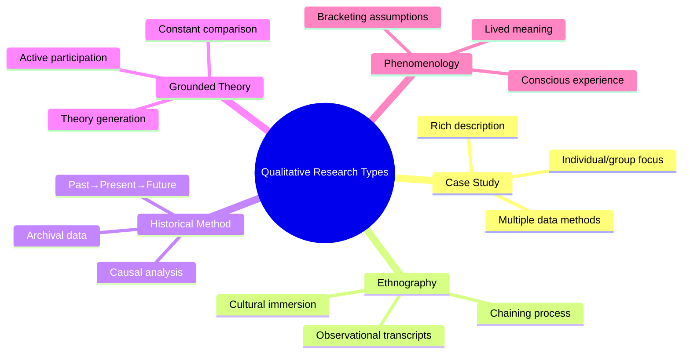
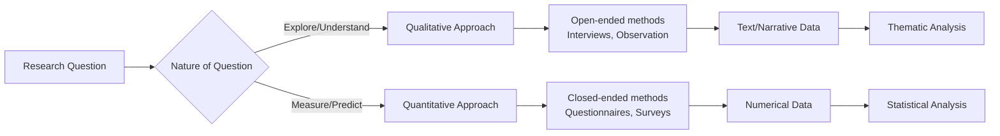

# Qualitative Research: Meaning, Types, and Comparison with Quantitative Research

> *"Qualitative research is a situated activity that locates the observer in the world. It consists of a set of interpretive, material practices that make the world visible."*
> — Norman Denzin & Yvonna Lincoln, *Handbook of Qualitative Research* (2011)

---

## 🎯 Learning Objectives

After studying this topic, you will be able to:
- Define qualitative research and explain its core characteristics
- Identify and describe the five major types of qualitative research
- Systematically compare qualitative and quantitative research approaches
- Explain the relevance of qualitative research for psychological inquiry

---

## 1. What is Qualitative Research?

Qualitative research is a type of scientific inquiry that seeks to **understand human experience, behavior, and social phenomena** from the inside — through the eyes of participants rather than through numerical measurement alone.

**IGNOU Definition (MPC-005 Block-4 Unit-1, p. 6):** Qualitative research can be defined as *"a type of scientific research that tries to bridge the gap of incomplete information, systematically collects evidence, produces findings and thereby seeks answer to a problem or question."*

It is widely used to collect and understand specific information about:
- Behavior, opinions, and values
- Social structures and cultural norms
- Lived experiences and subjective meanings

### Key Characteristics of Qualitative Research

| Feature | Description |
|---------|-------------|
| **Naturalistic** | Studies phenomena in their natural settings |
| **Interpretive** | Seeks meaning, not measurement |
| **Inductive** | Builds theory from data rather than testing hypotheses |
| **Holistic** | Considers context and the whole picture |
| **Participant-centered** | Values insider perspectives (emic view) |
| **Flexible** | Research design evolves with the inquiry |
| **Textual/rich data** | Produces narratives, transcripts, field notes |

### A Classic Example
David (1995) studied the concept of spiritual development among college students at a conservative school, analyzing whether there was **uniformity or diversity** in how people understood spiritual growth. This exemplifies qualitative research's strength: capturing the nuance and complexity of a lived experience that no survey could fully reveal.

---

## 2. Types of Qualitative Research

### 2.1 Case Study

A **case study** involves the in-depth investigation of a **single unit** — which may be an individual, group, event, institution, or society.

**Characteristics:**
- Uses multiple data collection methods simultaneously (interviews, observation, documents, questionnaires)
- Produces a **rich** (vivid, detailed) and **holistic** (whole + parts) description
- Ideal when the researcher wants to preserve context and complexity

**Example in Psychology:** Freud's famous case studies (Anna O., Little Hans, Dora) were essentially qualitative case study investigations that formed the foundation of psychoanalytic theory.

**Indian Application:** A case study of a first-generation college student navigating family pressures while pursuing higher education would generate insights no standardized questionnaire could capture.

:::tip Exam Tip
In IGNOU exams, case study is often asked to be compared with ethnography. Remember: **Case Study = Specific individual/event | Ethnography = Cultural group/community**
:::

---

### 2.2 Ethnography

Ethnography focuses on **studying culture through close observation and active participation** in a specific community. The researcher immerses themselves in the community for extended periods (months or years).

Key feature: **Chaining process** — initial respondents identify additional informants, creating a snowball-like data collection network.

*(Full coverage in the dedicated ethnography file →)*

---

### 2.3 Historical Method

The **historical method** analyzes causal relationships through the study of **past events**.

**Purpose:**
- Collect and evaluate data about historical occurrences
- Understand reasons behind events
- Test hypotheses about cause-effect relationships
- Explain present events and **anticipate future trends**

**Example:** A historian-psychologist studying the psychological impact of the Partition of India (1947) on survivors and their descendants would use historical method — combining archival records, oral histories, and secondary sources.

**Types of historical data:**
- *Primary sources*: Diaries, letters, government records, photographs
- *Secondary sources*: Books, articles, retrospective accounts
- *Oral history*: Recorded testimonies from living witnesses

---

### 2.4 Grounded Theory

Developed by Glaser and Strauss (1967), **grounded theory** involves **active participation** in a group/community to generate or develop theories **from the data itself** — not from prior assumptions.

#### Four Key Characteristics (IGNOU p. 7):

| Characteristic | Meaning |
|---------------|---------|
| **Fit** | Theory corresponds to real existing community/phenomena |
| **Understanding** | Theory is clear and comprehensible to participants |
| **Generality** | Theory has broad scope for further analysis |
| **Control** | Theory generated under analytically rigorous conditions |

#### Functions of Grounded Theory:
1. **Identifies anchors/codes** — Key concepts in data that organize understanding
2. **Makes implicit beliefs explicit** — Surfaces hidden assumptions through analysis
3. **Guarantees quality** — Careful execution of steps ensures rigor
4. **Continuous inquiry** — Data collection and analysis run simultaneously throughout

**Example:** Grounded theory was used in studying how Indian IT professionals psychologically adapt to working in multinational corporations — the theory of "professional hybridity" emerged from the data rather than being pre-imposed.

:::info Grounded Theory vs. Hypothesis Testing
Traditional research: **Theory → Hypothesis → Data → Test**
Grounded Theory: **Data → Codes → Categories → Theory**
:::

---

### 2.5 Phenomenology

**Phenomenology** explains behavioral phenomena through the **conscious experience** of participants, without using external theories, calculations, or assumptions from other disciplines.

The researcher attempts to understand: *What is it like to experience this phenomenon?*

**Classic Example (IGNOU p. 7-8):** Creswell (1998) studied how patients described "caring" versus "non-caring" nurses. Patients described caring nurses as those who showed **existential presence** (genuine emotional responsiveness) rather than mere **physical presence** (task performance). The study revealed that comfort, security, and healing are tied to being *heard and responded to* — not just physically attended to.

**Phenomenological Steps:**
1. Bracket preconceptions (epoché)
2. Collect descriptions from participants
3. Identify meaning units
4. Develop essences of the experience

**Indian Application:** Phenomenological research on the experience of meditation among practitioners at NIMHANS (National Institute of Mental Health and Neurosciences) has generated rich insights into altered consciousness that surveys cannot access.

---

## 3. Qualitative vs. Quantitative Research: Systematic Comparison

### Comprehensive Comparison Table

| Dimension | Qualitative Research | Quantitative Research |
|-----------|---------------------|----------------------|
| **General Framework** | Explores phenomena using structured methods (interviews, participant observation) | Confirms hypotheses using highly structured methods (questionnaires, surveys) |
| **Objectives** | Describe variation, explain relationships, describe behavior, experiences, norms | Quantify variation, predict causal relationships |
| **Research Questions** | Open-ended | Close-ended |
| **Data Representation** | Field notes, recordings, video tapes, transcripts | Numbers, graphs, tables, statistics |
| **Research Design** | Flexible; questions evolve with participant responses | Predetermined and stable from the beginning |
| **Participant Relationship** | Researcher as participant | Researcher as detached observer |
| **Sample Size** | Small, purposive | Large, representative |
| **Generalizability** | Transferability (context-specific) | Statistical generalization |
| **Validity Focus** | Internal (credibility, authenticity) | External (statistical reliability) |
| **Theory Role** | Inductive (generates theory) | Deductive (tests theory) |
| **Time Investment** | Extended field presence | Structured, time-limited |

### When to Use Which?

**Qualitative is preferred when:**
- The phenomenon is poorly understood
- Context is critical to meaning
- Individual variation matters
- Human experience/subjectivity is the focus
- Generating (not testing) theory is the goal

**Quantitative is preferred when:**
- Variables are clearly defined
- Measurement precision is essential
- Large-scale comparisons are needed
- Hypothesis testing is the goal

### Mixed Methods: The Best of Both Worlds

Modern psychology increasingly uses **mixed methods research** — combining qualitative and quantitative approaches. For example, the **Sequential Explanatory Design** collects quantitative data first, then uses qualitative interviews to explain unexpected findings.

---

## 4. Relevance of Qualitative Research in Psychology

As the IGNOU text notes (p. 8-9), qualitative research has gained increasing importance in psychology, even while psychology historically emphasized experimental (quantitative) methods.

### Why Qualitative Research Matters for Psychology:

1. **Textual description of experiences** — Captures the *how* and *why* of psychological phenomena, not just frequencies
2. **Social norms and roles** — Identifies and explains religion, gender roles, socioeconomic status effects in lived experience
3. **Non-quantifiable phenomena** — Studies phenomena like grief, love, prejudice, and transcendence that resist numeric reduction
4. **Natural settings** — Collects data under more ecologically valid conditions than lab experiments
5. **Participant meaning** — Determines what factors are *meaningful and important to respondents*, not just what researchers hypothesize

### Critique: The Replication Crisis and Qualitative Methods

The psychology replication crisis (2011–present), where many classic quantitative studies failed to replicate, has renewed interest in qualitative methods as a complement to experimental approaches. Researchers like Jonathan Haidt have argued that qualitative ethnographic observation can reveal psychological phenomena that experiments miss entirely.

### WEIRD Bias and Qualitative Research

Most psychological research draws from **Western, Educated, Industrialized, Rich, Democratic (WEIRD)** populations. Qualitative methods — especially ethnography — are essential tools for studying psychological phenomena in non-WEIRD contexts, including India's diverse cultural, linguistic, and socioeconomic landscape.

---

## 📚 External Resources

### Wikipedia Articles
- [Qualitative research — Wikipedia](https://en.wikipedia.org/wiki/Qualitative_research)
- [Case study — Wikipedia](https://en.wikipedia.org/wiki/Case_study)
- [Grounded theory — Wikipedia](https://en.wikipedia.org/wiki/Grounded_theory)

### Educational Videos
- 📹 [Qualitative vs. Quantitative Research — Crash Course Statistics](https://www.youtube.com/watch?v=W6NuBCnCHfQ)
- 📹 [Introduction to Qualitative Research Methods — Sociological Research Skills](https://www.youtube.com/watch?v=IsAUNs-IoSQ)

### Academic Sources & Research Papers
- Denzin, N. K., & Lincoln, Y. S. (2011). *The SAGE Handbook of Qualitative Research* (4th ed.). SAGE Publications.
- Creswell, J. W. (2013). *Qualitative Inquiry and Research Design: Choosing Among Five Approaches* (3rd ed.). SAGE. — [https://us.sagepub.com/en-us/nam/qualitative-inquiry-and-research-design/book235519](https://us.sagepub.com/en-us/nam/qualitative-inquiry-and-research-design/book235519)
- Glaser, B. G., & Strauss, A. L. (1967). *The Discovery of Grounded Theory*. Aldine. — Seminal grounded theory text.
- Henrich, J., Heine, S. J., & Norenzayan, A. (2010). The WEIRDest people in the world? *Behavioral and Brain Sciences, 33*(2–3), 61–83. — [https://doi.org/10.1017/S0140525X0999152X](https://doi.org/10.1017/S0140525X0999152X)
- Thorne, S. (2016). *Interpretive Description: Qualitative Research for Applied Practice* (2nd ed.). Routledge.

### Online Resources
- [The Qualitative Report — Journal of Qualitative and Mixed Methods Research](https://tqr.nova.edu/)
- [Patton, M. Q.'s Qualitative Research Overview — SAGE Resource](https://methods.sagepub.com/reference/the-sage-handbook-of-qualitative-research)
- [Qualitative Research Examples — South Alabama University](http://www.southalabama.edu/coe/bset/johnson/lectures/lec12.htm) *(as cited in IGNOU text)*
- [Qualitative Research Examples PDF](http://qualitativeresearch.ratcliffs.net/examples.pdf) *(as cited in IGNOU text)*
- [APA Division 5: Quantitative and Qualitative Methods](https://www.apadivisions.org/division-5)

---

## 🧠 Memory Aids

### Mnemonic: **"C-E-H-G-P" Types**
> **C**ase study, **E**thnography, **H**istorical, **G**rounded theory, **P**henomenology
> 
> Remember: **"Clever Explorers Have Great Perspectives"**

### Qualitative vs. Quantitative Quick Recall
> **Qual** = **Q**uestions (open-ended), **N**arrative data, **F**lexible design  
> **Quant** = **N**umbers, **S**tructured design, **H**ypothesis testing

### Grounded Theory 4 Features
> **FUGaC** → **F**it, **U**nderstanding, **G**enerality, **C**ontrol

---

## ✅ Self-Assessment Questions

### Conceptual Understanding
1. **Define qualitative research.** How does it differ from quantitative research in terms of research design flexibility?

2. **Compare and contrast** case study and ethnography as qualitative research methods. In what situations would you choose one over the other?

3. A researcher wants to study how medical students in India cope psychologically with the pressure of NEET preparation. Which qualitative method would you recommend — case study, grounded theory, or phenomenology? Justify your answer.

### Application Questions
4. **Identify the qualitative method** most appropriate for each scenario:
   - (a) Studying the tribal healing practices of the Garo people of Meghalaya
   - (b) Understanding how COVID-19 survivors describe their psychological recovery journey
   - (c) Generating a theory about how undergraduate psychology students develop professional identity
   - (d) Analyzing the psychological effects of the 1984 Bhopal gas tragedy on survivors

5. **Critical thinking:** The IGNOU text suggests qualitative research "helps in collecting data under more natural situations." Explain what this means and why it matters for psychological research validity.

---

## 📋 Quick Revision Summary

- **Qualitative research** explores human behavior through non-numerical data — observations, interviews, texts
- **Five types**: Case Study, Ethnography, Historical Method, Grounded Theory, Phenomenology
- **Grounded theory** characteristics: Fit, Understanding, Generality, Control
- **Phenomenology** focuses on conscious experience without external theoretical preconceptions
- **Key advantage** over quantitative: captures meaning, context, and subjective experience
- **WEIRD bias**: Qualitative methods essential for studying diverse non-Western populations

---

**Source PDFs:**
- 📄 [Block-4/Unit-1.pdf - Pages 5-10](/pdfs/MPC-005%20Research%20Methods/Block-4/Unit-1.pdf)
- 📚 MPC-005 Research Methods, Block 4: Qualitative Research in Psychology
