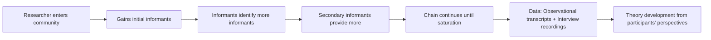
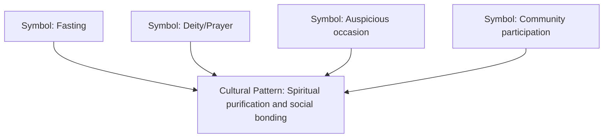
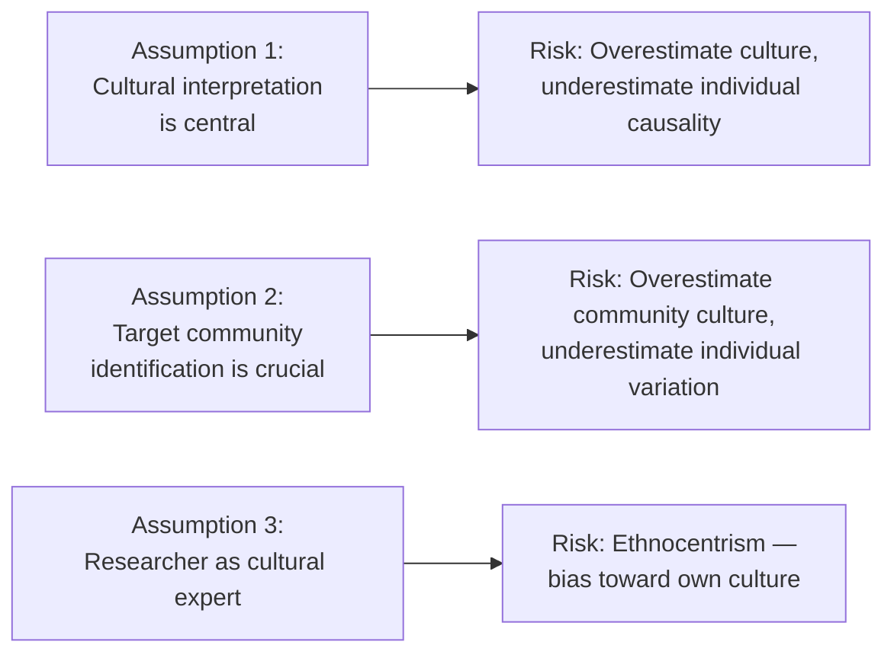

# Ethnography: Meaning, Key Concepts, and Common Terms

> *"The ethnographer does not approach the field as a blank slate. Yet the essence of the craft lies in learning to become a stranger in familiar territory — and to find the familiar in strange places."*
> — Martyn Hammersley & Paul Atkinson, *Ethnography: Principles in Practice* (1995)

---

## 🎯 Learning Objectives

After studying this topic, you will be able to:
- Define ethnography and explain its role as "ethnomethodology"
- Describe the key terms used by ethnographers (symbols, cultural patterning, tacit knowledge, situational reduction)
- Identify the three core assumptions underlying ethnographic research
- Distinguish between macro and micro ethnography, and emic vs. etic perspectives

---

## 1. Ethnography: The Meaning

The word **ethnography** comes from Greek: *ethnos* (people/culture) + *graphein* (to write). It is also known as **ethnomethodology** — literally, the **"methodology of people"** or the study of how people make sense of their everyday world.

**Core Purpose:** Ethnographic research intends to **study culture through close observation and active participation**. It focuses on socio-cultural phenomena of a specific community.

### The Chaining Process: Ethnography's Unique Data Collection Method

One of ethnography's defining features is the **chaining (or snowball) sampling process**:

**Key Feature:** The selected samples are re-interviewed to elicit **deeper and more nuanced responses**. The ethnographer may stay within the community for **months or even years** to:
- Gain access through trust-building
- Understand tacit (unstated) cultural knowledge
- Capture data that only emerges over extended contact

---

## 2. Common Terms Used by Ethnographers

The IGNOU text (Block-4 Unit-1, pp. 10-11) introduces four essential ethnographic concepts. Understanding these is critical for exam preparation.

### 2.1 Symbols

**Definition:** Any tradition or material artifact of a particular culture — including art, clothing, food, technology, rituals, gestures, and language.

The ethnographer's task is to understand the **cultural connotations behind symbols**, not merely their surface appearance.

**Examples:**
- The *tilak* (forehead mark) in Hindu culture carries religious, social, and political meanings that an outsider might misinterpret
- The red sari worn by a bride in a Bengali wedding is a symbol loaded with cultural meaning distinct from a white wedding gown in Western culture
- UPSC exam hall entry rituals (removing watches, phones, etc.) are symbols of academic integrity enforcement in Indian bureaucratic culture

### 2.2 Cultural Patterning

**Definition:** Ethnographic research holds that symbols cannot be understood in isolation — meaning emerges from **relationships between two or more symbols** forming patterns.

**Key Insight:** Cultures are not random collections of behaviors; they are organized systems where elements reinforce and contextualize each other.

**Example:** The symbol of fasting (*upvaas*) in Indian culture only becomes fully meaningful when understood alongside symbols of deity, prayer, auspiciousness, and community participation — the cultural pattern gives fasting its significance.

### 2.3 Tacit Knowledge

**Definition:** Cultural beliefs and knowledge that are **so deeply embedded** in a culture that members rarely articulate them explicitly — they are lived, not discussed.

**Characteristics:**
- Cannot be directly observed by the researcher
- Must be **inferred** from behavior, context, and indirect cues
- Often surfaces when a cultural rule is violated

**Examples:**
- **Caste-based seating arrangements** at village social events in rural India — participants follow unstated rules that no one explicitly teaches
- **Gender roles in family meals** — who serves, who eats first, who gets certain foods — often unreflected patterns
- **Code-switching** between Hindi and English in urban Indian contexts signals social status and education in ways speakers don't consciously plan

:::warning Important for Exams
Students often confuse **tacit knowledge** with **cultural patterning**. Remember:
- **Cultural patterning** = how symbols relate to each other (observable structure)
- **Tacit knowledge** = unspoken beliefs that must be *inferred*, never directly seen
:::

### 2.4 Situational Reduction

**Definition:** The ethnographic belief that **social structures and social dynamics emerge from the interaction of multiple social situations**, not from single causes.

Rather than seeking one explanation for a behavior, ethnographers identify the **confluence of situations** that produce it.

**Example from IGNOU text (p. 11):** Criminal behavior may result from the interaction of:
- Poor economic conditions
- Frustration and psychological distress
- Parenting failures
- Neighborhood environment
- Peer group influences

This multi-causal view contrasts sharply with the reductive approach of seeking a single "criminal gene" or single "root cause."

**Indian Application:** Farmer suicides in Maharashtra cannot be attributed to a single cause (crop failure, debt, drought) — situational reduction reveals the layered social, economic, climatic, and psychological conditions that converge to produce this tragedy.

---

## 3. Assumptions in Ethnographic Research

The IGNOU text identifies three critical assumptions of ethnography, each with built-in **risks** the researcher must guard against:

### Assumption 1: Cultural Interpretation Shapes Research

The main objective of ethnographic research **depends on and is affected by the interpretation of community cultural understandings**.

- Risk: The researcher may **overestimate cultural perception** and **underestimate individual causal factors** behind behavior

### Assumption 2: Community Identification is Difficult but Necessary

It is both important and difficult to identify the **target community** to be studied. Nature, size, and members' perceptions all influence what needs to be studied.

- Risk: The researcher may overestimate **community-level culture** while underestimating **individual beliefs and perceptions**

### Assumption 3: Researcher as Cultural Expert

The ethnographer is assumed to be thoroughly familiar with the norms, mores, and language of the culture under study.

- Risk: **Ethnocentrism** — the researcher may unconsciously judge the study culture by the standards of their own culture

:::info Ethnocentrism in Indian Contexts
Indian ethnographers studying Adivasi (tribal) communities must guard against viewing indigenous practices through the lens of mainstream Hindu-brahminical culture — an ethnocentric error that has historically distorted anthropological records of India's indigenous peoples.
:::

---

## 4. Types of Ethnographic Research

### 4.1 Macro vs. Micro Ethnography

| Type | Focus | Scale | Example |
|------|-------|-------|---------|
| **Macro Ethnography** | Broadly defined cultural groupings | Large, general | "Indians," "The Turkish," "African Americans" |
| **Micro Ethnography** | Specific, bounded cultural groupings | Small, particular | "Local government workers in Patna," "Kashmiri weavers" |

**Key Distinction:** Macro ethnography studies **what is common across broad cultural strata**, while micro ethnography examines **what is specific to a particular sub-group**.

### 4.2 Emic vs. Etic Perspectives

This distinction is fundamental to all ethnographic research:

| Perspective | Meaning | Who Provides It | Strengths |
|-------------|---------|-----------------|-----------|
| **Emic** | Insider view — the perspective of *ingroup* members | Community participants | Authenticity, lived experience, tacit knowledge |
| **Etic** | Outsider view — the perspective of *outgroup* observers | Researcher/external analyst | Comparative perspective, theoretical framing |

**Origins:** The terms derive from linguistics — *phonemic* (language-specific sounds) and *phonetic* (universal sound description). Anthropologist Kenneth Pike (1967) adapted them for cultural research.

**The Ideal Ethnographic Approach:** Good ethnography integrates both perspectives:
- Begin with **etic** framework (what can an outsider observe?)
- Immerse to understand **emic** meanings (what does it mean to insiders?)
- Synthesize for a comprehensive cultural analysis

**Indian Example:**
- **Emic perspective** on *purdah* (veil/seclusion practice): Women in communities practicing it may describe it as protection, identity, and social belonging
- **Etic perspective** on *purdah*: Feminist researchers from outside the community may analyze it as a patriarchal control mechanism
- Both perspectives are needed for a complete understanding

---

## 5. Purpose of Ethnographic Research

The IGNOU text (p. 11) identifies four key purposes:

1. **Cross-cultural analysis** — Comparing practices, beliefs, and behaviors across cultures (e.g., eating habits of North vs. South Indians)

2. **Historical analysis** — Analyzing past events or cultural history (e.g., the Harappan civilization — *Ethnohistory*)

3. **Natural environment study** — Studying behavior, experiences, and attitudes in ecologically valid settings rather than artificial labs

4. **Enhanced validity** — Close observation increases the validity of reports and generated theories (because data is context-rich)

### Special Types of Ethnography

| Type | Focus |
|------|-------|
| **Ethnology** | Comparative analysis of cultural groups (e.g., marriage practices across regions) |
| **Ethnohistory** | Analysis of cultural past through historical documents and artifacts |
| **Autoethnography** | Researcher studies their own culture/experience reflexively |
| **Netnography** | Online ethnography — studying digital communities and cultures |

---

## 📚 External Resources

### Wikipedia Articles
- [Ethnography — Wikipedia](https://en.wikipedia.org/wiki/Ethnography)
- [Emic and etic — Wikipedia](https://en.wikipedia.org/wiki/Emic_and_etic)
- [Tacit knowledge — Wikipedia](https://en.wikipedia.org/wiki/Tacit_knowledge)

### Educational Videos
- 📹 [What is Ethnography? — Sociological Research Methods](https://www.youtube.com/watch?v=kVnI_1nzYGQ)
- 📹 [Emic vs. Etic perspectives in anthropology — Explained Simply](https://www.youtube.com/watch?v=s0oeoPFX8vc)

### Academic Sources & Research Papers
- Hammersley, M., & Atkinson, P. (1995). *Ethnography: Principles in Practice* (2nd ed.). Routledge. *(Cited in IGNOU text)*
- Gold, R. L. (1997). The ethnographic method in sociology. *Qualitative Inquiry, 3*(4), 388–402. *(Cited in IGNOU text)*
- Pink, S. (2015). *Doing Sensory Ethnography* (2nd ed.). SAGE. — [https://uk.sagepub.com/en-gb/eur/doing-sensory-ethnography/book242879](https://uk.sagepub.com/en-gb/eur/doing-sensory-ethnography/book242879)
- Clifford, J. (1999). On Ethnographic Authority. In A. Bryman & R. Burgess (eds.), *Methods of Qualitative Research* (Vol. III). SAGE. *(Cited in IGNOU text)*
- Bernard, H. R. (1995). *Research Methods in Anthropology* (2nd ed.). SAGE. *(Cited in IGNOU text)*

### Online Resources
- [American Ethnological Society — AES](https://americanethnologist.org/)
- [Society for Cultural Anthropology Research Methods](https://culanth.org/fieldsights)
- [ICSSR (Indian Council of Social Science Research) — Ethnographic Research in India](https://www.icssr.org/)
- [CSDS (Centre for the Study of Developing Societies) — Ethnographic Studies](https://www.csds.in/)
- [Netnography by Robert Kozinets](https://www.netnography.com/)

---

## 🧠 Memory Aids

### Mnemonic: Ethnographic Terms — **"SCTS"**
> **S**ymbols → **C**ultural patterning → **T**acit knowledge → **S**ituational reduction
>
> Remember: **"Studying Cultures Takes Sensitivity"**

### Emic vs. Etic
> **E-M-IC** = E**m**otionally **i**nvolved insiders (community **members**)  
> **E-T-IC** = E**t**hically detached **t**heoretical outsiders

### Three Assumptions Memory Aid
> **"ICE"** — **I**nterpretation of culture shapes research | **C**ommunity identification is hard | **E**xpertise of researcher assumed (but ethnocentrism is the risk)

---

## ✅ Self-Assessment Questions

### True/False (Based on IGNOU Text pp. 12-13)
1. Ethnography is also known as "methodology of culture." (True / **False** — it is "methodology of people")
2. The ethnographer collects information from many community members. (**True**)
3. Macro ethnography studies specific, bounded cultural groupings. (**False** — that's micro ethnography)
4. Out-group members provide the *emic* perspective. (**False** — etic perspective)
5. The chaining process involves participants identifying additional informants. (**True**)
6. Tacit knowledge can be directly observed by the ethnographer. (**False** — must be inferred)

### Short Answer Questions
1. **Explain the concept of "situational reduction"** with a real-world example from Indian society.
2. **Why is tacit knowledge particularly difficult** to capture in ethnographic research? What methods can an ethnographer use to infer it?
3. **Distinguish between emic and etic perspectives.** Why does good ethnographic research require both?

### Application Question
4. An ethnographer is studying **mental health stigma** in a rural Rajasthani community. Identify:
   - (a) What symbols they might look for
   - (b) What tacit knowledge might exist around mental illness
   - (c) The assumptions they must guard against
   - (d) Whether this would be macro or micro ethnography

---

## 📋 Quick Revision Summary

- **Ethnography = Ethnomethodology** = "Methodology of people" — studies culture through immersion
- **Chaining process**: participants identify further informants — snowball data collection
- **Key terms**: Symbols (artifacts/traditions), Cultural patterning (symbol relationships), Tacit knowledge (unstated beliefs), Situational reduction (multi-causal analysis)
- **Three assumptions**: Cultural interpretation → Community identification → Researcher expertise (risk: ethnocentrism)
- **Types**: Macro (broad groups) vs. Micro (specific groups); Emic (insider) vs. Etic (outsider)
- **Purposes**: Cross-cultural analysis, historical analysis, natural environment study, enhanced validity

---

**Source PDFs:**
- 📄 [Block-4/Unit-1.pdf - Pages 10-13](/pdfs/MPC-005%20Research%20Methods/Block-4/Unit-1.pdf)
- 📚 MPC-005 Research Methods, Block 4: Qualitative Research in Psychology
