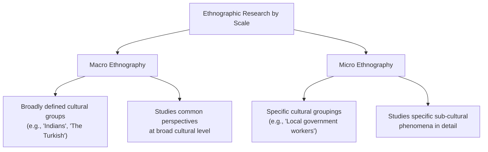
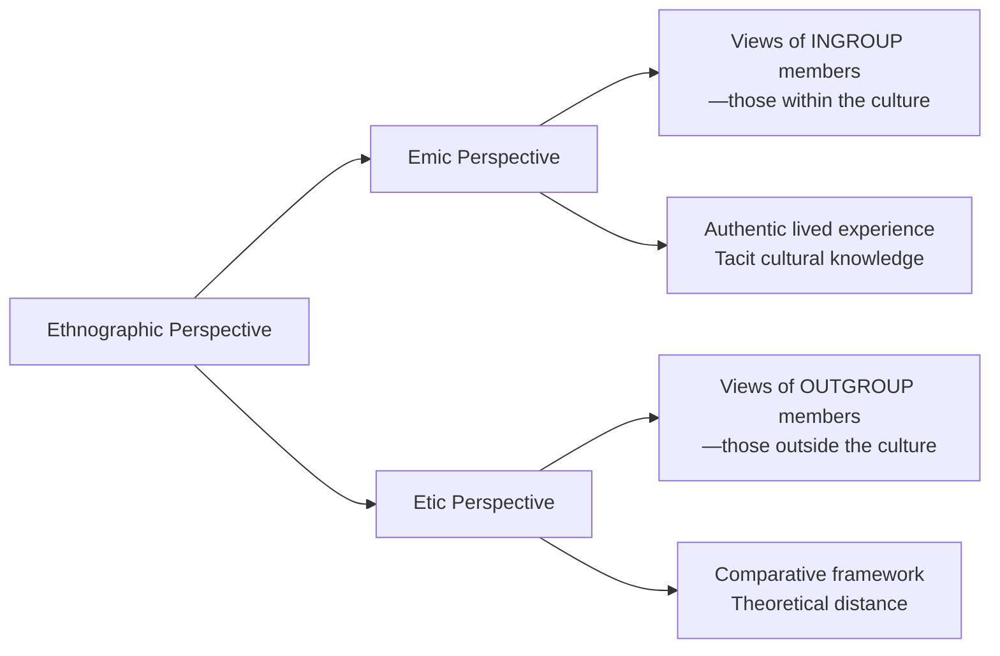
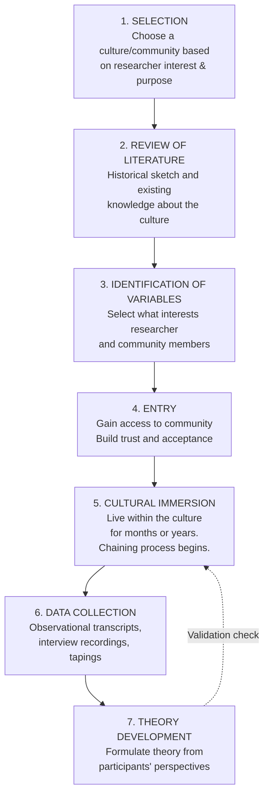
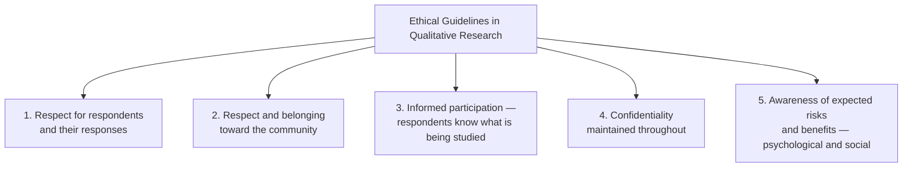

# Ethnographic Research: Types, Steps, Purpose, and Ethical Guidelines

> *"Ethical ethnography is not just about following a rulebook — it is about entering a relationship of genuine respect with those whose lives you seek to understand."*
> — Sarah Pink, *Doing Visual Ethnography* (2013)

---

## 🎯 Learning Objectives

After studying this topic, you will be able to:
- Identify and distinguish the four types of ethnographic research perspectives
- Describe the seven steps of the ethnographic method in sequence
- Explain the purpose of ethnographic research across different applications
- Apply ethical guidelines specific to qualitative research contexts

---

## 1. Types of Ethnographic Research (Comprehensive Overview)

Building on the foundational concepts from the previous section, ethnographic research can be classified across two primary axes:

### Axis 1: Scale of Analysis

### Axis 2: Insider vs. Outsider Perspectives

### Summary Table: Ethnographic Types

| Type | Definition | Level | Key Use |
|------|-----------|-------|---------|
| **Macro Ethnography** | Study of broadly defined cultural groupings | Large-scale | Cross-national cultural comparisons |
| **Micro Ethnography** | Study of specific, bounded cultural groupings | Small-scale | Community-specific investigations |
| **Emic Perspective** | Ingroup/insider viewpoints and responses | Participant | Authenticity, cultural meaning |
| **Etic Perspective** | Outgroup/outsider viewpoints and analysis | Observer | Theoretical comparison |

### Special Ethnographic Forms

| Form | Definition |
|------|-----------|
| **Ethnology** | Comparative analysis of different cultural groups (e.g., eating habits: North vs. South Indians) |
| **Ethnohistory** | Study of cultural past of a group of people (e.g., the Harappan civilization) |
| **Autoethnography** | Self-study — researcher examines their own cultural identity and experience |
| **Critical Ethnography** | Examines power structures, inequalities, and social justice within cultures |

---

## 2. Purpose of Ethnographic Research

The IGNOU text (Block-4 Unit-1, p. 11) identifies four core purposes:

1. **Cross-cultural analysis**: Comparative examination of practices across cultural groups
   - *Example*: Eating habits of North Indians vs. South Indians (called **Ethnology**)

2. **Historical cultural analysis**: Analyzing the past events or history of a culture
   - *Example*: Studying the Harappan civilization through material artifacts and social evidence (**Ethnohistory**)

3. **Natural environment study**: Understanding behavior, experiences, and attitudes in their **real-life context** — not laboratory conditions
   - *Why it matters*: Increases ecological validity — behaviors are studied as they actually occur

4. **Enhanced validity**: Close, extended observation increases the validity of reports and theories
   - The richness of observational data reduces the "demand characteristics" problem common in lab research

### Extended Purposes in Modern Ethnography

Beyond the IGNOU text's four purposes, contemporary researchers use ethnography for:
- **Policy evaluation**: How do communities actually experience welfare programs? (Contrasts official reports with lived reality)
- **Clinical applications**: Understanding how patients from specific cultural backgrounds experience mental illness and treatment
- **Organizational research**: Corporate ethnography to understand workplace cultures
- **Digital communities**: Netnography studies online gaming communities, social media cultures

---

## 3. Steps of the Ethnographic Method

The IGNOU text describes **seven sequential steps** in ethnographic research (pp. 11-12):

### Detailed Analysis of Each Step

#### Step 1: Selection
The ethnographic method begins with the **selection of a culture, community, or population** to study.

**Selection criteria include:**
- Researcher's academic interest and expertise
- Significance of the cultural question
- Accessibility and feasibility (language, permissions, safety)
- Ethical appropriateness

**Indian Example:** A researcher interested in understanding mental health attitudes might select a specific tribal community in Jharkhand, or the psychiatric ward of a government hospital in Mumbai.

---

#### Step 2: Review of Literature
Before entering the field, the researcher reviews existing literature about the selected culture to develop:
- Historical background and context
- Prior research findings
- Theoretical frameworks that may inform (but not constrain) analysis
- Awareness of what is known vs. what is unknown

**Why critical:** Going in without literature review risks wasting field time rediscovering what is already documented.

---

#### Step 3: Identification of Variables
The researcher identifies the **variables of interest** — phenomena that:
- Intrigue the researcher based on literature review
- Are important to community members themselves
- Need systematic exploration

:::tip Qualitative "Variables"
In qualitative research, "variables" are less about measurable constructs and more about **themes, patterns, and phenomena** that will guide observation and interview questioning.
:::

---

#### Step 4: Entry
Gaining entry to a community is often the most challenging step. The ethnographer must:
- Negotiate access (often through gatekeepers — community leaders, elders, school principals)
- Build initial trust and rapport
- Establish their role (participant observer, outsider researcher, etc.)
- Address community questions about the research purpose

**In India:** Gaining entry to caste-based communities, religious institutions, or government organizations often requires formal permissions and navigation of hierarchical social structures.

---

#### Step 5: Cultural Immersion
This is the **heart of ethnographic research**. Ethnographers **live within the culture** for months or even years.

During immersion:
- **Middle stages**: Gaining informants, using chaining process to identify more informants
- **Data accumulates gradually** as trust deepens
- **Researcher role can shift** from outsider to trusted insider

**Researcher Roles in Observation (Gold, 1958):**
| Role | Description |
|------|-------------|
| **Complete Participant** | Fully immersed; identity as researcher concealed |
| **Participant as Observer** | Active community member; research role known |
| **Observer as Participant** | Primarily observer; limited participation |
| **Complete Observer** | No participation; purely watching |

Most contemporary ethnographers take the **Participant as Observer** role for ethical transparency.

---

#### Step 6: Data Collection
After gaining the community's confidence, the researcher collects **multiple forms of data**:

- **Observational transcripts** — detailed written accounts of observed behavior
- **Interview recordings** — audio/video records of conversations
- **Tapings** — recordings of cultural events, ceremonies, interactions
- **Artifacts** — photographs, documents, objects with cultural significance
- **Field diaries** — researcher's own reflective notes

**Data Management:** All data must be organized systematically with dates, participants, and contexts noted. Confidentiality protocols must be established from the start.

---

#### Step 7: Theory Development
The final step involves **analyzing data and formulating theory based on participants' perspectives and observations** — not on the researcher's preconceptions.

**Key principle (IGNOU text, p. 12):** The ethnographer tries best to **avoid theoretical preconceptions** and formulates theory from the data itself.

**Validation process:** The researcher may return to community members to seek their **reaction to induced theories** — checking whether the interpretations resonate with insiders (member checking).

---

## 4. Ethical Guidelines in Qualitative Research

The IGNOU text identifies five essential ethical principles for qualitative (including ethnographic) research (p. 12):

### 4.1 Respect for Respondents
Both the **persons** and their **responses** must be treated with dignity. This means:
- Not dismissing or ridiculing cultural practices that seem "strange"
- Accurately representing what participants actually said/did
- Protecting participants from embarrassment or harm

### 4.2 Community Respect and Belonging
The researcher must demonstrate **genuine respect and a sense of belonging** to the community they are studying — not treating community members as research objects.

### 4.3 Informed Participation
Respondents must be **made aware of what is being analyzed**. This is the qualitative equivalent of **informed consent** — fundamental to ethical research.

**In practice:**
- Explain the research purpose in accessible language
- Clarify how data will be used
- Explain who will have access to findings
- Provide option to withdraw

### 4.4 Confidentiality
The researcher must **ensure and maintain the confidentiality** of respondents. This includes:
- Anonymizing participants in publications
- Securing recordings and transcripts
- Not sharing identifiable information with outside parties
- Using pseudonyms for communities when appropriate

### 4.5 Risk-Benefit Awareness
Researchers must be aware of **expected risks and benefits**, including:
- **Psychological risks**: Distress from discussing sensitive topics (trauma, stigma, conflict)
- **Social risks**: Community tensions that might arise from researcher's presence
- **Benefits**: Community empowerment through documentation, theory development

### Additional Contemporary Ethical Principles

Beyond the IGNOU text, modern ethical frameworks add:

| Principle | Description |
|-----------|-------------|
| **Justice** | Fair distribution of research benefits to the community studied |
| **Cultural competence** | Researcher understands cultural norms around privacy, hierarchy, and disclosure |
| **Reciprocity** | Give back to communities (feedback, advocacy, co-authorship) |
| **Reflexivity** | Researcher continuously examines their own biases and their effects |
| **Gatekeeping ethics** | Ethical responsibilities toward gatekeepers who grant access |

### Ethical Challenges Specific to Ethnography

1. **Covert research**: Is it ever ethical to conceal researcher identity? Most professional bodies (BPS, APA) require transparency except in rare justified cases.

2. **Power imbalances**: Researchers from urban, educated backgrounds studying rural or marginalized communities must actively address power differentials.

3. **Who owns the data?**: Indigenous communities increasingly claim rights over ethnographic data about their own culture — the **CARE Principles for Indigenous Data Governance** (Collective Benefit, Authority to Control, Responsibility, Ethics) have emerged as a framework.

4. **Publication harm**: Can publishing findings damage community reputation or trigger external interventions?

---

## 📚 External Resources

### Wikipedia Articles
- [Ethnography — Wikipedia](https://en.wikipedia.org/wiki/Ethnography)
- [Research ethics — Wikipedia](https://en.wikipedia.org/wiki/Research_ethics)
- [Informed consent — Wikipedia](https://en.wikipedia.org/wiki/Informed_consent)

### Educational Videos
- 📹 [Ethnographic Research Methods — The Basics](https://www.youtube.com/watch?v=kVnI_1nzYGQ)
- 📹 [Research Ethics in Qualitative Studies — Crash Course](https://www.youtube.com/watch?v=7EwhTlQLZGk)

### Academic Sources & Research Papers
- Lareau, A., & Schultz, J. (Eds.). (1996). *Journeys Through Ethnography: Realistic Accounts of Field Work*. Westview Press. *(Cited in IGNOU text)*
- Agar, M. (1996). *Professional Stranger: An Informal Introduction to Ethnography* (2nd ed.). Academic Press. *(Cited in IGNOU text)*
- Bernard, H. R. (2011). *Research Methods in Anthropology: Qualitative and Quantitative Approaches* (5th ed.). AltaMira Press.
- Guillemin, M., & Gillam, L. (2004). Ethics, reflexivity, and "ethically important moments" in research. *Qualitative Inquiry, 10*(2), 261–280. [https://doi.org/10.1177/1077800403262360](https://doi.org/10.1177/1077800403262360)
- CARE Principles for Indigenous Data Governance (2020). *Global Indigenous Data Alliance.* [https://www.gida-global.org/care](https://www.gida-global.org/care)

### Online Resources
- [APA Ethics in Research Guidelines](https://www.apa.org/ethics/code)
- [British Psychological Society (BPS) Code of Ethics and Conduct](https://www.bps.org.uk/guideline/bps-code-ethics-and-conduct)
- [ICMR (Indian Council of Medical Research) Ethical Guidelines for Biomedical Research](https://www.icmr.gov.in/ctntlink/icmr_ethical_guide/Ethical%20Guidelines%20Biomedical%20Research.pdf)
- [ICSSR Ethical Guidelines for Social Science Research in India](https://www.icssr.org/)
- [Reflexivity in Ethnographic Research — Writing Ethnography (Oxford)](https://global.oup.com/academic/product/writing-ethnography-9780198787440)

---

## 🧠 Memory Aids

### Mnemonic: 7 Steps of Ethnography — **"SR-IV-CDT"**
> **S**election → **R**eview of Literature → **I**dentification of Variables → **V**…wait, that's Entry (**E**) → **C**ultural Immersion → **D**ata Collection → **T**heory Development

Better mnemonic: **"SRIECT"**
> **S**elect, **R**eview, **I**dentify, **E**nter, **C**ulturally immerse, **T**heorize (with Data Collection between immersion and theorizing)

Full sequence: **"SRI ECDT"**
> **S**election → **R**eview → **I**dentify → **E**ntry → **C**ultural Immersion → **D**ata → **T**heory

### Ethical Principles — **"RICAR"**
> **R**espect respondents | **I**nformed participation | **C**onfidentiality | **A**wareness of risks/benefits | **R**espect community

### Emic vs. Etic — Quick Recall
> **EM**ic = **EM**bedded insider (community **member**)
> **ET**ic = **ET**hical outsider (**theoretical** distance)

---

## ✅ Self-Assessment Questions

### True/False
1. In ethnography, cultural immersion may last for months or years. (**True**)
2. Theory in ethnography is developed before data collection begins. (**False** — it emerges from data)
3. Macro ethnography studies specific, bounded cultural groupings. (**False** — that's micro ethnography)
4. The researcher must inform respondents about what is being analyzed. (**True**)
5. Etic perspective represents the views of community insiders. (**False** — that's emic)

### Short Answer
1. **List and briefly explain the seven steps** of ethnographic research in the correct sequence.
2. **What is the purpose of the "chaining process"** in ethnography? How does it differ from random sampling?
3. **Why is the validation step** (returning to community members) important after theory development?

### Application Question
4. A researcher from Delhi is studying **the psychological experience of migrant construction workers** living in temporary settlements on the outskirts of Panipat. 
   - (a) Identify potential **ethical challenges** they would face
   - (b) Describe **two types of data** they would collect during cultural immersion
   - (c) Explain how they would manage **confidentiality** for participants
   - (d) Is this macro or micro ethnography? Explain.

5. A researcher publishes findings from an ethnographic study of a tribal community in Odisha. The community members feel their knowledge has been appropriated and their practices misrepresented. Analyze this situation using the **ethical principles** from qualitative research guidelines.

---

## 📋 Quick Revision Summary

- **Ethnographic types**: Macro (broad) / Micro (specific) | Emic (insider) / Etic (outsider)
- **Special types**: Ethnology (cross-cultural comparison), Ethnohistory (cultural past)
- **Purposes**: Cross-cultural analysis, historical analysis, natural environment study, enhanced validity
- **7 Steps**: Selection → Review → Identify Variables → Entry → Cultural Immersion → Data Collection → Theory Development
- **Researcher roles**: Complete Participant, Participant-Observer, Observer-Participant, Complete Observer
- **Ethical guidelines**: Respect respondents, Respect community, Informed participation, Confidentiality, Risk-benefit awareness
- **Modern ethics adds**: Justice, Cultural competence, Reciprocity, Reflexivity, Indigenous data rights

---

**Source PDFs:**
- 📄 [Block-4/Unit-1.pdf - Pages 11-14](/pdfs/MPC-005%20Research%20Methods/Block-4/Unit-1.pdf)
- 📚 MPC-005 Research Methods, Block 4: Qualitative Research in Psychology
