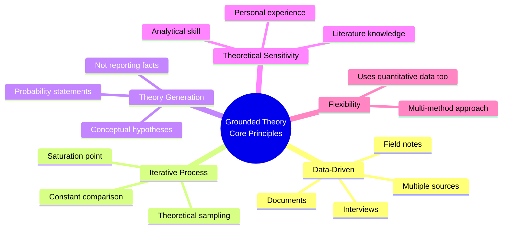

# Grounded Theory: Foundations, Goals, and Perspectives

## Introduction

Grounded theory (GT) occupies a singular position in qualitative research: it is the only qualitative methodology that explicitly aims to **generate theory**, not merely describe phenomena. Rather than beginning with a theory and testing it deductively, grounded theory moves inductively—starting with raw data and constructing conceptual frameworks that are *grounded* in that data. This makes it uniquely powerful for exploring psychological and social processes where little existing theory applies, or where prevailing theories have failed to capture lived experience.

Developed by sociologists Barney Glaser and Anselm Strauss in the 1960s, grounded theory emerged as a methodological response to the dominance of quantitative, hypothesis-testing research. Their landmark 1967 work, *The Discovery of Grounded Theory*, argued that richly descriptive, inductively derived theories were not only scientifically legitimate but often more relevant to real human experience than theories imposed from above.

In psychology, grounded theory has become an indispensable tool for studying phenomena such as coping with chronic illness, the experience of grief, decision-making under uncertainty, and the formation of professional identity. It bridges the world of data—interviews, observations, field notes—with the world of abstract theory.

---

**Source PDF**: 📄 [Block-4/Unit-2.pdf – Pages 15–24](/pdfs/MPC-005%20Research%20Methods/Block-4/Unit-2.pdf)  
**Course**: MPC-005 Research Methods, Block 4: Qualitative Research in Psychology

---

## What Is Grounded Theory?

At its core, grounded theory is **the process of generating theory based on the systematic collection and analysis of data from multiple sources**. Unlike conventional research, which tests pre-existing theories, grounded theory allows theory to *emerge* from the data itself.

A key feature that distinguishes grounded theory from other qualitative methods is its capacity to incorporate **quantitative data** when necessary. This methodological flexibility makes it uniquely versatile among qualitative approaches. A grounded theorist studying healthcare decision-making, for example, might analyze interview transcripts (qualitative) alongside hospital admission records (quantitative) to develop a more complete theoretical picture.

The process involves:
1. Collecting textual data (field notes, interviews, documents, video recordings)
2. Interpreting the data and identifying meaningful categories
3. Analyzing interrelationships among categories
4. Building a theoretical framework from these relationships

The ability to identify, analyze, and interpret meaningful variables within data is called **theoretical sensitivity**—a critical skill that every grounded theorist must develop and refine.

*Figure 1: The iterative cycle of grounded theory — data continuously informs emerging theory through systematic coding.*

---

## Historical Context: Glaser and Strauss

Barney Glaser (trained in quantitative sociology at Columbia) and Anselm Strauss (trained in the Chicago School's qualitative tradition) represented a remarkable intellectual partnership. Their collaboration was born during fieldwork on dying patients in hospitals, documented in their 1965 book *Awareness of Dying*.

The methodological insights from that fieldwork led to *The Discovery of Grounded Theory* (1967), which challenged the sociological establishment's bias toward deductive hypothesis-testing and argued for theory that emerges from empirical observation. Glaser and Strauss wrote that sociology needed *grounded* theories—not grand theoretical systems imposed on data, but theories grown from the soil of lived experience.

Later, the two scholars diverged significantly. Strauss (with Juliet Corbin) developed a more structured, systematic approach emphasizing verification alongside discovery. Glaser maintained that theory should emerge naturally without forcing; he criticized the Strauss-Corbin approach for being too prescriptive. This split gave rise to two distinct streams of grounded theory that researchers continue to navigate today.

A third major strand was introduced by Kathy Charmaz, who developed **constructivist grounded theory**, arguing that knowledge is co-constructed between researcher and participant rather than objectively "discovered."

---

## Goals of Grounded Theory

The grounded theory approach pursues six interconnected goals:

### 1. Producing Good Theory
Because data is collected from multiple sources and analyzed through systematic steps, grounded theory is designed to yield theories with **high reliability and validity**. The rigor of the process—not the credentials of the theorist—guarantees quality.

### 2. Emphasizing Process Quality
The grounded theory approach places particular emphasis on *how* a theory is developed, not just what it concludes. This procedural rigor—careful coding, constant comparison, theoretical sampling—determines the quality of the resulting theory.

### 3. Enhancing Theoretical Sensitivity
Theoretical sensitivity refers to the researcher's capacity to perceive subtle meanings in data and recognize patterns that others might miss. It develops through:
- Deep familiarity with existing literature
- Personal and professional experience
- Continuous engagement with data
- Iterative analytical reflection

### 4. Formulating Conceptual Hypotheses
Rather than testing prior hypotheses, grounded theory *formulates* hypotheses from conceptual ideas that emerge from data. These conceptual hypotheses are not rigid predictions but provisional relational statements between categories.

### 5. Discovering Participants' Main Concerns
The grounded theorist's central task is to discover **what participants are most concerned about** and how they attempt to resolve that concern. This "main concern" organizes the entire theory and gives it coherence.

### 6. Generating Time- and Place-Independent Concepts
Grounded theory aims to generate conceptual explanations of human action that transcend specific cultural contexts—applicable across different times and places. While the data is always contextual, the resulting concepts aspire to theoretical generality.

Glaser (1998) captured the ambitious, multi-directional nature of grounded theory elegantly: "GT is multivariate. It happens sequentially, subsequently, simultaneously, serendipitously, and scheduled."

---

## Core Theoretical Perspectives

### Constant Comparative Method
A hallmark of grounded theory is the **constant comparative method**—comparing each new piece of data against existing codes and categories to refine conceptual definitions and find patterns. This constant comparison drives category development and ensures the theory remains grounded in empirical evidence.

### Theoretical Sampling
Rather than sampling for demographic representativeness, grounded theorists engage in **theoretical sampling**—collecting data based on emerging conceptual needs. If a new category appears, the researcher seeks additional data that will help elaborate, refine, or challenge that category.

### Saturation
Data collection continues until **theoretical saturation** is reached—the point at which new data no longer adds conceptual variety or depth to the emerging categories. Saturation signals that the theory has achieved sufficient density and comprehensiveness.

### Probability Statements, Not Facts
Grounded theory results are not a catalog of facts but a set of **probability statements about relationships between concepts**—an integrated network of conceptual hypotheses developed from empirical data (Glaser, 1998). This distinguishes GT from mere description or thick ethnographic narration.

*Figure 2: Core principles that differentiate grounded theory from other research approaches.*

---

## Grounded Theory in Psychology: Indian Context

In Indian psychology research, grounded theory has been applied in several significant areas:

**Mental Health and Coping**: Researchers at institutions like NIMHANS (National Institute of Mental Health and Neuro Sciences, Bengaluru) have used grounded theory to develop culturally grounded models of how Indian families cope with a member's schizophrenia—moving beyond Western models that overemphasize individual coping.

**Educational Psychology**: Studies of student resilience in Indian urban slum communities have used grounded theory to develop theories of educational persistence that are grounded in the specific social, economic, and cultural realities of those contexts.

**Organizational Psychology**: Corporate India has seen grounded theory applied to understand how employees navigate the intersection of traditional hierarchical values and modern organizational expectations—generating theories of "value negotiation" specific to Indian workplace contexts.

**Disaster Psychology**: Post-earthquake and post-flood studies in India have used grounded theory to understand community recovery processes—generating locally applicable intervention theories.

The **ICSSR (Indian Council of Social Science Research)** has increasingly funded qualitative research using grounded theory methodology, recognizing its capacity to generate theories relevant to India's diverse social contexts rather than merely importing Western frameworks.

---

## Comparison: Grounded Theory vs. Other Qualitative Approaches

| Feature | Grounded Theory | Ethnography | Phenomenology | Narrative Research |
|---------|----------------|-------------|---------------|-------------------|
| **Primary Goal** | Generate theory | Describe culture | Describe lived experience | Understand individual stories |
| **Data Sources** | Multiple (interviews, docs, etc.) | Participant observation | In-depth interviews | Personal narratives |
| **Starting Point** | Open question | Cultural entry | Lived experience | Life story |
| **Uses Quant Data?** | Yes | Rarely | No | No |
| **Key Product** | Conceptual theory | Cultural description | Essence of experience | Narrative themes |
| **Sampling** | Theoretical | Purposive | Purposive | Purposive/Snowball |
| **Developers** | Glaser & Strauss | Malinowski, Boas | Husserl, van Manen | Clandinin & Connelly |

---

## External Resources

### Foundational Readings
- 📖 [Wikipedia: Grounded Theory](https://en.wikipedia.org/wiki/Grounded_theory) — Comprehensive overview of GT's history, variants, and applications
- 📖 [Wikipedia: Barney Glaser](https://en.wikipedia.org/wiki/Barney_Glaser) — Biography and contributions of GT's co-founder
- 📚 [The Discovery of Grounded Theory (1967) – Glaser & Strauss (Abstract)](https://www.routledge.com/The-Discovery-of-Grounded-Theory-Strategies-for-Qualitative-Research/Glaser-Strauss/p/book/9780202300283) — The seminal original text
- 📄 [Kathy Charmaz – Constructing Grounded Theory (Overview)](https://us.sagepub.com/en-us/nam/constructing-grounded-theory/book235960) — Third-generation GT by Charmaz

### Research Papers
- 🔬 [Timonen et al. (2018) – Challenges in Applying GT in Qualitative Research](https://www.qualitativesociologyreview.org/ENG/Volume14/QSR_14_3_Timonen_et_al.pdf) — Practical challenges and methodological guidance
- 🔬 [Charmaz, K. (2014) – Grounded Theory: Methodology and Theory Construction](https://doi.org/10.1016/B978-0-08-097086-8.32035-4) — Modern constructivist take on GT foundations
- 🔬 [Apramey Dube & Jochen Wirtz (2015) – Willingness to Pay for GT Studies](https://journals.sagepub.com/doi/10.1177/1094670515574534) — GT application in consumer behavior research

### Video Resources
- 🎥 [Introduction to Grounded Theory – ResearchMethodology.net](https://www.youtube.com/watch?v=8S9R4J4bqeY) — Clear visual explanation of GT process
- 🎥 [Grounded Theory Research Explained – Grad Coach](https://www.youtube.com/watch?v=43FqC0GFIXM) — Practical walkthrough for psychology students

### Online Tools & Communities
- 🌐 [Qualitative Data Analysis Software (ATLAS.ti for GT)](https://atlasti.com/research-hub/grounded-theory) — How software supports GT coding
- 🌐 [Grounded Theory Institute](http://www.groundedtheory.com/) — Resources maintained by Glaser's institute
- 🌐 [Social Research Methods – GT Overview](https://www.socialresearchmethods.net/kb/qualapp.php) — As referenced in IGNOU PDF

---

## Memory Aids

### Mnemonic: **"GSTPS"** — *Goals of Grounded Theory*
> **G**ood theory production  
> **S**ensitivity (theoretical) enhancement  
> **T**heory-from-data (hypothesis formulation)  
> **P**articipants' concerns (main concern discovery)  
> **S**calar concepts (time/place independent)

### The "Soil" Metaphor
Think of grounded theory as **growing a plant from soil**:
- The **soil** = raw data collected from multiple sources
- **Watering** = constant comparative analysis
- **Roots** = emerging categories grounded in data
- **Stem** = core/selective code
- **Flower** = the resulting theory

Theory grows up *from* the soil of data—it is not imposed from outside.

### Key Dates
- **1965**: Glaser & Strauss — *Awareness of Dying* (fieldwork origins)
- **1967**: *The Discovery of Grounded Theory* — the founding text
- **1990**: Strauss & Corbin — *Basics of Qualitative Research* (systematic approach)
- **1992**: Glaser's critique — *Basics of Grounded Theory Analysis*
- **2006**: Charmaz — *Constructing Grounded Theory* (constructivist turn)

---

## Self-Assessment Questions

**Level 1 – Recall**

1. Who developed the grounded theory approach and in which decade?
2. Define "theoretical sensitivity" in the context of grounded theory.

**Level 2 – Understanding**

3. How does grounded theory differ from hypothesis-testing research in terms of the relationship between theory and data?
4. What makes grounded theory unique among qualitative research approaches in terms of data use?

**Level 3 – Application & Analysis**

5. A psychologist wants to understand how first-generation college students in rural India manage the stress of academic life. How would a grounded theory approach differ from a survey-based approach in generating knowledge about this phenomenon? What would "theoretical saturation" look like in this study?

---

*Next: [Grounded Theory Methods and Steps →](/mpc-005/block-4/grounded-theory-methods-steps)*  
*Previous: [Ethnography: Steps, Types and Ethics ←](/mpc-005/block-4/ethnography-steps-types-ethics-qualitative)*
