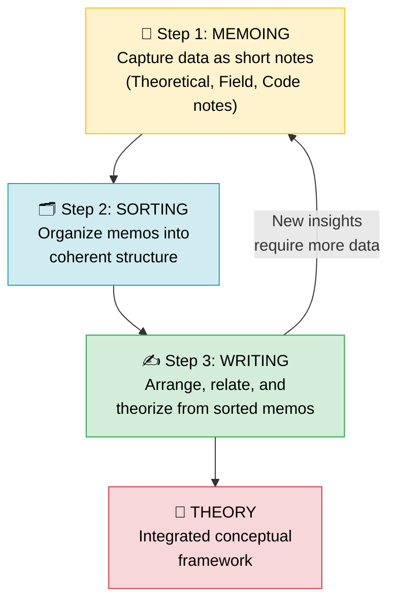
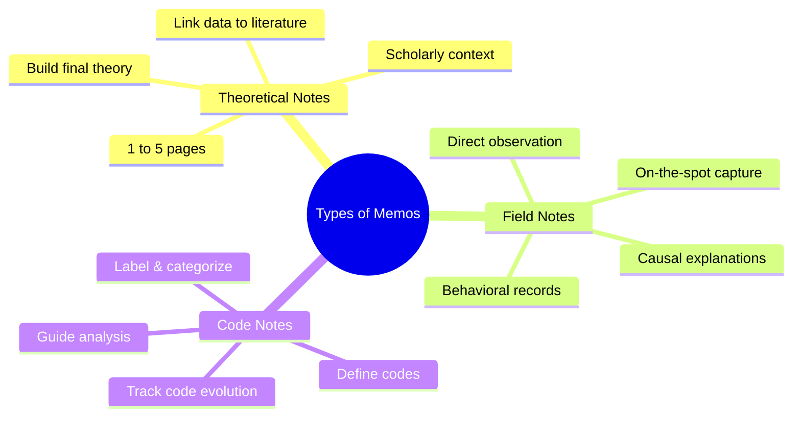

# Grounded Theory: Methods, Memoing, Sorting, and Writing

## Introduction

If the goals of grounded theory describe *what* the researcher is trying to achieve, the methods and steps describe *how* they get there. The methodological approach of grounded theory is distinctive in several important ways: it rejects conventional interview-transcription practices, embraces data from virtually any source imaginable, and proceeds through three systematic stages—memoing, sorting, and writing—that transform raw observations into theoretical propositions.

This document examines each of these methodological elements in depth, with special attention to the three types of memos that form the building blocks of grounded theory's analytical process.

---

**Source PDF**: 📄 [Block-4/Unit-2.pdf – Pages 17–19](/pdfs/MPC-005%20Research%20Methods/Block-4/Unit-2.pdf)  
**Course**: MPC-005 Research Methods, Block 4: Qualitative Research in Psychology

---

## The Grounded Theory Approach to Data Collection

### What Counts as Data?

One of the most liberating aspects of grounded theory methodology is its **expansive definition of data**. Glaser (1998) articulated this clearly: anything that gets in the researcher's way when studying a certain area *is data*. The full range includes:

- Formal interviews (though GT treats them differently than most approaches)
- Informal conversations and chats
- Observations of behavior and interactions
- Field notes from participant observation
- Documents, newspapers, academic articles
- Internet discussions and email lists
- Television programs, films, and media
- Expert group meetings and seminars
- Lectures and academic presentations
- The researcher's own knowledge and reflection

This radical openness to data sources makes grounded theory particularly well-suited for studying complex, multi-layered psychological and social phenomena.

### Why Grounded Theory Avoids Verbatim Transcription

A striking methodological choice distinguishes grounded theory from most qualitative approaches: **grounded theorists generally do not tape-record and transcribe interviews verbatim**. Glaser considered this practice a wasteful drain on time and motivational energy.

Instead, the grounded theorist:
1. Conducts interviews while actively taking field notes
2. **Delimits** (selectively records) the most conceptually relevant material
3. Generates initial codes and concepts almost immediately after data collection
4. Keeps the analytical momentum going rather than getting buried in transcript management

This approach keeps the researcher in a state of continuous analytical engagement, where concepts are always being generated and refined—rather than deferring all analysis until transcription is complete.

### The Danger of Premature Discussion

Glaser (1998) offered an interesting warning about discussing an emerging theory before it is written up. Such discussions, whether they generate praise or criticism, **drain the researcher's motivational energy** and can derail the memo-writing process. The discipline of grounded theory requires the researcher to maintain their analytical momentum by writing memos rather than talking about their ideas.

This insight has a psychological parallel: premature verbalization can reduce the intrinsic motivation to formalize and complete intellectual work—a phenomenon related to what researchers call "social substitution," where talking about a goal partially substitutes for achieving it.

### Interviewing Oneself

One remarkable technique sanctioned by grounded theory is **self-interview**—the researcher interviews their own knowledge base, treating it as data like any other source. This is particularly valuable when the researcher has deep domain expertise. The self-interview data is coded and compared with external data, and concepts are generated from it. This technique helps surface tacit knowledge at the conceptual level, which is precisely where grounded theory operates.

---

## The Three Steps of Grounded Theory

The process of building theory through grounded theory unfolds across three sequential but recursive stages:

*Figure 1: The three-stage grounded theory process — iterative and recursive, not strictly linear.*

---

## Step 1: Memoing

The first objective of the grounded theorist is to **capture data in the form of memos**—short, focused analytical notes that serve as the raw material for theory-building. Memos are not simply summaries of what happened; they are analytical *tools* for developing concepts.

Memos can be prepared in three distinct forms:

### Theoretical Notes

Theoretical notes address the relationship between textual data and the **existing literature** of the field under study. They explore conceptual connections—how what the researcher observes might extend, challenge, or refine established theoretical frameworks.

- **Length**: Typically 1 to 5 pages each
- **Function**: Build the scholarly context for the emerging theory
- **Cumulative role**: The final theory integrates multiple theoretical notes into a coherent scholarly argument

*Example*: A researcher studying how Indian adolescents cope with academic pressure writes a theoretical note connecting their observations to self-determination theory, noting similarities and divergences from Western samples.

### Field Notes

Field notes are created when the researcher is **actively engaged in the field**—participating with or observing the community, culture, or population under study. They capture:
- Observed behaviors, interactions, and events as they occur
- Contextual details that explain *why* behaviors occur (causal notes)
- Researcher reflections on what is significant and what might be coded

*Example*: During a hospital observation study, a psychologist notes that family members consistently avoid direct eye contact with patients when discussing prognosis—recording both the behavior and several possible explanations.

### Code Notes

Code notes are produced by the process of **naming, labeling, and categorizing** things, properties, and events encountered in the data. They:
- Record the codes assigned during analysis
- Explain and define what each code means
- Track the evolution of codes as the analysis progresses
- Guide the researcher during subsequent analysis sessions

Code notes serve a dual function: they are both a record of the analytical process and a navigational tool that helps the researcher move systematically through large bodies of data.

*Figure 2: Three types of memos and their distinct analytical functions in grounded theory.*

---

## Step 2: Sorting

Once memos have been generated, the accumulated data must be **sorted**—organized into a coherent structure that reveals the relationships among ideas and categories.

Sorting is not merely filing; it is a deeply analytical process that:
- Arranges memos and codes in an order that reveals conceptual relationships
- Establishes proper linkages between related ideas and observations
- Makes the structure of the emerging theory visible
- Can surface **new insights** that were not apparent during initial memoing

The importance of sorting is often underestimated. It is during sorting that the researcher begins to see the *shape* of their theory—which categories are central, which are peripheral, and how they relate to each other. Glaser described sorting as the stage where the conceptual framework begins to crystallize.

*Practical note*: Many grounded theorists use physical index cards or qualitative data analysis software (such as ATLAS.ti or NVivo) to sort their memos, allowing them to create and rearrange conceptual clusters until a satisfying theoretical structure emerges.

---

## Step 3: Writing

After sorting, the researcher moves to **writing**—the stage in which the theoretical framework is given explicit verbal form. This is not simply transcription; it is active theoretical construction.

During writing, the researcher:
- **Arranges** the sorted memos into a logical sequence
- **Relates** categories to each other through theoretical propositions
- **Interprets** the data through their own conceptual lens
- **Links** the emerging theory to the existing scholarly literature

Writing is considered a crucial stage because it is here that the researcher's interpretive judgment most powerfully shapes the final theory. The same sorted memos might give rise to different theories in the hands of different researchers, depending on how they interpret relationships and what they emphasize.

The integration of the researcher's data with existing literature during writing places the new theory in **scholarly context**, allowing it to speak to and extend prior work rather than existing in isolation.

### The Recursive Nature of the Three Steps

It is important to understand that memoing, sorting, and writing are not strictly sequential phases that happen once. They are **recursive and iterative**:
- New data encountered during writing may require new memos
- Sorting may reveal gaps that send the researcher back to the field for more data
- Writing often generates new theoretical questions that require additional sorting and analysis

This recursion continues until theoretical saturation is reached—the point at which new data no longer produces new concepts or categories.

---

## Methodological Rigor in GT Data Collection

### Triangulation Across Data Sources

Because grounded theory actively draws on multiple data sources, it naturally incorporates **methodological triangulation**—using different data collection methods to examine the same phenomenon from multiple angles. This strengthens the credibility and validity of the emerging theory.

A study on student mental health in India might triangulate:
- In-depth interviews with students (primary data)
- Focus groups with faculty and parents (secondary data)
- Analysis of university counseling center records (documentary data)
- Observations of student common spaces (observational data)

### Reflexivity

Grounded theorists are expected to maintain **reflexivity**—ongoing critical awareness of how their own positionality, assumptions, and experiences might shape data collection and analysis. While the researcher's knowledge is treated as a data source (through self-interview), it must also be monitored as a potential source of bias that could compromise theoretical sensitivity.

---

## Indian Context: GT in Clinical Psychology Research

Grounded theory has been effectively deployed in several important Indian research contexts:

**NIMHANS Studies on Family Burden**: Researchers at NIMHANS, Bengaluru have used grounded theory to develop theories of "expressed emotion" and family burden that account for the specific cultural context of Indian joint family systems—generating concepts like "collective coping" that do not appear in Western GT studies of mental illness caregiving.

**Rural Mental Health Access**: GT studies in rural Maharashtra and Rajasthan have generated theories about why rural populations avoid formal mental health services, identifying culturally specific categories like "stigma by association" and "traditional healer dependency" that required new theoretical concepts not available in imported Western frameworks.

**NCERT Educational Psychology**: Educational researchers working under NCERT frameworks have used grounded theory to understand learning motivation patterns in multilingual classroom environments, generating theories that account for linguistic identity as a moderating variable.

---

## External Resources

### Foundational Readings
- 📖 [Wikipedia: Grounded Theory – Methodology section](https://en.wikipedia.org/wiki/Grounded_theory#Methodology) — Overview of GT methods including memoing and sorting
- 📖 [Wikipedia: Memo (Grounded Theory)](https://en.wikipedia.org/wiki/Memo_(research)) — Detailed explanation of memos as analytical tools
- 📚 [Glaser (1998) – Doing Grounded Theory: Issues and Discussions (Overview)](http://www.groundedtheory.com/books.aspx) — Source of quotations in IGNOU unit
- 📄 [Kelle (2005) – "Emergence" vs. "Forcing" in Grounded Theory](https://www.qualitative-research.net/index.php/fqs/article/view/467) — Classic methodological debate referenced in IGNOU PDF

### Research Papers
- 🔬 [Birks & Mills (2015) – Grounded Theory: A Practical Guide (2nd Ed. Overview)](https://us.sagepub.com/en-us/nam/grounded-theory/book238645) — Comprehensive practical methods guidance
- 🔬 [Holton (2007) – The Coding Process and Its Challenges](https://link.springer.com/article/10.1007/s11135-006-9010-y) — Detailed analysis of grounded theory coding methodology
- 🔬 [Wuest (2012) – Grounded Theory: The Method](https://link.springer.com/chapter/10.1007/978-1-4614-0699-1_11) — Methods chapter covering all stages including memoing

### Video Resources
- 🎥 [Grounded Theory: Data Collection and Memoing](https://www.youtube.com/watch?v=_8SWm2GRFbk) — Practical explanation of memo-writing in GT
- 🎥 [Qualitative Research Methods: Grounded Theory](https://www.youtube.com/watch?v=T5lCFCNKPcQ) — Step-by-step overview including sorting and writing stages

### Tools for GT Practice
- 🌐 [ATLAS.ti for Grounded Theory](https://atlasti.com/research-hub/grounded-theory) — Software support for memo management and sorting
- 🌐 [NVivo for Qualitative Research](https://www.qsrinternational.com/nvivo-qualitative-data-analysis-software/resources/blog/grounded-theory-research-process) — How NVivo supports GT workflow
- 🌐 [Grounded Theory Institute Resources](http://www.groundedtheory.com/) — Glaser's methodological guidance archive

---

## Memory Aids

### Mnemonic: **"MSW"** — *Three Steps of Grounded Theory*
> **M**emoing → **S**orting → **W**riting  
> Think: "My Study Works" — the three stages that make GT work!

### The Three Types of Memos: **"TFC"**
> **T**heoretical notes — link to *Theory* and *literature*  
> **F**ield notes — capture what happens in the *Field*  
> **C**ode notes — record how you *Code* and *Classify*

### Analogy: Cooking Metaphor
- **Memoing** = Gathering and preparing ingredients (raw data → labeled notes)
- **Sorting** = Arranging ingredients by dish/category before cooking
- **Writing** = Actually cooking — combining elements into a finished, coherent dish (theory)

---

## Self-Assessment Questions

**Level 1 – Recall**

1. What are the three types of memos used in grounded theory?
2. Why do grounded theorists typically avoid verbatim transcription of interviews?

**Level 2 – Understanding**

3. What is the role of "sorting" in the grounded theory process, and why is it considered more than just filing?
4. Explain the concept of self-interview in grounded theory. Why might a researcher with expertise in a field benefit from this technique?

**Level 3 – Application & Analysis**

5. A grounded theorist studying the experience of postpartum depression among women in urban India has collected field notes, conducted informal interviews, reviewed social media posts, and read clinical case reports. Describe how she would move through the three stages—memoing, sorting, and writing—using this data to develop a theory. What types of memos would be most relevant at each stage?

---

*Next: [Grounded Theory: Types of Coding →](/mpc-005/block-4/grounded-theory-coding-types)*  
*Previous: [Grounded Theory Foundations ←](/mpc-005/block-4/grounded-theory-foundations)*
