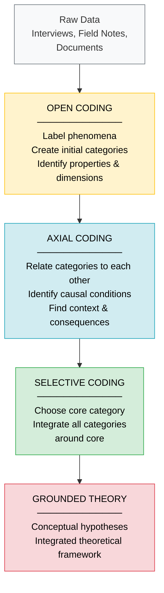
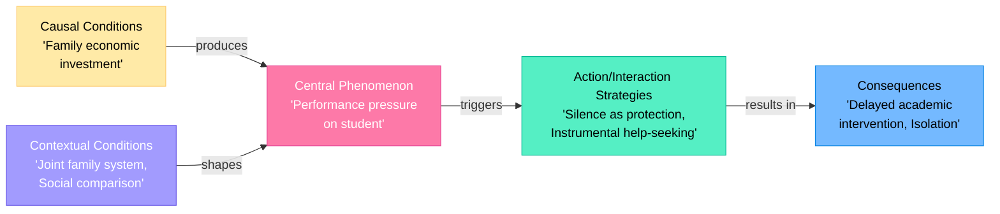

# Grounded Theory: Types of Coding — Open, Axial, and Selective

## Introduction

Coding is the analytical engine of grounded theory. Where other qualitative methods might stop at rich description or thematic interpretation, grounded theory uses coding to systematically build theoretical frameworks from raw data. The coding process transforms scattered observations, interview fragments, and field notes into coherent, interconnected conceptual categories—and ultimately into a grounded theory.

The IGNOU curriculum identifies three primary types of coding in grounded theory: **selective coding**, **open coding**, and **axial coding**. Together, these three forms of coding represent a comprehensive analytical toolkit that guides the researcher from initial data encounters to the final theoretical structure.

Understanding the coding process is essential not only for conducting grounded theory research but also for evaluating GT studies—knowing what kind of coding was used and how rigorously it was applied helps assess the quality and trustworthiness of any GT-based theory.

---

**Source PDF**: 📄 [Block-4/Unit-2.pdf – Pages 19–21](/pdfs/MPC-005%20Research%20Methods/Block-4/Unit-2.pdf)  
**Course**: MPC-005 Research Methods, Block 4: Qualitative Research in Psychology

---

## What Is Coding in Grounded Theory?

Coding in grounded theory is the process by which the researcher **identifies, names, and categorizes phenomena** found in the data. It is an active, interpretive process—not a mechanical labeling exercise. The coder must:
- Read data closely for conceptual significance
- Assign names (codes) that capture the essence of what is happening
- Group related codes into broader categories
- Analyze relationships among categories

This is fundamentally different from content analysis (which counts occurrences) or thematic analysis (which identifies patterns). GT coding aims to produce **conceptual categories with theoretical implications**—building blocks of an emergent theory.

Code notes—recording the names, definitions, and evolution of codes—are produced throughout this process and serve as a running record of the analytical journey.

*Figure 1: The three-tier coding progression from raw data to grounded theory.*

---

## Open Coding

### Definition

Open coding is **the process of identifying, labeling, and analyzing the phenomena found in the text**. It is called "open" because the researcher approaches the data with an open mind—without predetermined categories—and allows codes to emerge organically from the material.

During open coding, the researcher:
- Reads through data line by line, sentence by sentence, or incident by incident
- Assigns code names to conceptually significant moments in the data
- Identifies **properties** of each concept (its characteristics) and **dimensions** (the range along which a property varies)
- Groups related codes into broader **categories**

### The Process in Practice

Consider a psychologist studying how engineering students in India experience academic failure. Open coding of interview transcripts might produce codes such as:
- *family-shame-expression* — student describing parent's reaction
- *social-comparison-downward* — comparing oneself to peers who failed more severely
- *silence-as-protection* — not telling family about exam results
- *instrumental-help-seeking* — seeking tutoring only, not emotional support
- *fatalistic-attribution* — attributing failure to fate/destiny

Each code captures a specific conceptual idea. Related codes begin to cluster: the first three might cluster into a category called **"stigma management"**, while the latter two form **"response to failure"**.

### Generalization Through Open Coding

Open coding involves the process of **generalizing**—moving from specific incidents to broader conceptual categories. A researcher does not simply catalog every unique event; they ask: *"What category does this incident represent? What more general concept does it exemplify?"* This generalizing move is what lifts the analysis from description toward theory.

---

## Axial Coding

### Definition

Axial coding is **the process of relating categories and their properties to each other through deductive and inductive thinking**. It is called "axial" because it is conducted around the axis of a category—examining each category in relation to others, determining how they connect.

While open coding *creates* categories, axial coding *connects* them—establishing a web of relationships that forms the structural skeleton of the emerging theory.

### Causal Analysis: Cause and Context

The axial coder's primary analytical task is to examine **causal relationships** among codes. Specifically, the researcher identifies:
- **Cause codes**: Categories that function as causal conditions—the events, circumstances, or variables that bring about other phenomena
- **Context codes**: The conditions or circumstances under which the causal processes operate
- **Consequence codes**: The outcomes or effects produced by the causal processes

Interestingly, the IGNOU unit notes that grounded theorists focus their analytical attention on cause codes and context codes while **showing less interest in consequence codes** per se. The emphasis is on understanding *why and under what conditions* things happen, rather than merely cataloging outcomes.

### Inductive and Deductive Thinking

Axial coding uniquely combines **inductive reasoning** (moving from specific codes to general relational patterns) with **deductive reasoning** (applying theoretical frameworks to hypothesize what connections should exist, then checking against data). This integration of both forms of reasoning makes axial coding particularly powerful.

*Example continued*: In the engineering student study, axial coding might reveal:
- **Cause**: *Family economic investment* → causes → *performance pressure*
- **Context**: *Joint family system* → moderates → *performance pressure* (amplifying it)
- **Consequence**: *Performance pressure* → leads to → *silence-as-protection*

The causal chain becomes analytically explicit through axial coding.

*Figure 2: Axial coding paradigm model showing causal conditions, context, strategies, and consequences.*

---

## Selective Coding

### Definition

Selective coding is the process of **selecting one category as the core category** and systematically relating all other categories to it. The "core category" is the central phenomenon around which the entire theory is organized.

Selective coding represents the final integrative phase of grounded theory analysis. By this stage, the researcher has:
- Generated dozens of open codes
- Established relationships through axial coding
- Identified which category has the most analytical power to explain the phenomenon under study

That most powerful, most central category becomes the **core category**—the theoretical axis around which everything else revolves.

### Criteria for Selecting the Core Category

A good core category is:
- **Frequent**: It appears across most data segments
- **Saturated**: It has been elaborated through extensive theoretical sampling
- **Central**: Other major categories relate to and affect it
- **Explanatory**: It captures the main concern of participants
- **Conceptual**: It has sufficient abstraction to generate theoretical propositions

### Integration Around the Core

Once the core category is selected, the researcher systematically integrates all other categories around it—showing how they contribute to, modify, result from, or moderate the core phenomenon. This integration produces the final grounded theory: a set of conceptual hypotheses describing how various factors relate to the central phenomenon.

*Example continued*: In the engineering student study, after open and axial coding, "**managing academic face in family context**" might emerge as the core category—a concept that integrates performance pressure, stigma management, help-seeking patterns, and failure attribution into a coherent theoretical framework explaining how students navigate academic failure within the specific demands of Indian family relationships.

---

## Comparison of the Three Coding Types

| Feature | Open Coding | Axial Coding | Selective Coding |
|---------|------------|--------------|-----------------|
| **Purpose** | Create categories from data | Relate categories to each other | Integrate around core category |
| **Process** | Label phenomena; generalize | Identify causes, contexts, consequences | Select core; connect all categories |
| **Thinking Mode** | Inductive primarily | Inductive + Deductive | Deductive primarily |
| **Stage** | Early analysis | Middle analysis | Final integration |
| **Output** | Categories with properties | Category relationships | Theoretical propositions |
| **Question Asked** | "What is this?" | "How does this relate?" | "What is the central story?" |
| **Analogy** | Identifying puzzle pieces | Finding how pieces connect | Assembling the complete picture |

---

## Strauss-Corbin vs. Glaser: A Note on Coding Differences

The IGNOU curriculum follows the Strauss-Corbin tradition, which explicitly identifies open, axial, and selective coding as distinct sequential phases. It is worth noting that Glaser criticized this approach for being overly prescriptive and potentially "forcing" data into predetermined coding categories.

In Glaser's original tradition, coding is more fluid—**substantive coding** (equivalent to open coding) leads naturally to **theoretical coding** (which examines the relationships among categories), without a rigid three-stage structure. Kathy Charmaz's constructivist version uses **initial coding** and **focused coding**.

For IGNOU MAPC purposes, the Strauss-Corbin three-stage model (open → axial → selective) is the framework to master.

---

## Coding in Indian Psychology Research: Examples

**Study on Bereavement Among Elderly in Kerala**  
A grounded theory study using open coding might identify codes like *ritual-as-anchor*, *family-obligation-performance*, and *private-grief-expression*. Axial coding would reveal how *collective mourning rituals* function as a **causal condition** that moderates *private grief*. Selective coding might identify **"performing grief publicly, experiencing it privately"** as the core category—a cultural paradox specific to the Malayali Hindu context.

**Adolescent Identity Formation in Indian Cities**  
Open coding of diary entries and interviews: *peer-group-belonging*, *parental-tradition-adherence*, *aspirational-westernization*, *religious-identity-anchor*. Axial coding: tension between *peer influence* and *parental expectations* as competing causal conditions. Selective coding: **"negotiating between worlds"** as the core category—an integrative concept explaining how urban Indian adolescents construct identity at the intersection of tradition and modernity.

---

## External Resources

### Foundational Readings
- 📖 [Wikipedia: Grounded Theory – Coding](https://en.wikipedia.org/wiki/Grounded_theory#Coding) — Overview of all three coding types
- 📖 [Wikipedia: Open Coding](https://en.wikipedia.org/wiki/Open_coding) — Dedicated article on open coding procedures
- 📚 [Strauss & Corbin (1990) – Basics of Qualitative Research (Coding Chapters)](https://us.sagepub.com/en-us/nam/basics-of-qualitative-research/book235578) — Original source of the three-coding framework
- 📄 [Saldaña (2015) – The Coding Manual for Qualitative Researchers](https://us.sagepub.com/en-us/nam/the-coding-manual-for-qualitative-researchers/book243616) — Comprehensive guide to all coding approaches

### Research Papers
- 🔬 [Holton (2007) – The Coding Process and Its Challenges in Grounded Theory](https://link.springer.com/article/10.1007/s11135-006-9010-y) — Detailed analysis of GT coding challenges
- 🔬 [Moghaddam (2006) – Coding Issues in Grounded Theory](https://doi.org/10.1177/160940690600500305) — Critique and clarification of coding procedures
- 🔬 [Tie et al. (2019) – A Unified Approach to Grounded Theory in Nursing Research](https://doi.org/10.1177/1609406919843423) — Contemporary application of GT coding in healthcare

### Video Resources
- 🎥 [Grounded Theory Coding Explained – Open, Axial, Selective](https://www.youtube.com/watch?v=X1mBdV6Dxmo) — Visual walkthrough of all three coding stages
- 🎥 [How to Do Grounded Theory Coding](https://www.youtube.com/watch?v=LxFWTMkHB8s) — Practical demonstration with example data

### Software Tools
- 🌐 [MAXQDA for Grounded Theory Coding](https://www.maxqda.com/methods/grounded-theory) — How software supports axial and selective coding
- 🌐 [NVivo Grounded Theory Tutorial](https://www.qsrinternational.com/nvivo-qualitative-data-analysis-software/resources/blog/grounded-theory-research-process) — Step-by-step NVivo guidance
- 🌐 [Atlas.ti Coding Guide](https://atlasti.com/research-hub/grounded-theory) — GT-specific coding workflow in ATLAS.ti

---

## Memory Aids

### Mnemonic: **"OAS"** — *Order of Coding Stages*
> **O**pen → **A**xial → **S**elective  
> Think: **"Open A Safe"** — first you open it (label what's inside), then use the axial mechanism (connect the parts), then select the combination that unlocks the theory!

### Mnemonic: **"CCC"** — *What Axial Coding Finds*
> **C**ause → **C**ontext → **C**onsequence  
> *"Every effect has a Cause, happens in a Context, and creates Consequences"*

### Visual Summary Card

| Stage | Key Word | Question | Output |
|-------|----------|----------|--------|
| **Open** | LABEL | "What IS this?" | Categories |
| **Axial** | RELATE | "How do they CONNECT?" | Relationships |
| **Selective** | INTEGRATE | "What's the CORE story?" | Theory |

### The "Solar System" Metaphor for Selective Coding
- The **core category** = the Sun (central, massive, everything orbits it)
- **Major categories** = planets (orbit the core, each with its own structure)
- **Minor categories** = moons (orbit the planets, supporting their structure)
- **Theoretical propositions** = gravitational laws (describe how everything relates)

---

## Self-Assessment Questions

**Level 1 – Recall**

1. What is open coding and what is its primary output?
2. Define selective coding. What is the "core category" in a grounded theory?

**Level 2 – Understanding**

3. How does axial coding differ from open coding in terms of analytical purpose and process?
4. Why do grounded theorists (per the Strauss-Corbin model) pay more attention to causes and contexts than to consequences during axial coding?

**Level 3 – Application & Analysis**

5. A researcher studying work-family conflict among female physicians in Indian government hospitals has completed open coding and generated 45 codes. Some major categories include: *institutional rigidity*, *family-role expectations*, *peer support absence*, *career ambition*, and *guilt management*. 
   - Apply axial coding to map the causal relationships among these categories.
   - Which category might be the strongest candidate for the core category, and why?
   - What conceptual hypothesis might emerge from selective coding around that core category?

---

*Next: [Grounded Theory: Relevance, Implications, and Criticism →](/mpc-005/block-4/grounded-theory-relevance-implications-criticism)*  
*Previous: [Grounded Theory: Methods and Steps ←](/mpc-005/block-4/grounded-theory-methods-steps)*
