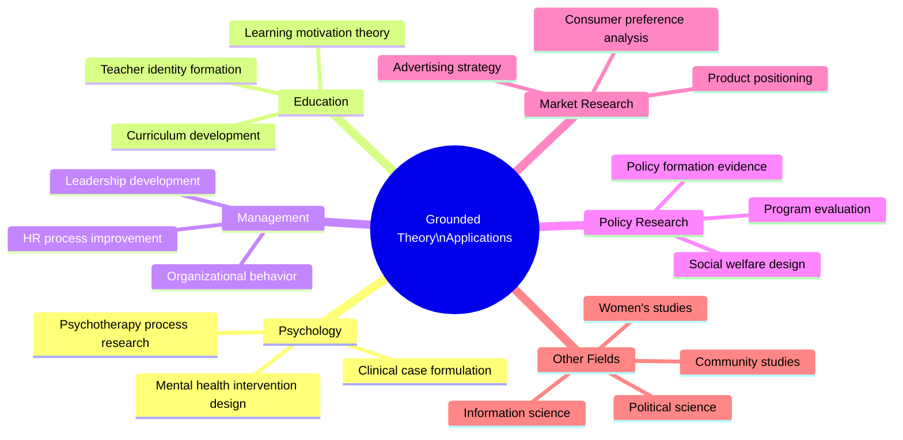
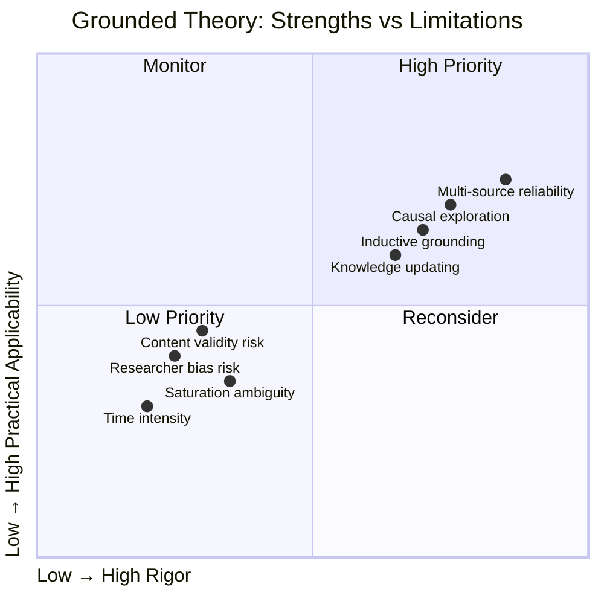

# Grounded Theory: Relevance, Implications, and Criticism

## Introduction

Having examined the foundations, methods, steps, and coding procedures of grounded theory, we now turn to the broader question: **Why does grounded theory matter?** What makes it a relevant and enduring methodology in psychology and the social sciences? Where has it been applied with greatest effect? And what are its genuine limitations and criticisms?

No methodology is without weaknesses, and grounded theory has attracted significant critical attention over the decades since its founding. Honest engagement with these criticisms—alongside a clear understanding of GT's genuine strengths—equips the psychology researcher to make informed methodological choices and to design more rigorous studies.

---

**Source PDF**: 📄 [Block-4/Unit-2.pdf – Pages 19–24](/pdfs/MPC-005%20Research%20Methods/Block-4/Unit-2.pdf)  
**Course**: MPC-005 Research Methods, Block 4: Qualitative Research in Psychology

---

## Relevance of Grounded Theory

The IGNOU curriculum identifies five core reasons why grounded theory produces significant, trustworthy knowledge:

### 1. Multi-Source Data Reliability

Grounded theory's insistence on data from **multiple sources** substantially increases the reliability and validity of the resulting theory. Unlike studies that rely solely on a single interview batch or a single observation session, grounded theory triangulates data from interviews, observations, documents, and other sources—producing theories with broader empirical foundations.

This multi-source approach reduces the likelihood that the theory merely reflects a single participant's idiosyncratic perspective or a researcher's confirmation bias.

### 2. Inductive Foundation in Observation

Grounded theory is fundamentally **inductive**—grounded in observations and collected data rather than deduced from prior theories. This inductive base gives GT theories a descriptive authenticity that purely theoretical frameworks lack. The theory has been *earned* through engagement with empirical reality rather than constructed through intellectual speculation.

This is captured in the very name: the theory is *grounded* — rooted in the soil of observed experience.

### 3. Exploratory Causal Analysis

GT provides genuine opportunities for **exploring and analyzing causal reasons** behind observed facts. Through axial coding's systematic examination of cause-context-consequence relationships, grounded theory goes beyond description to explanation—asking *why* phenomena occur, not merely *what* they are.

This causal exploratory function makes GT particularly valuable in psychology, where understanding the mechanisms behind behavior and experience is central to the discipline's mission.

### 4. Knowledge Base Updating

Grounded theory is inherently **dynamic**—it specifies how a knowledge base should be updated in the light of new information. This built-in reflexivity means that GT theories are not fixed monuments but living frameworks that evolve as new data challenges or refines them. Theoretical saturation marks the *current* state of the theory, not a permanent endpoint.

### 5. Organizational Base for Reporting

The categorical structure produced by GT coding provides a natural **organizational framework** for reporting findings. Categories become headings; their properties become subpoints; their relationships become the narrative of the results section. This structural clarity makes GT findings more communicable than the amorphous themes that sometimes emerge from less rigorous qualitative approaches.

---

## Implications of Grounded Theory

Grounded theory's practical applications span a remarkably wide range of fields, well beyond its sociological origins:

*Figure 1: Breadth of grounded theory applications across disciplines.*

### Policy and Program Evaluation Research

Grounded theory is particularly powerful in **policy research** because it can address unanswered questions that quantitative methods cannot. When policymakers want to understand *why* a welfare program is not reaching its target population, or *how* beneficiaries experience a mental health initiative, grounded theory generates the conceptual frameworks needed to redesign interventions.

*Indian Example*: The Government of India's mental health programs under the National Mental Health Policy (2014) have been evaluated using grounded theory to understand why ASHA (Accredited Social Health Activists) workers resist referring community members to mental health services—producing conceptual models of stigma, role confusion, and resource constraint that have informed program redesign.

### Consumer Behavior and Market Research

GT's capacity to explore participants' **main concerns and decision-making processes** makes it invaluable in market research. By generating theories of consumer behavior grounded in actual consumer experience, it produces insights that survey-based research—constrained by predetermined question categories—cannot access.

Applications include:
- Understanding product adoption resistance in rural markets
- Analyzing how consumers construct brand loyalty in emotionally complex categories (health, insurance, family goods)
- Studying the experience of financial decision-making among first-generation earners

### Product Positioning and Advertising

GT has been applied to develop theories of **how consumers construct meaning around products**—insights that inform positioning strategy. Advertising campaigns that resonate deeply are often those built on genuine understanding of consumer psychology, and GT's theory-generating capability serves this need.

### Education, Management, and Multi-Disciplinary Applications

The IGNOU unit identifies GT as "one of the best theoretical approaches" in:
- **Education**: Understanding learning motivation, teacher-student relationships, curriculum effectiveness
- **Management**: Organizational culture, decision-making processes, leadership emergence
- **Women's Studies**: Gendered experiences of work, family, and health
- **Information Studies**: Information-seeking behavior, digital literacy patterns
- **Political Science**: Political socialization, voting motivation, civic participation
- **Community Studies**: Social cohesion, conflict resolution, community resilience

### Human Psychology and Experience

At its core, grounded theory is a tool for **understanding, analyzing, and describing human psychology and experience**. It allows researchers to get inside participants' phenomenological worlds—to see how they construct meaning, manage concern, and navigate their social realities—and to build theories that capture these processes with conceptual precision.

---

## Criticisms of Grounded Theory

Grounded theory has attracted substantial critical attention since its founding. A balanced researcher must engage honestly with these critiques.

### 1. Researcher Preconceptions and Bias

The most significant criticism is that **researchers inevitably bring preconceptions** to the data collection and analysis process, despite GT's claim to let theory "emerge" inductively. No researcher approaches data tabula rasa—their theoretical commitments, cultural assumptions, and professional experiences inevitably shape what they notice, what they code, and what they conclude.

Glaser himself acknowledged this risk: the ability to maintain "theoretical sensitivity" without allowing preexisting theories to contaminate the analysis is an ideal that is difficult to fully achieve in practice. Critics (most notably Thomas & James, 2006) argue that the claim of pure emergence is epistemologically untenable—"emergence" always involves the researcher's interpretive choices.

*Response*: Most contemporary GT practitioners (especially Charmaz's constructivist approach) embrace reflexivity rather than claiming objectivity—acknowledging that the researcher co-constructs the theory with participants rather than discovering a pre-existing truth.

### 2. Content Validity of Corpus Data

While the collection of large, multi-source data bodies (corpus data) is presented as a strength of GT, **content validity is still questionable**. Even with many sources, there is no guarantee that the data corpus represents the full range of relevant experiences and perspectives. The researcher's choices about which data to collect, which participants to include, and which contexts to sample all shape the theory's scope in ways that may not be fully acknowledged.

### 3. Boundary Between Induction and Deduction

Critics note that the line between **inductive discovery and deductive imposition** is frequently blurred in practice. Axial coding, in particular, requires the researcher to apply theoretical frameworks (causal models, paradigm structures) to organize categories—a deductive move that potentially forces data into predetermined conceptual structures.

Kelle (2005) identified this as the "emergence vs. forcing" problem: the more structured the analytical procedures, the greater the risk that the researcher is confirming rather than discovering.

### 4. Difficulty of Theoretical Saturation

Determining when **theoretical saturation** has genuinely been reached is a judgment call that is notoriously difficult to defend methodologically. Critics argue that researchers often claim saturation prematurely, producing theories that are less robust than claimed—or conversely, that continued data collection beyond practical feasibility is sometimes presented as a methodological virtue.

### 5. Applicability Beyond Discovery Phase

Some methodologists argue that grounded theory is best suited to the **early, exploratory phase** of research—generating hypotheses and conceptual frameworks—but that its products need subsequent testing through quantitative methods to establish the kind of generalizability and predictive validity that makes theory scientifically useful.

### 6. Time and Resource Intensity

GT's commitment to multiple data sources, theoretical sampling, and iterative analysis makes it extremely **time- and resource-intensive**. For many research contexts in psychology—particularly in India, where research resources are constrained—the full GT process may be practically unfeasible, leading to partial or abbreviated applications that may undermine the method's rigor.

---

## Strengths and Limitations Summary

*Figure 2: Positioning GT's key strengths and limitations on rigor and practical applicability dimensions.*

---

## Grounded Theory's Enduring Value: A Balanced Assessment

Despite these criticisms, grounded theory remains one of the most widely used and methodologically influential approaches in the social sciences. Its enduring value rests on several foundations:

**It fills an essential methodological niche**: When little theory exists about a phenomenon, or when existing theories have failed to capture lived experience, grounded theory provides a principled pathway from observation to conceptual understanding.

**It is genuinely theory-generative**: Unlike other qualitative methods that produce rich descriptions or identified themes, grounded theory produces conceptual frameworks with explanatory and predictive implications—theory in the strongest sense.

**It is methodologically explicit**: GT's systematic coding procedures, theoretical sampling logic, and saturation criteria make it more defensible than less structured qualitative approaches, even if perfect rigor is elusive.

**It serves multiple disciplines**: The breadth of GT's applications—from clinical psychology to market research to policy evaluation—demonstrates a methodological generativity that few approaches can match.

---

## Indian Research Landscape: GT Applications and Challenges

### Successful Applications

**Community Psychology**: ICSSR-funded researchers have used grounded theory to develop culturally specific theories of community resilience following natural disasters in Odisha and Gujarat—generating concepts like *collective memory activation* and *ritual-based cohesion* that Western disaster psychology frameworks had not theorized.

**Clinical Formulation**: Psychiatry departments at AIIMS New Delhi and NIMHANS Bengaluru have used GT to develop culturally grounded formulations of depression in Indian patients that account for the somatic presentation of psychological distress—a pattern that Western DSM criteria underserve.

**Educational Research**: GT studies of first-generation college students in tribal regions have generated theories of "educational aspiration navigation"—explaining how students balance tribal identity, family obligation, and academic ambition in ways that inform NCERT's scholarship and retention programs.

### Challenges in Indian Research Context

**Resource Constraints**: The time-intensive nature of GT conflicts with academic publishing pressures and limited research funding in many Indian institutions.

**Methodological Training**: Rigorous GT training remains concentrated in a small number of elite research institutions; many graduate programs in psychology offer limited qualitative methods exposure.

**Publication Bias**: Indian journal publication systems still show a preference for quantitative studies, making it harder for GT researchers to secure publication for their work.

---

## External Resources

### Foundational Readings
- 📖 [Wikipedia: Grounded Theory – Criticisms](https://en.wikipedia.org/wiki/Grounded_theory#Criticisms_and_responses) — Overview of major GT critiques and scholarly responses
- 📖 [Wikipedia: Constructivist Grounded Theory](https://en.wikipedia.org/wiki/Constructivist_grounded_theory) — Charmaz's response to objectivist GT critique
- 📚 [Thomas & James (2006) – Reinventing Grounded Theory](https://doi.org/10.1080/01411920600989412) — The British Educational Research Journal critique cited in IGNOU PDF
- 📄 [Allan (2003) – A Critique of Grounded Theory as a Research Method](https://academic-publishing.org/index.php/ejbrm/article/view/1030) — Referenced directly in IGNOU suggested readings

### Research Papers
- 🔬 [Kelle (2005) – Emergence vs. Forcing of Empirical Data in Grounded Theory](https://www.qualitative-research.net/index.php/fqs/article/view/467) — Key methodological debate paper cited in IGNOU unit
- 🔬 [Charmaz (2014) – Grounded Theory in Global Perspective](https://doi.org/10.1177/1468794113498841) — Application of GT across cultural contexts
- 🔬 [Goulding (2002) – Grounded Theory for Management and Business Researchers (Overview)](https://us.sagepub.com/en-us/nam/grounded-theory/book205609) — Practical application guide referenced in IGNOU

### Video Resources
- 🎥 [Limitations of Grounded Theory – Research Methods Discussion](https://www.youtube.com/watch?v=GVVuON2j1rk) — Balanced discussion of GT strengths and weaknesses
- 🎥 [Grounded Theory Applications in Health Research](https://www.youtube.com/watch?v=5WmA_bDkK5g) — Real-world applications in psychology and health

### Application Resources
- 🌐 [Program Evaluation Using Qualitative Methods (CDC Guide)](https://www.cdc.gov/evaluation/guide/index.htm) — How GT informs policy and program evaluation
- 🌐 [ICSSR Qualitative Research Guidelines](https://icssr.in/research_guidelines.html) — Indian Council of Social Science Research guidelines
- 🌐 [Grounded Theory in Market Research – Overview](https://www.questionpro.com/blog/grounded-theory/) — Business application context

---

## Memory Aids

### Mnemonic: **"RIEKO"** — *5 Reasons for GT's Relevance*
> **R**eliability from multi-source data  
> **I**nductive grounding in observation  
> **E**xploration of causal reasons  
> **K**nowledge base updating  
> **O**rganizational base for reporting

### The "Three-Legged Criticism Stool"
GT's three main criticisms rest on three legs:
1. **Bias leg** — researcher preconceptions contaminate "pure emergence"
2. **Validity leg** — corpus data may not ensure content validity
3. **Boundary leg** — the induction/deduction line is inevitably blurred

If any of these legs wobbles, the criticism gains strength; methodological reflexivity, member-checking, and audit trails help stabilize the stool.

---

## Self-Assessment Questions

**Level 1 – Recall**

1. List three fields beyond psychology in which grounded theory has been applied, as mentioned in the IGNOU unit.
2. What is the primary criticism of grounded theory regarding researcher bias?

**Level 2 – Understanding**

3. In what sense is grounded theory "inductive," and why is this considered a strength for studying human psychological experience?
4. Explain the content validity criticism of grounded theory. How does multi-source data help address this, and where does it fall short?

**Level 3 – Application & Critical Thinking**

5. A government-funded research team proposes to use grounded theory to evaluate the effectiveness of a school mental health program implemented across 500 schools in Maharashtra. Critically evaluate this proposal:
   - What are the genuine strengths that make GT appropriate for this evaluation?
   - What are the methodological challenges or criticisms that the team must address?
   - What modifications or complementary methods would you recommend to strengthen the study design?

---

## Unit Summary: Grounded Theory (MPC-005 Block 4 Unit 2)

This unit has traced the complete arc of grounded theory:

**Foundations** (File 268): GT's definition as theory generated from multi-source data; Glaser and Strauss's intellectual history; six core goals including theoretical sensitivity, main concern discovery, and probability-statement theories; the centrality of constant comparison and theoretical sampling.

**Methods and Steps** (File 269): The expansive definition of data; deliberate avoidance of verbatim transcription; the three types of memos (theoretical, field, code notes); and the recursive three-stage process of memoing → sorting → writing.

**Coding Types** (File 270): Open coding (labeling phenomena, creating categories through generalization); axial coding (relating categories through cause-context-consequence analysis using inductive + deductive thinking); selective coding (identifying the core category and integrating all other categories around it).

**Relevance, Implications, and Criticism** (This file): GT's strengths in reliability, inductive grounding, causal exploration, and multi-domain applicability; its practical implications from policy research to market research to human psychology; and balanced engagement with criticisms regarding researcher bias, content validity, and the emergence vs. forcing debate.

---

*Previous: [Grounded Theory: Types of Coding ←](/mpc-005/block-4/grounded-theory-coding-types)*  
*Up Next: [MPC-005 Block 4 Unit 3: Discourse Analysis →](/mpc-005/block-4/)*
