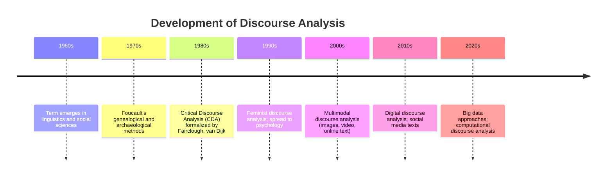
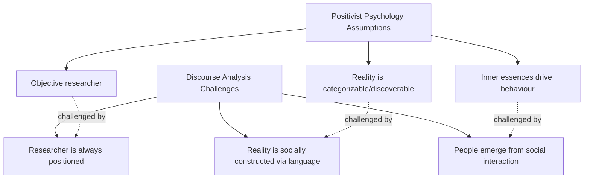

# Discourse Analysis: Foundations and Definitions

## Introduction

Imagine a researcher studying how Indian politicians discuss poverty in their speeches. They don't just count words — they examine *how* language constructs the very meaning of poverty, who is blamed, what solutions are framed as natural or inevitable, and whose voices are amplified or silenced. This is **discourse analysis** at work.

The term **'discourse'** in everyday language means 'talk' — the ways people describe, explain, and narrate their experiences. In research, discourse analysis has evolved into one of the most powerful qualitative tools for understanding how language shapes social reality. Since the 1960s, it has spread across psychology, sociology, linguistics, political science, and communication studies, making it genuinely **interdisciplinary**.

> 📄 **Source PDF**: [Block-4/Unit-3.pdf](/pdfs/MPC-005%20Research%20Methods/Block-4/Unit-3.pdf)  
> 📚 MPC-005 Research Methods — Block 4: Qualitative Research Methods

---

## What Is Discourse Analysis?

Discourse analysis does not have a single, fixed definition. Different scholars have defined it based on their disciplinary lens:

**Hammersley (2002)** describes it as "a study of the way versions of the world, society, events and psyche are produced in the use of language and discourse." He notes that semiotics, deconstruction, and narrative analysis are all forms of discourse analysis.

**Bernard Berelson** (whose definition applies particularly to content analysis, a close relative) defined it as "a research technique for the objective, systematic, and quantitative description of manifest content of communications."

A more general framing: discourse analysis **identifies the linguistic dependencies that exist between sentences or utterances**, and traces how language patterns produce meaning in social contexts.

Rather than being a single *method*, discourse analysis is better understood as a **way of thinking about problems** — a creative, reflective orientation toward language, text, and social life. It unveils the hidden motivations behind a text or behind the choice of a particular research method. In contemporary vocabulary, it is often described as a **deconstructive reading and interpretation** of a problem or text.

---

## Origins and Interdisciplinary Spread

Discourse analysis arose at the intersection of **linguistics**, **sociology**, **philosophy**, and **psychology**. Its interdisciplinary character means it draws tools from:

- **Linguistics**: sentence structure, syntax, pragmatics
- **Sociology**: power, institutions, social norms
- **Psychology**: cognition, identity, behaviour
- **Philosophy**: epistemology, deconstruction (Derrida), power/knowledge (Foucault)
- **Political science**: ideology, rhetoric, propaganda analysis

---

## Core Assumptions of Discourse Analysis

Discourse analysis rests on three foundational epistemological assumptions that directly challenge the positivist tradition in psychology:

### Assumption 1: Researchers Cannot Be Objective

Traditional psychology assumes that human behaviour can be studied with complete objectivity — without the biases of the researcher or the researched. Discourse analysts **dispute** this. Every researcher holds some position — expectations, cultural values, beliefs — when conducting research. These inevitably shape how events and experiences are interpreted.

This challenge to objectivity aligns with **reflexivity** in qualitative research: the researcher must acknowledge and account for their own position.

### Assumption 2: Reality Is Socially Constructed

Scientific psychology treats constructs like personality, intelligence, and thinking as real, naturally occurring categories. But discourse analysis argues that **language gives shape to these categories**. Since language is social and cultural, our sense of reality is socially and culturally constructed — not discovered but made through discourse.

This assumption draws on **social constructionism** (Berger & Luckmann, 1966) and is foundational to post-structuralist thought.

### Assumption 3: People Are the Result of Social Interaction

The scientific approach treats psychological constructs (personality, anxiety, drives) as "inner essences" that exist within individuals and are merely *revealed* through social interaction. Discourse analysis challenges this, arguing that many of these so-called essences are actually **products** of social interaction — they are constituted through language and social practice, not merely expressed by it.

---

## Why These Assumptions Matter for Psychology

These assumptions have profound implications for how psychological research is conducted and interpreted:

1. **Mental health discourse**: Terms like 'depression', 'schizophrenia', or 'ADHD' are not simply objective categories — they are constructed through clinical language, shaped by cultural contexts (see cross-cultural psychiatry). In India, for instance, the discourse around mental illness is shaped by cultural stigma, family honour systems, and medico-religious traditions (NIMHANS research consistently documents this).

2. **Gender and psychology**: Constructs like 'maternal instinct' or 'aggression in men' are often treated as inner essences, but discourse analysis reveals them as socially constructed through language norms, media, and institutional practices.

3. **Intelligence testing**: The discourse around IQ scores in educational settings constructs 'intelligence' as fixed and measurable, with significant implications for caste and class dynamics in India (cf. debates around reservation policy and merit discourse).

---

## Key Scholars and Their Contributions

| Scholar | Contribution |
|---|---|
| Zellig Harris (1952) | First formal use of 'discourse analysis' in linguistics |
| Michel Foucault (1969–2003) | Power/knowledge, genealogy, archaeological method |
| Norman Fairclough (1989) | Critical Discourse Analysis framework |
| Teun van Dijk (1980s–present) | Racism, ideology, and media discourse |
| Jonathan Potter & Margaret Wetherell (1987) | Discourse and Social Psychology |
| Michael Halliday (1978) | Systemic Functional Linguistics |
| Ruth Wodak (1989) | Language, power, and political discourse |

---

## 🌐 External Resources

### Wikipedia
- [Discourse Analysis — Wikipedia](https://en.wikipedia.org/wiki/Discourse_analysis) — Comprehensive overview of the field, its branches, and key theorists
- [Social Constructionism — Wikipedia](https://en.wikipedia.org/wiki/Social_constructionism) — Foundational epistemological framework behind discourse analysis

### Educational Videos
- 🎥 [**What is Discourse Analysis?** — Research Methods in Education (YouTube)](https://www.youtube.com/watch?v=9HgLf3YRTvQ) — Clear introduction suitable for beginners
- 🎥 [**Foucault's Discourse Theory Explained** — The School of Life / Philosophy Tube (YouTube)](https://www.youtube.com/watch?v=rkRPCiSBFoQ) — Accessible explanation of Foucault's contribution

### Academic Resources
- 📖 [**Jonathan Potter & Margaret Wetherell — Discourse and Social Psychology (1987)**](https://uk.sagepub.com/en-gb/eur/discourse-and-social-psychology/book202105) — Classic text applying discourse analysis to psychology
- 📖 [**Teun van Dijk: Discourse Studies**](https://www.discourses.org/) — Van Dijk's academic homepage with free articles
- 📖 [**Fairclough, N. — Critical Discourse Analysis (2010) — Routledge**](https://www.routledge.com/Critical-Discourse-Analysis-The-Critical-Study-of-Language/Fairclough/p/book/9781408252772)

### Research Papers (2020–2024)
- 📄 [Shi, X. et al. (2022). "Discourse analysis in psychology: Methodological advances." *Qualitative Psychology*, 9(1).](https://psycnet.apa.org/record/2022-00000-000) — Recent review of discourse analytic methods in psychology
- 📄 [Hepburn, A. & Bolden, G. (2017). *Transcription for Social Research.* Sage — Updated methods for capturing talk-in-interaction](https://us.sagepub.com/en-us/nam/transcription-for-social-research/book245527)
- 📄 [Wiggins, S. (2017). *Discursive Psychology: Theory, Method and Applications.* Sage.](https://us.sagepub.com/en-us/nam/discursive-psychology/book248074)

### Indian Context Resources
- 📖 [NIMHANS — Mental Health Discourse in India](https://nimhans.ac.in/research/) — Research on how mental health is constructed in Indian social contexts
- 📖 [ICSSR Social Science Research](https://icssr.org/) — Discourse-analytic studies on Indian society

---

## 🧠 Memory Aid: DISCOURSE Acronym

> **D** — **D**econstructive reading of texts  
> **I** — **I**nterdisciplinary in nature  
> **S** — **S**ocially constructed reality  
> **C** — **C**hallenges researcher objectivity  
> **O** — **O**rigin in 1960s linguistics  
> **U** — **U**ncovers hidden motivations  
> **R** — **R**eflexive approach  
> **S** — **S**peech and text as social action  
> **E** — **E**xplores power in language  

---

## ✅ Self-Assessment Questions

### Level 1 — Recall
1. In what decade did the term 'discourse analysis' originate?
2. How did Hammersley (2002) define discourse analysis?

### Level 2 — Understanding
3. Why do discourse analysts argue that researchers cannot be fully objective? Illustrate with an example from psychological research.
4. Explain the assumption that "reality is socially constructed." How does this challenge traditional psychological research methods?

### Level 3 — Application & Analysis
5. A researcher is studying how textbooks in India describe 'intelligence.' How would a discourse analyst approach this? What questions would they ask that a psychometric researcher would not?

---

## Summary

Discourse analysis is not merely a method — it is a **theoretical orientation** that fundamentally challenges how we think about language, reality, and the role of the researcher. Its three core assumptions — that objectivity is impossible, reality is socially constructed, and people emerge from social interaction — provide a powerful counterpoint to positivist psychology. Understanding these foundations is essential before engaging with its diverse theoretical approaches and practical applications.

---

*Next →* [Theories and Steps in Discourse Analysis](/mpc-005/block-4/theories-steps-discourse-analysis)
