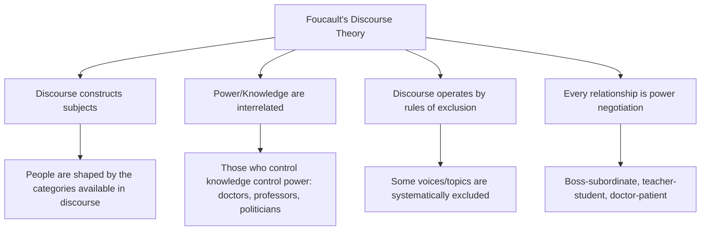
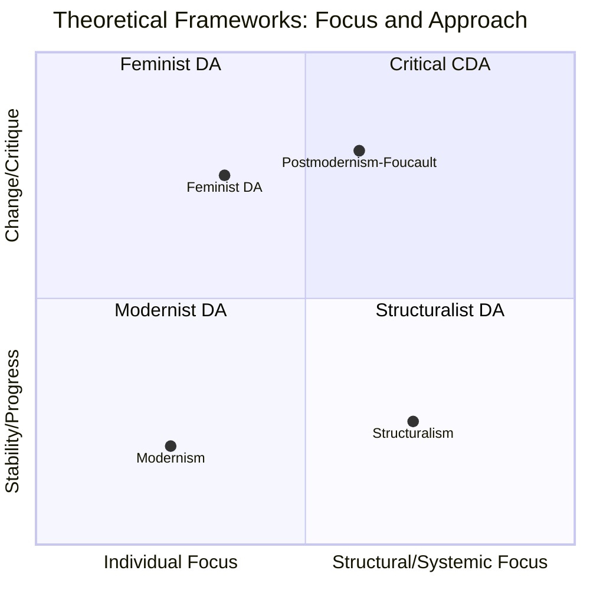
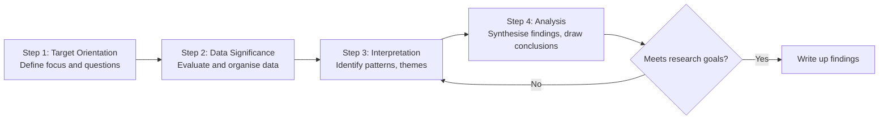

# Theories and Steps in Discourse Analysis

## Introduction

Once we understand *what* discourse analysis is, the next question is: *which theoretical lens do we use?* There is no single unified theory of discourse analysis — rather, it is a family of approaches shaped by different philosophical traditions. The major theoretical frameworks include **modernism**, **structuralism**, **postmodernism**, and **feminism**, each offering a distinct way of reading language and social reality.

Understanding these frameworks is also essential because each shapes *how* discourse analysis is conducted — what counts as data, what questions are asked, and what conclusions can be drawn.

> 📄 **Source PDF**: [Block-4/Unit-3.pdf](/pdfs/MPC-005%20Research%20Methods/Block-4/Unit-3.pdf)  
> 📚 MPC-005 Research Methods — Block 4: Qualitative Research Methods

---

## Theoretical Frameworks of Discourse Analysis

### 1. Modernism

Modernist theorists approach discourse from a **realist and achievement-oriented** perspective. They view discourse as being relative to talk — the way in which something is spoken about. Their key insight is that language and discourse **transform** to describe new inventions, innovations, and understandings more accurately.

Key features of modernist discourse theory:
- Language and discourse are **natural products** of common sense and progress
- New words and vocabulary are needed to describe new realities (e.g., the evolution of medical terminology)
- Modernism gave rise to discourses of **rights, equality, freedom, and justice** — a significant contribution to democratic discourse
- Discourse evolves linearly as human knowledge progresses

**Example in Psychology**: The modernist framing of psychology's development — from folk psychology to behaviourism to cognitive science — treats each advance as more accurate than the last, with new technical language replacing old.

---

### 2. Structuralism

Structuralist theorists, influenced by Ferdinand de Saussure's linguistics, argue that **human actions and social formations can be analysed as systems of related elements**. Language and discourse are key to this.

Key principles:
- Individual elements of a system have meaning only **in relation to the whole structure**
- Structures are **self-contained, self-regulated, and self-transforming**
- The structure itself determines the significance, meaning, and function of elements
- Language is not a reflection of reality — it is a **system of differences** (signs vs. referents)

**Saussure's fundamental insight**: The word 'tree' does not derive meaning from its resemblance to actual trees, but from its *difference* from other signs ('three', 'free', etc.).

**Contribution to psychology**: Structuralism influenced Lévi-Strauss's analysis of myth and culture, and Lacan's psychoanalytic reading of language as structuring the unconscious.

---

### 3. Postmodernism (with Foucault's Discourse Theory)

Postmodernism is the most influential theoretical framework in contemporary discourse analysis. Unlike modernism, postmodern theorists:
- Emphasise **differences** over similarities and common experiences
- Examine the **variety of experiences** of individuals and groups
- Analyse discourses as texts, language, policies, and practices

**Michel Foucault** (1926–1984) is the towering figure here. Foucault defined discourse as:

> *"Systems of thoughts composed of ideas, attitudes, courses of action, beliefs and practices that systematically construct the subjects and the worlds of which they speak."* — Foucault (1977, 1980)

**Key Foucauldian concepts:**

| Concept | Meaning |
|---|---|
| **Power/Knowledge** | Power and knowledge are inseparable — to claim knowledge is to exercise power |
| **Discourse as exclusion** | Discourses operate by *including* some things and *excluding* others |
| **Genealogy** | Tracing how current discourses came to be — what historical accidents shaped what counts as 'truth' |
| **Subject formation** | People are not pre-formed subjects who then speak — discourse *creates* the subject |
| **Discourse regularity** | Discourses have patterns, rules, and regularities that can be mapped |

**Example**: The discourse of 'mental illness' in psychiatry does not simply describe a pre-existing phenomenon — it *creates* the category, defines who counts as ill, and establishes who has the authority to diagnose. Foucault's *Madness and Civilisation* (1961) traced how 'madness' was constructed differently across historical periods.

**Postmodernism in Indian context**: Postcolonial scholars like Partha Chatterjee and Gayatri Spivak applied Foucauldian discourse analysis to examine how colonial discourse constructed 'the Indian subject' — as irrational, superstitious, child-like — justifying British rule. This is a landmark application in Indian intellectual history.

---

### 4. Feminism

Feminist discourse analysis investigates the **complex relationships among power, ideology, language, and discourse** from a gendered perspective.

Key feminist insights:
- Discourse reveals events of **social practices**
- Gender is not a property of *persons* but of **behaviours to which society ascribes gendering meaning**
- Feminist analysts examine the concept of **'performing gender'** (drawing on Judith Butler's work)
- Language norms often systematically marginalise women's experiences and voices

**Example**: Analysis of how newspaper reports on domestic violence in India use passive voice ("woman was assaulted") vs. active voice for other crimes — revealing how language constructs victim-blaming discourse.

---

## Comparison of Theoretical Frameworks

| Framework | View of Language | View of Power | Method Emphasis |
|---|---|---|---|
| Modernism | Evolving, progressive | Implicit | Historical change in vocabulary |
| Structuralism | System of differences | Structural | Mapping relational structures |
| Postmodernism | Constitutive of reality | Central (Foucault) | Genealogy, archaeology of knowledge |
| Feminism | Gendered practice | Patriarchal | Identifying gendering in texts |

---

## Steps in Discourse Analysis

Discourse analysis is more flexible than quantitative methods, but still follows a systematic process. The key steps are:

### Step 1: Target Orientation
The analyst must first clarify their **focus of study** — what text, talk, or interaction is being analysed, and what questions are being asked. This involves deciding:
- What is the discourse to be analysed? (e.g., political speeches, therapy transcripts, newspaper articles)
- What theoretical framework guides the analysis?
- How will data be analysed and interpreted?

### Step 2: Significance of Data
Once data is collected, the researcher examines the **value and relevance** of what has been gathered. This involves:
- Judging the quality and relevance of collected data
- Handling data from multiple sources critically
- Checking for completeness and representativeness

### Step 3: Interpretation of Data
As research progresses, the analyst **interprets the patterns** emerging from the data:
- What linguistic patterns are present? (metaphors, passive voice, turn-taking, word choice)
- What do these patterns suggest about power, identity, or social reality?
- Interpretation is **reflexive and iterative** — the analyst revises interpretations as new patterns emerge

### Step 4: Analysis of Findings
Finally, the analyst undertakes the **synthesis and conclusion** stage:
- Summarising patterns and themes
- Drawing conclusions about what the discourse reveals
- Using software tools (NVivo, ATLAS.ti, MAXQDA) for locating words/phrases, counting occurrences, and building theory — while recognising that computers cannot *judge or interpret* qualitative data

---

## Relevance and Significance of Discourse Analysis

The method has broad applications across disciplines:

1. **Unveiling hidden motivations**: It reveals what lies behind texts — ideologies, power relations, unspoken assumptions
2. **Comprehensive problem view**: Provides a fuller picture of 'problems' by situating them in social and historical context
3. **Deconstructing assumptions**: Challenges taken-for-granted social values and belief systems
4. **Cross-disciplinary application**: Can be applied to any text — media, policy, conversation, literature
5. **No rigid guidelines**: Provides flexibility — the method adapts to the text and the research question
6. **Meaningful interpretation**: Enables richer understanding of people and social worlds
7. **Promoting social change**: Critical applications can identify and challenge injustice

---

## 🌐 External Resources

### Wikipedia
- [Michel Foucault — Wikipedia](https://en.wikipedia.org/wiki/Michel_Foucault) — Comprehensive overview of his life, works, and influence on discourse theory
- [Postmodernism — Wikipedia](https://en.wikipedia.org/wiki/Postmodernism) — Context for postmodern discourse analysis

### Educational Videos
- 🎥 [**Foucault: Power, Knowledge, and Discourse** — Popular Social Science (YouTube)](https://www.youtube.com/watch?v=6AAkSHMiS1o) — Visual explanation of Foucault's key concepts
- 🎥 [**Feminist Discourse Analysis** — Qualitative Research Methods (YouTube)](https://www.youtube.com/watch?v=ZgRt5QE93Hk)

### Research Papers
- 📄 [van Dijk, T.A. (2015). "Critical Discourse Analysis." In *The Handbook of Discourse Analysis.* Wiley-Blackwell.](https://onlinelibrary.wiley.com/doi/10.1002/9781118584194.ch18)
- 📄 [Baker, P. et al. (2008). "A useful methodological synergy? Combining critical discourse analysis and corpus linguistics." *Discourse & Society*, 19(3).](https://journals.sagepub.com/doi/10.1177/0957926508088962)
- 📄 [Arribas-Ayllon, M. & Walkerdine, V. (2008). "Foucauldian Discourse Analysis." In *The Sage Handbook of Qualitative Research in Psychology.* Sage.](https://uk.sagepub.com/en-gb/eur/the-sage-handbook-of-qualitative-research-in-psychology/book228878)

### Books & Articles
- 📖 [Foucault, M. (1972). *Archaeology of Knowledge.* Pantheon.](https://www.routledge.com/The-Archaeology-of-Knowledge/Foucault/p/book/9780415287524)
- 📖 [Fairclough, N. (1989). *Language and Power.* Longman.](https://www.routledge.com/Language-and-Power/Fairclough/p/book/9781408237939)
- 📖 [Potter, J. & Wetherell, M. (1987). *Discourse and Social Psychology.* Sage.](https://uk.sagepub.com/en-gb/eur/discourse-and-social-psychology/book202105)
- 📖 [ATLAS.ti — Qualitative Analysis Software for Discourse Analysis](https://atlasti.com/)

---

## 🧠 Memory Aid: FOUCAULT's Key Ideas

> **F** — **F**oucault's genealogical method  
> **O** — **O**peration by rules of exclusion  
> **U** — **U**nderpins power/knowledge relation  
> **C** — **C**onstructs subjects through discourse  
> **A** — **A**rchaeology of knowledge  
> **U** — **U**ncovers historical contingency  
> **L** — **L**anguage as social practice  
> **T** — **T**ruth as effect of discourse  

---

## ✅ Self-Assessment Questions

### Level 1 — Recall
1. Which theoretical framework emphasised achieving more accurate words to describe new realities?
2. What is the central principle of structuralism regarding individual elements and structure?

### Level 2 — Understanding
3. How did Foucault define discourse? Why is power central to his conception?
4. What do feminist discourse analysts mean by 'performing gender'? How does this differ from viewing gender as an inner essence?

### Level 3 — Application & Analysis
5. A student wants to analyse how COVID-19 was discussed in Indian government press briefings. Which theoretical framework(s) would you recommend and why? What would a Foucauldian analysis specifically focus on?

---

## Summary

Discourse analysis draws on four major theoretical traditions: **modernism** (language evolves progressively), **structuralism** (language as a system of relations), **postmodernism** (discourse constitutes reality and power — especially Foucault), and **feminism** (language as gendered practice). The analytical process moves through target orientation → data significance → interpretation → analysis. Each framework offers unique insights, and the skilled researcher chooses based on their research question and epistemological commitments.

---

*Previous ←* [Discourse Analysis: Foundations](/mpc-005/block-4/discourse-analysis-foundations)  
*Next →* [Critical Discourse Analysis](/mpc-005/block-4/critical-discourse-analysis)
