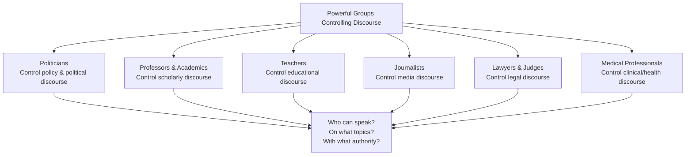
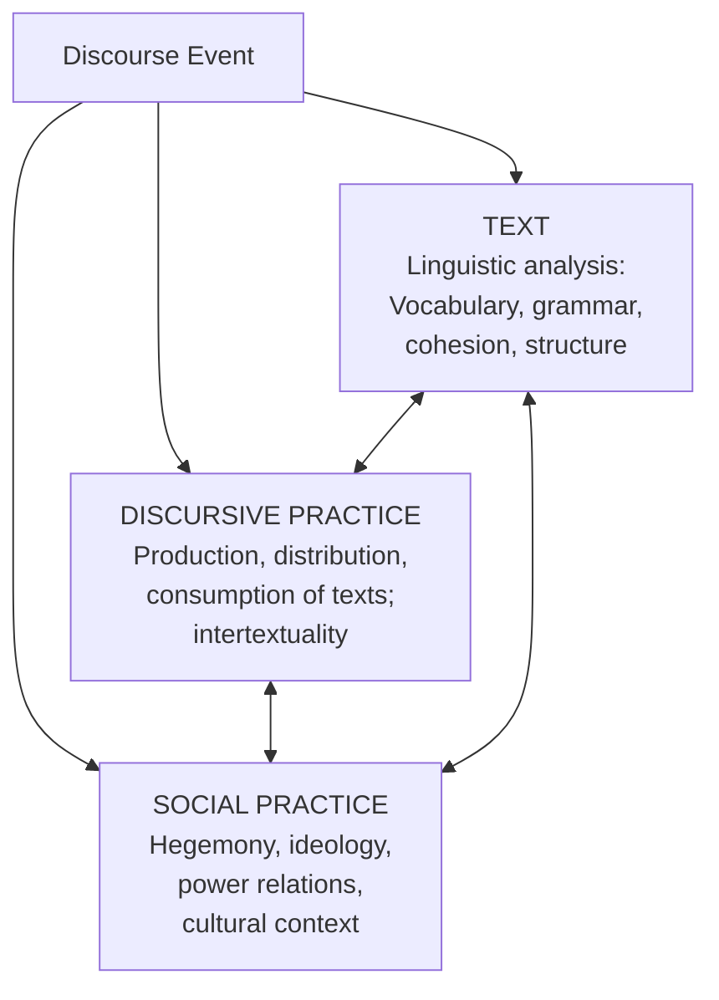

# Critical Discourse Analysis (CDA): Theory and Applications

## Introduction

In 1991, Teun van Dijk analysed how mainstream European newspapers covered immigrants and refugees. He found that even 'neutral' reporting systematically used language that framed migrants as threats — through word choices, metaphors, passive constructions, and what was left unsaid. This work exemplifies **Critical Discourse Analysis (CDA)**: the study of how language in texts reproduces, legitimises, or challenges social power, inequality, and injustice.

CDA is not simply a method for describing language — it is a **politically committed form of analysis** that explicitly aims to contribute to social change. As van Dijk (1993) puts it, CDA researchers are "discourse analysts who are explicitly critical... their aim is not only to describe but to contribute to social change."

> 📄 **Source PDF**: [Block-4/Unit-3.pdf](/pdfs/MPC-005%20Research%20Methods/Block-4/Unit-3.pdf)  
> 📚 MPC-005 Research Methods — Block 4: Qualitative Research Methods

---

## What is Critical Discourse Analysis?

CDA is a **discourse-based research method** that studies how social power abuse, dominance, and inequality are:
- **Enacted** (performed) through text and talk
- **Reproduced** (maintained and normalised) through text and talk  
- **Resisted** (challenged or subverted) through text and talk

All of this occurs in social and political contexts — particularly in media, political speeches, legal language, educational texts, and institutional communication.

CDA positions the researcher as an **active agent** — not a neutral observer, but someone explicitly trying to understand, expose, and ultimately help overcome social inequality and injustice.

---

## Key Institutional Sites of Discourse Power

CDA pays special attention to **powerful groups** that control public discourse:

This is deeply Foucauldian: those who control discourse control what counts as truth, what is sayable, and who has the legitimacy to say it.

**Indian examples:**
- Brahminical academic discourse historically controlled what counted as valid knowledge (cf. debates on oral vs. written traditions)
- Medical discourse around 'hysteria' historically pathologised women's behaviour
- Colonial legal discourse created categories like 'criminal tribes' that criminalised entire communities

---

## The Three-Dimensional Model of CDA (Fairclough, 1992)

Norman Fairclough's model is one of the most influential frameworks in CDA. He proposes three interlocking dimensions:

- **Text level**: What words are used? What metaphors? Whose voice is quoted? What is passive/active?
- **Discursive practice**: How is the text produced? Who wrote it? How is it distributed? Who reads/consumes it?
- **Social practice**: What ideologies, power relations, and social structures does the text reflect, reinforce, or challenge?

Effective CDA analyses all three dimensions simultaneously.

---

## Implications and Applications of CDA

### 1. Researcher as Active Agent
CDA explicitly allows — indeed, requires — the researcher to be positioned. Rather than pretending neutrality, CDA researchers acknowledge their commitment to exposing injustice. This makes CDA both **emancipatory** and **reflexive**.

### 2. Media Analysis — Exposing Ideological Messages
CDA is particularly powerful for analysing media texts. It enables media critics to **"denaturalise"** — to expose as constructed and ideological — what appears to be natural or commonsensical in media coverage.

**Example**: Analysing how Indian news channels cover agrarian crises:
- Do headlines use "farmer suicide" (individual pathology) or "agrarian distress" (systemic crisis)?
- Are corporate farming voices given more column inches than small farmers?
- What metaphors frame rural poverty?

### 3. Applied Linguistics
CDA has transformed applied linguistics by showing that language learning and teaching are never politically neutral. Curriculum texts, English language teaching materials, and standardised tests all embed particular ideological assumptions that CDA can uncover.

### 4. Interdisciplinary Tool
CDA bridges disciplines: media studies, sociology, linguistics, psychology, legal studies, and education can all use CDA methods. This cross-disciplinary reach is one of CDA's great strengths.

### 5. Cross-Cultural Study
CDA enables comparison of how similar social phenomena are discursively constructed across different cultural contexts — for example, how 'poverty' is framed differently in Indian vs. Western media discourse.

### 6. Theoretical-Descriptive Integration
CDA critically examines the relationship between theoretical accounts and descriptive analyses of texts — ensuring that abstract theory is grounded in close reading of actual language.

### 7. Language as Social Practice
CDA's central claim: **language is not merely a tool for expressing pre-existing thoughts** — it is a form of social practice that constitutes social reality. This has radical implications for how we understand communication, media, and power.

---

## Reliability and Validity in Discourse Analysis

Despite its power, discourse analysis — including CDA — faces significant challenges around reliability and validity:

| Issue | Description |
|---|---|
| **Lack of standardised format** | No fixed method means results may be difficult to replicate |
| **Researcher subjectivity** | Interpretation involves the analyst's own position — open to bias |
| **No hard data** | Unlike quantitative research, findings rest on argument and rhetoric |
| **Validity as rhetoric** | The quality of a CDA analysis depends on the quality of its argumentation |
| **Counter-interpretations** | Even the best argument is open to alternative readings |

**Response from CDA scholars**: These are not necessarily weaknesses — they are features of interpretive research. The goal is not replication but **transparency of method**, **reflexivity**, and the **persuasiveness** of the analysis.

As van Dijk argues, the validity standard for CDA should be: *does the analysis illuminate patterns that matter for understanding power and injustice?*

---

## Key Scholars in CDA

| Scholar | Key Work | Focus |
|---|---|---|
| **Norman Fairclough** | *Language and Power* (1989); *Critical Discourse Analysis* (1995) | Media, institutions, neoliberal discourse |
| **Teun van Dijk** | *Racism and the Press* (1991); *Ideology* (1998) | Racism, ideology, political discourse |
| **Ruth Wodak** | *Language, Power, Ideology* (1989); *The Politics of Fear* (2015) | Political discourse, right-wing populism |
| **Michel Foucault** | *Discipline and Punish* (1977); *History of Sexuality* (1978) | Power/knowledge, subject formation |
| **Gunther Kress** | *Multimodality* (2010) | Visual discourse, multimodal CDA |

---

## CDA in Indian Context

CDA has rich applications in the Indian context:

1. **Caste discourse**: Analysing how 'merit' is constructed in public debate around reservations — CDA reveals how neutral-sounding language often encodes caste privilege
2. **Religious nationalism**: Analysis of political speeches using CDA to map how religious and nationalist discourses merge and exclude minorities
3. **Postcolonial discourse**: Subaltern Studies scholars (Ranajit Guha, Gayatri Spivak) used discourse-analytic approaches to recover marginalised voices from colonial archives
4. **Mental health stigma**: CDA applied to Indian media coverage of suicide reveals persistent pathologising of victims rather than systemic critiques

---

## 🌐 External Resources

### Wikipedia
- [Critical Discourse Analysis — Wikipedia](https://en.wikipedia.org/wiki/Critical_discourse_analysis) — Overview with key scholars, methods, and critiques
- [Teun van Dijk — Wikipedia](https://en.wikipedia.org/wiki/Teun_A._van_Dijk) — Profile of the leading CDA scholar

### Educational Videos
- 🎥 [**Critical Discourse Analysis Explained** — SAGE Research Methods (YouTube)](https://www.youtube.com/watch?v=APz7OxJa7oA) — Authoritative academic overview
- 🎥 [**CDA: Analysing Power in Language** — Research Methods in Social Science (YouTube)](https://www.youtube.com/watch?v=_kOcsFTITJE)

### Research Papers (2020–2024)
- 📄 [Flowerdew, J. & Richardson, J.E. (Eds.) (2018). *The Routledge Handbook of Critical Discourse Studies.* Routledge.](https://www.routledge.com/The-Routledge-Handbook-of-Critical-Discourse-Studies/Flowerdew-Richardson/p/book/9780367581725)
- 📄 [Machin, D. & Mayr, A. (2012). *How to Do Critical Discourse Analysis.* Sage.](https://us.sagepub.com/en-us/nam/how-to-do-critical-discourse-analysis/book235832)
- 📄 [Charteris-Black, J. (2021). *Metaphor, COVID-19 and the Politics of Economic Recovery.* Palgrave.](https://link.springer.com/book/10.1007/978-3-030-90942-4) — Recent CDA application to COVID discourse

### Additional Resources
- 📖 [Fairclough, N. (1995). *Critical Discourse Analysis.* Longman.](https://www.routledge.com/Critical-Discourse-Analysis-The-Critical-Study-of-Language/Fairclough/p/book/9781408252772)
- 📖 [van Dijk, T. (1998). *Ideology: A Multidisciplinary Approach.* Sage.](https://us.sagepub.com/en-us/nam/ideology/book204677)
- 📖 [Discourse & Society Journal — Sage Publications](https://journals.sagepub.com/home/das) — Leading peer-reviewed journal for CDA research
- 📖 [Subaltern Studies Reader — Ranajit Guha (Indian context)](https://www.upress.umn.edu/book-division/books/a-subaltern-studies-reader-1986-1995)

---

## 🧠 Memory Aid: CDA = POWER in Language

> **P** — **P**olitically committed analysis  
> **O** — **O**ppression and inequality exposed  
> **W** — **W**ho controls public discourse?  
> **E** — **E**nacted, reproduced, and resisted  
> **R** — **R**esearcher as active change agent  

---

## ✅ Self-Assessment Questions

### Level 1 — Recall
1. What does CDA stand for, and what does it study?
2. Name three institutional groups that CDA identifies as controlling public discourse.

### Level 2 — Understanding
3. What does it mean for a researcher to be an "active agent" in CDA? Why might this be considered a strength rather than a weakness?
4. Explain Fairclough's three-dimensional model of discourse analysis. How do the three dimensions interact?

### Level 3 — Application & Analysis
5. Apply CDA to the following: A national newspaper in India runs a story about a farmer suicide under the headline "Farmer in debt takes his life." Analyse this headline from a CDA perspective — what ideological work does this phrasing do? What alternative framings are excluded?

---

## Summary

Critical Discourse Analysis is a theoretically sophisticated and politically committed form of qualitative research that examines how language in texts enacts, reproduces, and potentially resists social power and inequality. It treats the researcher as an active participant in knowledge production, not a neutral observer. Drawing on Foucault's power/knowledge framework and Fairclough's three-dimensional model, CDA provides tools for analysing media, political, educational, and institutional language — with particularly rich applications in the Indian context, where questions of caste, religion, gender, and colonial legacy intersect with language and power.

---

*Previous ←* [Theories and Steps in Discourse Analysis](/mpc-005/block-4/theories-steps-discourse-analysis)  
*Next →* [Content Analysis: Methods and Applications](/mpc-005/block-4/content-analysis-methods-applications)
