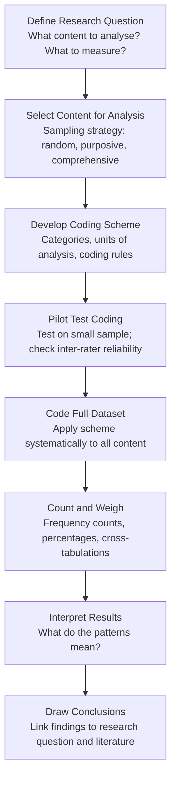
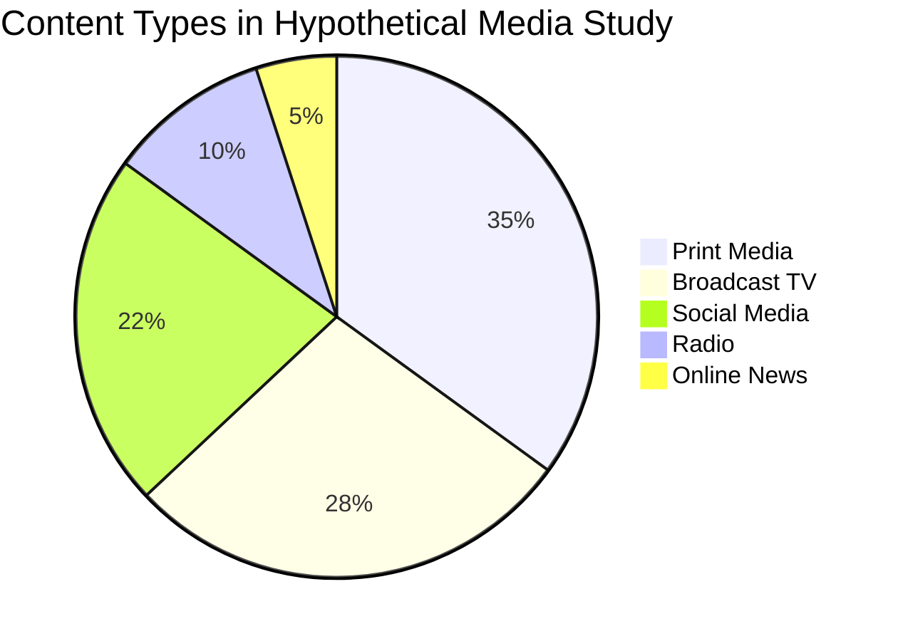

# Content Analysis: Methods, Examples, and Applications

## Introduction

A researcher wants to know whether Indian television news channels have increased their coverage of mental health topics since 2020. She records 200 hours of news broadcasts, develops a coding scheme, and counts how often specific terms appear, which contexts they appear in, and how they are framed. This is **content analysis** — a systematic, replicable method for quantifying and interpreting patterns in communication content.

Content analysis bridges the **quantitative-qualitative divide** in research: at its core it produces numerical data, but the interpretation of those numbers requires qualitative judgment and contextual understanding. It is one of the most widely used research methods in communication studies, media studies, sociology, and psychology.

> 📄 **Source PDF**: [Block-4/Unit-3.pdf](/pdfs/MPC-005%20Research%20Methods/Block-4/Unit-3.pdf)  
> 📚 MPC-005 Research Methods — Block 4: Qualitative Research Methods

---

## Definition of Content Analysis

Bernard Berelson, one of the pioneers of the method, defined content analysis as:

> *"A research technique for the objective, systematic, and quantitative description of manifest content of communications."* — Berelson (1952)

Three key words in this definition:
- **Objective**: The analyst applies predetermined categories consistently, not based on personal impressions
- **Systematic**: A clear protocol is followed throughout — what is counted, how, and why
- **Quantitative**: Results are expressed numerically (frequencies, percentages, ratios)

However, modern content analysis — particularly **qualitative content analysis** — goes beyond Berelson's quantitative framing to also analyse *latent* content (deeper meanings, themes, implied messages) rather than just *manifest* content (explicit, surface-level text).

---

## Content Analysis vs. Discourse Analysis

While both methods analyse communication, they differ significantly:

| Feature | Content Analysis | Discourse Analysis |
|---|---|---|
| **Primary output** | Numbers and percentages | Interpretive accounts |
| **Approach** | More structured, replicable | Flexible, reflexive |
| **Focus** | Manifest + latent content | Language as social practice |
| **Researcher role** | More distanced | Explicitly positioned (especially CDA) |
| **Data type** | Any media/communication content | Text, talk, interaction |
| **Theoretical basis** | Can be atheoretical | Tied to specific theories (structuralism, Foucault, etc.) |
| **Frequency of use** | Very common in media studies | More common in sociology, psychology |

The two methods are often **complementary**: content analysis can identify *what* is present and *how often*, while discourse analysis explains *how* that content functions socially and politically.

---

## Types of Content: What Can Be Analysed?

Content analysis can be applied to two broad categories:

### Media Content
Sources where the content is produced by media organisations:
- **Print media**: Newspapers, magazines, journals (e.g., analysis of suicide reporting in *The Hindu*)
- **Broadcasts**: Television news, radio programs, podcasts
- **Recordings**: Films, documentaries, advertisements
- **Digital media**: Websites, social media posts, online news

### Audience Content
Sources where the content is produced by individuals in response to researchers:
- **Questionnaires**: Open-ended responses analysed for themes
- **Interviews**: Transcripts coded for categories
- **Group discussions / Focus groups**: Transcripts analysed for interaction patterns
- **Letters to editors**: Used to understand public opinion trends

---

## The Content Analysis Process

**Key decision: Unit of analysis**
The unit of analysis can be:
- A **word** (e.g., counting occurrences of 'terrorist' in news reports)
- A **sentence** or **paragraph**
- A **theme** (e.g., every paragraph that mentions mental health)
- An entire **article** or **program episode**

The choice depends on the research question and the level of analysis required.

---

## Two Core Purposes of Content Analysis

Berelson's definition highlights two fundamental purposes:

### Purpose 1: Reducing Subjectivity in Summaries
Without content analysis, a researcher summarising a TV program's content relies on memory, impression, and personal emphasis — inherently subjective. Content analysis provides a **systematic record** that reduces (though never eliminates) this subjectivity. When another researcher applies the same coding scheme to the same material, they should reach similar results (inter-rater reliability).

### Purpose 2: Detecting Trends
Content analysis is ideal for tracking **changes over time**:

**Example from the PDF**: *"27% of programs on FM Radio in November 2009 mentioned at least one aspect of antiterrorism, compared with only 3% of the programs in 2006."*

This kind of trend analysis is only possible with systematic counting — an impressionistic summary could not produce such precise comparisons.

---

## Worked Examples of Content Analysis

### Example 1: FM Radio Coverage of Antiterrorism
The PDF provides this example: tracking the percentage of FM radio programs mentioning antiterrorism themes across years (3% in 2006 vs. 27% in 2009). This illustrates how content analysis:
- Enables precise trend measurement
- Tracks the impact of real-world events (e.g., post-2008 Mumbai attacks) on media coverage
- Produces data for policymakers to understand media influence on public discourse

### Example 2: Suicide Reporting in Indian Media
A researcher applies content analysis to 500 newspaper articles about suicide in Indian newspapers over five years:
- **Unit of analysis**: Individual article
- **Categories**: Headline framing (individual/systemic), mention of helplines, cause attribution (personal failure vs. social factors), word choice (committed suicide vs. died by suicide)
- **Finding**: 78% of articles used 'committed suicide' (criminalising framing); only 12% mentioned helpline numbers; agrarian suicides were more likely to be framed systemically than urban suicides
- **Implication**: Indian media coverage violates WHO media guidelines for suicide reporting — advocacy needed

### Example 3: Gender Representation in IGNOU Psychology Textbooks
A content analysis of case studies in IGNOU psychology textbooks:
- **Measure**: Percentage of case examples featuring male vs. female protagonists; profession assigned to male vs. female characters
- **Finding**: Male protagonists predominate in cases about leadership and career; female characters more frequent in cases about family distress and anxiety
- **Implication**: Textbook content may inadvertently reinforce gender stereotypes

---

## Implications and Applications of Content Analysis

### In Research
- **Causal inference support**: Links content (e.g., violent video games) to audience effects (e.g., aggression) — though causation requires additional methods
- **Media effects research**: Studying how media exposure shapes attitudes, beliefs, and behaviours
- **Policy analysis**: Tracking whether government communication aligns with policy objectives

### In Media and Broadcasting
- **Programming evaluation**: Identifying gaps, biases, or imbalances in broadcast content
- **Audience research**: Understanding what content different demographic groups respond to
- **Editorial standards audit**: Checking whether reporting meets ethical guidelines

### In Education and Advocacy
- **Textbook analysis**: Identifying biased content in educational materials
- **Awareness campaigns**: Documenting the extent of stigmatising language to advocate for change
- **Documentary/research summaries**: Coding field notes or interview transcripts to build theory

### In Indian Context
- **NCERT textbook analysis**: Researchers have used content analysis to examine how history textbooks represent marginalised communities
- **Religious representation in media**: Studies of how different religions are portrayed in Indian entertainment
- **Political rhetoric**: Tracking campaign promises vs. policy coverage in news media

---

## Limitations of Content Analysis

While powerful, content analysis has important limitations:

| Limitation | Explanation |
|---|---|
| **Cannot explain meaning** | Counts *what* is present but not *why* or *how it functions* — needs discourse analysis for that |
| **Coding scheme dependency** | Results are only as good as the coding scheme — poor categories produce meaningless data |
| **Latent content ambiguity** | Coding deeper meanings requires interpretation — threatens reliability |
| **Context loss** | Quantifying strips away context that might be essential for understanding |
| **Publication bias** | Easily published when it confirms common sense; harder to publish null findings |

---

## 🌐 External Resources

### Wikipedia
- [Content Analysis — Wikipedia](https://en.wikipedia.org/wiki/Content_analysis) — Comprehensive overview with history, types, and applications
- [Bernard Berelson — Wikipedia](https://en.wikipedia.org/wiki/Bernard_Berelson) — Pioneer of content analysis methodology

### Educational Videos
- 🎥 [**What is Content Analysis?** — Research Methods Series, SAGE (YouTube)](https://www.youtube.com/watch?v=yB0QoMGq2ag) — Clear methodological introduction
- 🎥 [**How to Do Content Analysis** — Dr. Todd Grande (YouTube)](https://www.youtube.com/watch?v=MkPBh6GlFAc) — Practical walk-through of the coding process

### Research Papers (2020–2024)
- 📄 [Neuendorf, K.A. (2017). *The Content Analysis Guidebook* (2nd ed.). Sage.](https://us.sagepub.com/en-us/nam/the-content-analysis-guidebook/book234078) — The definitive methodological reference
- 📄 [Hsieh, H.F. & Shannon, S.E. (2005). "Three Approaches to Qualitative Content Analysis." *Qualitative Health Research*, 15(9).](https://journals.sagepub.com/doi/10.1177/1049732305276687) — Highly cited (9000+ citations); distinguishes conventional, directed, and summative approaches
- 📄 [Krippendorff, K. (2018). *Content Analysis: An Introduction to Its Methodology* (4th ed.). Sage.](https://us.sagepub.com/en-us/nam/content-analysis/book258450)

### Tools and Software
- 📖 [NVivo — Qualitative & Mixed Methods Analysis Software](https://lumivero.com/products/nvivo/) — Industry standard for qualitative content analysis
- 📖 [MAXQDA — Professional Software for Qualitative Research](https://www.maxqda.com/) — Widely used in academic research
- 📖 [ATLAS.ti — Qualitative Data Analysis](https://atlasti.com/)

---

## 🧠 Memory Aid: The BERELSON Framework

Remember Berelson's three words — **OSQ**:

> **O** — **O**bjective (apply categories consistently)  
> **S** — **S**ystematic (follow a clear protocol)  
> **Q** — **Q**uantitative (express results in numbers)  

And the two core purposes — **RS**:

> **R** — **R**educe subjectivity in summaries  
> **S** — **S**pot trends over time  

---

## ✅ Self-Assessment Questions

### Level 1 — Recall
1. How did Berelson define content analysis? What are the three key characteristics in his definition?
2. What are the two types of content that can be analysed in content analysis? Give two examples of each.

### Level 2 — Understanding
3. Why does content analysis produce numbers and percentages? What are the advantages and limitations of this quantitative output?
4. How does content analysis differ from discourse analysis? In what situations might a researcher use both?

### Level 3 — Application & Analysis
5. Design a content analysis study to investigate how mental health is portrayed in Indian social media (Instagram and Twitter/X) in 2024. Specify: (a) your research question, (b) your sampling strategy, (c) your units of analysis, (d) your coding categories, and (e) one potential limitation.

---

## Summary

Content analysis is a systematic research method for objectively, systematically, and quantitatively describing communication content. It serves two core purposes: reducing subjectivity in summaries and detecting trends. It can be applied to media content (print, broadcast, digital) and audience content (interviews, questionnaires, focus groups). While it produces numerical outputs that enable comparison and trend analysis, it is best combined with discourse analysis to understand both *what* is present and *how* it functions socially. In the Indian context, content analysis has important applications in studying media representation, educational materials, and political communication.

---

*Previous ←* [Critical Discourse Analysis](/mpc-005/block-4/critical-discourse-analysis)  
*Next →* [Narrative Analysis and Interpretive Phenomenological Analysis](/mpc-005/block-4/narrative-ipa-analysis)
