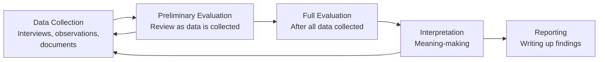
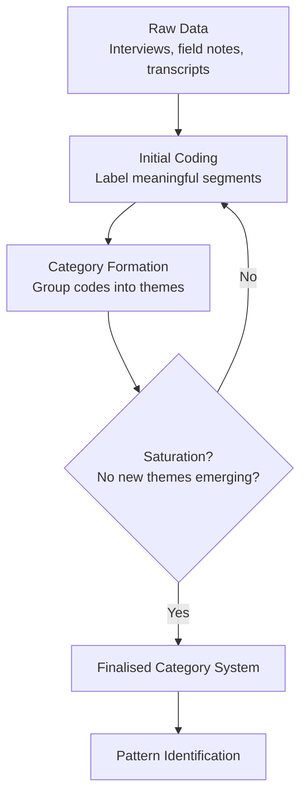

# Evaluating and Analysing Data in Qualitative Research

## Introduction

You have conducted 40 in-depth interviews with survivors of domestic violence in rural Rajasthan. You have pages of transcripts, field notes, and audio recordings. Now what? The collected data is not yet knowledge — it must be systematically **evaluated and analysed** before it can answer your research questions or contribute to understanding.

This challenge — turning raw, messy qualitative data into meaningful, credible findings — is one of the most demanding and creative aspects of qualitative research. Unlike quantitative analysis, where standard statistical procedures are applied, qualitative data analysis requires the researcher to be both rigorous and interpretive, both systematic and responsive to the unexpected.

This unit introduces the foundational concepts and steps in evaluating and analysing qualitative data, setting the stage for interpretation and reporting.

> 📄 **Source PDF**: [Block-4/Unit-4.pdf](/pdfs/MPC-005%20Research%20Methods/Block-4/Unit-4.pdf)  
> 📚 MPC-005 Research Methods — Block 4: Qualitative Research Methods

---

## What is Data Evaluation in Qualitative Research?

**Evaluation** in the context of qualitative research refers to the systematic attempt to understand:
- The **extent to which** collected information helps answer the research questions
- The **quality, relevance, and credibility** of the data gathered
- The **patterns, associations, and causal relationships** that may explain the phenomena under study

In other words, evaluation is the researcher's attempt to judge the value of their data — to understand what the data can and cannot tell them, and to organise it in a way that minimises bias and maximises insight.

Evaluation provides an **insight** into the problems, aims, and goals of the research. It bridges data collection and interpretation, transforming raw material into organised, meaningful content.

---

## When Does Evaluation Happen?

A common misconception is that data evaluation happens only *after* all data is collected. In qualitative research, evaluation is an **iterative and ongoing** process:

Miles and Huberman (1984), whose work is foundational in qualitative data analysis, emphasised that data collection and analysis are intertwined — analysis informs subsequent data collection, and new data shapes the analysis.

---

## Steps in Evaluating / Analysing Qualitative Data

The process follows five systematic steps. Each builds on the previous, moving from raw data to structured, interpretable findings.

### Step 1: Reading the Overall Collected Data

The first step is immersion — the researcher reads through **all** the collected data thoroughly:
- Interview transcripts
- Field notes from observations
- Video and audio recordings (and their transcriptions)
- Documents, diaries, artefacts

This step serves several purposes:
- Getting a **holistic picture** of what the data contains
- Developing a preliminary sense of patterns and themes
- Identifying gaps or areas where more data may be needed
- Beginning to form initial hypotheses

**Best practice**: Read the data at least twice — once for the broad picture, once paying attention to specific details. Note initial impressions in the margins or in a separate research journal.

### Step 2: Categorising the Collected Data

From the full dataset, the researcher **sorts relevant information** into categories or themes. This process (also called *coding* in many qualitative traditions) involves:
- Identifying segments of data that relate to the research questions
- Grouping similar segments together
- Creating categories that capture the essence of the grouped data

**Examples of categories in a study of student mental health:**
- *Concerns* (about academic pressure, relationships, finances)
- *Strengths* (support systems, coping strategies)
- *Weaknesses* (access to services, awareness of resources)
- *Suggestions* (from participants about what would help)
- *Experiences* (accounts of seeking or avoiding help)

### Step 3: Naming or Labelling the Categories

Once categories are formed, they need to be **labelled** clearly and consistently. Good labels:
- Are **descriptive** of the content they contain
- Are **mutually exclusive** (data fits into one category, not multiple)
- Are **exhaustive** (all relevant data can be placed somewhere)

**Example**: All participant suggestions about improving mental health services are grouped under the label *"Propositions for Service Improvement"* rather than just "suggestions" — the label should capture both content and nature.

In grounded theory, this process is called *open coding* → *axial coding* → *selective coding* (see Unit 2 of this block). In thematic analysis, it is called theme development.

### Step 4: Identification of Causal Relationships

With categories and labels in place, the researcher looks for **patterns, associations, and causal relationships** among categories:

- Do certain experiences cluster together? (e.g., students from rural areas more likely to report stigma)
- Does one factor seem to cause or influence another? (e.g., financial stress → academic disengagement → dropout)
- Are there unexpected patterns that challenge initial assumptions?

**Example from the PDF**: If most participants in a sample belong to the same geographic area, the researcher can hypothesise that location (and related factors — access to services, cultural norms) may be associated with the observed phenomenon. Or if participants share a similar economic stratum, salary level may be linked to motivation levels.

This is where **explanatory power** begins to emerge — the analysis moves from description (what is there?) to explanation (why might this be the case?).

### Step 5: Recording or Filing the Data

The final step in evaluation is systematic **documentation** of the analysis:
- Creating organised files for each category and its associated data segments
- Recording the analytical decisions made (audit trail)
- Keeping track of patterns and relationships discovered
- Preparing the data for the interpretation and reporting stages

This step ensures that the analysis is:
- **Traceable**: Other researchers can follow the analytical path
- **Verifiable**: Claims can be checked against the raw data
- **Useful**: Future researchers studying similar populations can build on the work

---

## The Relationship Between Evaluation and Interpretation

Evaluation and interpretation are related but distinct processes:

| Feature | Evaluation / Analysis | Interpretation |
|---|---|---|
| **Primary activity** | Organising, categorising, pattern-finding | Meaning-making, theorising |
| **Mode of thinking** | Systematic, descriptive | Conceptual, integrative |
| **Output** | Structured categories and patterns | Explanations, insights, viewpoints |
| **Relation to data** | Close, data-driven | Moves beyond data to implications |
| **Use of literature** | Minimal at this stage | Connects findings to existing knowledge |

As the IGNOU PDF notes: *"Interpretation requires more conceptual and integrative thinking than data analysis"* — evaluation prepares the ground; interpretation builds on it.

---

## Common Challenges in Qualitative Data Evaluation

Qualitative researchers face several recurring challenges during analysis:

1. **Volume of data**: Qualitative datasets can be enormous — managing hundreds of pages of transcripts requires careful organisation
2. **Researcher bias**: The categories we "see" in data are shaped by our prior knowledge and values — reflexivity is essential
3. **Multiple valid interpretations**: The same data can often be categorised in different ways — there is no single "correct" analysis
4. **Maintaining participant voice**: Analysis risks reducing rich accounts to abstract categories — good analysis preserves the texture of experience
5. **Premature closure**: Stopping analysis too soon, before patterns are fully developed — saturation is the goal

---

## Software Tools for Qualitative Data Analysis

While software cannot replace the interpretive work of the researcher, it can manage the mechanical processes of data organisation:

| Software | Key Features |
|---|---|
| **NVivo** | Coding, queries, matrices, visualisations; industry standard |
| **ATLAS.ti** | Flexible coding, network mapping, team collaboration |
| **MAXQDA** | Strong mixed-methods features; good for surveys + qualitative |
| **Dedoose** | Web-based; good for distributed teams |
| **f4analyse** | Simple, affordable; good for smaller projects |

**Important caveat**: Software can locate words, count occurrences, and organise data — but it **cannot judge, interpret, or generate insights**. The analytical intelligence always remains with the researcher.

---

## 🌐 External Resources

### Wikipedia
- [Qualitative Research — Wikipedia](https://en.wikipedia.org/wiki/Qualitative_research) — Overview of qualitative methods including data analysis approaches
- [Thematic Analysis — Wikipedia](https://en.wikipedia.org/wiki/Thematic_analysis) — One of the most widely used qualitative analysis frameworks

### Educational Videos
- 🎥 [**Introduction to Qualitative Data Analysis** — SAGE Methods (YouTube)](https://www.youtube.com/watch?v=X2cM9Lzm_b8) — Clear foundational overview
- 🎥 [**How to Analyse Qualitative Data** — Dr. Philip Adu (YouTube)](https://www.youtube.com/watch?v=3x55FKtFTKo) — Practical step-by-step walkthrough

### Research Papers (2020–2024)
- 📄 [Braun, V. & Clarke, V. (2021). "One size fits all? What counts as quality practice in (reflexive) thematic analysis?" *Qualitative Research in Psychology*, 18(3).](https://www.tandfonline.com/doi/full/10.1080/14780887.2020.1769238) — Authoritative update on thematic analysis methodology
- 📄 [Nowell, L. et al. (2017). "Thematic Analysis: Striving to Meet the Trustworthiness Criteria." *International Journal of Qualitative Methods*, 16(1).](https://journals.sagepub.com/doi/full/10.1177/1609406917733847)
- 📄 [Miles, M.B., Huberman, A.M., & Saldaña, J. (2014). *Qualitative Data Analysis: A Methods Sourcebook* (3rd ed.). Sage.](https://us.sagepub.com/en-us/nam/qualitative-data-analysis/book239534) — The classic reference, now in 3rd edition

### Additional Resources
- 📖 [NVivo — Qualitative Analysis Software](https://lumivero.com/products/nvivo/)
- 📖 [ATLAS.ti — Qualitative Research Software](https://atlasti.com/)
- 📖 [Saldaña, J. (2021). *The Coding Manual for Qualitative Researchers* (4th ed.). Sage.](https://us.sagepub.com/en-us/nam/the-coding-manual-for-qualitative-researchers/book273583)
- 📖 [ICMR — Indian Council of Medical Research: Qualitative Methods Guidelines](https://icmr.gov.in/ctri/index.html)

---

## 🧠 Memory Aid: RCLIR Steps

The five steps of qualitative data evaluation:

> **R** — **R**ead the overall data (immerse yourself)  
> **C** — **C**ategorise (sort into themes)  
> **L** — **L**abel the categories (name them precisely)  
> **I** — **I**dentify causal relationships (find patterns)  
> **R** — **R**ecord and file (document for future use)  

---

## ✅ Self-Assessment Questions

### Level 1 — Recall
1. What are the five steps of evaluating or analysing qualitative data according to the IGNOU framework?
2. What is the purpose of the "reading the overall data" step? Why can't a researcher skip directly to coding?

### Level 2 — Understanding
3. How does categorising data differ from labelling categories? Illustrate with an example from psychological research.
4. Why is it important to record and file data patterns (Step 5)? What risks arise if this documentation is skipped?

### Level 3 — Application & Analysis
5. A researcher has interviewed 25 school teachers in Mumbai about their experiences during the COVID-19 pandemic shift to online teaching. Describe how they would apply all five steps of qualitative data evaluation to this dataset. What categories might emerge?

---

## Summary

Evaluating and analysing qualitative data is a systematic, iterative process that transforms raw data into structured, interpretable findings. The five steps — reading, categorising, labelling, identifying relationships, and recording — provide a roadmap for making sense of complex qualitative material. Unlike quantitative analysis, this process requires ongoing researcher judgment and reflexivity, but the systematic framework ensures that findings are credible, traceable, and meaningful. Understanding this process is foundational to producing high-quality qualitative research reports.

---

*Next →* [Interpreting Qualitative Research Data](/mpc-005/block-4/interpreting-qualitative-data)
