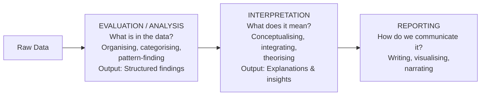
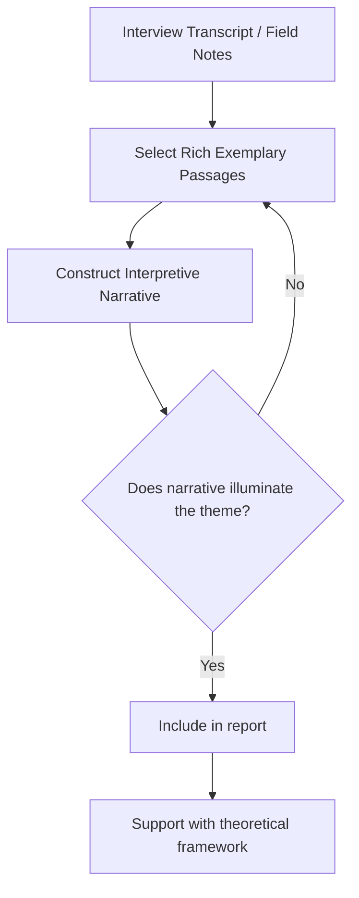
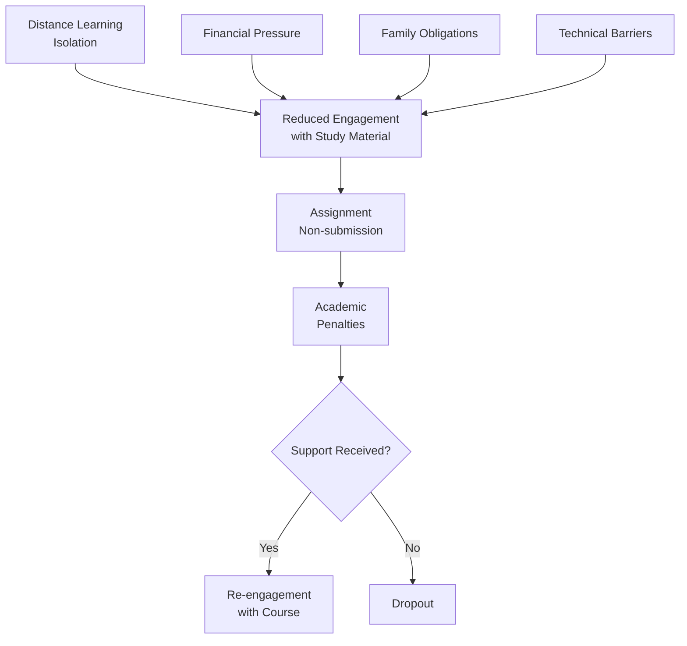

# Interpreting Qualitative Research Data: Strategies and Approaches

## Introduction

Analysis tells you *what is in* the data. Interpretation tells you *what it means*.

After categorising interview data about student stress into themes, a researcher might find that students in their first year report significantly higher anxiety. The analysis identifies this pattern — but **interpretation** asks the deeper questions: *Why first year specifically? What does the transition to university mean for these students? How does this connect to identity, autonomy, and social support?* These are interpretive questions, and answering them requires going beyond the data itself — into theory, context, comparison, and researcher insight.

Interpretation is the most intellectually demanding stage of qualitative research. It is where the researcher's knowledge, creativity, and reflexivity combine to produce genuine understanding.

> 📄 **Source PDF**: [Block-4/Unit-4.pdf](/pdfs/MPC-005%20Research%20Methods/Block-4/Unit-4.pdf)  
> 📚 MPC-005 Research Methods — Block 4: Qualitative Research Methods

---

## What Is Data Interpretation in Qualitative Research?

Interpretation refers to **summarising the findings of data analysis in a way that provides useful information related to the research goals**. The researcher attempts to put the information into the form of a viewpoint — a coherent account that makes sense of what was found.

Interpretation can take several forms:

- **Comparative**: Comparing findings with initial expectations, or with prior research
- **Contextual**: Relating findings to standardised products, services, or goals
- **Achievement-focused**: Explaining accomplishments and what they signify
- **Analytical**: Conducting a SWOT analysis (Strengths, Weaknesses, Opportunities, Threats) of the research
- **Theoretical**: Connecting findings to existing psychological theories or frameworks

A good interpretation:
1. Summarises findings in a way that helps both the studied group and future researchers
2. Can be **justified later** in the reporting stage
3. Is supported by **relevant literature review**
4. Goes beyond description to offer explanations and insights

---

## Evaluation vs. Interpretation: A Clear Distinction

The IGNOU PDF makes an important distinction that students often blur:

| Dimension | Evaluation | Interpretation |
|---|---|---|
| **Thinking mode** | Descriptive, systematic | Conceptual, integrative |
| **Question asked** | "What is there?" | "What does it mean?" |
| **Relation to data** | Stays close to data | Moves beyond data |
| **Use of theory** | Minimal | Central |
| **Output** | Categories and patterns | Explanations and viewpoints |

As the IGNOU material notes: *"Interpretation requires more conceptual and integrative thinking than data analysis."*

---

## Strategies for Data Interpretation

There are three primary strategies for interpreting qualitative data:

### Strategy 1: Making a Final List

The researcher summarises the labelled categories and coded themes into a **final list of findings** — a concise, structured enumeration of key conclusions that can be elaborated in subsequent reporting.

**Example**: After studying workplace stress among IT professionals in Bengaluru, a researcher compiles:
- *Finding 1*: Work-life boundary erosion is the primary stressor, reported by 87% of participants
- *Finding 2*: Team support buffers against burnout more than individual coping strategies
- *Finding 3*: Remote work intensifies isolation but reduces commute stress
- *Finding 4*: Middle managers report higher stress than senior or junior staff
- *Finding 5*: Cultural expectations about work dedication inhibit help-seeking

This final list becomes the backbone of the research report.

---

### Strategy 2: Elaborate Narratives

The researcher **gives voice and meaning** to the findings by constructing rich, detailed narrative accounts drawn from interviews, recordings, and discussions.

Narrative interpretation involves:
- Retelling participants' stories in ways that illuminate the research themes
- Using **direct quotes** as evidence for interpretive claims
- Building a coherent story arc that explains how and why the patterns emerged
- Situating individual accounts within broader social and cultural contexts

**Why narratives matter**: They preserve the **texture of lived experience** — the complexity, contradiction, and humanity that is easily lost in abstracted category lists. A narrative about a farmer's debt crisis in Maharashtra is more powerful and instructive than a category label "financial stress."

---

### Strategy 3: Use of Matrices

A **matrix** is a cross-table that compares different groups or data sets on important variables, presented in key words or brief descriptions. Matrices are particularly useful when:
- Comparing multiple cases or participants
- Showing how themes vary across subgroups (gender, age, location)
- Illustrating patterns that are difficult to describe verbally

**Example matrix from the PDF** (adapted):

| Age Group | No. of Boys Using Product | No. of Girls Using Product |
|---|---|---|
| Under 15 years | 45 | 48 |
| 16–20 years | 11 | 13 |

This matrix immediately reveals that younger adolescents are heavier users of the product, and that gender differences are small — information that would take many sentences to convey in prose.

**Psychological research example — Matrix comparing coping styles by gender and context:**

| Context | Male Participants | Female Participants |
|---|---|---|
| Academic stress | Problem-focused coping predominant | Both problem- and emotion-focused |
| Relationship conflict | Avoidance/withdrawal reported | Seeking social support |
| Financial stress | Self-reliance emphasised | Family consultation common |

---

### Strategy 4: Flow Charts

A **flow chart** uses boxes (containing variables) and arrows (indicating relationships) to visualise:
- Causal chains and processes
- Sequence of events
- Decision trees
- Relational networks between themes

Flow charts are especially useful for communicating complex multi-step processes or causal mechanisms that emerge from qualitative data.

**Example**: Visualising the pathway from academic stress to dropout in the IGNOU context:

---

## SWOT Analysis as an Interpretive Tool

The IGNOU PDF mentions SWOT analysis as one approach to interpretation. While originally a business strategy tool, SWOT can be adapted for qualitative research:

| SWOT Element | In Qualitative Research |
|---|---|
| **Strengths** | What worked well in the research design / context studied? |
| **Weaknesses** | Limitations of findings; gaps in data |
| **Opportunities** | Implications and directions for future research |
| **Threats** | Challenges to validity, transferability, or implementation of recommendations |

**Example — SWOT of a community mental health programme in rural India:**

- **Strengths**: Strong community acceptance; integration with ASHA workers; culturally congruent approach
- **Weaknesses**: Limited psychiatrist availability; reliance on verbal screening only
- **Opportunities**: Scale to other states; integration with Ayushman Bharat scheme
- **Threats**: Stigma in conservative communities; staff turnover; funding dependency

---

## Connecting Interpretation to Literature

Strong qualitative interpretation does not exist in isolation — it must be connected to the existing body of knowledge:

1. **Confirming literature**: Does the interpretation align with prior research? (strengthens credibility)
2. **Contradicting literature**: Does the interpretation challenge prior findings? (requires explanation)
3. **Extending literature**: Does the interpretation add something new? (the contribution)

In psychology research in India, this often involves connecting local findings to:
- Global theories (attachment theory, stress-coping models)
- Indian psychological frameworks (karma, dharma, family systems theory)
- Public health research (NIMHANS, ICMR studies)
- Sociological literature (caste, class, gender in Indian context)

---

## 🌐 External Resources

### Wikipedia
- [Hermeneutics — Wikipedia](https://en.wikipedia.org/wiki/Hermeneutics) — The philosophical tradition of interpretation that underpins qualitative research
- [Narrative Inquiry — Wikipedia](https://en.wikipedia.org/wiki/Narrative_inquiry) — Theory and method of narrative-based qualitative interpretation

### Educational Videos
- 🎥 [**Making Sense of Qualitative Data** — Research Methods Channel (YouTube)](https://www.youtube.com/watch?v=WKd2s4W7FHU) — Visual walkthrough of interpretation strategies
- 🎥 [**Using Matrices in Qualitative Research** — Miles & Huberman Method (YouTube)](https://www.youtube.com/watch?v=qO7ZsT7L4bk)

### Research Papers
- 📄 [Braun, V. & Clarke, V. (2006). "Using thematic analysis in psychology." *Qualitative Research in Psychology*, 3(2), 77–101.](https://www.tandfonline.com/doi/abs/10.1191/1478088706qp063oa) — The most cited article in qualitative psychology (90,000+ citations)
- 📄 [Sandelowski, M. (2000). "Whatever happened to qualitative description?" *Research in Nursing & Health*, 23(4), 334–340.](https://onlinelibrary.wiley.com/doi/10.1002/1098-240X(200008)23:4%3C334::AID-NUR9%3E3.0.CO;2-G)
- 📄 [Miles, M.B. & Huberman, A.M. (1984). *Qualitative Data Analysis: A Sourcebook of New Methods.* Sage.](https://us.sagepub.com/en-us/nam/qualitative-data-analysis/book239534) — Foundational text; matrices and flowcharts from this tradition

### Additional Resources
- 📖 [Creswell, J.W. (2013). *Qualitative Inquiry and Research Design.* (3rd ed.). Sage.](https://us.sagepub.com/en-us/nam/qualitative-inquiry-and-research-design/book235557)
- 📖 [Patton, M.Q. (2015). *Qualitative Research & Evaluation Methods.* (4th ed.). Sage.](https://us.sagepub.com/en-us/nam/qualitative-research-evaluation-methods/book232962)

---

## 🧠 Memory Aid: FNM Interpretation Strategies

Three strategies for interpreting qualitative data:

> **F** — **F**inal list (coded categories → structured summary)  
> **N** — **N**arrative (rich, detailed accounts preserving lived experience)  
> **M** — **M**atrices (cross-tables comparing groups/themes visually)  
> **+F** — **F**low charts (causal/process visualisations)  
> **+SWOT** — **S**trengths, **W**eaknesses, **O**pportunities, **T**hreats  

---

## ✅ Self-Assessment Questions

### Level 1 — Recall
1. What is meant by "interpretation" in qualitative research? How does it differ from data evaluation?
2. Name three strategies for interpreting qualitative data.

### Level 2 — Understanding
3. Why is narrative interpretation particularly valuable in psychological research? What would be lost if only matrices or final lists were used?
4. What does SWOT stand for in the context of qualitative research interpretation? Give one example of each element from a psychology research context.

### Level 3 — Application & Analysis
5. A researcher has conducted a qualitative study on the experiences of LGBTQ+ youth in Indian cities. After categorising their data, they find themes of: family rejection, peer support, identity negotiation, online community, and mental health challenges. Design an interpretive matrix comparing how these themes manifest differently for male-presenting and female-presenting participants. Then draft the opening sentence of a narrative interpretation about the "identity negotiation" theme.

---

## Summary

Interpretation is the bridge between structured findings and meaningful knowledge. It goes beyond description to ask what findings *mean* — for the participants, for theory, and for practice. The three primary strategies (final lists, elaborate narratives, and matrices/flowcharts) each offer distinct advantages, and skilled qualitative researchers combine them. Strong interpretation is always connected to existing literature, grounded in the data, and honestly reflexive about the researcher's role in meaning-making. In the Indian psychological research context, this means connecting local findings to both global frameworks and culturally specific knowledge systems.

---

*Previous ←* [Evaluating and Analysing Qualitative Data](/mpc-005/block-4/evaluating-analysing-qualitative-data)  
*Next →* [Preparing the Qualitative Research Report](/mpc-005/block-4/preparing-qualitative-research-report)
