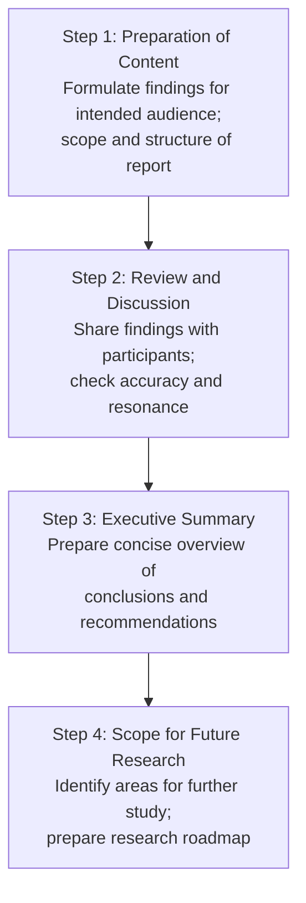
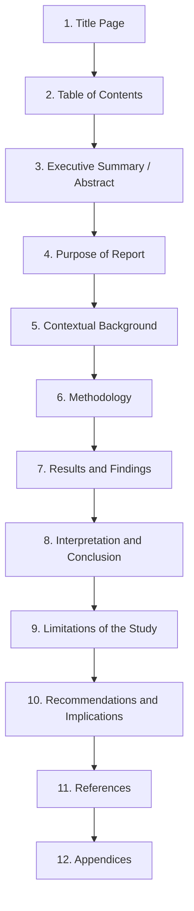

# Preparing the Qualitative Research Report: Structure and Contents

## Introduction

The research report is the **final product** of the research process — the communication through which a researcher shares their findings, interpretations, and recommendations with the world. It is, in many ways, the most important stage: no matter how excellent the data collection and analysis, if the report is poorly structured, unclear, or incomplete, the research fails to achieve its purpose.

Preparing a qualitative research report presents unique challenges. Unlike quantitative reports, which follow rigid statistical conventions, qualitative reports must convey **the richness, complexity, and contextual specificity** of human experience in a readable, credible, and structured way. The researcher must be simultaneously a scientist (rigorous, evidence-based) and a storyteller (engaging, clear, compelling).

> 📄 **Source PDF**: [Block-4/Unit-4.pdf](/pdfs/MPC-005%20Research%20Methods/Block-4/Unit-4.pdf)  
> 📚 MPC-005 Research Methods — Block 4: Qualitative Research Methods

---

## What Is a Research Report?

A **research report** is the ultimate discussion of the interpretations and findings of a study, backed by relevant literature and an explanation of the reasons behind the findings. It serves multiple purposes:

1. **Communication**: Shares findings with the intended audience (funders, policymakers, practitioners, other researchers)
2. **Documentation**: Creates a permanent record of the research for future reference
3. **Justification**: Demonstrates the validity, rigour, and significance of the findings
4. **Guidance**: Points toward future research directions and practical recommendations
5. **Accountability**: Shows how resources and time were used

The report contains **enough information to be understood and followed** by someone who was not involved in the research process.

---

## Steps in Preparing the Research Report

The IGNOU framework identifies four key steps:

### Step 1: Preparation of Content

Before writing begins, the researcher must **formulate the findings** according to the needs of the intended audience. Crucially, this means asking: *Who is this report for?*

Different audiences require different emphases:
- **Funders/sponsors**: Want to see return on investment, programme effectiveness
- **Policymakers**: Need actionable recommendations, scalable findings
- **Practitioners** (e.g., psychologists, social workers): Need practical implications, case examples
- **Academic community**: Requires theoretical contribution, methodological rigour
- **The studied community**: May want findings presented accessibly, in their own language

In India, many research reports must address multiple audiences simultaneously — the ICMR grant body, the NIMHANS clinical team, the NGO implementing a programme, and the communities being served all have different needs.

### Step 2: Review and Discussion

Once a draft is prepared, the researcher **reviews findings with participants** — the people on whom the research was conducted. This practice:
- Increases **member checking** (a key validity strategy in qualitative research)
- Ensures that participants' voices are accurately represented
- May reveal errors, oversimplifications, or cultural misunderstandings
- Is an ethical obligation in participatory and community-based research

This step is especially important in sensitive research areas (mental health, trauma, marginalised communities) where misrepresentation can cause harm.

### Step 3: Preparation of the Executive Summary

The executive summary is a **concise overview** (typically one page) of the entire research. It contains:
- Description of the organisation, people, event, or practice studied
- Statement of research goals
- Brief account of methods and analysis procedures
- Listing of key conclusions and recommendations
- Any relevant attachments (if applicable)
- Details of instruments used (questionnaires, interview guides) if relevant

The executive summary is often the only part that busy decision-makers read — so it must be **self-contained, clear, and impactful**.

### Step 4: Scope for Future Research

The report concludes with an articulation of **directions for future research** — areas that the current study raises but cannot fully answer, methodological improvements for replication, or new questions that emerged from the findings.

This section:
- Shows intellectual honesty (acknowledging the study's limits)
- Contributes to the cumulative development of knowledge
- Helps future researchers design better studies
- Can secure follow-on funding

---

## Contents of the Research Report

A comprehensive qualitative research report typically contains twelve sections:

### 1. Title Page
Contains:
- Full title of the research
- Name of the researcher(s)
- Name of the institution/organisation
- Date of submission

The title should be **specific and informative** — not just "A Study of Stress" but "Experiences of Academic Stress Among First-Year Distance Learning Students in India: A Qualitative Study."

### 2. Table of Contents
A structured list of all sections and sub-sections with page numbers, enabling readers to navigate directly to sections of interest.

### 3. Executive Summary
A one-page concise overview of findings and recommendations. (See Step 3 above for content.) This is written *last* but placed near the *front* of the report.

### 4. Purpose of the Report
Clearly states:
- The **aims and objectives** of the research
- The **type of research** (qualitative/quantitative/mixed methods)
- The **research questions** being addressed

### 5. Contextual Background of the Research Target
This section provides:
- **Historical background** of the people, event, practice, or programme under study
- The **problem** being investigated and why it matters
- The **overall goals** of the research
- The **expected outcomes** (what was hoped to be found)
- The **questions** this research answers
- **Relevant literature review** — what is already known, and how this study contributes

This section is crucial for contextualising findings within broader social, historical, and cultural realities — particularly important in Indian research contexts where local history shapes present experiences.

### 6. Methodology
The methodology section details exactly how the research was conducted, enabling replication and evaluation of rigour. It contains:

**Sample**
- Number of participants
- Sampling strategy (purposive, snowball, theoretical, etc.)
- Inclusion/exclusion criteria
- Demographic profile of participants

**Scales and Instruments Used**
- Details of interview guides, observation protocols, or questionnaires
- Rationale for instrument choice
- Any adaptations for cultural or linguistic context

**Type of Data Collected**
- Nature of data (interview transcripts, field notes, documents, audio/video recordings)
- Data collection procedures
- Duration and setting of data collection

### 7. Results and Findings
This section presents the **outcomes of the data analysis** — the categorised themes, patterns, and relationships identified. In qualitative reports, this typically includes:
- **Thematic presentation**: Each major theme with supporting evidence (quotes, examples)
- **Matrices and tables**: Cross-comparative displays of data
- **Flow charts and diagrams**: Visual representations of processes or relationships
- **Participant quotes**: Direct excerpts that illustrate themes (attributed to anonymised participants)

### 8. Interpretation and Conclusion
Going beyond the findings, this section:
- Explains *what the findings mean*
- Connects findings to existing literature and theory
- Draws **conclusions** about the significance of the research
- Explains how the conclusions are **justified** by the data
- Identifies whether findings confirm, challenge, or extend existing knowledge

### 9. Limitations of the Study
Honest acknowledgment of:
- **Sampling limitations** (who was included/excluded, sample size)
- **Methodological limitations** (what the chosen method could/couldn't capture)
- **Transferability** (under what conditions the findings generalise)
- **Researcher positionality** (how the researcher's identity may have shaped the study)
- **Contextual limitations** (time, place, social context that bound the findings)

### 10. Recommendations and Implications
Practical suggestions arising from the findings, directed at relevant stakeholders:
- Policy implications (what should change at the level of policy)
- Practice implications (what practitioners should do differently)
- Research implications (what future studies should investigate)

### 11. References
Comprehensive bibliography of all sources cited, following the appropriate citation style (APA is standard in psychology).

### 12. Appendices
Supporting documents that are too detailed for the main body:
- Questionnaires and interview guides
- Consent forms
- Raw data samples (with participant permission)
- Data in tabular format
- Case studies or testimonials
- Company/organisation forms used

---

## Qualitative vs. Quantitative Report Structure

While the sections are broadly similar, qualitative reports differ in key ways:

| Feature | Qualitative Report | Quantitative Report |
|---|---|---|
| **Results section** | Thematic, narrative, richly described | Tables, statistics, figures |
| **Length** | Often longer; detail is value-added | More standardised length |
| **Voice** | May include first-person reflexivity | Third-person, passive voice convention |
| **Quotes** | Central evidence | Rarely used |
| **Generalisability** | Discussed as transferability | Statistical generalisation |
| **Diagrams** | Thematic maps, process diagrams | Graphs, histograms, scatter plots |

---

## 🌐 External Resources

### Wikipedia
- [Research Report — Wikipedia](https://en.wikipedia.org/wiki/Academic_publishing) — Overview of academic reporting conventions
- [Executive Summary — Wikipedia](https://en.wikipedia.org/wiki/Executive_summary) — Purpose and structure of executive summaries

### Educational Videos
- 🎥 [**Writing a Qualitative Research Report** — ResearchGate Masterclass (YouTube)](https://www.youtube.com/watch?v=7ztFWFitoVY)
- 🎥 [**How to Structure a Research Report** — PhD & Academic Writing (YouTube)](https://www.youtube.com/watch?v=1QqCHpBt97U)

### Research Papers
- 📄 [Creswell, J.W. & Creswell, J.D. (2018). *Research Design: Qualitative, Quantitative and Mixed Methods Approaches* (5th ed.). Sage.](https://us.sagepub.com/en-us/nam/research-design/book255675) — Standard reference for research design and reporting
- 📄 [Tong, A., Sainsbury, P. & Craig, J. (2007). "Consolidated criteria for reporting qualitative research (COREQ)." *International Journal for Quality in Health Care*, 19(6).](https://academic.oup.com/intqhc/article/19/6/349/1791966) — The 32-item COREQ checklist for qualitative reporting quality
- 📄 [Lincoln, Y.S. & Guba, E.G. (1985). *Naturalistic Inquiry.* Sage.](https://us.sagepub.com/en-us/nam/naturalistic-inquiry/book842) — Classic text on qualitative trustworthiness and reporting

### Additional Resources
- 📖 [COREQ Checklist — 32 Criteria for Quality Qualitative Reporting](https://academic.oup.com/intqhc/article/19/6/349/1791966)
- 📖 [APA Publication Manual (7th ed.) — Reporting Standards for Qualitative Research](https://apastyle.apa.org/products/publication-manual-7th-edition)
- 📖 [EQUATOR Network — Reporting Guidelines for Health Research](https://www.equator-network.org/)
- 📖 [ICMR Indian Bioethics Guidelines — Research Reporting Standards](https://icmr.gov.in/ethics_guidelines.html)

---

## 🧠 Memory Aid: The 12-Section Report — TECPMRIMLAR

> **T** — **T**itle Page  
> **E** — **E**xecutive Summary  
> **C** — **C**ontents (Table of Contents)  
> **P** — **P**urpose  
> **C** — **C**ontextual Background  
> **M** — **M**ethodology  
> **R** — **R**esults and Findings  
> **I** — **I**nterpretation and Conclusion  
> **L** — **L**imitations  
> **R** — **R**ecommendations  
> **R** — **R**eferences  
> **A** — **A**ppendices  

Or simply remember: **"The Excellent Completed Paper Contains Most Relevant Insights, Limits, Recommendations, References Always"**

---

## ✅ Self-Assessment Questions

### Level 1 — Recall
1. What are the four steps involved in preparing a qualitative research report?
2. List six of the twelve sections in a comprehensive research report.

### Level 2 — Understanding
3. Why is the executive summary placed near the front of the report even though it is written last? Who is it primarily written for?
4. What does the "contextual background" section of a report contain? Why is this particularly important in Indian research contexts?

### Level 3 — Application & Analysis
5. A PhD student at NIMHANS has completed a qualitative study on the experiences of caregivers of patients with schizophrenia in Kerala. Help them plan their research report: (a) Identify the likely audience(s), (b) Suggest what the contextual background section should include, (c) Describe what the limitations section should address, and (d) List three practical recommendations that might emerge from such a study.

---

## Summary

The qualitative research report is the culmination of the entire research process — the medium through which findings, interpretations, and recommendations are communicated to the world. Effective reporting requires both structural rigour (the 12 sections) and communicative clarity (writing for specific audiences). The four preparatory steps — content preparation, review with participants, executive summary, and future research directions — ensure that the report is credible, responsive, and genuinely useful. Understanding report structure is both a practical necessity and an ethical responsibility: good reporting ensures that the experiences of research participants are faithfully and meaningfully communicated.

---

*Previous ←* [Interpreting Qualitative Data](/mpc-005/block-4/interpreting-qualitative-data)  
*Next →* [Do's and Don'ts in Qualitative Research](/mpc-005/block-4/dos-donts-qualitative-research-quality)
