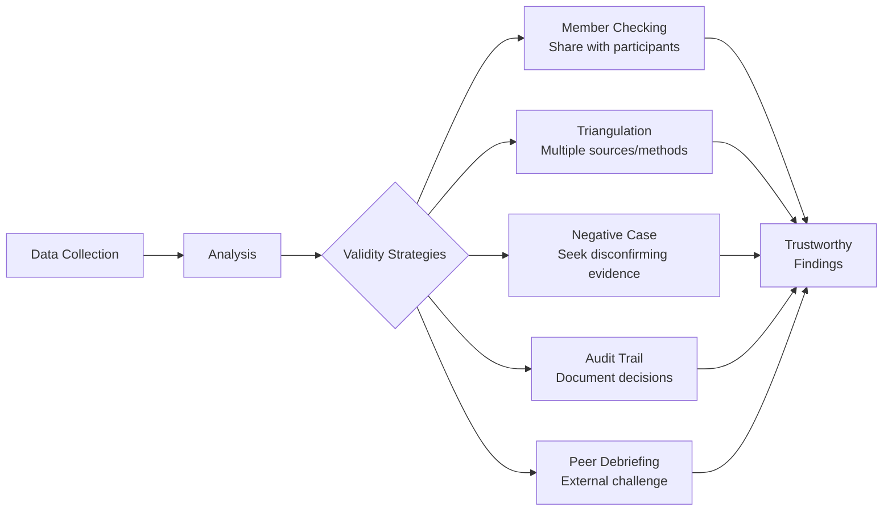
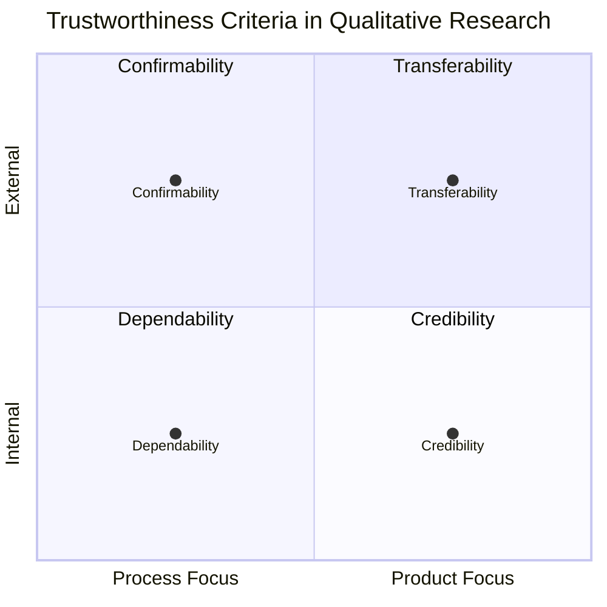
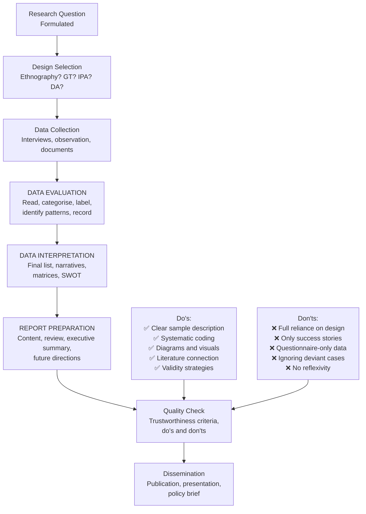

# Do's and Don'ts in Qualitative Research: Quality Standards and Trustworthiness

## Introduction

What separates excellent qualitative research from poor qualitative research? This question is more contested than in quantitative research, where statistical conventions provide clear benchmarks. In qualitative research, quality depends on a combination of **procedural rigour** (following systematic steps), **ethical integrity** (treating participants fairly), **intellectual honesty** (acknowledging limitations), and **communicative clarity** (writing that conveys findings faithfully).

This final unit of MPC-005 brings together the practical wisdom of qualitative researchers — the **do's** that characterise excellent research and the **don'ts** (pitfalls) that undermine it. It also introduces the foundational frameworks for evaluating qualitative research quality: Lincoln and Guba's **trustworthiness criteria** and the broader discussion of quality standards in the field.

> 📄 **Source PDF**: [Block-4/Unit-4.pdf](/pdfs/MPC-005%20Research%20Methods/Block-4/Unit-4.pdf)  
> 📚 MPC-005 Research Methods — Block 4: Qualitative Research Methods

---

## Do's in Qualitative Research

The following practices are **essential** for producing credible, rigorous qualitative research:

### ✅ DO: Be Clear, Specific, and Describe the Sample

The sample is the foundation of qualitative research. Readers must understand exactly who participated:
- **Demographics**: Age, gender, education, occupation, location
- **Selection rationale**: Why these participants? What was the sampling strategy?
- **Context**: Social and cultural context of participants
- **Access**: How were participants recruited?

Vague descriptions like "several participants were interviewed" are unacceptable. Specificity allows readers to assess **transferability** — whether findings might apply to similar groups in other contexts.

### ✅ DO: Code the Data Systematically

Systematic coding:
- Makes the analysis **transparent** and **auditable**
- Reduces the risk of cherry-picking evidence that confirms expectations
- Enables other researchers to evaluate the analytical process
- Facilitates team research and inter-rater reliability checks

Maintaining a **codebook** (a documented record of code definitions and examples) is best practice.

### ✅ DO: Frequently Use Diagrams, Flowcharts, and Matrices

Visual representations of data:
- Make complex patterns **accessible** to readers
- Allow comparison across multiple dimensions simultaneously
- Are particularly useful for summarising process data and relationships
- Complement narrative descriptions

Well-designed diagrams increase the impact of the report and demonstrate analytical sophistication.

### ✅ DO: Draw Conclusions Based on Current and Related Studies

Qualitative findings do not exist in isolation — they gain meaning and credibility through connection to:
- **Prior research** in the same area
- **Theoretical frameworks** that explain the findings
- **Contrasting studies** that challenge or contextualise the findings

Conclusions grounded in literature are more defensible and more useful to the field.

### ✅ DO: Develop Policies for Confirming and Validating Data

Proactive validity strategies should be planned from the start, not added as an afterthought:
- **Member checking**: Sharing interpretations with participants for verification
- **Triangulation**: Using multiple data sources, methods, or investigators
- **Negative case analysis**: Actively seeking data that challenges emerging interpretations
- **Audit trail**: Documenting all analytical decisions
- **Peer debriefing**: Discussing interpretations with a colleague who can challenge assumptions

---

## Don'ts in Qualitative Research

These are the **critical pitfalls** that undermine the quality and credibility of qualitative research:

### ❌ DON'T: Depend Fully on the Research Design

No research design is perfect. Every design involves trade-offs:
- **Interview designs** capture what people say, not necessarily what they do
- **Observational designs** may miss participants' inner experiences
- **Documentary analysis** may only capture official accounts

The researcher must acknowledge what the chosen design **cannot** answer, not just what it can. Overconfidence in a single design weakens credibility.

### ❌ DON'T: Interview Only About Successes

Focusing exclusively on positive outcomes creates a **skewed, overly optimistic picture**. Failures, negative experiences, and challenges are equally important:
- They reveal what doesn't work — crucial for programme evaluation
- They give voice to participants who had negative experiences
- They demonstrate intellectual honesty
- They often contain the most analytically interesting material

In programme evaluation research (common in Indian development and health contexts), focusing only on successes can lead policymakers to scale up ineffective programmes. The truth includes failures.

### ❌ DON'T: Depend Completely on Questionnaires

Questionnaires are useful but limited in qualitative research:
- They constrain responses to researcher-predetermined categories
- They miss **body language, tone, context, and spontaneous revelations**
- Much of what is most significant emerges in conversation, not written responses
- Observations reveal behaviour; questionnaires only capture self-reports about behaviour

The IGNOU material cautions: *"much of the information can only be available through observations and interviews."* Qualitative richness requires qualitative methods.

---

## Additional Critical Don'ts (Extended)

Beyond the three in the PDF, qualitative research literature identifies several other critical pitfalls:

| Don't | Why It Matters |
|---|---|
| Don't ignore researcher positionality | Undisclosed biases undermine credibility |
| Don't claim generalisability without justification | Qualitative findings transfer, not generalise |
| Don't quote selectively to support predetermined conclusions | Cherry-picking undermines trustworthiness |
| Don't neglect participant confidentiality | Ethical obligation, especially in sensitive research |
| Don't skip member checking | Misrepresenting participants is harmful |
| Don't conflate interpretation with description | Findings must be distinguished from analytical claims |
| Don't ignore deviant cases | Data that doesn't fit the pattern is analytically valuable |

---

## Frameworks for Evaluating Qualitative Research Quality

The IGNOU material notes that "quality assessment of qualitative research studies still remains a challenging area." Several frameworks have been proposed:

### Lincoln and Guba's Trustworthiness Framework (1985)

The most influential framework in qualitative research quality. It proposes four trustworthiness criteria as parallels to quantitative rigour:

| Qualitative Criterion | Quantitative Parallel | What It Means | How to Achieve It |
|---|---|---|---|
| **Credibility** | Internal validity | Are findings believable/accurate? | Member checking, triangulation, prolonged engagement |
| **Transferability** | External validity | Can findings apply elsewhere? | Thick description, purposive sampling |
| **Dependability** | Reliability | Is the process consistent? | Audit trail, detailed methodology |
| **Confirmability** | Objectivity | Are findings shaped by data, not researcher? | Reflexivity, audit trail |

Lincoln and Guba later added a fifth criterion: **Authenticity** — whether the research benefits participants and represents multiple perspectives fairly.

### Blaxter's Criteria (1996)

Mildred Blaxter proposed that quality in qualitative research includes:
- **Theoretical appropriateness**: Methods matched to research questions
- **Analytic adequacy**: Depth and completeness of analysis
- **Interpretive sensitivity**: Respect for participants' perspectives
- **Communicative adequacy**: Clarity and accessibility of reporting
- **Reflexive awareness**: Researcher awareness of their own influence

### COREQ (Consolidated Criteria for Reporting Qualitative Research, 2007)

A 32-item checklist developed for health research, covering:
- Research team and reflexivity
- Study design
- Analysis and findings

COREQ has been widely adopted in medical and psychological journals as a standard for reporting quality.

---

## Quality Assessment in Indian Research Contexts

Quality in qualitative research has specific implications in the Indian research context:

1. **Language and translation**: Studies conducted in regional languages must document translation processes carefully — interpretation can be lost or distorted in translation
2. **Power differentials**: Researchers from elite urban institutions studying rural or marginalised communities must be reflexive about power dynamics that shape the research relationship
3. **Community benefit**: Research on marginalised communities should include explicit attention to how findings will benefit those communities — aligned with ICMR ethical guidelines
4. **Cultural sensitivity**: Research on sensitive topics (caste discrimination, domestic violence, mental illness stigma) requires additional ethical care and validity strategies
5. **Institutional ethics**: ICMR and university ethics boards increasingly require detailed qualitative methodology and validation strategies in ethics applications

---

## Bringing It Together: The Complete Qualitative Research Process

This unit concludes MPC-005's Block 4 on Qualitative Research. The complete qualitative research process can now be summarised:

---

## 🌐 External Resources

### Wikipedia
- [Trustworthiness (Qualitative Research) — Wikipedia](https://en.wikipedia.org/wiki/Trustworthiness_(qualitative_research)) — Lincoln and Guba's framework explained
- [Research Ethics — Wikipedia](https://en.wikipedia.org/wiki/Research_ethics) — Overview of ethical principles in research

### Educational Videos
- 🎥 [**Rigor and Quality in Qualitative Research** — SAGE Research Methods (YouTube)](https://www.youtube.com/watch?v=HI8n6ZgY5A4) — Expert discussion of quality criteria
- 🎥 [**Lincoln & Guba's Trustworthiness** — PhD Qualitative Methods (YouTube)](https://www.youtube.com/watch?v=Kp50Y8z56VE) — Clear explanation of the four criteria

### Research Papers (2020–2024)
- 📄 [Cypress, B.S. (2017). "Rigor or Reliability and Validity in Qualitative Research." *Dimensions of Critical Care Nursing*, 36(4).](https://journals.lww.com/dccnjournal/Abstract/2017/07000/Rigor_or_Reliability_and_Validity_in_Qualitative.2.aspx)
- 📄 [Morse, J.M. et al. (2002). "Verification Strategies for Establishing Reliability and Validity in Qualitative Research." *International Journal of Qualitative Methods*, 1(2).](https://journals.sagepub.com/doi/10.1177/160940690200100202)
- 📄 [Tracy, S.J. (2010). "Qualitative Quality: Eight 'Big-Tent' Criteria for Excellent Qualitative Research." *Qualitative Inquiry*, 16(10).](https://journals.sagepub.com/doi/10.1177/1077800410383121) — Widely cited contemporary framework for qualitative quality

### Additional Resources
- 📖 [Lincoln, Y.S. & Guba, E.G. (1985). *Naturalistic Inquiry.* Sage.](https://us.sagepub.com/en-us/nam/naturalistic-inquiry/book842) — Foundational trustworthiness framework
- 📖 [Patton, M.Q. (2015). *Qualitative Research & Evaluation Methods* (4th ed.). Sage.](https://us.sagepub.com/en-us/nam/qualitative-research-evaluation-methods/book232962) — Comprehensive coverage of quality in qualitative evaluation
- 📖 [ICMR Ethical Guidelines for Biomedical and Health Research](https://main.icmr.nic.in/sites/default/files/guidelines/ICMR_Ethical_Guidelines_2017.pdf)
- 📖 [COREQ 32-Item Checklist](https://academic.oup.com/intqhc/article/19/6/349/1791966)

---

## 🧠 Memory Aid: Quality = CDCT + SMART Don'ts

**Trustworthiness = CDCT:**
> **C** — **C**redibility (member checking, triangulation)  
> **D** — **D**ependability (audit trail)  
> **C** — **C**onfirmability (reflexivity)  
> **T** — **T**ransferability (thick description)  

**Do's — CODED:**
> **C** — **C**lear sample description  
> **O** — **O**rganised coding  
> **D** — **D**iagrams frequently used  
> **E** — **E**vidence from literature  
> **D** — **D**evelop validation policies  

**Don'ts — SAD:**
> **S** — **S**uccesses only (don't interview only about successes)  
> **A** — **A**bsolute reliance on one design  
> **D** — **D**epend entirely on questionnaires  

---

## ✅ Self-Assessment Questions

### Level 1 — Recall
1. List three do's and three don'ts from the IGNOU framework for qualitative research.
2. What are Lincoln and Guba's four trustworthiness criteria? What quantitative concept does each parallel?

### Level 2 — Understanding
3. Why is it a problem to "interview only about successes"? What is lost if failures and negative experiences are excluded from qualitative research?
4. Explain the difference between *credibility* and *transferability* in qualitative research. How is each established?

### Level 3 — Application & Analysis
5. A researcher has conducted a qualitative study on the experiences of women who have left abusive marriages in Delhi. Evaluate the following aspects of their research from a quality standpoint: (a) They interviewed 15 women — 14 from upper-middle-class backgrounds. (b) They coded data but kept no codebook. (c) They reported only positive stories of recovery and empowerment. (d) They did not do member checking because the topic was too sensitive. For each, identify the quality concern and suggest how it could be addressed.

---

## Summary

Quality in qualitative research is achieved through conscious adherence to best practices (the do's) and vigilant avoidance of common pitfalls (the don'ts). The IGNOU framework emphasises clear sample description, systematic coding, visual data displays, literature-grounded conclusions, and proactive validity strategies — while warning against over-reliance on research designs, selective reporting of successes, and dependence on questionnaires. Lincoln and Guba's trustworthiness framework — credibility, transferability, dependability, confirmability — provides the foundational vocabulary for assessing qualitative research quality. This final unit completes MPC-005's journey through research methods, leaving students equipped with the tools to conduct, evaluate, and report rigorous, ethical, and socially valuable qualitative research.

---

*Previous ←* [Preparing the Research Report](/mpc-005/block-4/preparing-qualitative-research-report)  
*Completing MPC-005: Research Methods ✅*  
*Next Course →* [MPC-006: Statistics in Psychology](/mpc-006-statistics/)
