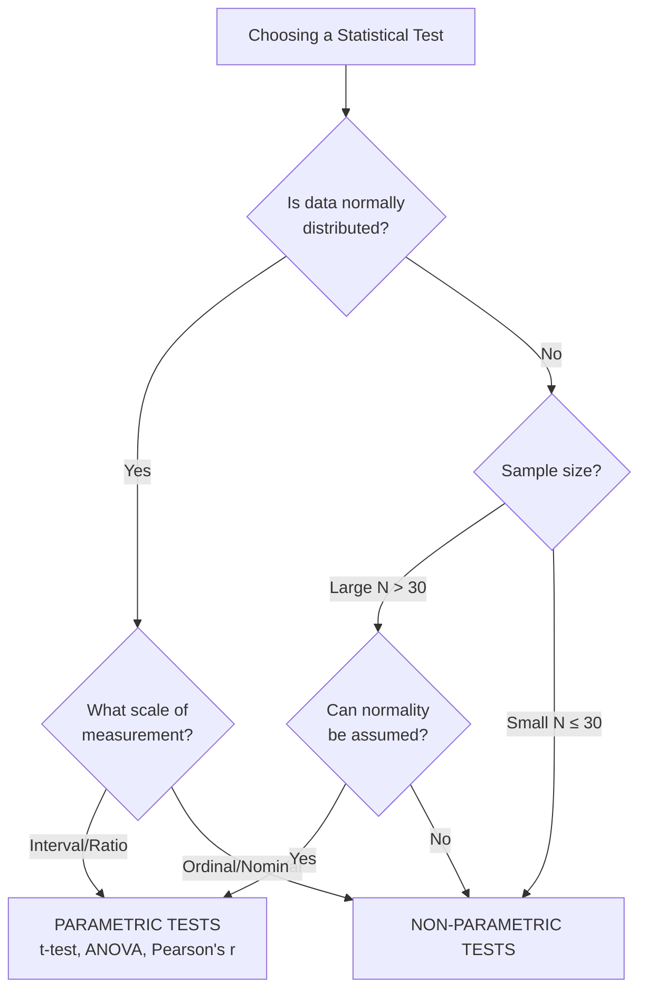
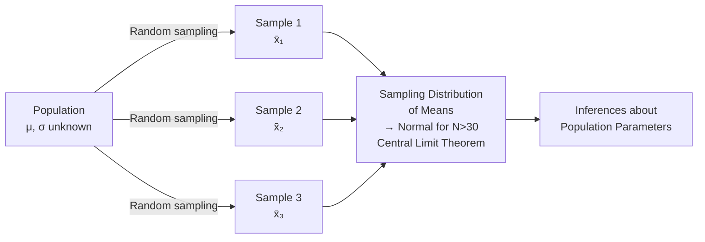

# Parametric and Non-Parametric Statistics: Foundations and Definitions

## Introduction

A researcher wants to compare the anxiety levels of students from two different schools. She has scores from 120 students in School A and 115 in School B. Should she use a t-test or a Mann-Whitney U test? The answer depends on a fundamental choice in statistical analysis: **parametric or non-parametric methods?**

This choice is not merely technical — it reflects deep assumptions about the nature of data, the shape of distributions, and the kind of inferences a researcher can legitimately make. Understanding the distinction between parametric and non-parametric statistics is one of the most important conceptual foundations for any researcher in psychology or social sciences.

> 📄 **Source PDF**: [Block-1/Unit-1.pdf](/pdfs/MPC-006%20Statistics%20in%20Psychology/Block-1/Unit-1.pdf)  
> 📚 MPC-006 Statistics in Psychology — Block 1: Introduction to Statistics

---

## What Is Statistics?

Statistics is an independent scientific discipline concerned with the collection, organisation, analysis, interpretation, and presentation of data. In psychology, statistics serves two essential functions:

1. **Descriptive statistics**: Summarising and describing the properties of a sample (means, standard deviations, correlations)
2. **Inferential statistics**: Drawing conclusions about a population based on observations from a sample

A key distinction is between:
- **Statistics**: Measurements associated with a **sample** (e.g., sample mean x̄)
- **Parameters**: Measurements associated with the **population** (e.g., population mean μ)

Inferential statistics uses sample statistics to estimate population parameters — and this is precisely where the parametric/non-parametric distinction matters most.

---

## Defining Parametric Statistics

**Parametric statistics** are statistical methods that operate under specific conditions about the data and the underlying population distribution. The term *parametric* indicates that inferences are made *about population parameters* (mean, variance) under defined assumptions.

Key characteristics:
- Data are expressed in **absolute numbers or values** (not ranks)
- Tests assume the population is **normally distributed**
- Data must be measured on at least an **interval or ratio scale**
- Examples: **t-test, z-test, F-test, Pearson's r**

The meaningfulness of parametric test results depends entirely on the validity of their underlying assumptions. If assumptions are violated, conclusions may be invalid.

---

## Defining Non-Parametric Statistics

**Non-parametric statistics** (also called **distribution-free tests**) are methods that do **not** require assumptions about the specific form of the population distribution. Data are typically ranked or grouped rather than measured as absolute values.

Key characteristics:
- **No assumption of normality** — do not require normally distributed population
- Data can be measured on **nominal or ordinal scales** (ranked or categorical)
- Suitable for **small samples** (N ≤ 30)
- Examples: **Chi-square test, Mann-Whitney U, Spearman's rank correlation, Sign test, Wilcoxon test**

Three broad senses of "non-parametric":

1. **Distribution-free methods**: No assumption that data come from a normally distributed population
2. **Rank-based methods**: Statistics based on ranks of observations rather than their absolute values
3. **Model-free methods**: No fixed structure assumed for the model — includes non-parametric regression and hierarchical Bayesian models

---

## Core Comparison: Parametric vs Non-Parametric

| Feature | Parametric | Non-Parametric |
|---|---|---|
| **Data type** | Interval / Ratio scale | Nominal / Ordinal scale |
| **Distribution assumption** | Normal distribution required | No distribution assumption |
| **Sample size** | Typically large (N > 30) | Can be used with small N |
| **Statistical power** | Higher | Lower (less efficient) |
| **Ease of use** | More complex | Simpler to apply |
| **Examples** | t-test, ANOVA, Pearson's r | Chi-square, Mann-Whitney U |
| **Data form** | Absolute values | Ranks, categories, signs |

---

## Understanding Population and Sampling

The logic of both parametric and non-parametric inference rests on the relationship between **sample** and **population**:

- **Population**: The entire group of people/objects a researcher wants to understand regarding a phenomenon. In practice, studying the entire population is usually impossible.
- **Sample**: A subset drawn from the population, intended to represent it.
- **Sampling error**: The natural variability between sample statistics and the true population parameter.

The **Central Limit Theorem** is foundational here: if a large number of equal-sized samples (N > 30) are drawn at random from a population, their means will be normally distributed regardless of the shape of the original population distribution. This is why parametric tests become more robust with larger samples.

---

## When to Use Non-Parametric Statistics

Non-parametric tests are recommended when:

1. **Sample size is very small** — even N = 5 or N = 6 may require non-parametric methods
2. **Normality is doubtful** — population distribution is not known to be normal
3. **Data are ordinal** — scores express ranks or order but not equal intervals
4. **Data are nominal/categorical** — categories like "good/bad", "pass/fail", "male/female"
5. **Data are expressed as signs** — only direction of difference known (+/-)
6. **Mixed populations** — samples drawn from several different populations

**Indian research context**: Much psychological research in India uses ordinal rating scales (5-point Likert scales on attitude surveys, ranking of cultural values, preference scales) where the assumption of equal intervals is questionable. Non-parametric methods are therefore frequently appropriate.

---

## The Power-Efficiency Trade-off

Non-parametric tests are **less powerful** than their parametric equivalents when parametric assumptions are met. This is expressed through **power-efficiency**:

- If a non-parametric test has **90% power-efficiency**, this means the parametric test achieves the same result with a sample 10% smaller
- If assumptions are met, using a non-parametric test when a parametric one would work is **statistically wasteful**
- However, if assumptions are violated, the parametric test's apparent power is illusory — its results may be misleading

The wise researcher chooses based on the data's actual properties, not on a blanket preference for either approach.

---

## 🌐 External Resources

### Wikipedia
- [Parametric Statistics — Wikipedia](https://en.wikipedia.org/wiki/Parametric_statistics) — Overview with links to specific parametric tests
- [Non-Parametric Statistics — Wikipedia](https://en.wikipedia.org/wiki/Nonparametric_statistics) — Comprehensive coverage of distribution-free methods

### Educational Videos
- 🎥 [**Parametric vs Non-Parametric Tests** — Statistics Made Easy (YouTube)](https://www.youtube.com/watch?v=biXY84hDX5M) — Clear side-by-side comparison
- 🎥 [**When to Use Non-Parametric Tests** — StatQuest with Josh Starmer (YouTube)](https://www.youtube.com/watch?v=vGiqFxS_8aA) — Intuitive explanation with visuals

### Research Papers
- 📄 [Norman, G.R. & Streiner, D.L. (2008). *Biostatistics: The Bare Essentials* (3rd ed.). B.C. Decker.](https://www.amazon.com/Biostatistics-Bare-Essentials-Geoffrey-Norman/dp/1607950286)
- 📄 [Siegel, S. & Castellan, N.J. (1988). *Non-Parametric Statistics for the Behavioural Sciences* (2nd ed.). McGraw-Hill.](https://www.amazon.com/Nonparametric-Statistics-Behavioral-Sciences-Sidney/dp/0070573573) — The classic reference text cited by IGNOU
- 📄 [Fagerland, M.W. (2012). "t-tests, non-parametric tests, and large studies — a paradox of statistical practice." *BMC Medical Research Methodology*, 12(78).](https://bmcmedresmethodol.biomedcentral.com/articles/10.1186/1471-2288-12-78)

### Additional Resources
- 📖 [Guilford, J.P. (1965). *Fundamental Statistics in Psychology and Education.* McGraw-Hill.](https://archive.org/details/fundamentalstati00guil) — Classic IGNOU-recommended text
- 📖 [SPSS Statistics — IBM](https://www.ibm.com/spss) — Standard software for both parametric and non-parametric analysis in psychology
- 📖 [R Project for Statistical Computing](https://www.r-project.org/) — Free, powerful statistics software
- 📖 [Khan Academy: Statistics and Probability](https://www.khanacademy.org/math/statistics-probability)

---

## 🧠 Memory Aid: POND

> **P** — **P**arametric = **P**owerful but needs **P**rerequisites  
> **O** — **O**rdinal or nominal data → non-parametric  
> **N** — **N**ormal distribution assumed by parametric  
> **D** — **D**istribution-free = non-parametric's other name  

And for choosing:
> **SNOD** conditions → use Non-Parametric:  
> **S** — **S**mall sample  
> **N** — **N**ot normally distributed  
> **O** — **O**rdinal or nominal data  
> **D** — **D**ifferent/mixed populations  

---

## ✅ Self-Assessment Questions

### Level 1 — Recall
1. What is the primary meaning of the term "distribution-free tests"?
2. Give two examples each of parametric and non-parametric statistical tests.

### Level 2 — Understanding
3. A researcher has data from 8 participants on a 5-point "well-being" scale. Should she use a t-test or a Mann-Whitney U test? Justify your answer with reference to the conditions for each type of test.
4. Explain the Central Limit Theorem. Why is it important for understanding when parametric tests can be used?

### Level 3 — Application & Analysis
5. A clinical psychologist in India wants to compare depression scores (measured on the BDI-II, a continuous interval scale) between urban (N=45) and rural (N=42) participants. Another researcher wants to compare satisfaction rankings (1st to 10th preference) for different therapy modalities among 12 therapists. Which statistical approach (parametric/non-parametric) should each researcher use, and why?

---

## Summary

Parametric statistics assume normal distribution, interval/ratio data, and larger samples — and offer higher statistical power when assumptions are met. Non-parametric statistics make fewer assumptions, work with ordinal and nominal data, suit small samples, and are simpler to apply — at the cost of some efficiency. The choice between them is not a matter of preference but of logical alignment with the properties of the data and the research situation. Understanding this fundamental distinction is the foundation of sound statistical reasoning in psychology.

---

*Next →* [Assumptions and Scales of Measurement](/mpc-006-statistics/block-1/assumptions-scales-measurement)
