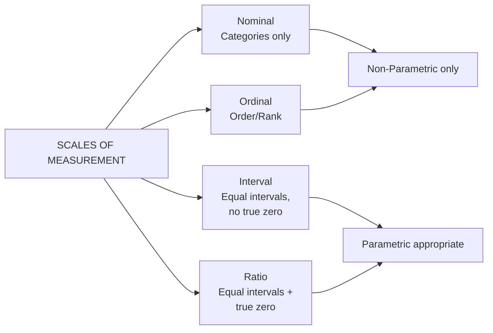
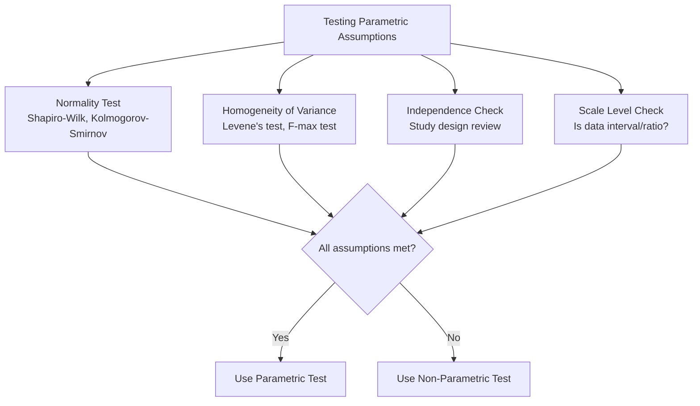
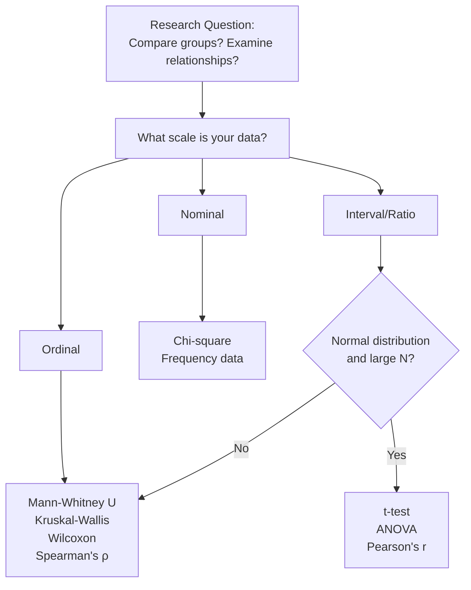

# Assumptions of Parametric and Non-Parametric Statistics & Scales of Measurement

## Introduction

Every statistical test rests on a set of **assumptions** — conditions that must be satisfied for the test results to be valid and interpretable. Choosing the wrong test, or using a test when its assumptions are violated, can lead to incorrect conclusions — even with perfectly collected data.

Two interrelated decisions guide statistical choice: (1) Do your data meet the assumptions of parametric tests? And (2) What scale of measurement were your variables measured on? These questions are inseparable: the scale of measurement often directly determines which assumptions can be met.

> 📄 **Source PDF**: [Block-1/Unit-1.pdf](/pdfs/MPC-006%20Statistics%20in%20Psychology/Block-1/Unit-1.pdf)  
> 📚 MPC-006 Statistics in Psychology — Block 1: Introduction to Statistics

---

## The Four Scales of Measurement

S.S. Stevens (1946) proposed the foundational classification of measurement scales — a framework so influential it remains standard in psychology and statistics textbooks worldwide.

### 1. Nominal Scale

The **nominal scale** is the most basic level of measurement. It assigns numbers or labels to categories purely for identification — not for any mathematical purpose.

- **Nature**: Classifies into mutually exclusive, exhaustive categories
- **Operations**: Can only determine equality or inequality
- **Example**: Gender (male/female), blood type (A/B/AB/O), religion, caste
- **Labelling**: Categories may be labelled 0/1, m/f, 1/2/3 — but these numbers have no mathematical meaning
- **Statistical use**: Only frequency counts and percentages; modal category
- **Non-parametric test appropriate**: Chi-square test

**Why it's called "nominal"**: From Latin *nomen* (name) — it's a naming scale.

### 2. Ordinal Scale

The **ordinal scale** ranks data in a meaningful order, but the **intervals between ranks are not equal**.

- **Nature**: Implies rank order but not the magnitude of differences
- **Operations**: Can determine greater than/less than relationships
- **Example**: Satisfaction scale (1=very dissatisfied to 5=very satisfied); academic rank (1st, 2nd, 3rd); pain severity (mild, moderate, severe)
- **Key limitation**: The difference between rank 1 and rank 2 may not equal the difference between rank 4 and rank 5
- **Statistical use**: Median, percentiles, rank correlations
- **Non-parametric tests appropriate**: Mann-Whitney U, Wilcoxon, Spearman's ρ

### 3. Interval Scale

The **interval scale** has equal intervals between values — the distance between any two consecutive values is the same — but has **no true zero point**.

- **Nature**: Equal intervals, but zero does not mean absence of the property
- **Operations**: Addition and subtraction meaningful; ratios are not
- **Example**: Temperature in Celsius or Fahrenheit (0°C does not mean no temperature); calendar years; IQ scores (an IQ of 0 doesn't mean zero intelligence)
- **Properties**: Two of three key requirements — magnitude and equal intervals — but lacks the real/absolute zero
- **Statistical use**: Mean, standard deviation, correlation
- **Parametric tests appropriate**: t-test, ANOVA, Pearson's r

### 4. Ratio Scale

The **ratio scale** has all the properties of the interval scale plus a **true (absolute) zero**, meaning zero represents complete absence of the quantity.

- **Nature**: Equal intervals + true zero; ratios between values are meaningful
- **Operations**: All arithmetic operations are valid
- **Example**: Height, weight, age, length, reaction time, income, number of correct answers
- **Key property**: A person who is 180cm is genuinely *twice as tall* as a 90cm person
- **Statistical use**: All parametric statistics
- **Parametric tests appropriate**: t-test, ANOVA, regression, Pearson's r

### Comparison Summary

| Scale | Order | Equal Intervals | True Zero | Example | Test Type |
|---|---|---|---|---|---|
| Nominal | ❌ | ❌ | ❌ | Gender, Religion | Non-parametric |
| Ordinal | ✅ | ❌ | ❌ | Likert scale, Rank | Non-parametric |
| Interval | ✅ | ✅ | ❌ | Temperature (°C), IQ | Parametric |
| Ratio | ✅ | ✅ | ✅ | Height, Reaction time | Parametric |

---

## Assumptions of Parametric Statistics

Parametric tests (t-test, F-test, Pearson's r) operate under specific assumptions. Violating these can invalidate results.

### Assumption 1: Normal Distribution

The population from which the sample is drawn should be **normally distributed** — the classic bell-shaped frequency distribution that is:
- Symmetrical about the mean
- Unimodal (one peak)
- Infinite at both ends (theoretical)
- Mean = Median = Mode

However, parametric tests (especially t and F) are considered **robust** — they remain valid even when the normality assumption is mildly violated, particularly with larger samples.

### Assumption 2: Interval or Ratio Scale

Variables must be measured on at least an **interval scale**. This ensures that arithmetic operations (computing means, standard deviations) are mathematically meaningful.

### Assumption 3: Independence of Observations

The inclusion or exclusion of any case should not unduly affect the results. Each observation must be independent of all others. Violations occur when:
- The same participants provide multiple responses that are treated as independent
- Participants influence each other (e.g., in group settings)
- Time-series data are treated as independent

### Assumption 4: Homoscedasticity (Equality of Variances)

The populations from which samples are drawn must have **the same variance** (or a known ratio of variances). This is also called **homogeneity of variances** and is particularly important with small samples.

The **F-max test** is used to check this:

> F-max = Largest Variance ÷ Smallest Variance

If the computed F-max does not meet or exceed the critical value at p = .05, variances are considered homogeneous.

---

## Assumptions of Non-Parametric Statistics

Non-parametric tests make **fewer and weaker** assumptions:

### Situation 1: Small Sample Size
When N is as small as 5 or 6, parametric tests cannot be applied because the normal distribution of sample means (central limit theorem) does not hold. Non-parametric tests provide the **only valid alternative**.

### Situation 2: Non-Normal Distribution
When the population distribution is unknown or known to be non-normal, parametric tests are inappropriate regardless of sample size.

### Situation 3: Ordinal or Nominal Data
When measurements are expressed as:
- Rankings or ordinal categories
- Plus/minus signs (direction of difference only)
- Classifications like "good-bad", "improved-not improved"

### Situation 4: Unknown Population Distribution
When the nature of the population from which samples are drawn is simply not known.

### Situation 5: Nominal Form of Variables
When variables are expressed purely as categories (e.g., religion, caste, type of therapy).

---

## Variables: Types and Definitions

Understanding variables is inseparable from understanding scales and assumptions:

| Variable Type | Definition | Example |
|---|---|---|
| **Independent Variable (IV)** | The variable considered to be a cause; manipulated by the researcher | Teaching method (lecture vs. activity-based) |
| **Dependent Variable (DV)** | The variable considered to be an effect; what is measured | Test score, anxiety level |
| **Characteristic** | Any variable that can take different values across cases | Age, IQ, gender |

**Homoscedasticity** — a key parametric assumption — requires that the DV's variance is similar across levels of the IV. If anxiety scores have much greater variance in the control group than the experimental group, homoscedasticity is violated.

---

## Practical Guidance: Selecting the Right Test

**Real-world complication**: Likert scales (1–5, 1–7) used extensively in psychology are technically **ordinal** — but many researchers treat them as interval. This is a longstanding controversy. In India, where attitude and satisfaction scales are commonly used in health and educational research, this decision has practical consequences for statistical analysis.

---

## 🌐 External Resources

### Wikipedia
- [Level of Measurement — Wikipedia](https://en.wikipedia.org/wiki/Level_of_measurement) — Stevens's four scales explained with examples
- [Statistical Assumption — Wikipedia](https://en.wikipedia.org/wiki/Statistical_assumption) — What assumptions are and why they matter

### Educational Videos
- 🎥 [**Levels of Measurement: Nominal, Ordinal, Interval, Ratio** — Dr. Todd Grande (YouTube)](https://www.youtube.com/watch?v=LPHYPXBK_ks)
- 🎥 [**Understanding Statistical Assumptions** — StatQuest (YouTube)](https://www.youtube.com/watch?v=5ABpqVSx33I)

### Research Papers
- 📄 [Stevens, S.S. (1946). "On the Theory of Scales of Measurement." *Science*, 103(2684), 677–680.](https://science.sciencemag.org/content/103/2684/677) — The original paper proposing the four scales — one of the most cited papers in measurement theory
- 📄 [Field, A. (2018). *Discovering Statistics Using IBM SPSS Statistics* (5th ed.). Sage.](https://uk.sagepub.com/en-gb/eur/discovering-statistics-using-ibm-spss-statistics/book257672) — Standard comprehensive statistics reference
- 📄 [Norman, G. (2010). "Likert scales, levels of measurement and the 'laws' of statistics." *Advances in Health Sciences Education*, 15(5).](https://link.springer.com/article/10.1007/s10459-010-9222-y) — Influential debate on treating Likert scales as interval

### Additional Resources
- 📖 [SPSS Statistics Tutorials — IBM](https://www.ibm.com/docs/en/spss-statistics)
- 📖 [GraphPad Statistics Guide — Free Online](https://www.graphpad.com/guides/statistics)
- 📖 [APA Style Statistics Reporting Guide](https://apastyle.apa.org/instructional-aids/numbers-statistics-guide.pdf)
- 📖 [NCERT Statistics Resources — Indian context](https://ncert.nic.in/)

---

## 🧠 Memory Aid: NOIR Scales

> **N** — **N**ominal: Names/Categories only (gender, religion)  
> **O** — **O**rdinal: Order matters (1st, 2nd, 3rd) but intervals don't  
> **I** — **I**nterval: Equal intervals, no true zero (temperature °C, IQ)  
> **R** — **R**atio: Real zero + all operations valid (height, weight, age)  

**Parametric assumptions — HINDI:**
> **H** — **H**omoscedasticity (equal variances)  
> **I** — **I**ndependence of observations  
> **N** — **N**ormal distribution  
> **D** — **D**ata on interval/ratio scale  
> **I** — **I**nferential goal: estimating population parameters  

---

## ✅ Self-Assessment Questions

### Level 1 — Recall
1. Name the four scales of measurement in order from lowest to highest level.
2. What is homoscedasticity and why is it important for parametric tests?

### Level 2 — Understanding
3. A researcher measures "years of education" (0–25 years). What scale of measurement is this? Is it appropriate for parametric tests? Explain.
4. Why does an interval scale lack a true zero? Give two examples to illustrate this limitation.

### Level 3 — Application & Analysis
5. A study in India measures participants on the following variables: (a) Caste category (SC/ST/OBC/General), (b) Self-reported stress level on a 1–10 scale, (c) Systolic blood pressure in mmHg, (d) Rank in school class (1st to 40th). For each variable, identify the scale of measurement and state whether parametric or non-parametric analysis is appropriate, with justification.

---

## Summary

The four scales of measurement — nominal, ordinal, interval, and ratio — directly determine which statistical analyses are appropriate. Parametric tests require at least interval-scale data, normally distributed populations, independent observations, and homogeneous variances. Non-parametric tests apply when these conditions cannot be met: with small samples, ordinal or nominal data, non-normal distributions, or unknown population characteristics. Understanding these assumptions is not bureaucratic box-ticking — it is the foundation of statistically sound and ethically responsible research.

---

*Previous ←* [Parametric vs Non-Parametric Foundations](/mpc-006/block-1/parametric-nonparametric-foundations)  
*Next →* [Parametric Statistical Tests: t-test, F-test, and Pearson's r](/mpc-006/block-1/parametric-tests-t-f-pearson)
