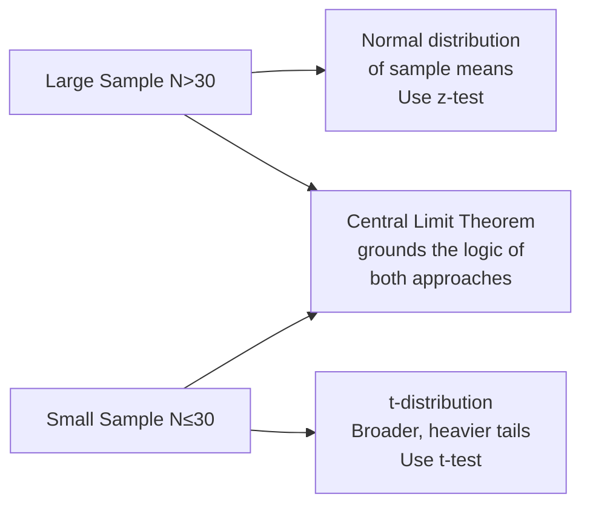
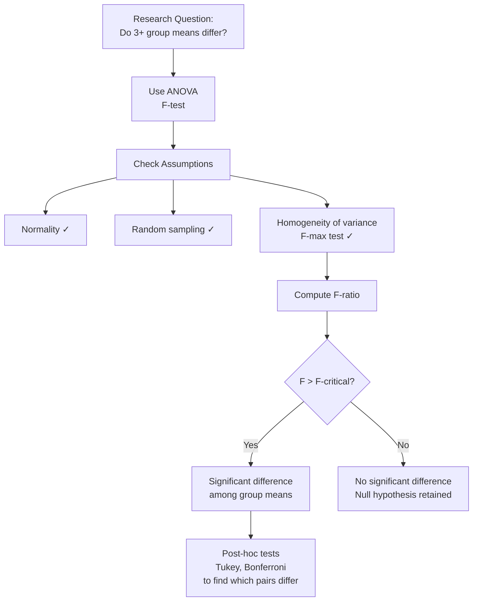

# Parametric Statistical Tests: t-test, F-test, ANOVA, and Pearson's r

## Introduction

A researcher at IGNOU wants to know whether male and female psychology students differ in their attitude towards teaching. Another wants to compare anxiety scores across three different therapy groups. A third wants to know if two correlations computed from different samples are significantly different from each other.

Each of these questions requires a different parametric test — and understanding which test to use, and why, is the core practical skill in inferential statistics. This unit covers the key parametric tests: the **t-test** (for comparing two means), **ANOVA/F-test** (for three or more means), and tests involving **Pearson's r** (correlation).

> 📄 **Source PDF**: [Block-1/Unit-1.pdf](/pdfs/MPC-006%20Statistics%20in%20Psychology/Block-1/Unit-1.pdf)  
> 📚 MPC-006 Statistics in Psychology — Block 1: Introduction to Statistics

---

## Foundation: Sampling Distribution and Standard Error

Before any inferential test, we need to understand **sampling distributions** and **standard error** — the conceptual pillars underlying all parametric inference.

### Sampling Distribution of Means

When multiple large random samples (N > 30) are drawn from a population, their means form a distribution — the **sampling distribution of means**. The **Central Limit Theorem** tells us this distribution is:
- **Normally distributed** (regardless of the original population's shape, for large N)
- Centred on the **population mean** (μ)
- Has a standard deviation called the **Standard Error of the Mean (SEM)**

### Standard Error of the Mean (SEM)

The SEM tells us how much sample means are expected to deviate from the population mean:

**SE_M = σ / √N**

Where:
- σ = Standard deviation of the population
- N = Sample size

**Interpretation**: A smaller SEM means sample means cluster tightly around the population mean — more reliable estimation.

For small samples (N ≤ 30), the sampling distribution follows the **t-distribution** (developed by William Sealy Gosset, ~1815), which is broader and flatter than the normal curve, with heavier tails.

---

## The t-Test: Comparing Two Means

The **t-test** tests whether two group means differ significantly — whether the observed difference is larger than what we'd expect from sampling error alone.

There are three scenarios, each with a different formula:

### 1. Independent Large Samples (z-test / CR)

When comparing means from **two independent groups** with **large samples** (N > 30 each):

- Groups are "independent" when drawn from **totally different, unrelated** populations
- The formula uses the **Critical Ratio (CR)** — essentially a z-test

The **Standard Error of the Difference between Means** (σ_dM) is:

**σ_dM = √(σ_M1² + σ_M2²)**

Where σ_M1 and σ_M2 are the standard errors of the means of Sample 1 and Sample 2 respectively.

**Worked example**: Male M.A. Psychology students at IGNOU score a mean of 55 on an attitude scale; female students score 59. The difference is 4 — but is this real or sampling error? The CR/z-test determines whether this 4-point difference exceeds what chance would produce.

### 2. Independent Small Samples (t-test)

When N is small (≤ 30 per group) and groups are independent, use Student's **t-test**. The t-distribution accounts for the extra uncertainty introduced by small samples.

### 3. Dependent/Correlated Samples (Paired t-test)

Means are **dependent/correlated** when obtained from:
- The **same participants** tested twice (pre-test/post-test)
- **Matched pairs** — participants matched on key attributes

The formula for correlated means:

**t = (M₁ - M₂) / √(σ_M1² + σ_M2² - 2r₁₂σ_M1σ_M2)**

Where:
- M₁, M₂ = Means of initial and final testing
- σ_M1, σ_M2 = Standard errors of the two means
- r₁₂ = Correlation between scores on initial and final testing

The **r₁₂** term adjusts for the non-independence — if scores at two time points are correlated, the effective variance is reduced.

**When to use paired t-test**:
- Pre/post intervention study (measure anxiety before and after mindfulness training)
- Repeated measures design (same participants in two conditions)
- Matched subjects design (matched for age, IQ, or other variables)

---

## ANOVA: Comparing Three or More Means

When we have more than two groups, using multiple t-tests inflates the **Type I error rate** (false positive risk). Analysis of Variance (**ANOVA**) solves this by testing all group differences simultaneously, producing a single **F-statistic**.

### F-statistic

**F = Variance Between Groups / Variance Within Groups**

- If the null hypothesis is true (all means equal), F ≈ 1
- If group means differ meaningfully, the numerator increases → F > 1
- Statistical significance is determined by comparing computed F to a critical F value in tables

### Assumptions of ANOVA

1. **Normal distribution** in the population (though robust to violations with large N)
2. **Random sampling** from subpopulations — randomisation is the "keystone" of ANOVA
3. **Homogeneity of variances** — tested using **F-max test**:

**F_max = Largest Variance / Smallest Variance**

If computed F-max < critical F-max at p = .05, variances are homogeneous.

**IGNOU example**: Suppose we compare the teaching aptitude of M.A. Psychology students from three different zones (North, South, East). ANOVA tests whether any of the three group means differ significantly from one another.

---

## Tests Related to Pearson's r

### Why Pearson's r Needs Special Treatment

The sampling distribution of Pearson's r is **not normal** in most practical situations:
- When r is very high (≥ 0.80) and N is small → distribution is **negatively skewed**
- When r is very low (≤ 0.20) → distribution is **positively skewed**
- Only when r is near zero and N is large (≥ 30) is the distribution approximately normal

### Fisher's Z Transformation

The solution is **Fisher's Z transformation** — converting r to a Z coefficient whose sampling distribution **is normal regardless of sample size and population r**:

- Use a conversion table (Fisher's r-to-Z table) to find Z for any r
- The SE of Z depends only on N:

**SE_Z = 1 / √(N - 3)**

This is elegant: the standard error of the Fisher Z coefficient is a simple function only of sample size.

### Testing Significance of Pearson's r

To test whether a single correlation is significantly different from zero, convert r to Z and compute:

**CR = (Z₁ - Z₂) / SE_DZ**

### Comparing Two Correlations (Independent Samples)

When testing whether two r values from **different, independent samples** differ significantly:

**SE_DZ = √(1/(N₁ - 3) + 1/(N₂ - 3))**

**CR = (Z₁ - Z₂) / SE_DZ**

**Example**: A researcher finds r = .65 between anxiety and performance in Sample 1 (N = 50) and r = .42 in Sample 2 (N = 48). Are these correlations significantly different from each other?

Step 1: Convert both r values to Fisher's Z using tables  
Step 2: Compute SE_DZ using the formula above  
Step 3: Compute CR  
Step 4: Compare CR to critical z-value (1.96 for p = .05)

---

## Summary of Parametric Tests

| Test | Purpose | Sample Type | N Requirement |
|---|---|---|---|
| **z-test / CR** | Compare two independent means | Independent large | N > 30 per group |
| **t-test (independent)** | Compare two independent means | Independent | Any (especially small) |
| **t-test (paired)** | Compare two correlated means | Dependent/matched | Any |
| **ANOVA (F-test)** | Compare three or more means | Independent | Large preferred |
| **Pearson's r** | Measure linear correlation | Any | N > 30 for normal approximation |
| **Fisher's Z test** | Test/compare correlations | Independent/single | Any (recommended for all r) |

---

## 🌐 External Resources

### Wikipedia
- [Student's t-test — Wikipedia](https://en.wikipedia.org/wiki/Student%27s_t-test) — Theory, formulas, and variations of the t-test
- [Analysis of Variance — Wikipedia](https://en.wikipedia.org/wiki/Analysis_of_variance) — ANOVA explained with examples

### Educational Videos
- 🎥 [**t-Tests: Independent and Paired** — CrashCourse Statistics (YouTube)](https://www.youtube.com/watch?v=AGh66ZPpOSQ) — Accessible introduction with examples
- 🎥 [**ANOVA Explained** — StatQuest with Josh Starmer (YouTube)](https://www.youtube.com/watch?v=0Vj2V2qRU10) — Intuitive explanation of the F-ratio

### Research Papers
- 📄 [Cumming, G. (2014). "The New Statistics: Why and How." *Psychological Science*, 25(1).](https://journals.sagepub.com/doi/10.1177/0956797613504966) — Modern perspective on statistical inference in psychology
- 📄 [Lakens, D. (2013). "Calculating and reporting effect sizes to facilitate cumulative science." *Frontiers in Psychology*, 4.](https://www.frontiersin.org/articles/10.3389/fpsyg.2013.00863/full) — Essential guide to effect sizes alongside significance tests
- 📄 [Guilford, J.P. (1965). *Fundamental Statistics in Psychology and Education.* McGraw-Hill.](https://archive.org/details/fundamentalstati00guil) — IGNOU-recommended foundational text

### Additional Resources
- 📖 [ANOVA Calculator — Social Science Statistics](https://www.socscistatistics.com/tests/anova/)
- 📖 [t-test Calculator — GraphPad](https://www.graphpad.com/quickcalcs/ttest1.cfm)
- 📖 [Fisher's r-to-Z Transformation Table — StatSoft](https://www.statsoft.com/Textbook/Distribution-Tables)
- 📖 [Field, A. (2018). *Discovering Statistics Using IBM SPSS Statistics.* Sage.](https://uk.sagepub.com/en-gb/eur/discovering-statistics-using-ibm-spss-statistics/book257672)

---

## 🧠 Memory Aid: "2 = t, 3+ = F, Corr = r→Z"

> **2 groups** → **t**-test  
> **3+ groups** → **F**-test (ANOVA)  
> **Correlation significance** → Pearson's **r** → Fisher's **Z**  

For t-test types:
> **I**ndependent groups → **I**ndependent samples t-test  
> **D**ependent (same/matched) groups → **D**ependent samples (paired) t-test  

---

## ✅ Self-Assessment Questions

### Level 1 — Recall
1. What is the formula for the Standard Error of the Mean?
2. Why is Fisher's Z transformation used instead of directly testing Pearson's r?

### Level 2 — Understanding
3. A researcher compares anxiety scores between two independent groups (N₁ = 35, N₂ = 40). She uses an independent samples t-test. Later she realises participants in both groups completed both conditions (it was a within-subjects design). What test should she have used, and why?
4. What is the F-max test? When and why is it used before ANOVA?

### Level 3 — Application & Analysis
5. A researcher finds that a mindfulness intervention reduces depression scores from a pre-test mean of 24.6 to a post-test mean of 18.2 (N = 28 matched pairs, r₁₂ = .72, σ_M1 = 1.8, σ_M2 = 1.6). Using the paired t-test formula provided in this unit, calculate the denominator of the t-ratio. Is the denominator larger or smaller than if you had assumed the groups were independent (r₁₂ = 0)? What does this tell you about the effect of matching?

---

## Summary

Parametric statistical tests form the core toolkit of psychological research. The t-test handles two-group comparisons (independent or paired), while ANOVA extends this to three or more groups using the F-ratio. Pearson's r measures correlation, but because its sampling distribution is non-normal, Fisher's Z transformation is used for significance testing and comparison. All these tests rest on the foundation of the Central Limit Theorem, standard error, and the assumptions explored in the previous unit. Mastery of these tests — including their logic, formulas, and assumptions — is essential for both conducting and critically reading psychological research.

---

*Previous ←* [Assumptions & Scales of Measurement](/mpc-006/block-1/assumptions-scales-measurement)  
*Next →* [Non-Parametric Tests: Chi-Square, Median, Mann-Whitney, Sign Test, Wilcoxon](/mpc-006/block-1/nonparametric-tests-chi-square-mann-whitney)
