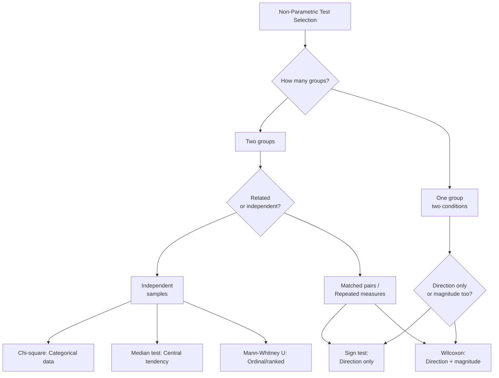
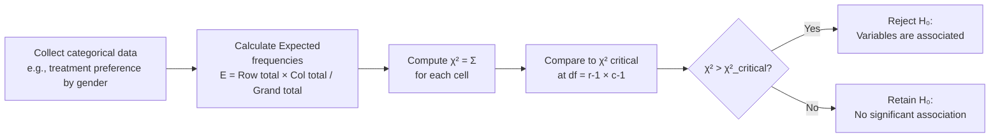

# Non-Parametric Tests: Chi-Square, Median, Mann-Whitney U, Sign Test, and Wilcoxon

## Introduction

A researcher wants to know whether the distribution of anxiety levels (categorised as low/medium/high) differs between urban and rural school students. Her data are counts in categories — not continuous measurements. She cannot use a t-test. She needs a **non-parametric test**.

Non-parametric tests are the essential toolkit for research situations where parametric assumptions cannot be met: small samples, ordinal or categorical data, non-normal distributions. They are not fallback methods for when the "real" tests fail — they are the *appropriate* tests for a large proportion of real psychological research, particularly in India where many studies use Likert scales, ranking tasks, or work with small clinical samples.

This unit covers five key non-parametric tests across two contexts: **independent samples** (chi-square, median test, Mann-Whitney U) and **related/dependent samples** (sign test, Wilcoxon matched-pairs).

> 📄 **Source PDF**: [Block-1/Unit-1.pdf](/pdfs/MPC-006%20Statistics%20in%20Psychology/Block-1/Unit-1.pdf)  
> 📚 MPC-006 Statistics in Psychology — Block 1: Introduction to Statistics

---

## Overview: Which Non-Parametric Test to Use?

---

## Tests for Independent Samples

### 1. The Chi-Square (χ²) Test

**Purpose**: Tests whether an observed distribution of categorical (counted) data differs significantly from an expected distribution. Tests for **independence** between two categorical variables.

**Data type**: Nominal (categorical, counted data — not measured)

**Key principle**: Chi-square evaluates the probability that an observed relationship between categorical variables results from chance. It is *not* a measure of the strength of the relationship — only of whether a relationship exists.

**Formula**:

$$\chi^2 = \sum \frac{(f_o - f_e)^2}{f_e}$$

Where:
- f_o = Observed frequency (actually counted in data)
- f_e = Expected frequency (what we'd expect if there were no relationship)
- Σ = Sum across all cells

**Assumptions**:
- Data are **discrete counts** (not continuous measurements)
- Observations are **randomly sampled and independent**
- Expected frequencies in each cell should be ≥ 5 (rule of thumb)

**Example — Chi-square test of independence**:

A researcher studies whether treatment preference (medication/therapy/both) differs between male and female patients:

| | Medication | Therapy | Both | Total |
|---|---|---|---|---|
| Male | 30 | 20 | 10 | 60 |
| Female | 15 | 35 | 10 | 60 |
| **Total** | 45 | 55 | 20 | **120** |

Calculate expected frequencies (e.g., E for Male-Medication = 60 × 45/120 = 22.5), then compute χ² = Σ[(O-E)²/E] and compare to critical value from chi-square table at appropriate degrees of freedom.

**Example from the PDF**: Analysing FM Radio programming — counting how many programs mention antiterrorism topics and testing whether the observed frequency differs from expected (chance) distribution.

---

### 2. The Median Test

**Purpose**: Tests whether two **independent samples** have been drawn from populations with the **same median**. Tests for differences in central tendency.

**Data type**: Ordinal (or data that cannot meet t-test assumptions)

**Procedure**:

1. Calculate the **combined median** of all scores from both samples together
2. Dichotomise both sets of scores at the combined median: count how many fall **above** and **below** the median in each sample
3. Create a **2×2 contingency table**:

| | Sample 1 | Sample 2 |
|---|---|---|
| **Above combined median** | A | B |
| **Below combined median** | C | D |

4. Apply chi-square to the 2×2 table

**When to use**: When the measurement for both samples is expressed in an ordinal scale and parametric t-test assumptions cannot be met.

**Limitation**: Less powerful than Mann-Whitney U because it only uses whether scores are above or below the median, discarding information about how far above or below.

---

### 3. The Mann-Whitney U Test

**Purpose**: Tests whether two independent samples come from the same population. It is the **most powerful alternative to the t-test** when parametric assumptions cannot be met.

**Data type**: Ordinal scale or continuous data that violates normality

**Key advantage over Median test**: Uses the full rank-order information of both samples, not just above/below the median — therefore more powerful.

**Procedure**:
1. Combine all scores from both samples and **rank** them from lowest to highest
2. Sum the ranks for each group separately (W₁ and W₂)
3. Compute U using the formula:

$$U_1 = N_1 N_2 + \frac{N_1(N_1+1)}{2} - W_1$$

$$U_2 = N_1 N_2 + \frac{N_1(N_1+1)}{2} - W_2$$

4. The smaller of U₁ and U₂ is the test statistic
5. Compare to critical U values in Mann-Whitney tables

**Note**: U₁ + U₂ = N₁ × N₂ (useful check)

**Example**: Comparing coping strategy scores (rated on an ordinal scale 1–20) between students who received counselling (N=12) and those who didn't (N=11), when normality cannot be assumed with these small samples.

---

## Tests for Related Samples

### 4. The Sign Test

**Purpose**: The **simplest** non-parametric significance test. Used when quantitative measurement is impossible but paired comparisons can determine which of two conditions produces superior performance.

**Data type**: Only requires direction of difference (+/-) — not magnitude

**Procedure**:
1. For each matched pair, determine whether condition A is better (+) or worse (-) than condition B
2. Ties receive no sign and are excluded
3. Count the number of pluses and minuses
4. Under the null hypothesis, pluses and minuses should be equally frequent (50/50)
5. Use the binomial distribution (or a z-approximation for large N) to test significance

**Assumption**: Only that the variable has a **continuous underlying distribution** — no normality or equal intervals required.

**When to use**:
- Qualitative comparisons possible but measurement difficult or inconvenient
- Ordinal data where only "better/worse" is known
- Single sample measured under two conditions

**Example**: 15 pairs of therapists are rated on client outcome. For each pair (matched on experience level), we know which therapist had better outcomes but not by how much. Sign test uses this direction information.

**Limitation**: Ignores the *size* of differences — less powerful than Wilcoxon.

---

### 5. The Wilcoxon Matched-Pairs Signed-Ranks Test

**Purpose**: A **more powerful** test than the sign test because it considers not only the **direction** but also the **magnitude** of differences within matched pairs.

**Data type**: At least ordinal, with meaningful differences between scores

**Key principle**: Uses both the sign (direction) and rank of differences — therefore uses more information than the sign test.

**Procedure**:
1. For each matched pair, compute the difference (D = Score₁ - Score₂)
2. **Rank** the absolute values of differences (ignoring sign)
3. Assign the sign of the original difference to each rank
4. Sum the positive ranks (W+) and negative ranks (W-)
5. The smaller of W+ or W- is the test statistic T
6. Compare T to critical values in Wilcoxon tables

**Assumptions**:
- **Dependent groups** — matched pairs or repeated measures
- Variable has a continuous distribution
- Differences can be ranked (ordinal measurement of differences)
- **Not applicable to independent groups**

**Null hypothesis**: The direction and magnitude of pair differences are approximately equal in both directions (no systematic tendency one way).

**When to use instead of sign test**:
- When you can determine not just *which* condition is better, but *how much* better
- When differences are meaningful and can be ranked
- When you want more statistical power than the sign test offers

**Example**: Pre/post anxiety scores for 12 patients in a mindfulness programme. We know both the direction (decrease/increase) and magnitude (how many points) of change — Wilcoxon uses both.

---

## Advantages of Non-Parametric Tests: Summary

| Advantage | Explanation |
|---|---|
| **Small samples** | Valid even with N = 5 or 6 |
| **No distribution assumption** | Works when population is non-normal |
| **Ordinal/nominal data** | Appropriate for rank data, categorises |
| **Mixed populations** | Handles samples from different populations |
| **Ease of computation** | Simpler formulas and procedures |
| **Direct interpretation** | Results often more intuitively understandable |
| **Robustness** | Valid even when data have outliers or skew |

## Disadvantages of Non-Parametric Tests

| Disadvantage | Explanation |
|---|---|
| **Lower power** | Less efficient than parametric when assumptions are met |
| **Power-efficiency cost** | Non-parametric test with 90% efficiency needs 10% more cases |
| **Table availability** | Critical value tables scattered across sources |
| **Less precision** | Discards information by converting to ranks |

---

## Parametric vs Non-Parametric: Test Equivalents

| Research Situation | Parametric Test | Non-Parametric Equivalent |
|---|---|---|
| Two independent groups | Independent t-test | Mann-Whitney U / Median test |
| Two related groups | Paired t-test | Wilcoxon / Sign test |
| Three+ independent groups | One-way ANOVA | Kruskal-Wallis H |
| Correlation | Pearson's r | Spearman's ρ |
| Categorical association | — | Chi-square test |

---

## 🌐 External Resources

### Wikipedia
- [Chi-Squared Test — Wikipedia](https://en.wikipedia.org/wiki/Chi-squared_test) — Theory, formula, examples, and applications
- [Mann-Whitney U Test — Wikipedia](https://en.wikipedia.org/wiki/Mann%E2%80%93Whitney_U_test) — Comprehensive coverage including ties and large sample approximations

### Educational Videos
- 🎥 [**Chi-Square Test Explained** — StatQuest with Josh Starmer (YouTube)](https://www.youtube.com/watch?v=7_cs1YlZoug) — Highly visual, intuitive explanation
- 🎥 [**Mann-Whitney U Test in SPSS** — Andy Field / Statistics Laerd (YouTube)](https://www.youtube.com/watch?v=duvkBgJrAZE)

### Research Papers
- 📄 [Siegel, S. & Castellan, N.J. (1988). *Non-Parametric Statistics for the Behavioural Sciences* (2nd ed.). McGraw-Hill.](https://www.amazon.com/Nonparametric-Statistics-Behavioral-Sciences-Sidney/dp/0070573573) — The definitive reference; the core IGNOU source for this unit
- 📄 [Zimmermann, D.W. (2012). "A note on consistency of non-parametric rank tests and related rank transformations." *British Journal of Mathematical and Statistical Psychology*.](https://bpspsychub.onlinelibrary.wiley.com/doi/10.1111/j.2044-8317.2011.02024.x)
- 📄 [Hart, A. (2001). "Mann-Whitney test is not just a test of medians." *BMJ*, 323.](https://www.bmj.com/content/323/7309/391) — Important conceptual clarification of what the Mann-Whitney U actually tests

### Calculators and Tools
- 📖 [Chi-Square Calculator — Social Science Statistics](https://www.socscistatistics.com/tests/chisquare2/)
- 📖 [Mann-Whitney U Calculator](https://www.socscistatistics.com/tests/mannwhitney/)
- 📖 [Wilcoxon Signed-Rank Test Calculator](https://www.socscistatistics.com/tests/signedranks/)
- 📖 [SPSS: Running Non-Parametric Tests](https://statistics.laerd.com/spss-tutorials/mann-whitney-u-test-using-spss-statistics.php)

---

## 🧠 Memory Aid: "CMMWS" — The Five Non-Parametric Tests

**For independent samples (unrelated groups):**
> **C** — **C**hi-square: Counts/categorical data  
> **M** — **M**edian test: Above/below combined median  
> **M** — **M**ann-Whitney U: Full ranked data, most powerful  

**For dependent/related samples (matched/repeated):**
> **W** — **W**ilcoxon: Direction + magnitude of differences  
> **S** — **S**ign test: Direction only (+/-)  

Power ranking (low → high): Sign test < Median test < Wilcoxon < Mann-Whitney ≈ parametric equivalents

---

## ✅ Self-Assessment Questions

### Level 1 — Recall
1. What type of data does the chi-square test require? What does it test for?
2. What is the key difference between the sign test and the Wilcoxon matched-pairs signed-ranks test?

### Level 2 — Understanding
3. Why is the Mann-Whitney U test preferred over the Median test for independent samples? What additional information does it use?
4. A researcher has 10 matched pairs. For 7 pairs, the experimental condition produced better scores; for 3 pairs, the control was better. How would the Sign Test approach this? What additional data would the Wilcoxon test require?

### Level 3 — Application & Analysis
5. A researcher in India studies whether type of school (government/private/aided) is associated with level of academic stress (low/medium/high). She has data from 90 students (30 per school type). (a) Which non-parametric test is appropriate? (b) What would the contingency table look like? (c) How many degrees of freedom does the chi-square have? (d) If χ² = 12.4, is this significant at p = .05 (critical value = 9.49)?

---

## Summary

Non-parametric tests provide valid, powerful methods for situations where parametric assumptions cannot be met. The five key tests covered here serve distinct purposes: chi-square for categorical data associations, median test for simple central tendency comparison, Mann-Whitney U for the most powerful comparison of two independent ranked samples, sign test for the simplest case of paired direction comparison, and Wilcoxon matched-pairs signed-ranks for paired comparisons that incorporate both direction and magnitude. Together with their parametric equivalents, these tests form the complete toolkit for inferential statistics in psychological research. The choice between them should always be driven by the data's properties and the research question — not by habit or convenience.

---

*Previous ←* [Parametric Tests: t, F, and Pearson's r](/mpc-006-statistics/block-1/parametric-tests-t-f-pearson)  
*Next →* [MPC-006 Block 1: Unit 2](/mpc-006-statistics/block-1/)
