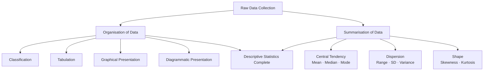
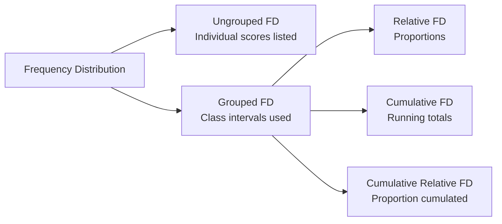

# Descriptive Statistics and Data Organisation

## Introduction

Every psychological investigation generates raw data — scores on a personality inventory, reaction times in a cognitive experiment, ratings on an attitude scale. By themselves these numbers are silent; they become meaningful only when organised and summarised. **Descriptive statistics** provides the tools to speak for the data.

This file focuses on the first half of descriptive statistics: organising raw data through classification, tabulation, frequency distributions, and their graphical cousins. Understanding these foundations is essential before you can interpret any measure of central tendency or dispersion.

> 📄 **Source PDF**: [Block-1/Unit-2.pdf — Pages 18–26](/pdfs/MPC-006%20Statistics%20in%20Psychology/Block-1/Unit-2.pdf)  
> 📚 MPC-006 Statistics in Psychology, IGNOU

---

## What is Descriptive Statistics?

Statistics as a discipline carries two meanings. In the **plural** sense it refers to *data* — collections of numerical observations. In the **singular** sense it refers to *statistical methods* — the procedures used to make sense of those data.

Within statistical methods, the science divides into two broad branches:

| Branch | Focus | Example |
|--------|-------|---------|
| **Descriptive** | Characterise the data in hand | Reporting the mean exam score of a class |
| **Inferential** | Draw conclusions about a larger population | Estimating the national average from a sample |

**Descriptive statistics** describes obtained data. It defines a particular group on specific characteristics without generalising beyond that group. Its two core operations are:

1. **Organisation of data** — imposing structure on raw scores
2. **Summarisation of data** — reducing many numbers to a few meaningful indices

### Why Descriptive Statistics Matters in Psychology

Human behaviour is inherently variable. No two people score identically on an IQ test; no two trials of a reaction-time task produce the same millisecond reading. Descriptive statistics gives researchers a principled language for capturing that variability in a compact form — what the IGNOU textbook calls *parameters of the distribution* — single estimates that summarise the entire distribution.

**Key insight**: Parameters *define* the distribution completely. If you know the mean and standard deviation of a normal distribution, you know everything about it.

🔗 **Further Reading**:
- [Wikipedia: Descriptive Statistics](https://en.wikipedia.org/wiki/Descriptive_statistics)
- [Khan Academy: Introduction to Statistics](https://www.khanacademy.org/math/statistics-probability)
- [Crash Course Statistics #1 — What is Statistics?](https://www.youtube.com/watch?v=sxQaBpKfDRk)

---

## Organisation of Data: Four Major Techniques

The IGNOU curriculum identifies four techniques for organising raw data:

### 1. Classification

**Classification** is the arrangement of data into groups according to similarities. It is typically the *first* step after data collection.

#### Frequency Distribution

The most fundamental classificatory tool is the **frequency distribution** — a table showing each score value (or range of scores) and how often it occurred.

**Why frequency distributions matter**: A raw list of 200 test scores tells you almost nothing at a glance. A frequency distribution reveals where scores concentrate, how spread out they are, and whether unusual patterns exist.

#### Ungrouped vs Grouped Frequency Distributions

| Type | When to Use | Construction |
|------|-------------|--------------|
| **Ungrouped** | Small range of scores | List every unique score value; tally occurrences |
| **Grouped** | Wide range of scores | Group into class intervals; count per interval |

**Rules for constructing a grouped frequency distribution:**

1. **Range** = Highest score − Lowest score
2. **Number of class intervals**: typically 5–30 (no rigid rule; depends on dataset size)
3. **Class interval width (i)**: should be a whole number, conveniently divisible by 2, 3, 5, 10, or 20; all classes should be equal width

#### Three Methods for Defining Class Limits

**Exclusive Method**  
Upper limit of one class = Lower limit of the next class.  
*(30–40, 40–50, 50–60)*  
A score of 40 falls in the *40–50* class, not the *30–40* class.

**Inclusive Method**  
Upper limit of one class does NOT become the lower limit of the next. Preferred when measurements are whole numbers.  
*(30–39, 40–49, 50–59)*

**True (Actual) Class Limits Method**  
Mathematically, a score extends 0.5 units below and above its face value.  
*(29.5–39.5, 39.5–49.5)*

#### Types of Frequency Distributions

| Type | Description | Use Case |
|------|-------------|----------|
| **Relative frequency** | Proportion of total N at each interval | Comparing distributions of different sizes |
| **Cumulative frequency** | Running sum of frequencies up to each interval | Finding medians, percentiles |
| **Cumulative relative frequency** | Cumulative frequency as a proportion of N | Combining both above uses |

🔗 **Further Reading**:
- [Wikipedia: Frequency Distribution](https://en.wikipedia.org/wiki/Frequency_distribution)
- [Statistics How To: Frequency Distribution Tables](https://www.statisticshowto.com/probability-and-statistics/descriptive-statistics/frequency-distribution-table/)
- Asthana, H. S. & Bhushan, B. (2007). *Statistics for Social Sciences*. Prentice Hall of India.

---

### 2. Tabulation

Once data is classified, it must be presented in a structured table. **Tabulation** is the process of presenting classified data in rows and columns with appropriate headings.

#### Components of a Statistical Table

A well-constructed table has eight standard components:

| Component | Position | Purpose |
|-----------|----------|---------|
| **Table number** | Top center | Identification and reference |
| **Title** | Below table number | Describes content clearly and briefly |
| **Caption** | Column headings | Labels for columns; may have sub-headings |
| **Stub** | Row headings | Labels for rows |
| **Body** | Central cells | The actual numerical data |
| **Head note** | Right side below title | Explains unit of measurement |
| **Footnote** | Below table | Qualifying statements not covered in title/captions |
| **Source** | Bottom | Credits the data source |

**Mnemonic for table components**: **T-T-C-S-B-H-F-S** → *"Two Teachers Can Sometimes Be Hard For Students"* (Title, Table#, Caption, Stub, Body, Headnote, Footnote, Source)

#### Why Proper Tabulation Matters

A poorly constructed table creates confusion; a well-structured table allows the reader to extract information at a glance. In psychological research reports — including IGNOU project reports — tabular clarity is an examiner expectation.

🔗 **Further Reading**:
- [APA Style: Tables and Figures](https://apastyle.apa.org/style-grammar-guidelines/tables-figures)
- [SPSS Tutorial: Creating Frequency Tables](https://www.spss-tutorials.com/frequency-tables-in-spss/)

---

## Indian Context: Data Organisation in Psychological Research

Indian psychological research institutions like **NIMHANS** (National Institute of Mental Health and Neurosciences), **NCERT**, and various ICSSR-funded projects routinely publish frequency distributions of standardised test scores. Understanding how to construct and read these tables is essential for interpreting Indian normative data.

For example, the **Bhatia Battery of Intelligence** and various Indian adaptations of personality inventories publish their norms as frequency distributions and percentile tables. A student who understands frequency distributions can interpret where any individual score falls relative to the normative sample.

🔗 **Further Reading**:
- [NIMHANS Publications](https://nimhans.ac.in/publications/)
- [ICSSR Data Service](https://www.icssrdataservice.in/)

---

## Recent Research Spotlight

**Digital and Computational Approaches to Data Organisation (2020–2024)**

Contemporary psychological research increasingly uses automated data processing. However, the foundational logic of frequency distributions and tabulation remains unchanged — software simply performs these operations faster.

- **Ruscio, J., & Roche, B. (2020)**. Determining the number of factors to retain in an exploratory factor analysis using comparison data of known factorial structure. *Psychological Assessment*, 32(4), 364–374. Demonstrates how frequency distributions of factor loadings guide analytical decisions.
- **Lakens, D. et al. (2022)**. Sample size justification. *Collabra: Psychology*, 8(1), 33267. Discusses how descriptive summaries of pilot data inform power calculations — a direct application of frequency distributions. [DOI: 10.1525/collabra.33267](https://doi.org/10.1525/collabra.33267)

---

## Self-Assessment Questions

### Level 1 — Knowledge

1. Statistics in **plural** sense means ________, whereas in **singular** sense it means ________.

2. Name the four major techniques for organising data.

3. What is the difference between a grouped and an ungrouped frequency distribution?

### Level 2 — Comprehension

4. A researcher collects test scores ranging from 32 to 97 (n = 150). She decides to use class intervals of width 5. How many class intervals will she need? Which method of class limit definition (exclusive, inclusive, or true) would you recommend and why?

5. Explain the difference between a relative frequency distribution and a cumulative relative frequency distribution. Give a research scenario where each would be more useful.

### Level 3 — Application/Analysis

6. *Critical Thinking*: A critic argues that "frequency distributions destroy data because they group individual scores together." Evaluate this argument. Under what conditions is grouping beneficial? When might it obscure important information?

---

## Memory Aids

### Mnemonic 1: Types of Frequency Distributions
**"Really Cute Cats"** → **R**elative, **C**umulative, **C**umulative Relative

### Mnemonic 2: Class Limit Methods
**"Every Inch Tells"** → **E**xclusive (upper goes to next), **I**nclusive (upper stays), **T**rue (±0.5 unit)

### Mnemonic 3: Steps to Build a Grouped FD
**"RNIC"** → Find the **R**ange → Decide **N**umber of classes → Set **I**nterval width → **C**ount frequencies

---

## Key Terms Glossary

| Term | Definition |
|------|-----------|
| **Descriptive statistics** | Branch dealing with description of obtained data without generalising beyond the sample |
| **Frequency distribution** | Table showing score values and their frequency of occurrence |
| **Class interval (i)** | The width of each group in a grouped frequency distribution |
| **Exclusive method** | Class limits where upper limit of one class = lower limit of next |
| **Inclusive method** | Class limits where upper and lower limits don't overlap between classes |
| **True class limits** | Limits extending ±0.5 units from the face value of scores |
| **Cumulative frequency** | Running total of frequencies up to each class |
| **Relative frequency** | Frequency expressed as proportion of total N |
| **Tabulation** | Systematic presentation of classified data in rows and columns |
| **Parameter** | A single estimate summarising a distribution characteristic |

---

## Video Resources

- 🎥 [Crash Course Statistics: Frequency Distributions](https://www.youtube.com/watch?v=oI3hZJqXAws) — Accessible introduction with visual examples
- 🎥 [Khan Academy: Frequency Tables](https://www.khanacademy.org/math/statistics-probability/displaying-describing-data) — Interactive practice problems
- 🎥 [Statistics 101: Descriptive Statistics Overview](https://www.youtube.com/watch?v=SzZ6GpcfoQY) — Brandon Foltz series

---

## Cross-References

- 👉 [Graphical & Diagrammatic Presentation](/mpc-006/block-1/graphical-diagrammatic-data-presentation) — Next: how to visualise frequency distributions
- 👉 [Measures of Central Tendency & Dispersion](/mpc-006/block-1/central-tendency-dispersion-skewness) — Summarising the organised data
- 👉 [Parametric vs Non-parametric Foundations](/mpc-006/block-1/parametric-nonparametric-foundations) — Unit 1 foundation concepts
