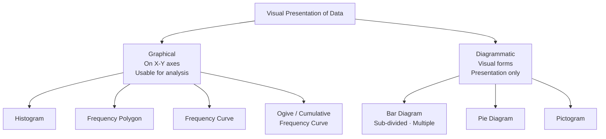
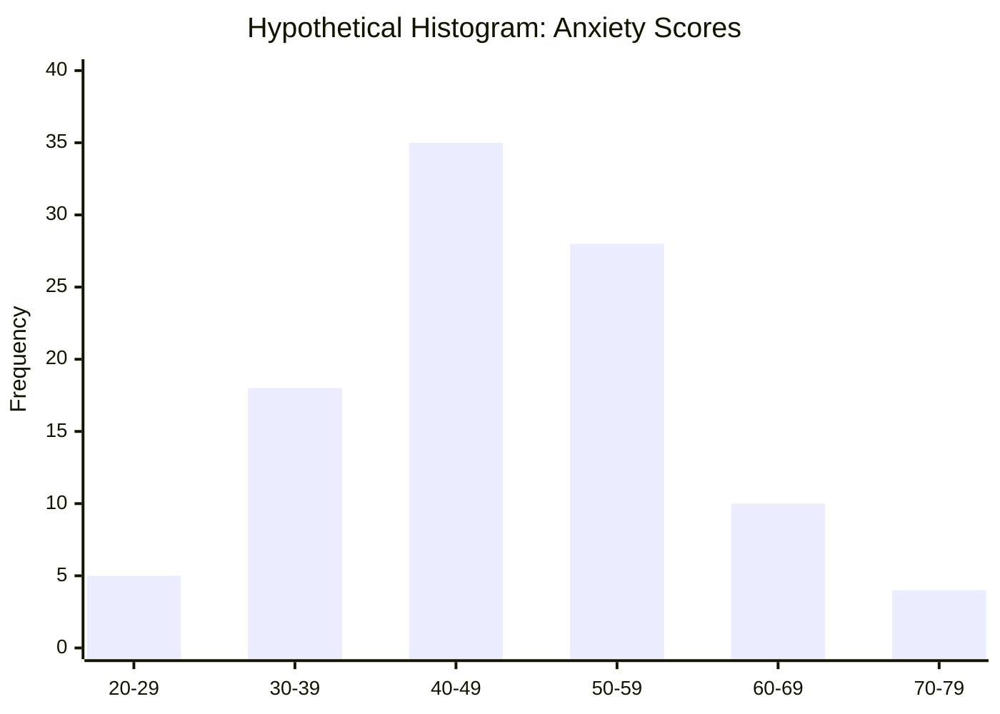
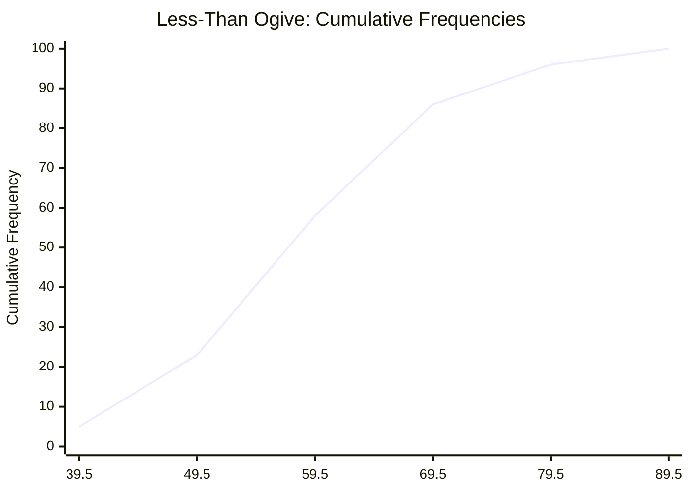
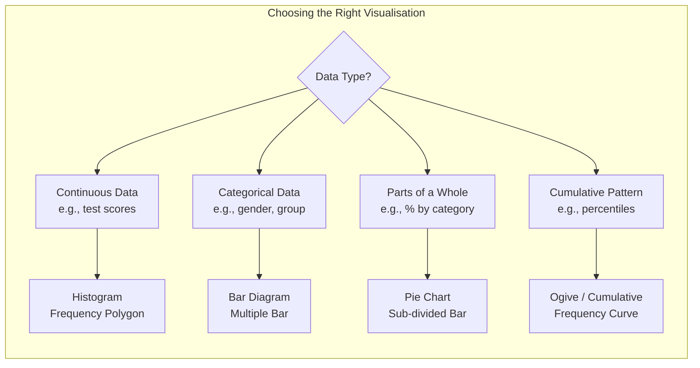

# Graphical and Diagrammatic Presentation of Data

## Introduction

A frequency distribution table organises data — but a **graph** makes data *visible*. The human brain is remarkably good at detecting patterns in visual displays: clusters, gaps, outliers, symmetry, skewness. Graphical and diagrammatic presentation extends what tabulation begins.

This file covers the major graphical and diagrammatic tools used in psychological statistics: histograms, frequency polygons, frequency curves, cumulative frequency curves (ogives), and various diagram types (bar, pie, pictogram). Each has a specific purpose, and choosing the right one is part of statistical literacy.

> 📄 **Source PDF**: [Block-1/Unit-2.pdf — Pages 23–26](/pdfs/MPC-006%20Statistics%20in%20Psychology/Block-1/Unit-2.pdf)  
> 📚 MPC-006 Statistics in Psychology, IGNOU

---

## Graphical vs Diagrammatic Presentation: Key Distinction

Before diving into specific techniques, it is critical to understand the difference the IGNOU curriculum draws:

| Aspect | Graphical Presentation | Diagrammatic Presentation |
|--------|----------------------|--------------------------|
| **Tool** | Graph (plotted on X–Y axes) | Diagram (bars, circles, pictures) |
| **Analysis** | Can be used for further statistical analysis | Used only for visual presentation |
| **Precision** | More precise | More appealing to general audiences |
| **Examples** | Histogram, frequency polygon, ogive | Bar diagram, pie chart, pictogram |

**Key point**: Graphs are analytically useful (e.g., reading off medians from ogives); diagrams are primarily presentational.

---

## Graphical Presentations

A graph is created on two mutually perpendicular axes: the **horizontal X-axis (abscissa)** and the **vertical Y-axis (ordinate)**. Class intervals or score values are plotted on the X-axis; frequencies on the Y-axis.

### 1. Histogram

The **histogram** is the most popular graphical method for displaying a continuous frequency distribution.

**Structure**: A series of adjacent rectangles where:
- **Width** of each rectangle = class interval (i)
- **Height** of each rectangle = frequency of that class

Unlike a bar chart, histograms have **no gaps** between bars — this reflects the continuous nature of the variable being measured.

**When to use**: Continuous data (test scores, reaction times, physiological measures) grouped into class intervals.

**Psychological example**: Distribution of anxiety scores (STAI) in a clinical sample; distribution of IQ scores in a school population.

🔗 **Further Reading**:
- [Wikipedia: Histogram](https://en.wikipedia.org/wiki/Histogram)
- [Statology: Histogram vs Bar Chart — What's the Difference?](https://www.statology.org/histogram-vs-bar-chart/)

---

### 2. Frequency Polygon

A **frequency polygon** is constructed by:

1. Marking class intervals on the X-axis (using midpoints or exact limits)
2. Adding one empty class on each side (frequency = 0) to "anchor" the polygon to the baseline
3. Plotting frequency against the midpoint of each class interval
4. Joining plotted points with straight lines

The resulting shape — a many-sided figure — gives the polygon its name.

**Advantage over histogram**: Multiple frequency polygons can be overlaid on the same graph for easy comparison (e.g., male vs female score distributions).

---

### 3. Frequency Curve

A **frequency curve** is a smooth, free-hand curve drawn *through* the frequency polygon. The smoothing process eliminates random fluctuations ("noise") in the data.

**Why smooth?** The frequency polygon reflects the sample's specific quirks. The frequency curve represents the *underlying population distribution* that the sample approximates.

**Relationship**: Histogram → Frequency Polygon → Frequency Curve (increasing abstraction and smoothing)

| Form | How Constructed | Purpose |
|------|----------------|---------|
| Histogram | Rectangles | Read off frequencies per interval |
| Frequency polygon | Points joined by lines | Compare multiple distributions |
| Frequency curve | Smooth free-hand curve | Represent underlying population shape |

---

### 4. Cumulative Frequency Curve (Ogive)

The **ogive** (pronounced "oh-jive") is the graph of a cumulative frequency distribution. It is one of the most practically useful graphs in psychology because it allows direct reading of percentiles.

#### Two Types of Ogive

**'Less Than' Ogive**:
- Plot cumulative frequency against the **upper class boundary**
- Shape: S-curve rising from left to right (increasing curve)
- Use: "What proportion of scores fall *below* a given value?"

**'More Than' Ogive**:
- Plot cumulative frequency against the **lower class boundary**
- Shape: Decreasing curve, slopes downward from left to right
- Use: "What proportion of scores fall *above* a given value?"

**Practical application**: The point where the less-than and more-than ogives intersect gives the **median** of the distribution.

🔗 **Further Reading**:
- [Wikipedia: Ogive (statistics)](https://en.wikipedia.org/wiki/Ogive_(statistics))
- [Math is Fun: Cumulative Frequency](https://www.mathsisfun.com/data/cumulative-frequency.html)

---

## Diagrammatic Presentations

Diagrams are visual representations used for *presenting* data to general audiences. They are striking and memorable but cannot be used for detailed statistical analysis.

### 1. Bar Diagram

A **bar diagram** is most useful for **categorical data**. Bars are thick lines (rectangles) where:
- X-axis: variable categories
- Y-axis: frequencies or values
- Height of each bar corresponds to the frequency/value

**Variants**:

| Type | Description | Use |
|------|-------------|-----|
| **Simple bar** | One bar per category | Compare a single variable across categories |
| **Sub-divided bar** | Each bar divided into sub-components | Show composition within categories |
| **Multiple bar** | Groups of bars side by side | Compare multiple variables across categories |

**Distinction from histogram**: Bar diagrams have **gaps** between bars (categorical data); histograms do not (continuous data). This is a frequently tested distinction.

### 2. Pie Diagram (Angular Diagram)

A **pie diagram** (also called an angular diagram) is a circle divided into sectors proportional to the frequencies of the categories.

**Construction logic**:
- Total circle = 360°
- Each sector's angle = (Category frequency / Total N) × 360°

**Example**: If 40 out of 100 students prefer visual learning, their sector = (40/100) × 360° = 144°

**Best used for**: Showing parts of a whole; limited to a small number of categories (too many slices become unreadable).

### 3. Pictogram

A **pictogram** uses pictures or icons to represent data quantities. Each icon represents a fixed number of units. While visually engaging, pictograms are the least precise of the diagrammatic methods.

---

## Indian Context: Data Visualisation in Psychology

Indian psychological research increasingly adopts data visualisation best practices. The **Annual Health Survey** by the Registrar General of India and NCERT's national achievement surveys routinely use histograms, bar charts, and ogives to present their findings.

In clinical settings like NIMHANS and CIP (Central Institute of Psychiatry, Ranchi), frequency distributions and ogives are used to present normative data for psychological tests adapted for Indian populations, such as the **PGI Memory Scale** and various Hindi adaptations of standardised instruments.

🔗 **Further Reading**:
- [NCERT Statistical Data on Education](https://ncert.nic.in/)
- [Annual Health Survey India](https://censusindia.gov.in/vital_statistics/AHSBulletins/AHS_Bulletins.html)

---

## Recent Research Spotlight

**Data Visualisation in Psychological Science (2020–2024)**

- **Weissgerber, T. L. et al. (2019/updated 2022)**. Reveal, Don't Conceal: Transforming Data Visualization to Improve Transparency. *Circulation*, 141(18), 1469–1480. Argues that bar charts often hide distributional information that histograms and violin plots reveal — directly relevant to choosing between diagrammatic and graphical approaches. [DOI: 10.1161/CIRCULATIONAHA.118.037777](https://doi.org/10.1161/CIRCULATIONAHA.118.037777)

- **Allen, M. et al. (2021)**. Raincloud plots: a multi-platform tool for robust data visualization. *Wellcome Open Research*, 4, 63. Modern best practices for visualising psychological data distributions — builds directly on histogram and frequency polygon concepts. [DOI: 10.12688/wellcomeopenres.15191.2](https://doi.org/10.12688/wellcomeopenres.15191.2)

---

## Self-Assessment Questions

### Level 1 — Knowledge

1. What is the key structural difference between a histogram and a bar diagram?

2. In a 'less than' ogive, cumulative frequencies are plotted against the ________ class boundary; in a 'more than' ogive, against the ________ class boundary.

3. Name four types of diagrams used for diagrammatic presentation of data.

### Level 2 — Comprehension

4. A researcher wants to compare the score distributions of male and female participants on a depression inventory. Which graphical method(s) would be most appropriate and why?

5. Explain how an ogive can be used to find the median of a distribution without calculation.

### Level 3 — Application/Analysis

6. *Scenario*: A clinical psychologist wants to present results to a hospital committee (non-statisticians) showing what percentage of patients fall into mild, moderate, and severe depression categories. She also needs to show the cumulative pattern of scores for clinical cut-off analysis. Which presentation tools would you recommend for each purpose, and why?

---

## Memory Aids

### Mnemonic 1: Graphical Types (in order of increasing smoothness)
**"His Polygon Can Finally Originate"** → **H**istogram → **P**olygon → **C**urve → **O**give (cumulative)

### Mnemonic 2: Ogive Direction
- **Less** than → **L**eft-rising (like an L rotated) → increasing curve
- **More** than → **M**ountain going down → decreasing curve

### Mnemonic 3: Bar vs Histogram
**"B-G-C-H-N"** → **B**ar has **G**aps (Categorical); **H**istogram has **N**o gaps (continuous)

---

## Key Terms Glossary

| Term | Definition |
|------|-----------|
| **Histogram** | Graph of continuous frequency distribution using adjacent rectangles |
| **Frequency polygon** | Line graph connecting midpoint frequencies of a distribution |
| **Frequency curve** | Smoothed free-hand curve through a frequency polygon |
| **Ogive** | Graph of cumulative frequency distribution |
| **Less-than ogive** | Cumulative frequencies plotted against upper class boundaries; increasing curve |
| **More-than ogive** | Cumulative frequencies plotted against lower class boundaries; decreasing curve |
| **Bar diagram** | Diagram for categorical data using separated bars |
| **Pie diagram** | Circle divided into sectors proportional to category frequencies |
| **Abscissa** | The X-axis (horizontal line) of a graph |
| **Ordinate** | The Y-axis (vertical line) of a graph |

---

## Video Resources

- 🎥 [Crash Course Statistics: Data Visualisation](https://www.youtube.com/watch?v=hEWY6kkBdpo) — Why how we show data matters
- 🎥 [Khan Academy: Creating Histograms](https://www.khanacademy.org/math/statistics-probability/displaying-describing-data/quantitative-data-graphs/v/histograms-intro) — Step-by-step construction
- 🎥 [Statistics 101: Cumulative Frequency and Ogives](https://www.youtube.com/watch?v=t4AiAFKdj-g) — Practical walkthrough

---

## Cross-References

- 👉 [Descriptive Statistics & Data Organisation](/mpc-006/block-1/descriptive-statistics-data-organisation) — Previous: classification and frequency distributions
- 👉 [Measures of Central Tendency & Dispersion](/mpc-006/block-1/central-tendency-dispersion-skewness) — Next: summarising the distributions you've visualised
- 👉 [Inferential Statistics & Hypothesis Testing](/mpc-006/block-1/inferential-statistics-hypothesis-testing) — Beyond description to inference
