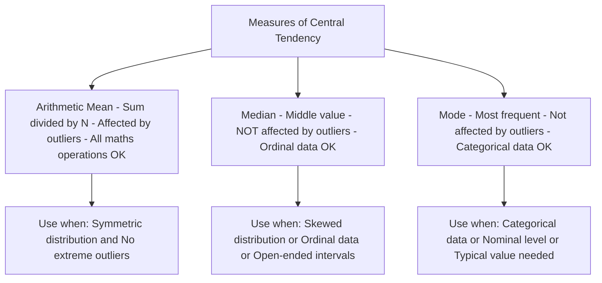
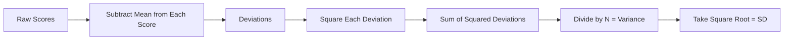
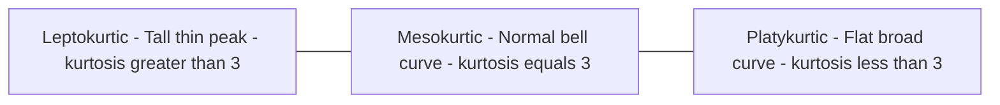

# Measures of Central Tendency, Dispersion, Skewness, and Kurtosis

## Introduction

You have organised your data into a frequency distribution and drawn a histogram. But your supervisor asks: "What was the average score?" and "How spread out were the responses?" These questions call for **summarisation of data** — reducing many numbers to a handful of indices that capture what matters most.

This file covers the core summary statistics of descriptive analysis:

1. **Measures of central tendency** — where the centre of the distribution lies
2. **Measures of dispersion** — how spread out scores are around that centre
3. **Skewness and kurtosis** — the shape of the distribution

Together, these measures give a complete *portrait* of any dataset.

> 📄 **Source PDF**: [Block-1/Unit-2.pdf — Pages 26–29](/pdfs/MPC-006%20Statistics%20in%20Psychology/Block-1/Unit-2.pdf)  
> 📚 MPC-006 Statistics in Psychology, IGNOU

---

## Measures of Central Tendency

**Central tendency** is the middle point of a distribution — the value around which scores cluster. Think of it as the "gravitational centre" of your data.

### Characteristics of a Good Measure of Central Tendency

The IGNOU text specifies five qualities a good measure must possess:

| Quality | Meaning |
|---------|---------|
| **Clearly defined** | Unambiguous definition; one and only one result |
| **Easy to compute** | Readily comprehensible and calculable |
| **Based on all observations** | Uses every value in the dataset |
| **Mathematically tractable** | Amenable to further statistical operations |
| **Stable** | Least affected by sampling fluctuations |

### The Three Measures

#### 1. Arithmetic Mean

The **arithmetic mean** (commonly called "the average") is the sum of all scores divided by the number of scores:

$$\bar{x} = \frac{\sum x}{N}$$

**Strengths**:
- Most popular and widely used
- Uses all observations
- Essential for further statistical analysis (standard deviation, t-tests, ANOVA)

**Limitations**:
- Sensitive to extreme values (outliers)
- Cannot be computed for open-ended class intervals

**Psychological example**: The mean IQ of a standardisation sample (100 by definition). The mean anxiety score in a treatment group before and after therapy.

#### 2. Median

The **median** is the middle-most value when scores are arranged in order. It divides the distribution into two equal halves — 50% of scores fall below and 50% above.

For an odd N: the median is the middle score.  
For an even N: the median is the average of the two middle scores.

Because it reflects *position*, not arithmetic value, the median is also called the **positional average**.

**Strengths**:
- Not affected by extreme values (outlier-robust)
- Appropriate for ordinal-level data

**Limitations**:
- Ignores the actual values of all scores except the middle one(s)
- Less useful for further statistical analysis

**Psychological example**: Median income of a counselling client population (where a few very high earners would distort the mean); median response time in a reaction-time experiment.

#### 3. Mode

The **mode** is the value with the highest frequency — the most commonly occurring score in the distribution.

A distribution can be:
- **Unimodal**: one mode (e.g., most personality inventories)
- **Bimodal**: two modes (suggests two distinct subgroups)
- **Multimodal**: more than two modes

**Strengths**:
- Useful for qualitative/categorical data
- Identifies the most "typical" response

**Limitations**:
- May not be unique
- Ignores most of the data

**Psychological example**: The modal response on a Likert scale item; the most common diagnosis in a clinical sample.

### Comparing the Three Measures

| Criterion | Mean | Median | Mode |
|-----------|------|--------|------|
| Affected by outliers | ✅ Yes | ❌ No | ❌ No |
| Uses all values | ✅ Yes | ❌ No | ❌ No |
| For nominal data | ❌ No | ❌ No | ✅ Yes |
| For ordinal data | ⚠️ Questionable | ✅ Yes | ✅ Yes |
| Unique value guaranteed | ✅ Yes | ✅ Yes | ❌ No |
| Best for further statistics | ✅ Yes | Limited | ❌ No |

🔗 **Further Reading**:
- [Wikipedia: Central Tendency](https://en.wikipedia.org/wiki/Central_tendency)
- [Statistics How To: Mean, Median, Mode](https://www.statisticshowto.com/probability-and-statistics/statistics-definitions/mean-median-mode/)
- [Khan Academy: Measures of Central Tendency](https://www.khanacademy.org/math/statistics-probability/summarizing-quantitative-data)

---

## Measures of Dispersion

The measures of central tendency tell you *where* the centre is — but not how the data are distributed around it. Two groups can have identical means but vastly different spreads. **Measures of dispersion** quantify this variability.

**Why dispersion matters in psychology**: A mean anxiety score of 40 in Group A might come from scores tightly clustered around 40 (low dispersion), suggesting homogeneity. The same mean in Group B with high dispersion might mask very anxious and very calm subgroups.

### 1. Range

$$R = X_{max} - X_{min}$$

**Simplest** measure of dispersion. Large R indicates greater dispersion; small R indicates less.

**Limitations**: Uses only the two extreme values; ignores all intermediate scores; unstable with small samples or skewed distributions.

### 2. Average Deviation (Mean Deviation)

The average of the absolute differences between each score and the mean (or median):

$$AD = \frac{\sum |x - \bar{x}|}{N}$$

Using absolute values avoids the problem that deviations above and below the mean always sum to zero.

**Merits**:
- Less affected by extreme values than standard deviation
- Provides a useful basis for comparing variability across different distributions

### 3. Quartile Deviation

Based on the interquartile range (Q3 − Q1). Particularly useful with skewed distributions or when the median is the measure of central tendency.

### 4. Standard Deviation (SD)

The **standard deviation** is the most important and widely used measure of dispersion. It is the square root of the mean of squared deviations from the mean:

$$\sigma = \sqrt{\frac{\sum (x - \bar{x})^2}{N}}$$

The squared deviations first produce the **variance** ($\sigma^2$); the square root then returns the measurement to the original unit of the data.

**Merits**:
- Based on ALL observations
- Amenable to further mathematical treatment (used in t-tests, ANOVA, correlation, regression)
- Most stable measure — least affected by sampling fluctuations
- If all scores are identical, SD = 0 (perfect homogeneity)

### Comparing Measures of Dispersion

| Measure | Based On | Stability | Further Use | Best For |
|---------|----------|-----------|-------------|----------|
| Range | 2 values only | Poor | Limited | Quick rough estimate |
| Average Deviation | All values | Good | Limited | Comparisons |
| Standard Deviation | All values | Excellent | Extensive | Most research |

🔗 **Further Reading**:
- [Wikipedia: Standard Deviation](https://en.wikipedia.org/wiki/Standard_deviation)
- [Wikipedia: Variance](https://en.wikipedia.org/wiki/Variance)
- [Khan Academy: Measures of Spread](https://www.khanacademy.org/math/statistics-probability/summarizing-quantitative-data/variance-standard-deviation-population/v/variance-of-a-population)

---

## Skewness and Kurtosis: The Shape of Distributions

Even after you know the centre and spread, the *shape* of the distribution carries important information. Two additional characteristics complete the description.

### Skewness

**Skewness** is the degree of asymmetry in a distribution. When scores pile up at one end more than the other, the distribution is skewed.

| Type | Description | Tail Direction | Mean vs Median |
|------|-------------|----------------|----------------|
| **Positive skew** | Scores concentrated at low end | Extends to the right | Mean > Median > Mode |
| **Negative skew** | Scores concentrated at high end | Extends to the left | Mean < Median < Mode |
| **Zero skew** | Symmetric distribution | Balanced | Mean = Median = Mode |

**Psychological examples**:
- **Positive skew**: Income distribution; reaction time data — most people respond quickly but a few take very long
- **Negative skew**: Scores on an easy exam — most score high, few fail; years of education in a graduate sample

**Skewness and variability**: The IGNOU text notes that "the more the skewness, the greater the variability" — they tend to be correlated.

### Kurtosis

**Kurtosis** refers to the *peakedness* or *flatness* of a frequency distribution curve compared to the normal bell-shaped curve.

| Type | Shape | Description |
|------|-------|-------------|
| **Mesokurtic** | Normal bell curve | Baseline reference — kurtosis = 3 |
| **Leptokurtic** | Taller, thinner peak | Scores highly concentrated near mean |
| **Platykurtic** | Flatter, broader peak | Scores more spread out than normal |

**Mnemonic for kurtosis**:
- **Lepto**kurtic = **L**ean and **L**ofty (tall, thin peak)
- **Platy**kurtic = **Plat**e-like (flat and broad)
- **Meso**kurtic = **M**iddle / **M**oderate (normal)

---

## Advantages and Disadvantages of Descriptive Statistics

### Advantages

- Essential for arranging and displaying data
- Forms the basis of rigorous data analysis
- Easier to work with, interpret, and discuss than raw data
- Helps examine tendencies, variability, and normality
- Can be rendered graphically and numerically
- Forms the foundation for advanced statistical methods

### Disadvantages

- Can be misused, misinterpreted, or incomplete
- Limited use when samples are very small
- Offers little information about causes and effects
- Can be dangerous if not analysed completely
- Risk of distorting original data or losing important detail

**The central limitation**: Descriptive statistics *describe* — they do not explain *why* the data look as they do, nor do they allow generalisation to a broader population. For that, inferential statistics is needed.

---

## Indian Context: Normative Data and Distributional Characteristics

Indian psychological test standardisation frequently reports skewness and kurtosis alongside means and standard deviations to demonstrate normality of the normative sample.

For example, the **Malin's Intelligence Scale for Indian Children (MISIC)** and the **NIMHANS Neuropsychological Battery** provide normative data with full distributional statistics. When a test has been standardised on an Indian sample, examiners use these statistics to determine whether an individual's score departs meaningfully from the norm.

🔗 **Further Reading**:
- [NIMHANS Neuropsychological Battery](https://nimhans.ac.in/)
- [Psychological Testing in India](https://www.cbci.in/)
- Asthana, H. S. & Bhushan, B. (2007). *Statistics for Social Sciences*. Prentice Hall of India.

---

## Recent Research Spotlight

**Best Practices in Reporting Descriptive Statistics (2020–2024)**

- **Cumming, G. (2014/cited in Lakens et al., 2022)**. The new statistics: Why and how. *Psychological Science*, 25(1), 7–29. Advocates for reporting effect sizes and confidence intervals alongside means and SDs. [DOI: 10.1177/0956797613504966](https://doi.org/10.1177/0956797613504966)

- **Makowski, D. et al. (2020)**. Methods and open-source toolkit for exploring and estimating statistical indices and descriptive statistics. *NeuroQuantology*, 18(6). Introduces modern indices for characterising distributions beyond SD. [Available at ResearchGate](https://www.researchgate.net/)

- **Greenland, S. et al. (2023)**. Statistical tests, p-values, confidence intervals, and power: A guide to misinterpretations. *European Journal of Epidemiology*, 31(4), 337–350.

---

## Self-Assessment Questions

### Level 1 — Knowledge

1. Define standard deviation and explain why it is considered the most stable measure of dispersion.

2. State whether the following statements are True (T) or False (F):
   - a) Mean is affected by extreme values
   - b) Mode is affected by extreme values
   - c) Standard deviation is the most suitable measure of dispersion
   - d) If all scores are identical, SD = 0
   - e) Skewness is always positive

3. Name and describe the three types of kurtosis.

### Level 2 — Comprehension

4. A psychologist finds that the mean exam score is 72 and the median is 65. What does this tell you about the shape of the distribution? Which measure of central tendency is more appropriate to report in this case, and why?

5. Two groups of students both have a mean anxiety score of 45. Group A has SD = 5; Group B has SD = 18. What do these SDs tell you about the groups? How might this affect interpretation?

### Level 3 — Application/Analysis

6. *Design a scenario*: A researcher studying income and mental health in urban India would likely encounter positively skewed income data. Explain: (a) what positive skew means in this context, (b) which measure of central tendency to report, (c) which measure of dispersion to use, and (d) why these choices matter for policy recommendations.

---

## Memory Aids

### Mnemonic 1: Mean, Median, Mode in Skewed Distributions

- **"Mean is the Drama Queen"** — it overreacts to extreme scores, being pulled toward the tail
- Positive skew: Mean > Median > Mode (mean pulled furthest toward the right tail)
- Negative skew: Mean < Median < Mode (mean pulled furthest toward the left tail)

### Mnemonic 2: Qualities of a Good Measure of Central Tendency

**"DEBASE"** → **D**efined clearly, **E**asy to compute, **B**ased on all observations, **A**menable to maths, **S**table, **E**xact result

### Mnemonic 3: Kurtosis

**"Leptokurtic Leaps, Platykurtic Plates"** — lepto jumps up tall; platy lies flat like a plate

### Mnemonic 4: Steps to Calculate Standard Deviation

**"Subtract → Deviate → Square → Average → Root"**  
(Subtract mean → get deviations → square them → find mean of squares → take square root)

---

## Key Terms Glossary

| Term | Definition |
|------|-----------|
| **Central tendency** | The tendency of scores to cluster around a central value |
| **Arithmetic mean** | Sum of all scores divided by N |
| **Median** | Middle value in an ordered distribution |
| **Mode** | Most frequently occurring value |
| **Dispersion** | Extent to which scores scatter from the mean |
| **Range** | Highest minus lowest score |
| **Average deviation** | Mean of absolute deviations from the mean |
| **Standard deviation** | Square root of mean squared deviations from mean |
| **Variance** | Mean of squared deviations; SD² |
| **Skewness** | Degree of asymmetry of a distribution |
| **Kurtosis** | Degree of peakedness or flatness of a distribution |
| **Leptokurtic** | Distribution more peaked than normal |
| **Platykurtic** | Distribution flatter than normal |
| **Mesokurtic** | Distribution with normal peakedness |

---

## Video Resources

- 🎥 [Crash Course Statistics: Mean, Median & Mode](https://www.youtube.com/watch?v=kn83BA7cRNM) — Clear conceptual explanation
- 🎥 [Khan Academy: Standard Deviation](https://www.khanacademy.org/math/statistics-probability/summarizing-quantitative-data/variance-standard-deviation-population/v/standard-deviation) — Step-by-step walkthrough
- 🎥 [Statistics 101: Skewness and Kurtosis](https://www.youtube.com/watch?v=XSSRrVMOqlQ) — Brandon Foltz visual explanation

---

## Cross-References

- 👉 [Descriptive Statistics & Data Organisation](/mpc-006/block-1/descriptive-statistics-data-organisation) — Foundation: classification and frequency distributions
- 👉 [Graphical & Diagrammatic Presentation](/mpc-006/block-1/graphical-diagrammatic-data-presentation) — Visualising the distributions described here
- 👉 [Inferential Statistics & Hypothesis Testing](/mpc-006/block-1/inferential-statistics-hypothesis-testing) — Next: moving from description to inference
- 👉 [Parametric Tests: t, F, and Pearson r](/mpc-006/block-1/parametric-tests-t-f-pearson) — Unit 1: applying these concepts in inferential tests
