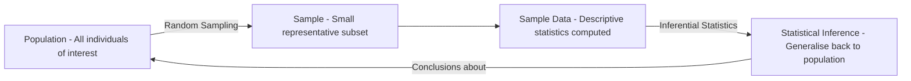
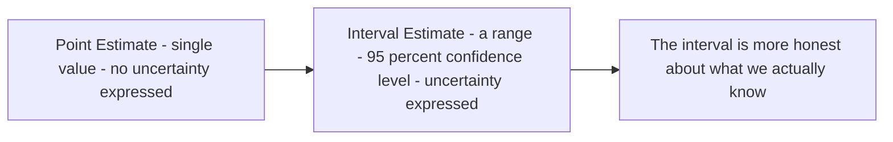
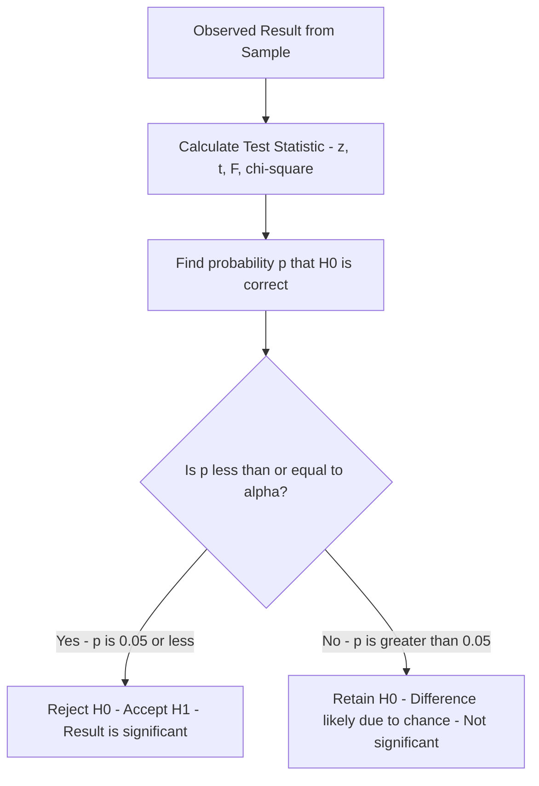
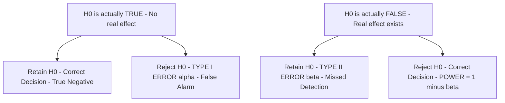
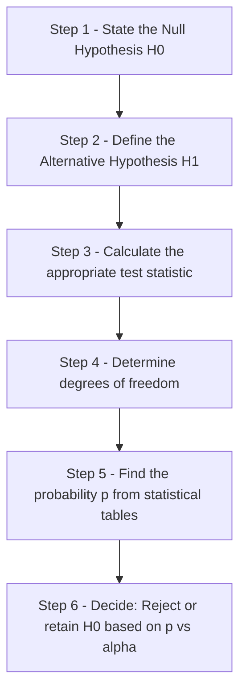

# Inferential Statistics, Estimation, and Hypothesis Testing

## Introduction

Descriptive statistics answers the question: *"What does this data look like?"* But science rarely stops there. The deeper question is: *"Does what I observed in my sample tell me something true about the wider population?"* This leap from sample to population is the territory of **inferential statistics**.

This file covers the entire inferential pathway: estimation (point and interval), hypothesis testing, the logic of null and alternative hypotheses, significance levels, one-tailed and two-tailed tests, Type I and Type II errors, statistical power, and the step-by-step procedure for testing hypotheses.

> 📄 **Source PDF**: [Block-1/Unit-2.pdf — Pages 29–35](/pdfs/MPC-006%20Statistics%20in%20Psychology/Block-1/Unit-2.pdf)  
> 📚 MPC-006 Statistics in Psychology, IGNOU

---

## What is Inferential Statistics?

**Statistical inference** is the process of drawing conclusions about an unknown population from a known sample drawn from it.

In most psychological investigations, studying the entire population is impossible or impractical. A researcher studying depression in Indian adults cannot test every Indian adult. Instead, a representative sample is tested, and conclusions are generalised.

**Classic example from the IGNOU text**: Before Lok Sabha or Vidhan Sabha election results, media houses conduct *exit polls* — testing a small sample of voters and inferring the likely outcome for the entire electorate. This is inferential statistics in everyday action.

### Two Types of Inferential Procedures

| Procedure | Question | Output |
|-----------|----------|--------|
| **Estimation** | What is the population value? | A number or range |
| **Hypothesis Testing** | Is a specific hypothesis about the population supported? | Reject or retain H₀ |

---

## Estimation

In estimation, inference is made about population characteristics (parameters) on the basis of sample characteristics (statistics).

### Characteristics of a Good Estimator

A good statistical estimator must be:

| Property | Meaning | Example |
|----------|---------|---------|
| **Unbiased** | Mean of the statistic equals the parameter across infinite samples | Sample mean is an unbiased estimator of population mean |
| **Consistent** | As sample size increases, estimate gets closer to parameter | Mean from N=200 is closer to true value than from N=20 |
| **Accurate** | The estimate is close to the true parameter value | Depends on sample representativeness, N, and variability |

### Point Estimation

A **point estimate** uses a single sample statistic to estimate the population parameter:

$$\hat{\mu} = \bar{x}$$

**Example**: A researcher tests 100 students on an adjustment scale and obtains $\bar{x} = 45.0$. This single value is used as the point estimate of the population mean.

**Limitation**: A point estimate is almost certainly wrong — the sample mean will rarely equal the exact population mean. There is no information about how far off the estimate might be.

### Interval Estimation (Confidence Interval)

To address the limitation of point estimation, we construct a **confidence interval (CI)**: a range of values expected to contain the true population parameter.

$$CI = \bar{x} \pm z \cdot \frac{\sigma}{\sqrt{N}}$$

Key concepts:
- **Confidence limits**: The lower and upper bounds of the interval
- **Confidence level**: The probability that the interval contains the true parameter (commonly 95% or 99%)
- **Interpretation**: A 95% CI means that if we drew 100 samples and constructed 100 intervals, approximately 95 of them would contain the true population mean

🔗 **Further Reading**:
- [Wikipedia: Statistical Estimation](https://en.wikipedia.org/wiki/Estimation_statistics)
- [Wikipedia: Confidence Interval](https://en.wikipedia.org/wiki/Confidence_interval)
- [Khan Academy: Confidence Intervals](https://www.khanacademy.org/math/statistics-probability/confidence-intervals-one-sample)

---

## Hypothesis Testing

**Hypothesis testing** is the statistical decision-making process for evaluating whether an observed result is due to the variable of interest or merely to chance.

The key question: *Could random sampling alone explain what I observed?*

### Statement of Hypotheses

A **statistical hypothesis** is a statement — which may or may not be true — about a population parameter or probability distribution.

#### Null Hypothesis (H₀)

The null hypothesis is a **statement of no difference** (or no effect, no relationship).

Common formulations:
- "The two samples come from the same population"
- "There is no significant difference between group means"
- "The correlation is zero in the population"

H₀ is testable — it can be accepted or rejected based on data. It assumes the population is normally distributed with equal means and standard deviations across groups.

#### Alternative Hypothesis (H₁)

The alternative hypothesis **proposes a difference** (or effect, or relationship). It states that:
1. The two samples belong to *different* populations
2. The means are estimates of two different parametric means
3. There is a significant difference between sample means

**Critical logic**: H₁ is never directly tested. It is *accepted* only when H₀ is rejected.

### Level of Significance (α)

The **level of significance** (α) is the probability threshold below which the null hypothesis is rejected.

| Level | Meaning | Use |
|-------|---------|-----|
| **α = .05 (5%)** | Results expected by chance in only 5 out of 100 similar experiments | Standard for most psychological research |
| **α = .01 (1%)** | Results expected by chance in only 1 out of 100 experiments | More stringent; for serious consequences of error |

**Interpreting p < .05**: The null hypothesis is rejected. The results are statistically significant. The probability that the observed difference occurred by chance alone is 5% or less.

### One-Tailed and Two-Tailed Tests

| Test | H₁ Specification | Use When |
|------|-----------------|----------|
| **Two-tailed** | μ₁ ≠ μ₂ (non-directional) | You predict a difference but not its direction |
| **One-tailed** | μ₁ > μ₂ or μ₁ < μ₂ (directional) | You predict the specific direction of the effect |

**One-tailed tests are more powerful** but require stronger theoretical justification for directionality.

🔗 **Further Reading**:
- [Wikipedia: Hypothesis Testing](https://en.wikipedia.org/wiki/Statistical_hypothesis_testing)
- [Wikipedia: Null Hypothesis](https://en.wikipedia.org/wiki/Null_hypothesis)
- [Simply Psychology: Hypothesis Testing](https://www.simplypsychology.org/hypothesis-testing.html)

---

## Errors in Hypothesis Testing

No decision-making procedure is perfect. When deciding to accept or reject H₀ based on sample data, two types of error are possible:

| Reality | Decision: Retain H₀ | Decision: Reject H₀ |
|---------|---------------------|---------------------|
| **H₀ is TRUE** | ✅ Correct Decision | ❌ **Type I Error (α)** — False Positive |
| **H₀ is FALSE** | ❌ **Type II Error (β)** — False Negative | ✅ Correct Decision — **POWER** |

### Type I Error (α Error — False Positive)

**Definition**: Rejecting H₀ when it is actually true.  
**Probability**: α (the significance level set by the researcher)  
**Example**: Concluding a new therapy is effective when it actually isn't  
**Consequence**: Adopting ineffective treatments; false scientific claims

### Type II Error (β Error — False Negative)

**Definition**: Retaining H₀ when it is actually false.  
**Probability**: β  
**Example**: Concluding a therapy has no effect when it actually does  
**Consequence**: Abandoning effective treatments; missed discoveries

### The α–β Trade-off

For a **fixed sample size**, α and β are inversely related:

| Change | Effect on α | Effect on β |
|--------|------------|------------|
| Lower α (more stringent) | Decreases | Increases |
| Higher α (more lenient) | Increases | Decreases |
| Increase sample size N | Can decrease both simultaneously |

**Key principle**: You cannot simultaneously minimise both errors with a fixed sample size. The only solution is to increase N.

### Power of a Test (1 − β)

**Statistical power** = the probability of correctly rejecting H₀ when it is false = $1 - \beta$

Power measures how well the test detects real effects. Factors that increase power:
- Larger sample size (N)
- Larger effect size (bigger true difference between groups)
- Higher α level (but this increases Type I error risk)
- Lower measurement error

**Convention**: Power ≥ 0.80 (80% chance of detecting a real effect) is the standard target in psychology.

🔗 **Further Reading**:
- [Wikipedia: Type I and Type II Errors](https://en.wikipedia.org/wiki/Type_I_and_type_II_errors)
- [Wikipedia: Statistical Power](https://en.wikipedia.org/wiki/Power_of_a_test)
- [G*Power Software for Power Analysis](https://www.psychologie.hhu.de/arbeitsgruppen/allgemeine-psychologie-und-arbeitspsychologie/gpower)

---

## General Procedure for Testing a Hypothesis

The IGNOU text provides a six-step systematic procedure:

### Applied Example

A researcher tests whether a new mindfulness programme reduces anxiety in college students:

| Step | Content |
|------|---------|
| **H₀** | The programme has no effect on anxiety — μ_pre = μ_post |
| **H₁** | The programme reduces anxiety — μ_pre > μ_post (one-tailed) |
| **Test statistic** | Paired-samples t-test |
| **df** | N − 1 |
| **p value** | Obtained from t-distribution table |
| **Decision** | If p < .05, reject H₀; mindfulness significantly reduces anxiety |

---

## Indian Context: Hypothesis Testing in Indian Psychological Research

The Indian Council of Social Science Research (ICSSR) and University Grants Commission (UGC) fund numerous studies that follow the hypothesis-testing framework. Common applications include:

- Testing whether rural vs urban populations differ on mental health indices (two-sample t-tests)
- Examining gender differences in stress among IT professionals (ANOVA)
- Evaluating the effectiveness of yoga interventions on psychological well-being (paired t-tests)

Understanding the hypothesis-testing framework is essential for interpreting research published in Indian journals like *Psychological Studies* (Springer India) and the *Journal of the Indian Academy of Applied Psychology*.

🔗 **Further Reading**:
- [ICSSR Research Programmes](https://icssr.org/)
- [Psychological Studies — Springer](https://www.springer.com/journal/12646)
- [Journal of Indian Academy of Applied Psychology](https://www.jiaap.org/)

---

## Recent Research Spotlight

**Rethinking Statistical Significance (2019–2024)**

- **Wasserstein, R. L. et al. (2019)**. Moving to a World Beyond "p < 0.05." *The American Statistician*, 73(S1), 1–19. Argues for richer reporting beyond binary significance testing. [DOI: 10.1080/00031305.2019.1583913](https://doi.org/10.1080/00031305.2019.1583913)

- **Lakens, D. (2022)**. Improving Your Statistical Inferences. Free online course via Coursera covering power analysis, confidence intervals, and effect sizes as complements to traditional hypothesis testing.

- **Benjamin, D. J. et al. (2018)**. Redefine statistical significance. *Nature Human Behaviour*, 2(1), 6–10. Proposed lowering the α threshold from .05 to .005 to reduce false positives in psychological research. [DOI: 10.1038/s41562-017-0189-z](https://doi.org/10.1038/s41562-017-0189-z)

---

## Self-Assessment Questions

### Level 1 — Knowledge

1. Fill in the blanks:
   - a) Alternative hypothesis is a statement of __________ difference.
   - b) Null hypothesis is denoted by __________.
   - c) Alternative hypothesis is __________ directly tested statistically.
   - d) Level of significance is the probability of __________ occurrence of observed results.
   - e) When the null hypothesis is true, a decision to reject it is known as __________.
   - f) When a null hypothesis is false, a decision to accept it is known as __________.

2. What are the three characteristics of a good estimator?

3. Distinguish between point estimation and interval estimation.

### Level 2 — Comprehension

4. A researcher sets α = .01 instead of α = .05. What effect does this have on (a) Type I error probability, (b) Type II error probability, and (c) power of the test?

5. A study finds p = .03. Should H₀ be rejected at α = .05? At α = .01? Explain what each decision means.

### Level 3 — Application/Analysis

6. *Research Design*: A clinical psychologist is testing a new cognitive-behavioural intervention for social anxiety. The consequences of claiming effectiveness when the therapy doesn't work are serious — but missing a genuinely effective treatment is also costly. How should these considerations influence the researcher's choice of α level, sample size, and which error type they most want to minimise?

---

## Memory Aids

### Mnemonic 1: Type I vs Type II Error

**"Alpha Alarm, Beta Blind"**
- **Alpha** = Type I = False **A**larm (rejected a true H₀ — cried wolf)
- **Beta** = Type II = **B**lind miss (failed to detect a real effect)

### Mnemonic 2: The α–β Trade-off

**"Squeeze one, the other grows"** — for fixed N, reducing α inflates β; the only way to reduce both is to increase sample size.

### Mnemonic 3: Six Steps of Hypothesis Testing

**"State → Define → Calculate → Determine → Find → Decide"**

### Mnemonic 4: Point vs Interval Estimation

- **Point**: One sharp dart at the target — precise but probably misses the bullseye
- **Interval**: A net cast around the target — wider but much more likely to catch the true value

---

## Key Terms Glossary

| Term | Definition |
|------|-----------|
| **Statistical inference** | Process of drawing conclusions about a population from a sample |
| **Estimation** | Inferring population parameter value from sample statistic |
| **Point estimation** | Estimating a parameter as a single value |
| **Interval estimation** | Estimating a parameter as a range with a stated confidence level |
| **Confidence interval** | Range expected to contain the true population parameter |
| **Confidence limits** | Lower and upper bounds of a confidence interval |
| **Statistical hypothesis** | A testable statement about a population parameter |
| **Null hypothesis (H₀)** | Statement of no difference; tentatively held true |
| **Alternative hypothesis (H₁)** | Statement of a significant difference; accepted when H₀ is rejected |
| **Level of significance (α)** | Probability threshold for rejecting H₀ |
| **One-tailed test** | Directional test; H₁ specifies direction of effect |
| **Two-tailed test** | Non-directional test; H₁ specifies only that a difference exists |
| **Type I error (α)** | Rejecting H₀ when it is true — false positive |
| **Type II error (β)** | Retaining H₀ when it is false — false negative |
| **Power (1 − β)** | Probability of correctly rejecting a false H₀ |
| **Parameter** | Characteristic of a population |
| **Statistic** | Characteristic of a sample |

---

## Video Resources

- 🎥 [Crash Course Statistics: Hypothesis Testing](https://www.youtube.com/watch?v=bf3egy7TQ2Q) — Excellent conceptual overview
- 🎥 [Khan Academy: Significance Tests](https://www.khanacademy.org/math/statistics-probability/significance-tests-one-sample) — Step-by-step walkthrough
- 🎥 [Statistics 101: Type I and Type II Errors](https://www.youtube.com/watch?v=7mE-K_w1v90) — Visual explanation with examples

---

## Cross-References

- 👉 [Descriptive Statistics & Data Organisation](/mpc-006/block-1/descriptive-statistics-data-organisation) — Foundation: organising the data before inference
- 👉 [Central Tendency & Dispersion](/mpc-006/block-1/central-tendency-dispersion-skewness) — The statistics used in hypothesis testing
- 👉 [Parametric Tests: t, F, and Pearson r](/mpc-006/block-1/parametric-tests-t-f-pearson) — Unit 1: specific parametric tests applying this framework
- 👉 [Non-parametric Tests: Chi-square & Mann-Whitney](/mpc-006/block-1/nonparametric-tests-chi-square-mann-whitney) — Unit 1: when parametric assumptions are violated
