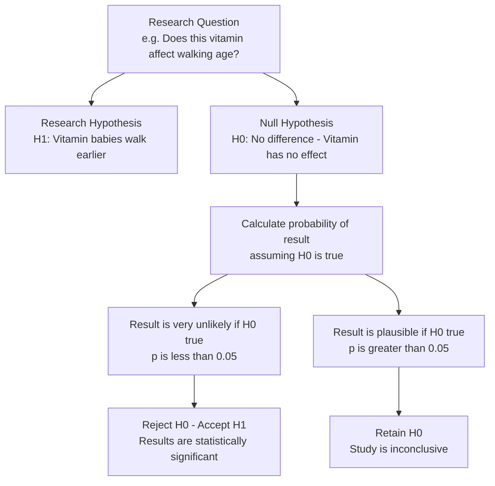
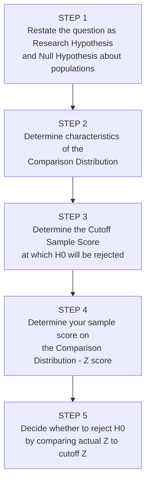

# The Logic and Process of Hypothesis Testing

## Introduction

Statistical inference begins with a claim — a hypothesis — about a population. But how do researchers decide whether their sample data actually support that claim? The answer lies in a systematic, formalised procedure called **hypothesis testing**, which is the central theme of most psychological research.

This file unpacks the *logic* behind hypothesis testing — why it works the way it does, why we test the *opposite* of what we predict, and how we move step-by-step from a research question to a statistical conclusion. Understanding this logic deeply is what separates a student who can mechanically apply a formula from one who truly understands statistical reasoning.

> 📄 **Source PDF**: [Block-1/Unit-3.pdf — Pages 37–42](/pdfs/MPC-006%20Statistics%20in%20Psychology/Block-1/Unit-3.pdf)  
> 📚 MPC-006 Statistics in Psychology, IGNOU

---

## What is Hypothesis Testing?

**Hypothesis testing** is a systematic procedure for deciding whether the results of a research study — which examines a *sample* — support a particular theory or practical innovation that applies to a *population*.

A **hypothesis** is a tentative answer to any research question. In psychological research, hypotheses typically predict a relationship between variables or a difference between groups.

The hypothesis testing framework has two essential features:

1. It is **probabilistic** — conclusions are expressed in terms of probabilities, not certainties
2. It is **indirect** — we test the *opposite* of what we predict, and reject that opposite if it is unlikely

### The Roundabout Logic: Why Test the Opposite?

This is the aspect of hypothesis testing that confuses most students. Why not test our prediction directly? Why test the *null* of no effect?

The answer is practical: **we can calculate the probability of results under the null hypothesis, but not easily under the research hypothesis.** If we assume "no effect," we know the expected distribution of scores. We can then ask: "How unlikely would our result be in a world where the null is true?"

- If our result is *very unlikely* under the null → we reject the null → we accept our research hypothesis
- If our result is *plausible* under the null → we cannot reject the null → the study is inconclusive

---

## The Research Hypothesis and the Null Hypothesis

### Research Hypothesis (H₁ / Alternative Hypothesis)

The **research hypothesis** is the prediction the researcher actually cares about — the expected effect or relationship. For example:

> *Babies given the specially purified vitamin will walk earlier than babies in general.*

In symbols: $\mu_1 < \mu_2$ (mean walking age of treated babies is less than untreated babies)

The research hypothesis is sometimes called the **alternative hypothesis** because it is the alternative to the null hypothesis.

### Null Hypothesis (H₀)

The **null hypothesis** is the opposite of the research hypothesis. It states that there is *no difference* between populations, or no effect of the treatment.

> *Babies given the vitamin will not walk earlier than babies in general — they walk at the same time.*

In symbols: $\mu_1 \geq \mu_2$ (no difference, or the vitamin actually delays walking)

**Critical rule**: The research hypothesis and null hypothesis are **complete opposites** — if one is true, the other cannot be. The entire hypothesis testing procedure is aimed at the null hypothesis so we can make a decision about the research hypothesis.

| Hypothesis | Also Called | Tests | Content |
|------------|-------------|-------|---------|
| Research Hypothesis | Alternative Hypothesis (H₁) | What we predict | Effect exists |
| Null Hypothesis | H₀ | What we test against | No effect / no difference |

🔗 **Further Reading**:
- [Wikipedia: Hypothesis Testing](https://en.wikipedia.org/wiki/Statistical_hypothesis_testing)
- [Wikipedia: Null Hypothesis](https://en.wikipedia.org/wiki/Null_hypothesis)
- [Simply Psychology: Hypothesis Testing](https://www.simplypsychology.org/hypothesis-testing.html)

---

## The Five-Step Hypothesis Testing Process

The IGNOU curriculum provides a clear five-step procedure that applies to virtually every hypothesis test in psychology:

### Step 1: Restate as Research and Null Hypotheses About Populations

Good researchers think in terms of *populations*, not just samples. The purpose of studying a sample is always to draw conclusions about the population.

**Example**:  
- Population 1: Babies who receive the specially purified vitamin  
- Population 2: Babies who do not receive the vitamin  
- H₁: μ₁ < μ₂ (Population 1 babies walk earlier on average)  
- H₀: μ₁ ≥ μ₂ (No earlier walking — no effect)

### Step 2: Determine the Comparison Distribution

The **comparison distribution** (also called the *sampling distribution* or *statistical model*) represents what the distribution of scores looks like if the null hypothesis is true.

This is the baseline against which your sample result is compared. In the vitamin example, the comparison distribution is the known distribution of walking ages in untreated babies (Population 2), since that is what we would expect *if* the vitamin had no effect.

**Key principle**: The comparison distribution always represents the population situation *if H₀ were true.*

### Step 3: Determine the Cutoff Score

Before collecting data, researchers set a **cutoff sample score** (also called the **critical value**): the minimum level of extremity the result must reach in order to reject the null hypothesis.

This is directly tied to the **significance level (α)**:
- At α = .05: the cutoff is the Z score that cuts off the most extreme 5% of the comparison distribution
- At α = .01: the cutoff is more extreme — only the most extreme 1% will lead to rejection

**Important practice**: The cutoff should be set *before* running the study, not after seeing the results. Post-hoc adjustment of cutoffs is a serious methodological violation.

### Step 4: Determine the Sample's Score (Z-Score)

After collecting data, compute the **Z-score** for your sample's result on the comparison distribution:

$$Z = \frac{X - \mu}{\sigma}$$

Where:
- $X$ = sample score
- $\mu$ = mean of the comparison distribution
- $\sigma$ = standard deviation of the comparison distribution

**Worked example** (from IGNOU text):  
- Baby walked at 6 months  
- Comparison distribution: μ = 14 months, σ = 3 months  
- Z = (6 − 14) / 3 = −8 / 3 = **−2.67**

This tells us the baby's walking age is 2.67 standard deviations *below* the mean of the comparison distribution — an extreme result.

### Step 5: Decide Whether to Reject H₀

Compare the actual Z score to the cutoff Z score:

- If the actual Z is **more extreme** than the cutoff → **Reject H₀** → Result is statistically significant
- If the actual Z is **less extreme** than the cutoff → **Retain H₀** → Study is inconclusive

**Example continued**:  
- Cutoff Z (α = .05, one-tailed) = −2.00  
- Actual Z = −2.67 (more extreme than −2.00)  
- **Decision**: Reject H₀ — the vitamin appears to affect walking age

---

## Implications of the Decision

### When You Reject H₀

- You do **not** say the results "prove" the research hypothesis
- You **do** say the results are **statistically significant**
- Results based on probabilities are never "proved" — this language is inappropriate in science

### When You Fail to Reject H₀

- You do **not** say the null hypothesis is "true" or "proven"
- You say the result is **not statistically significant** — the study is **inconclusive**
- The null hypothesis might still be false — the study may simply have lacked the sensitivity to detect the effect

**Why "inconclusive" and not "null is supported"?** It is always possible that a real difference exists but is smaller than what the study could detect. Absence of evidence is not evidence of absence.

---

## Z-Scores and the Normal Probability Curve

### What is a Z-Score?

A **Z-score** (also called a standard score) expresses a raw score in terms of how many standard deviations it falls above or below the mean of its distribution:

$$Z = \frac{X - \mu}{\sigma}$$

| Z-score | Meaning |
|---------|---------|
| Z = 0 | Score equals the mean |
| Z = +1 | Score is 1 SD above the mean |
| Z = −2 | Score is 2 SDs below the mean |
| Z = −2.67 | Score is 2.67 SDs below the mean (very extreme) |

### The Normal Probability Curve

The **normal curve** is a bell-shaped, symmetrical, unimodal frequency distribution. It is central to hypothesis testing because:

1. Many psychological variables are normally distributed (IQ, personality traits, anxiety scores)
2. The probabilities of different Z-scores are precisely known
3. Statistical tables convert Z-scores to exact probabilities

**Key probabilities** in the normal distribution:
- 68% of scores fall within ±1 SD of the mean
- 95% fall within ±1.96 SD
- 99% fall within ±2.58 SD

The extreme tails — beyond ±1.96 SD — represent the 5% of most extreme scores under the null hypothesis. A result in these tails leads to rejection of H₀ at α = .05.

🔗 **Further Reading**:
- [Wikipedia: Z-Score](https://en.wikipedia.org/wiki/Standard_score)
- [Wikipedia: Normal Distribution](https://en.wikipedia.org/wiki/Normal_distribution)
- [Khan Academy: Z-Scores](https://www.khanacademy.org/math/statistics-probability/modeling-distributions-of-data/z-scores/v/z-scores-intro)

---

## Indian Context: Hypothesis Testing in Indian Psychology

Hypothesis testing is the backbone of quantitative research published in Indian psychological journals. The **Indian Council of Social Science Research (ICSSR)** and University Grants Commission (UGC) mandate rigorous hypothesis-testing approaches in funded research.

Classic examples from Indian research:
- Testing H₀ that meditation has no effect on cortisol levels in urban professionals (AIIMS studies)
- Testing H₀ that gender makes no difference in academic self-efficacy (NCERT studies)
- Testing H₀ that socioeconomic status is unrelated to depression screening scores (community health research)

Understanding the five-step process helps students critically evaluate these published studies rather than accepting conclusions uncritically.

🔗 **Further Reading**:
- [ICSSR Social Science Research](https://icssr.org/)
- [UGC Research Programmes](https://ugc.gov.in/)

---

## Recent Research Spotlight

**Replication Crisis and Hypothesis Testing Practices (2019–2024)**

- **Open Science Collaboration (2015/widely cited through 2024)**. Estimating the reproducibility of psychological science. *Science*, 349(6251). Only ~36–39% of psychology studies replicated — directly raising questions about Type I error rates and α levels. [DOI: 10.1126/science.aac4716](https://doi.org/10.1126/science.aac4716)

- **Nosek, B. A. et al. (2022)**. Replicability, Robustness, and Reproducibility in Psychological Science. *Annual Review of Psychology*, 73, 719–748. Reviews best practices for hypothesis testing to improve replication. [DOI: 10.1146/annurev-psych-020821-114157](https://doi.org/10.1146/annurev-psych-020821-114157)

---

## Self-Assessment Questions

### Level 1 — Knowledge

1. Fill in the blanks:
   - a) The research hypothesis and __________ are completely opposite.
   - b) Cutoff sample scores are also known as __________.
   - c) The comparison distribution is the distribution that represents the population situation if __________ is true.

2. What is the difference between a research hypothesis and a null hypothesis? Give an original example from psychology.

3. Define Z-score and write its formula.

### Level 2 — Comprehension

4. A researcher uses α = .05 one-tailed and obtains Z = −1.85. Should H₀ be rejected? What if the cutoff were −1.65? Explain what each decision means for the research conclusion.

5. Why is a study that fails to reject H₀ described as "inconclusive" rather than as evidence that the null hypothesis is true?

### Level 3 — Application/Analysis

6. *Design critique*: A student researcher sets her cutoff *after* seeing the data — she obtains Z = −2.10 and decides to use a cutoff of −2.00 so she can report significance. What is wrong with this practice? How does it relate to the integrity of the hypothesis-testing process?

---

## Memory Aids

### Mnemonic 1: The Five Steps
**"Really Determined Clever Students Decide"**  
→ **R**estate hypotheses → **D**etermination distribution → **C**utoff score → **S**ample Z-score → **D**ecide

### Mnemonic 2: The Roundabout Logic
**"Prove it by disproving the opposite"** — we reject the null to support the research hypothesis, because we can calculate probabilities under the null.

### Mnemonic 3: Z-Score Meaning
**"Zero means average; each unit is one standard deviation away"** — Z = −2.67 means 2.67 SDs below average.

---

## Key Terms Glossary

| Term | Definition |
|------|-----------|
| **Hypothesis** | A tentative, testable statement |
| **Research hypothesis (H₁)** | Predicted relation between populations; the effect we expect |
| **Null hypothesis (H₀)** | Statement of no difference or no effect; the opposite of H₁ |
| **Hypothesis testing** | Systematic procedure to decide if sample data support a population hypothesis |
| **Comparison distribution** | Distribution representing the population if H₀ is true |
| **Cutoff sample score** | The critical value beyond which H₀ is rejected |
| **Z-score** | Standard score expressing distance from mean in SD units |
| **Normal curve** | Bell-shaped symmetrical unimodal distribution |
| **Statistical significance** | A result so extreme it is unlikely under H₀ (p ≤ α) |
| **Inconclusive** | A result that is not extreme enough to reject H₀ |

---

## Video Resources

- 🎥 [Crash Course Statistics: Hypothesis Testing](https://www.youtube.com/watch?v=bf3egy7TQ2Q) — Core logic explained visually
- 🎥 [Khan Academy: Z-Statistics vs T-Statistics](https://www.khanacademy.org/math/statistics-probability/significance-tests-one-sample/tests-about-population-mean/v/z-statistics-vs-t-statistics) — When to use Z vs t
- 🎥 [Statistics 101: The Null Hypothesis](https://www.youtube.com/watch?v=0zZYBALbZgg) — Brandon Foltz conceptual walkthrough

---

## Cross-References

- 👉 [Type I and Type II Errors](/mpc-006/block-1/type-i-type-ii-errors-alpha-beta) — Next: the errors that arise from this process
- 👉 [One-Tailed vs Two-Tailed Tests & Decision Errors](/mpc-006/block-1/one-tailed-two-tailed-decision-errors) — Directional hypotheses and trade-offs
- 👉 [Inferential Statistics & Hypothesis Testing](/mpc-006/block-1/inferential-statistics-hypothesis-testing) — Unit 2: broader inferential framework
