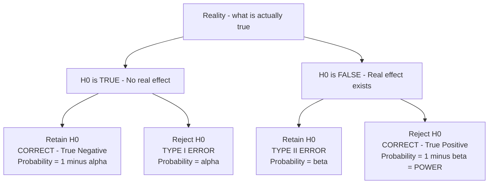
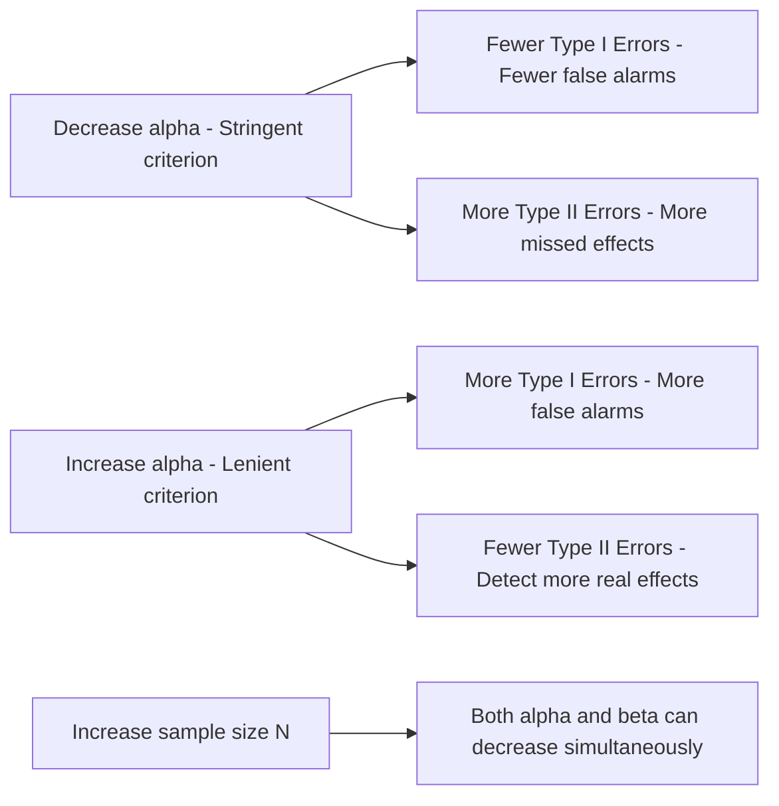

# Type I and Type II Errors: Alpha, Beta, and Statistical Power

## Introduction

Hypothesis testing is a probability-based system — and wherever there is probability, there is the possibility of error. Even when researchers follow every statistical procedure correctly, they can still arrive at the wrong conclusion. These are not *calculation* errors or *procedural* errors — they are **decision errors**: situations where correct procedures lead to incorrect conclusions.

Understanding Type I and Type II errors is not just an academic exercise. The history of psychology is filled with examples where decision errors led entire research programmes down wrong paths, influenced clinical practice, or missed genuine discoveries. Getting the error logic right is fundamental to scientific integrity.

> 📄 **Source PDF**: [Block-1/Unit-3.pdf — Pages 43–45](/pdfs/MPC-006%20Statistics%20in%20Psychology/Block-1/Unit-3.pdf)  
> 📚 MPC-006 Statistics in Psychology, IGNOU

---

## Why Decision Errors Are Inevitable

Hypothesis testing is based on making decisions about **populations** from **samples**. Samples are always incomplete pictures of populations. Even a perfectly random, representative sample may — by chance — produce an extreme result that does not reflect the population truth.

**The fundamental tension**: We only decide to reject H₀ when the sample result is very unlikely under H₀ (say, p < .05). But "very unlikely" is not "impossible." That 5% or 1% chance of an extreme result under H₀ is precisely the chance that we commit a decision error.

Two types of decision error are possible, and they are mirror images of each other.

---

## Type I Error (α — False Positive)

### Definition

A **Type I error** occurs when you **reject the null hypothesis when it is actually true**.

In plain language: You conclude the research hypothesis is supported — you claim an effect exists — when in reality there is no effect. The result was an extreme fluke of random sampling.

### The Significance Level *is* the Type I Error Rate

The probability of committing a Type I error equals **α** (alpha) — the significance level you set. This is not a coincidence; it is the literal meaning of what the significance level represents.

| Significance Level | Meaning | Type I Error Rate |
|-------------------|---------|------------------|
| α = .05 | Results must be in most extreme 5% to reject H₀ | 5% chance of false alarm |
| α = .01 | Results must be in most extreme 1% to reject H₀ | 1% chance of false alarm |
| α = .001 | Results must be in most extreme 0.1% to reject H₀ | 0.1% chance of false alarm |

**Worked example from IGNOU text**:  
Suppose a clinical psychologist tests a new therapy for depression using α = .05. If the therapy is actually *no different* from the standard treatment, but by random chance the selected patient responds unusually well, the Z score might still cross the cutoff. The psychologist rejects H₀ and concludes the new therapy is superior — but this conclusion is wrong. This is a Type I error. The probability of this happening is exactly 5% (= α).

### Why Type I Errors Are Called "Type I"

Type I errors are designated "Type I" because they are considered the more *serious* error in most research contexts. A false positive can:
- Launch entire research programmes based on a non-existent effect
- Lead to clinical adoption of ineffective (or even harmful) treatments
- Consume massive research funding chasing a phantom result
- Undermine public trust in science when results fail to replicate

### How to Reduce Type I Error

**Set a lower alpha.** Moving from α = .05 to α = .001 makes it much harder to achieve significance — only very extreme results count. The IGNOU text compares this to "buying insurance against making a Type I error."

But there is a cost — which brings us to Type II errors.

🔗 **Further Reading**:
- [Wikipedia: Type I Error](https://en.wikipedia.org/wiki/Type_I_and_type_II_errors)
- [Simply Psychology: Type I and Type II Errors](https://www.simplypsychology.org/type_I_and_type_II_errors.html)
- [Statistics How To: Type I vs Type II Error](https://www.statisticshowto.com/probability-and-statistics/statistics-definitions/type-i-error/)

---

## Type II Error (β — False Negative)

### Definition

A **Type II error** occurs when you **fail to reject the null hypothesis when it is actually false**.

In plain language: You conclude the study is inconclusive — you miss a real effect — when in reality the research hypothesis was true all along. The treatment worked, but your test was not sensitive enough to detect it.

The probability of making a Type II error is denoted **β** (beta).

### The "Insurance Cost" of Low Alpha

If you set a very stringent significance level (e.g., α = .001), you require an extremely extreme result before rejecting H₀. But if the real effect in the population is modest — the treatment works, but not dramatically — the sample result may not be extreme enough to cross that stringent cutoff. You therefore *fail* to detect a genuine effect.

**Example**: A new mindfulness programme genuinely reduces anxiety by a modest but real amount. But the researcher, worried about false positives, sets α = .001. With a small sample, the result (Z = −1.95) does not reach the stringent cutoff (Z = −3.09 for α = .001). The researcher concludes "inconclusive" — but the programme actually works. This is a Type II error.

### Consequences of Type II Errors

- Genuinely effective therapies are abandoned or never recommended
- Real psychological phenomena are dismissed as non-existent
- Under-powered research wastes participants' time and effort for inconclusive results
- Important scientific insights are delayed or lost

---

## The Full Decision Matrix

The relationship between the true state of reality and the researcher's decision produces four possible outcomes:

| | **H₀ is Actually TRUE** | **H₀ is Actually FALSE** |
|---|---|---|
| **Researcher retains H₀** | ✅ Correct Decision (True Negative) | ❌ **Type II Error (β)** — False Negative |
| **Researcher rejects H₀** | ❌ **Type I Error (α)** — False Positive | ✅ Correct Decision — **Power (1 − β)** |

**Key insight**: Of the four cells, researchers only *know* they are in one of them when they make a decision. The true state of reality is unknown — that is precisely why we do research. Decision errors can never be detected in any single study; they can only be estimated probabilistically.

---

## The Relationship Between Type I and Type II Errors

The IGNOU text identifies a fundamental trade-off: **for a fixed sample size, reducing the probability of one type of error increases the probability of the other.**

### The α–β Inverse Relationship

| If you... | Effect on α (Type I) | Effect on β (Type II) |
|-----------|---------------------|----------------------|
| Lower α (more stringent: .05 → .001) | Decreases | Increases |
| Raise α (more lenient: .05 → .20) | Increases | Decreases |
| Increase sample size N | Decreases | Decreases |

**This is the central dilemma of statistical research design.**

The only way to simultaneously reduce both α and β is to **increase the sample size (N)**. A larger sample gives more precise estimates of the population, making both false positives and false negatives less likely.

### The "Insurance" Analogy

The IGNOU text uses an insurance analogy:

- **Insurance against Type I errors** = Setting a low α = Stringent criterion = Better protection against false alarms, but *costs* more Type II errors
- **Insurance against Type II errors** = Setting a high α = Lenient criterion = Detects more real effects, but *costs* more Type I errors

The *premium* you pay for one type of protection is increased exposure to the other.

### Statistical Power (1 − β)

**Power** is the probability of correctly detecting a real effect — rejecting H₀ when it is truly false:

$$\text{Power} = 1 - \beta$$

A study with high power (e.g., 0.80 or 80%) has an 80% chance of detecting a real effect. The conventional standard in psychology is **power ≥ 0.80**.

Factors that increase power:
- Larger sample size (most important)
- Larger true effect size (the bigger the real difference, the easier to detect)
- Lower measurement error (more reliable instruments)
- Higher α level (but increases Type I error risk)
- One-tailed vs two-tailed test (one-tailed is more powerful for directional hypotheses)

🔗 **Further Reading**:
- [Wikipedia: Statistical Power](https://en.wikipedia.org/wiki/Power_of_a_test)
- [G*Power Software for Sample Size and Power Calculation](https://www.psychologie.hhu.de/arbeitsgruppen/allgemeine-psychologie-und-arbeitspsychologie/gpower)
- [Khan Academy: Type I and Type II Error](https://www.khanacademy.org/math/statistics-probability/significance-tests-one-sample/error-probabilities-and-power/v/introduction-to-type-i-and-type-ii-errors)

---

## Indian Context: Error Consequences in Applied Psychology

The consequences of Type I and Type II errors are particularly salient in applied Indian psychology:

**Clinical Setting (NIMHANS, hospitals)**:
- Type I error: Recommending an ineffective therapy → wasted resources, possibly harmful delays in evidence-based care
- Type II error: Missing an effective intervention for a patient population → people who could be helped continue to suffer

**Educational Psychology (NCERT research)**:
- Type I error: Implementing a teaching programme that does not actually improve learning → wasted curriculum reform
- Type II error: Dismissing a genuinely effective teaching method → students miss out

**Public Health (ICMR)**:
- Type I error: False signal of a risk factor → unnecessary public health interventions
- Type II error: Missing a genuine risk factor → preventable harm continues

These real-world stakes are why the choice of α — and adequate sample sizing for power — are ethical as much as statistical decisions.

---

## Recent Research Spotlight

**The Replication Crisis and Type I Error Rates (2019–2024)**

- **Ioannidis, J. P. A. (2005/highly cited through 2024)**. Why most published research findings are false. *PLOS Medicine*, 2(8), e124. Argues that field-wide use of α = .05 with small samples inflates false positive rates far beyond 5%. [DOI: 10.1371/journal.pmed.0020124](https://doi.org/10.1371/journal.pmed.0020124)

- **Button, K. S. et al. (2013/updated through 2024)**. Power failure: why small sample size undermines the reliability of neuroscience. *Nature Reviews Neuroscience*, 14(5), 365–376. Demonstrates that low power (high β) combined with α = .05 produces many false positives in published literature. [DOI: 10.1038/nrn3475](https://doi.org/10.1038/nrn3475)

- **Lakens, D. et al. (2022)**. Sample size justification. *Collabra: Psychology*, 8(1), 33267. Provides practical frameworks for power analysis to balance Type I and Type II error rates in psychological research. [DOI: 10.1525/collabra.33267](https://doi.org/10.1525/collabra.33267)

---

## Self-Assessment Questions

### Level 1 — Knowledge

1. Mark (T) for True and (F) for False:
   - a) The probability of making a Type II error is called β.
   - b) The significance level is the chance of making a Type II error.
   - c) The significance level is the chance of making a Type I error.
   - d) Increasing sample size can reduce both α and β simultaneously.

2. Define Type I error and Type II error in one sentence each.

3. What is the relationship between α (the significance level) and the probability of committing a Type I error?

### Level 2 — Comprehension

4. A researcher studying a new anti-anxiety medication sets α = .001. Explain: (a) how this affects the probability of Type I error, (b) how this affects the probability of Type II error, and (c) what the researcher would need to do to reduce both types of error.

5. A clinical psychologist concludes after a study that a new therapy is no more effective than the current treatment. Under what conditions would this conclusion represent a Type II error? Why can the researcher not be certain whether this error has occurred?

### Level 3 — Application/Analysis

6. *Ethical Dilemma*: A pharmaceutical company is testing a new psychiatric medication. They argue for using α = .20 so they can detect "any hint of an effect." A patient advocacy group argues for α = .001 to avoid false positives that could expose patients to an ineffective drug with side effects. Evaluate both positions using the Type I / Type II error framework. What sample size considerations are relevant?

---

## Memory Aids

### Mnemonic 1: The Two Error Types

**"Alpha Alarm, Beta Blind"**
- **Alpha (α) = Type I = False Alarm** — the null was true but we cried wolf
- **Beta (β) = Type II = Blind Miss** — the effect was real but we didn't see it

### Mnemonic 2: The Decision Matrix in Two Words

- **ACCEPT TRUE** = Correct (either direction)
- **REJECT TRUE** = Type **I** error (reject when true)
- **ACCEPT FALSE** = Type **II** error (accept when false)

### Mnemonic 3: The α–β Trade-off

**"Squeeze the balloon"** — push down α (one side) and β bulges up (other side); the only way to shrink the whole balloon is to increase N.

### Mnemonic 4: Power

**"Power = 1 minus missing the target"** — Power = 1 − β = probability of hitting the real effect when it exists.

---

## Key Terms Glossary

| Term | Definition |
|------|-----------|
| **Decision error** | An error arising from correct procedures producing wrong conclusions |
| **Type I error** | Rejecting H₀ when it is true — false positive |
| **Type II error** | Failing to reject H₀ when it is false — false negative |
| **Alpha (α)** | Probability of making a Type I error; equals the significance level |
| **Beta (β)** | Probability of making a Type II error |
| **Power (1 − β)** | Probability of correctly detecting a real effect |
| **Significance level** | The threshold probability (usually .05 or .01) for rejecting H₀ |
| **False positive** | Claiming an effect exists when it does not (Type I) |
| **False negative** | Failing to detect an effect that does exist (Type II) |
| **Sample size (N)** | The primary lever for reducing both error types simultaneously |

---

## Video Resources

- 🎥 [Crash Course Statistics: Type I and II Errors](https://www.youtube.com/watch?v=7mE-K_w1v90) — Clear visual explanation
- 🎥 [Khan Academy: Type I vs Type II Error](https://www.khanacademy.org/math/statistics-probability/significance-tests-one-sample/error-probabilities-and-power/v/introduction-to-type-i-and-type-ii-errors) — Animated walkthrough
- 🎥 [Statistics 101: Statistical Power](https://www.youtube.com/watch?v=Rsc5znwR5FA) — Brandon Foltz on power and sample size

---

## Cross-References

- 👉 [Hypothesis Testing Logic & Process](/mpc-006/block-1/hypothesis-testing-logic-process) — Previous: the process that generates these errors
- 👉 [One-Tailed vs Two-Tailed Tests & Decision Errors](/mpc-006/block-1/one-tailed-two-tailed-decision-errors) — Next: how test direction interacts with error rates
- 👉 [Inferential Statistics & Hypothesis Testing](/mpc-006/block-1/inferential-statistics-hypothesis-testing) — Unit 2: broader inferential context
