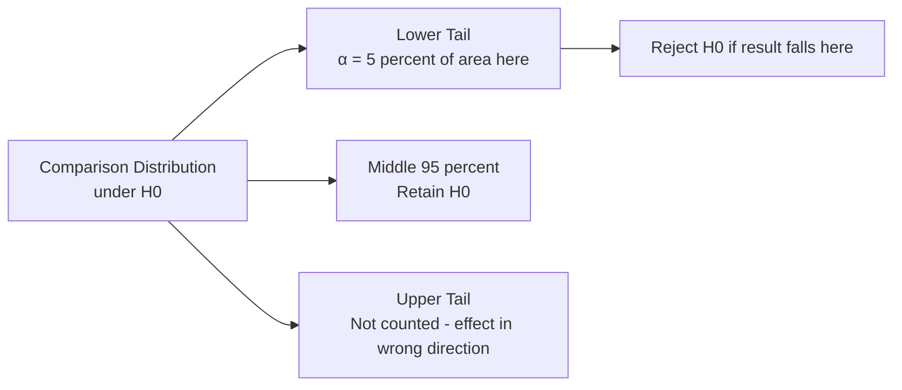
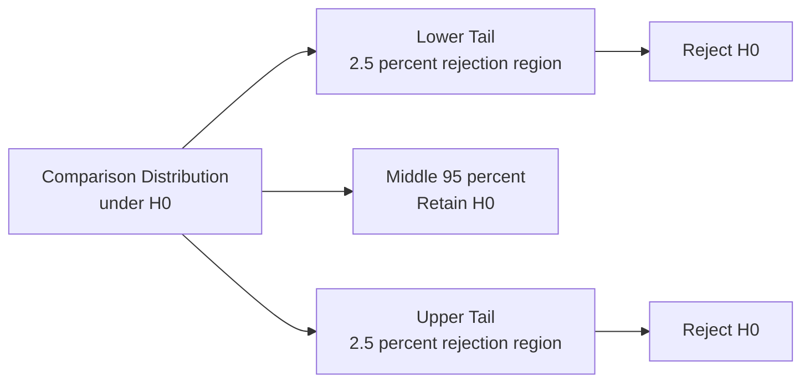
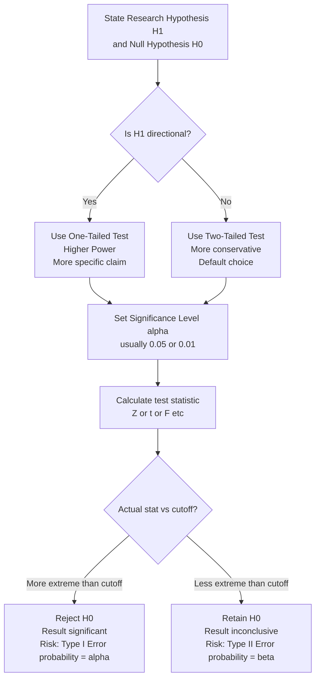

# One-Tailed and Two-Tailed Tests, and Decision Errors in Context

## Introduction

When formulating the alternative hypothesis (H₁), a researcher faces a fundamental choice: do they predict *what kind of difference* will exist, or just *that a difference* will exist? This choice determines whether a one-tailed or two-tailed test is appropriate — and it has real consequences for statistical power and the risk of decision errors.

This file covers the logic of directional (one-tailed) and non-directional (two-tailed) hypothesis tests, why the distinction matters, how significance thresholds differ between them, and how this connects back to the broader framework of decision errors in psychological research.

> 📄 **Source PDF**: [Block-1/Unit-3.pdf — Pages 42–45](/pdfs/MPC-006%20Statistics%20in%20Psychology/Block-1/Unit-3.pdf)  
> 📚 MPC-006 Statistics in Psychology, IGNOU

---

## Directional vs Non-Directional Hypotheses

The starting point for choosing between one-tailed and two-tailed tests is the nature of the research hypothesis.

### Directional Hypothesis

A **directional hypothesis** specifies *both* that an effect exists *and* which direction it will go.

**Examples**:
- "Babies given the vitamin will walk *earlier* than control babies" — specifies direction (earlier, not later)
- "People who receive $10 million will be *happier* than average" — specifies direction (happier, not less happy)
- "Cognitive-behavioural therapy will *reduce* depression scores" — specifies direction (lower, not higher)

When the research hypothesis is directional, the corresponding null hypothesis is also directional — it states that the effect does not occur *in the predicted direction* (i.e., no effect, or the opposite effect).

| Directional H₁ | Corresponding H₀ |
|----------------|-----------------|
| μ₁ < μ₂ (group 1 scores lower) | μ₁ ≥ μ₂ (group 1 not lower) |
| μ₁ > μ₂ (group 1 scores higher) | μ₁ ≤ μ₂ (group 1 not higher) |

### Non-Directional Hypothesis

A **non-directional hypothesis** predicts that an effect exists but does not specify which direction.

**Examples**:
- "A new social skills programme will *change* productivity levels" — does not specify higher or lower
- "Yoga practice is *associated with* changes in anxiety" — does not specify increase or decrease
- "The experimental drug will have *some effect* on sleep duration" — bidirectional

Non-directional hypotheses are used when:
- Theory does not clearly predict direction
- The effect could plausibly go either way
- The researcher wants to remain exploratory

---

## One-Tailed Tests (Directional)

A **one-tailed test** is used when testing a directional hypothesis. It is also called a *directional test* because the rejection region is placed in only one tail of the comparison distribution.

### Logic of One-Tailed Testing

If the researcher predicts a specific direction (e.g., treatment reduces anxiety — scores will be *lower*), they only care about results in the lower tail of the comparison distribution. A result in the *upper* tail (treatment actually *increases* anxiety) would be treated the same as a result in the middle — neither would lead to rejection of H₀.

**Cutoff for one-tailed test at α = .05**: The most extreme 5% of scores in the *predicted* direction.  
- Lower-tail test: Z < −1.65
- Upper-tail test: Z > +1.65

### Advantage of One-Tailed Tests

One-tailed tests are **more powerful** than two-tailed tests. Because all 5% of the rejection region is concentrated in one tail (rather than split 2.5% each side), it is *easier* to achieve significance if the effect occurs in the predicted direction.

| Test Type | Cutoff Z (α = .05) | Rejection Region |
|-----------|-------------------|-----------------|
| One-tailed (lower) | Z < −1.65 | Only lower tail |
| One-tailed (upper) | Z > +1.65 | Only upper tail |
| Two-tailed | Z < −1.96 or Z > +1.96 | Both tails |

---

## Two-Tailed Tests (Non-Directional)

A **two-tailed test** is used when testing a non-directional hypothesis. It tests whether the sample mean is significantly different from the comparison distribution *in either direction* — higher or lower.

### Logic of Two-Tailed Testing

Because the researcher does not predict direction, an extreme result in *either* tail is relevant. The rejection region is therefore split equally between both tails of the comparison distribution.

**Cutoff for two-tailed test at α = .05**: Z < −1.96 or Z > +1.96 (the most extreme 5%, split 2.5% each tail).

### When to Use Two-Tailed Tests

Two-tailed tests are the **more conservative** and more commonly recommended choice in modern psychology, for several reasons:

1. **Theoretical humility**: It is hard to be certain in advance which direction an effect will go
2. **Avoiding bias**: Pre-deciding direction can create pressure to report only confirming results
3. **Convention**: Most peer-reviewed journals expect two-tailed tests by default unless a directional prediction is strongly theoretically justified

| Criterion | One-Tailed | Two-Tailed |
|-----------|-----------|-----------|
| Hypothesis type | Directional | Non-directional |
| Power | Higher | Lower |
| Critical value (α = .05) | ±1.65 | ±1.96 |
| Required justification | Specific theory/prediction | None needed |
| Recommended when | Strong prior evidence for direction | Default choice |
| Rejection region | One tail only | Both tails |

🔗 **Further Reading**:
- [Wikipedia: One-Tailed and Two-Tailed Tests](https://en.wikipedia.org/wiki/One-_and_two-tailed_tests)
- [Wikipedia: Statistical Hypothesis Testing](https://en.wikipedia.org/wiki/Statistical_hypothesis_testing)
- [APA: One-Tailed vs Two-Tailed Tests — Which to Use?](https://www.apa.org/science/about/psa/2012/02/one-tailed-tests)

---

## Decision Errors: Correct Procedures, Wrong Conclusions

Even when researchers correctly choose between one- and two-tailed tests, and correctly calculate their test statistics, they can still reach the wrong conclusion. These are **decision errors** — not calculation mistakes, but the inherent uncertainty of probabilistic reasoning.

### Why Decision Errors Are Unavoidable

The hypothesis-testing process sets the probability of decision errors as *small* as possible — but never zero. A significance level of .05 means that in 5% of studies where H₀ is actually true, random sampling alone will produce an extreme enough result to reject H₀. That 5% represents real studies producing real (but wrong) conclusions.

**Key insight from the IGNOU text**: "Decision errors are situations in which the right procedures lead to the wrong decisions."

### The Two Decision Errors Revisited in Context

**Type I Error (False Positive)**:
- Occurs when H₀ is true but is rejected
- Probability = α
- More likely when α is set leniently (e.g., .20)

**Type II Error (False Negative)**:
- Occurs when H₀ is false but is retained
- Probability = β
- More likely when α is set stringently (e.g., .001) with a small sample

### Misinterpreting "Not Significant"

A critical and common error in reading psychology research: **concluding that a non-significant result means the null hypothesis is true**.

The IGNOU text is clear: when a result is not extreme enough to reject H₀, the study is **inconclusive** — not evidence for the null. The treatment may still work, but the study may have been underpowered, used a small sample, or employed an insensitive measure.

**Example**: Suppose the specially purified vitamin genuinely speeds up walking, but only by 2 months (not 8). A study using a sample of 1 baby would almost certainly fail to detect this modest effect. The researcher concludes "inconclusive" — but the vitamin works. This is a Type II error, and the non-significant result must not be reported as "the vitamin has no effect."

### Research Articles and Decision Error Reporting

In practice:
- Published articles report whether a result was *significant* (rejected H₀) or *not significant* (retained H₀)
- Articles rarely explicitly discuss decision errors — the error framework is implied by reporting α
- The significance level used (p < .05, p < .01, p < .001) signals the researcher's chosen Type I error rate
- Modern reporting also includes **effect sizes** and **confidence intervals** to help readers assess practical significance beyond statistical significance

---

## Putting It All Together: A Unified Framework

---

## Indian Context: Directional Hypotheses in Indian Psychological Research

Indian psychology has a strong tradition of directional hypotheses, particularly in:

- **Yoga and meditation research**: Studies routinely predict that practice will *decrease* stress or *increase* well-being — directional, one-tailed
- **Gender differences**: Studies predict specific directions based on sociocultural theory (e.g., women will score *higher* on agreeableness)
- **Educational interventions**: Remedial programmes are predicted to *improve* (not just change) academic performance

The choice of one-tailed vs two-tailed in such contexts reflects the strength of theoretical foundations. Indian researchers publishing in journals indexed by UGC/SCOPUS are expected to justify their choice explicitly.

🔗 **Further Reading**:
- [Indian Journal of Psychiatry](https://journals.lww.com/indianjpsychiatry/Pages/default.aspx)
- [Psychological Studies — Springer India](https://www.springer.com/journal/12646)

---

## Recent Research Spotlight

**The One-Tailed vs Two-Tailed Debate (2019–2024)**

- **Cho, H. C., & Abe, S. (2013/widely cited through 2024)**. Is two-tailed testing for directional research hypotheses tests legitimate? *Journal of Business Research*, 66(9), 1261–1266. Examines when one-tailed tests are appropriately justified vs. when they inflate false positive rates. [DOI: 10.1016/j.jbusres.2012.02.023](https://doi.org/10.1016/j.jbusres.2012.02.023)

- **Ruxton, G. D., & Neuhäuser, M. (2010/updated through 2024)**. When should we use one-tailed hypothesis testing? *Methods in Ecology and Evolution*, 1(2), 114–117. Practical guidance on when directional tests are scientifically justified. [DOI: 10.1111/j.2041-210X.2010.00014.x](https://doi.org/10.1111/j.2041-210X.2010.00014.x)

---

## Self-Assessment Questions

### Level 1 — Knowledge

1. Mark (T) for True and (F) for False:
   - a) A one-directional hypothesis is tested with a two-tailed test.
   - b) A hypothesis which predicts an effect but does not predict direction is non-directional.
   - c) A one-tailed test can be one-tailed in either direction.
   - d) Two-tailed tests are more powerful than one-tailed tests.

2. What is the cutoff Z-score for a one-tailed test at α = .05? For a two-tailed test at α = .05?

3. Define: (a) comparison distribution, (b) research hypothesis, (c) directional hypothesis.

### Level 2 — Comprehension

4. A researcher studying the effects of social media use on adolescent self-esteem cannot predict from theory whether use will increase or decrease self-esteem. Should she use a one-tailed or two-tailed test? What cutoff Z would she use at α = .05?

5. A result is Z = +1.80. Is this significant for: (a) a one-tailed upper-tail test at α = .05? (b) a two-tailed test at α = .05? What does this difference illustrate about the choice of test type?

### Level 3 — Application/Analysis

6. *Methodology critique*: A researcher first collects data (Z = +2.10), sees the data is in the positive direction, and *then* decides to use a one-tailed upper-tail test to achieve p < .05 (which would not be significant with a two-tailed test at α = .05). Explain why this practice is problematic in terms of: (a) Type I error rates, (b) scientific integrity, and (c) the pre-registration solution.

---

## Memory Aids

### Mnemonic 1: One-Tailed vs Two-Tailed

**"One tail means you bet on a horse; two tails means any horse wins"**
- One-tailed: You predict the *specific* direction — bet on one horse
- Two-tailed: Either direction counts — any horse that runs wins

### Mnemonic 2: Critical Z Values to Memorise

| Situation | Z cutoff |
|-----------|---------|
| One-tailed α = .05 | ±1.65 |
| Two-tailed α = .05 | ±1.96 |
| Two-tailed α = .01 | ±2.58 |

**"One sixty-five — one-tail five percent; One ninety-six — two-tail five percent; Two fifty-eight — two-tail one percent"**

### Mnemonic 3: The Directional Test Trade-off

**"One tail: more power, less proof"** — one-tailed is more sensitive but requires a specific directional prediction that must be justified in advance.

---

## Key Terms Glossary

| Term | Definition |
|------|-----------|
| **Directional hypothesis** | Research hypothesis predicting both existence and direction of effect |
| **Non-directional hypothesis** | Research hypothesis predicting existence but not direction of effect |
| **One-tailed test** | Hypothesis test using a rejection region in only one tail |
| **Two-tailed test** | Hypothesis test using rejection regions in both tails |
| **Rejection region** | Area of the comparison distribution where H₀ is rejected |
| **Critical value** | The cutoff score that separates rejection and retention regions |
| **Decision error** | A wrong conclusion from correct statistical procedures |
| **Statistical significance** | A result extreme enough to reject H₀ at the chosen α level |
| **Inconclusive** | A result not extreme enough to reject H₀ — study is undecided |
| **Type I error** | Rejecting a true H₀ — false positive |
| **Type II error** | Retaining a false H₀ — false negative |

---

## Video Resources

- 🎥 [Crash Course Statistics: One-Tailed and Two-Tailed Tests](https://www.youtube.com/watch?v=KMTSmpO9x40) — Visual explanation of tail regions
- 🎥 [Khan Academy: One-Tailed and Two-Tailed Tests](https://www.khanacademy.org/math/statistics-probability/significance-tests-one-sample/tests-about-population-mean/v/one-tailed-and-two-tailed-tests) — Interactive step-by-step
- 🎥 [Statistics 101: Decision Errors and Power](https://www.youtube.com/watch?v=Rsc5znwR5FA) — Brandon Foltz connecting tail tests to error rates

---

## Cross-References

- 👉 [Hypothesis Testing Logic & Process](/mpc-006/block-1/hypothesis-testing-logic-process) — Foundation: the five-step testing process
- 👉 [Type I and Type II Errors](/mpc-006/block-1/type-i-type-ii-errors-alpha-beta) — Previous: deep dive into error types and power
- 👉 [Inferential Statistics & Hypothesis Testing](/mpc-006/block-1/inferential-statistics-hypothesis-testing) — Unit 2: broader inferential context
- 👉 [Parametric Tests: t, F, and Pearson r](/mpc-006/block-1/parametric-tests-t-f-pearson) — Unit 1: applying these principles in specific tests
