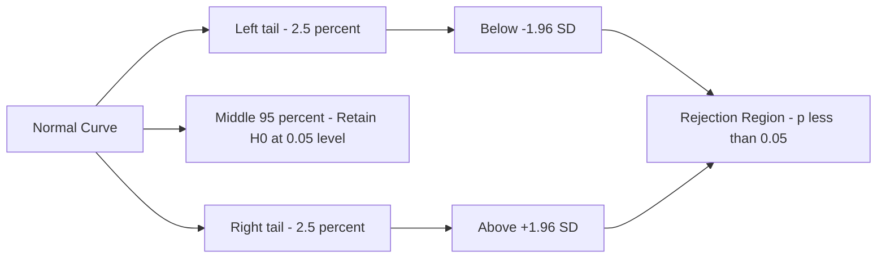
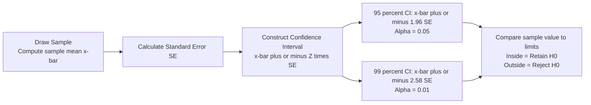

# Levels of Significance and Confidence Limits

## Introduction

Every time a researcher reports that a result is "statistically significant at p < .05", they are invoking the concept of **levels of significance** — one of the most important and frequently misunderstood ideas in psychological statistics. What does that p < .05 actually *mean*? How was that number chosen? What are we 95% confident about?

This file unpacks these questions completely, covering the meaning of significance levels, the concept of confidence limits, and how these two related ideas form the backbone of statistical decision-making in psychology.

> 📄 **Source PDF**: [Block-1/Unit-4.pdf — Pages 48–56](/pdfs/MPC-006%20Statistics%20in%20Psychology/Block-1/Unit-4.pdf)  
> 📚 MPC-006 Statistics in Psychology, IGNOU

---

## The Concept of Statistical Significance

The phrase **"test of significance"** was coined by Sir Ronald Fisher, one of the founding figures of modern statistics. In everyday speech, "significant" means "important." In statistics, it means something more precise: a result is **statistically significant** if it is **unlikely to have occurred by chance** under the null hypothesis.

**Critical distinction**: Statistical significance does NOT mean practical importance. A result can be statistically significant (unlikely by chance) but trivially small in real-world terms. This is particularly important in large-sample psychology research.

### Why Behavioural Scientists Accept Some Error

In behavioural sciences, nothing is absolute. Human behaviour is inherently variable — no two people respond identically to any stimulus. As the IGNOU text notes: *"behavioural scientists usually ignore the error to the maximum of 5%."* This is the origin of the conventional α = .05 level.

---

## What is the Level of Significance?

The **level of significance** (also called the **α level** or **alpha level**) is an arbitrary standard — a cut-off point on the probability scale — that separates:

- Results considered **significant** (unlikely enough to reject H₀)
- Results considered **non-significant** (plausible under H₀ — insufficient to reject it)

The two most commonly used levels in social science research are:

| Level | Symbol | Meaning |
|-------|--------|---------|
| 5% level | α = .05 | Reject H₀ if result has less than 5% probability under H₀ |
| 1% level | α = .01 | Reject H₀ if result has less than 1% probability under H₀ |

### Levels of Significance as Levels of Confidence

Because significance and confidence are complementary (they add to 100%), these levels are sometimes called **levels of confidence**:

| Level of Significance | Level of Confidence | Interpretation |
|----------------------|---------------------|----------------|
| .05 (5%) | 95% | If the experiment were repeated 100 times, the obtained mean would fall outside the limits μ ± 1.96 SE on only 5 occasions |
| .01 (1%) | 99% | If the experiment were repeated 100 times, the obtained mean would fall outside the limits μ ± 2.58 SE on only 1 occasion |

The values **1.96** and **2.58** are the Z-scores corresponding to the 5% and 1% significance levels respectively (from t-tables for large samples):

$$Z_{.05} = \pm 1.96 \quad \text{(two-tailed, } \alpha = .05\text{)}$$

$$Z_{.01} = \pm 2.58 \quad \text{(two-tailed, } \alpha = .01\text{)}$$

**Key rule**: If a result is significant at .01, it is automatically significant at .05. The reverse is not always true.

🔗 **Further Reading**:
- [Wikipedia: Statistical Significance](https://en.wikipedia.org/wiki/Statistical_significance)
- [Wikipedia: P-value](https://en.wikipedia.org/wiki/P-value)
- [APA: What Does Significance Mean?](https://www.apa.org/monitor/2015/04/p-value)

---

## Confidence Limits (Fiduciary Limits)

**Confidence limits** (also called **fiduciary limits**) are the boundaries within which a hypothesis should lie with specified probability. They define a range — the **confidence interval** — within which we expect the true population parameter to fall.

### Decision Rule Using Confidence Limits

- If the sample value lies **within** the confidence limits → **Accept H₀** at the specified significance level
- If the sample value lies **outside** the confidence limits → **Reject H₀** at the specified significance level

### The Two Standard Confidence Intervals

For large samples (using the normal distribution):

**95% Confidence Interval** (corresponding to α = .05):
$$CI_{95\%} = \bar{x} \pm 1.96 \times SE_{\bar{x}}$$

**99% Confidence Interval** (corresponding to α = .01):
$$CI_{99\%} = \bar{x} \pm 2.58 \times SE_{\bar{x}}$$

Where $SE_{\bar{x}}$ is the **Standard Error of the Mean** (discussed in the next file).

### Interpreting Confidence Intervals

A **95% confidence interval** means: if we were to draw 100 different random samples from the same population and construct 100 confidence intervals, approximately 95 of them would contain the true population mean (μ).

**Important**: The 95% refers to the procedure's long-run accuracy — not to any single interval. For any given computed interval, the true mean either is or is not inside it.

---

## The p-value: The Observed Level of Significance

The **p-value** (probability value) is a measure of how likely the sample results are, **assuming the null hypothesis is true**. It is sometimes called the **observed level of significance**.

| p-value | Meaning |
|---------|---------|
| **Small p** (e.g., p = .02) | Results are unlikely under H₀ → strong evidence against H₀ |
| **Large p** (e.g., p = .43) | Results are plausible under H₀ → insufficient evidence to reject H₀ |

**Decision rule**:
- If p ≤ α → **Reject H₀** (result is statistically significant)
- If p > α → **Retain H₀** (result is not statistically significant)

**Example**: If a researcher sets α = .05 and obtains p = .03, the null hypothesis is rejected because .03 < .05. The result is reported as significant at the 5% level.

### What the p-value Does NOT Mean

A common misconception: p = .05 does **not** mean there is a 5% chance the null hypothesis is true. The p-value is about the data *given* H₀ is true, not about whether H₀ is true. This distinction matters deeply for correct interpretation.

🔗 **Further Reading**:
- [Wikipedia: Confidence Interval](https://en.wikipedia.org/wiki/Confidence_interval)
- [Khan Academy: Confidence Intervals](https://www.khanacademy.org/math/statistics-probability/confidence-intervals-one-sample)
- [ASA Statement on p-values](https://www.amstat.org/asa/files/pdfs/P-ValueStatement.pdf)

---

## Accepting and Rejecting H₀: The Right Language

The IGNOU text emphasises a crucial point about the language of statistical conclusions:

| Situation | Correct Language | Incorrect Language |
|-----------|-----------------|-------------------|
| p ≤ α | "Results are statistically significant" / "Reject H₀" | "Hypothesis is proved" / "Hypothesis is true" |
| p > α | "Results are not statistically significant" / "Do not reject H₀" | "Null hypothesis is proved" / "No effect exists" |

**Why "prove" is never appropriate**: Research results are based on probabilities. Even a rejected H₀ might have been true — we may have committed a Type I error. Using "prove" overstates what statistics can deliver.

---

## Indian Context: Significance Levels in Indian Psychological Research

Indian psychology researchers typically follow the international convention of α = .05 as the standard level, with α = .01 used when more stringent evidence is required (e.g., clinical trials, medical psychology, policy-relevant studies).

Key Indian applications:
- **NIMHANS clinical trials**: Often use α = .01 for new therapeutic interventions
- **NCERT educational studies**: α = .05 for achievement and intervention research
- **ICMR epidemiological work**: α = .05 with power ≥ 0.80 increasingly mandated

The **Indian Journal of Psychiatry** and **Psychological Studies** both require explicit reporting of α levels and p-values in all hypothesis-testing studies.

🔗 **Further Reading**:
- [Indian Journal of Psychiatry](https://journals.lww.com/indianjpsychiatry/Pages/default.aspx)
- [ICMR Guidelines for Clinical Research](https://www.icmr.gov.in/guidelines.html)

---

## Recent Research Spotlight

**The p-value Debate: Significance Levels Under Scrutiny (2019–2024)**

- **Wasserstein, R. L., Schirm, A. L., & Lazar, N. A. (2019)**. Moving to a World Beyond "p < 0.05." *The American Statistician*, 73(S1), 1–19. The American Statistical Association's landmark statement calling for richer reporting beyond binary significance decisions. [DOI: 10.1080/00031305.2019.1583913](https://doi.org/10.1080/00031305.2019.1583913)

- **Amrhein, V., Greenland, S., & McShane, B. (2019)**. Scientists rise up against statistical significance. *Nature*, 567, 305–307. Signed by over 800 scientists — argues for abandoning the term "statistical significance" in favour of reporting full uncertainty. [DOI: 10.1038/d41586-019-00857-9](https://doi.org/10.1038/d41586-019-00857-9)

---

## Self-Assessment Questions

### Level 1 — Knowledge

1. Fill in the blanks:
   - a) Generally the .05 and the __________ levels of significance are mostly used.
   - b) At the .05 level of significance, the amount of confidence will be __________.
   - c) In case of a two-tailed test at α = .05, the critical Z values are __________ and __________.
   - d) If a result is significant at the .01 level, it is automatically significant at the __________ level.

2. Define confidence limits (fiduciary limits) in your own words.

3. What is a p-value? How is it used to make a statistical decision?

### Level 2 — Comprehension

4. A researcher obtains a Z-score of 2.10. Should H₀ be rejected (a) at the .05 level (two-tailed)? (b) at the .01 level (two-tailed)? Explain what each decision means.

5. Explain why a researcher should never say that a result "proves" the research hypothesis, even when H₀ is rejected at the .01 level.

### Level 3 — Application/Analysis

6. *Critical Thinking*: Two researchers study the same phenomenon. Researcher A sets α = .05 and reports p = .04 (significant). Researcher B sets α = .01 and reports p = .04 (not significant). They appear to reach opposite conclusions from the same p-value. Explain how this is possible and what it reveals about the arbitrary nature of significance thresholds. How might each researcher justify their choice of α?

---

## Memory Aids

### Mnemonic 1: The Two Standard Levels
**"Point-Oh-Five means Ninety-Five; Point-Oh-One means Ninety-Nine"**
- α = .05 → 95% confidence, Z = ±1.96
- α = .01 → 99% confidence, Z = ±2.58

### Mnemonic 2: Z Cutoff Values
**"One point Nine Six — Five percent; Two point Five Eight — One percent"**  
(1.96 for 5%; 2.58 for 1%)

### Mnemonic 3: Confidence vs Significance
**"They add to 100"**: Confidence level + Significance level = 100%  
(95% confidence = 5% significance; 99% confidence = 1% significance)

---

## Key Terms Glossary

| Term | Definition |
|------|-----------|
| **Level of significance** | The probability threshold (α) below which H₀ is rejected; the acceptable Type I error rate |
| **Level of confidence** | Complement of significance level (1 − α); e.g., 95% at α = .05 |
| **Confidence limits** | The upper and lower boundaries of a confidence interval |
| **Confidence interval** | A range of values expected to contain the true parameter with stated probability |
| **Fiduciary limits** | Another name for confidence limits |
| **p-value** | Observed level of significance; probability of the result given H₀ is true |
| **Critical region** | The area of the comparison distribution where H₀ is rejected |
| **Critical value** | The Z or t score that marks the boundary of the critical region |
| **Standard error (SE)** | The standard deviation of the sampling distribution |
| **α (alpha)** | Probability of Type I error; equals the significance level |

---

## Video Resources

- 🎥 [Crash Course Statistics: p-values](https://www.youtube.com/watch?v=bf3egy7TQ2Q) — Visual, accessible explanation
- 🎥 [Khan Academy: Significance Level Alpha](https://www.khanacademy.org/math/statistics-probability/significance-tests-one-sample/idea-of-significance-tests/v/idea-behind-hypothesis-testing) — Step-by-step
- 🎥 [StatQuest: p-values, clearly explained](https://www.youtube.com/watch?v=5Z9OIYA8He8) — Josh Starmer's highly acclaimed explanation

---

## Cross-References

- 👉 [Standard Error, Sample Size & the Z/t Decision](/mpc-006/block-1/standard-error-sample-size-z-t-decision) — Next: how SE and N determine which test to use
- 👉 [Setting Up Significance — Steps, Critical Region & p-value](/mpc-006/block-1/setting-up-significance-steps-critical-region) — Next: the complete step-by-step procedure
- 👉 [Type I and Type II Errors](/mpc-006/block-1/type-i-type-ii-errors-alpha-beta) — Unit 3: the error framework underlying significance decisions
