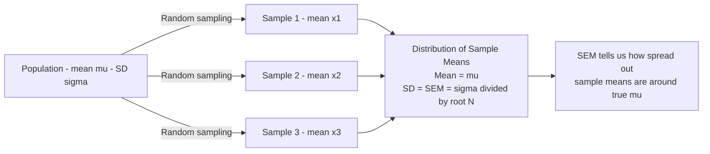
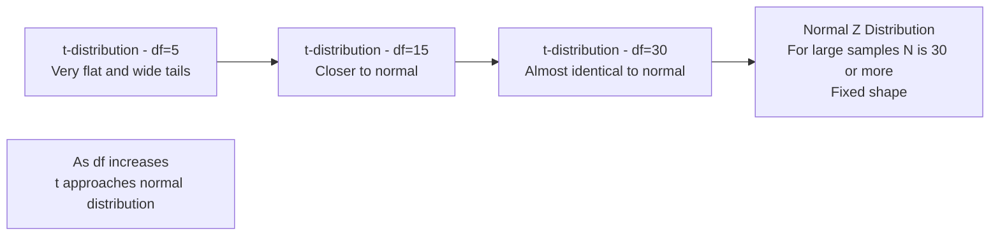

# Standard Error, Sample Size, and the Z vs t Decision

## Introduction

When testing a hypothesis, the researcher must answer a practical question before computing any test statistic: **which distribution should I compare my result against — the normal (Z) distribution or the t-distribution?** The answer depends critically on sample size and whether the population standard deviation is known.

This file covers the Standard Error of the Mean (SEM) — the key building block of all significance testing — and how sample size determines the shape of the comparison distribution, driving the choice between Z and t.

> 📄 **Source PDF**: [Block-1/Unit-4.pdf — Pages 56–59](/pdfs/MPC-006%20Statistics%20in%20Psychology/Block-1/Unit-4.pdf)  
> 📚 MPC-006 Statistics in Psychology, IGNOU

---

## The Standard Error of the Mean (SEM)

### What is Standard Error?

The **Standard Error of the Mean** (SEM or $\sigma_{\bar{x}}$) is the standard deviation of the *sampling distribution of the mean* — that is, it quantifies how much sample means vary from sample to sample when repeatedly drawn from the same population.

$$SE_{\bar{x}} = \frac{\sigma}{\sqrt{N}}$$

Where:
- $\sigma$ = population standard deviation
- $N$ = sample size

When the population SD is unknown (common in practice), it is estimated using the sample SD ($s$):

$$SE_{\bar{x}} \approx \frac{s}{\sqrt{N}}$$

### Why Standard Error Matters for Hypothesis Testing

The SEM is the unit of measurement for the comparison distribution. It tells us:

1. **How precise** our sample mean is as an estimate of the population mean
2. **How extreme** a sample mean must be (in SE units) to reject H₀

A **large SEM** means sample means vary a lot → we need a very extreme result to be confident it isn't chance  
A **small SEM** means sample means are consistent → even moderate deviations from μ can be significant

### The Inverse Relationship: N and SEM

As sample size increases, SEM decreases — larger samples produce more precise estimates:

$$SE_{\bar{x}} = \frac{\sigma}{\sqrt{N}} \quad \Rightarrow \quad \text{Larger N} \Rightarrow \text{Smaller SE} \Rightarrow \text{More precise estimate}$$

| Sample Size (N) | Effect on SEM | Implication |
|----------------|---------------|-------------|
| Small (N = 9) | Large SEM | High variability; harder to detect real effects |
| Medium (N = 25) | Moderate SEM | Reasonable precision |
| Large (N = 100) | Small SEM | High precision; even small effects detectable |

**Example**: If σ = 15 (like IQ SD):
- N = 9: SEM = 15/√9 = 5.0
- N = 25: SEM = 15/√5 = 3.0
- N = 100: SEM = 15/√100 = 1.5

🔗 **Further Reading**:
- [Wikipedia: Standard Error](https://en.wikipedia.org/wiki/Standard_error)
- [Khan Academy: Standard Error of the Mean](https://www.khanacademy.org/math/statistics-probability/sampling-distributions-library/sampling-distribution-mean/v/standard-error-of-the-mean)
- [Statistics How To: Standard Error](https://www.statisticshowto.com/what-is-the-standard-error-of-the-mean/)

---

## Sample Size and the Choice of Distribution

### The Fundamental Rule

The choice of whether to use the **normal (Z) distribution** or the **t-distribution** for hypothesis testing depends primarily on sample size:

| Condition | Distribution to Use | Critical Values |
|-----------|--------------------|-----------------| 
| Large sample (N ≥ 30) | Normal distribution (Z) | Z = ±1.96 (α = .05), Z = ±2.58 (α = .01) |
| Small sample (N < 30) | t-distribution | Values from t-tables, depend on df |

**The reason**: When N is large, the Central Limit Theorem guarantees the sampling distribution of the mean is approximately normal — regardless of the shape of the population distribution. When N is small, this guarantee no longer holds, and the t-distribution provides a more accurate model.

### The t-Distribution

The **t-distribution** (Student's t-distribution) is:
- **Symmetrical** and **bell-shaped** — like the normal curve
- **Flatter and wider** than the normal distribution — especially with small N
- **Approaches the normal distribution** as N (and df) increases

The key difference from Z: the t-distribution has an additional parameter called **degrees of freedom (df)**, which changes its shape.

### Degrees of Freedom (df)

**Degrees of freedom** = the number of independent pieces of information available for estimating a parameter.

For a single-sample t-test:
$$df = N - 1$$

For a two-sample t-test (comparing two independent groups):
$$df = N_1 + N_2 - 2$$

The df determines which row of the t-table to read. As df increases, the required t value for significance decreases (approaching the Z values of 1.96 and 2.58).

**Example**: A researcher tests a sample of 16 infants' weights. df = 16 − 1 = 15. She reads the t-table at df = 15 for the critical t values at .05 and .01 levels.

---

## Large Samples vs Small Samples: Key Differences

| Feature | Large Sample (N ≥ 30) | Small Sample (N < 30) |
|---------|----------------------|----------------------|
| **Comparison distribution** | Normal (Z) | t-distribution |
| **SD formula denominator** | N | N − 1 (corrected) |
| **Critical values** | Fixed: 1.96 and 2.58 | Variable: from t-table with df |
| **Table used** | Normal distribution table | t-distribution table |
| **Assumption about population** | Less strict (CLT applies) | Should be approximately normal |

### Why N-1 Instead of N for Small Samples?

When computing the sample standard deviation for small samples, the denominator is **N − 1** (not N):

$$s = \sqrt{\frac{\sum(x - \bar{x})^2}{N-1}}$$

Using N − 1 produces an **unbiased estimate** of the population standard deviation. Small samples tend to underestimate population variability when N is used in the denominator; the correction to N − 1 compensates for this.

🔗 **Further Reading**:
- [Wikipedia: Student's t-distribution](https://en.wikipedia.org/wiki/Student%27s_t-distribution)
- [Wikipedia: Degrees of Freedom (Statistics)](https://en.wikipedia.org/wiki/Degrees_of_freedom_(statistics))
- [Khan Academy: t-distributions](https://www.khanacademy.org/math/statistics-probability/significance-tests-one-sample/tests-about-population-mean/v/when-to-use-t-distribution)

---

## The Standard Error of the Median ($\sigma_{Mdn}$)

Most significance testing is based on the mean — but the median is sometimes preferred (especially with skewed data or ordinal-level measurement). The **Standard Error of the Median** quantifies variability in sample medians:

$$\sigma_{Mdn} = \frac{1.253 \cdot \sigma}{\sqrt{N}}$$

**Key fact**: The variability of sample medians is about **25% greater** than the variability of sample means in a normally distributed population (hence the 1.253 multiplier). This means confidence intervals for medians are wider than those for means — the median is a *less efficient* estimator.

**When to use the standard error of the median**:
- When the distribution is markedly skewed
- When data are ordinal-level
- When extreme outliers make the mean an inappropriate measure of central tendency

---

## Practical Application: The Full Z-Score Formula for Hypothesis Testing

Once the SEM is computed, the **Z-score** for hypothesis testing is:

$$Z = \frac{\bar{x} - \mu}{\sigma_{\bar{x}}} = \frac{\bar{x} - \mu}{\sigma / \sqrt{N}}$$

This Z tells us: *how many standard errors is our sample mean from the hypothesised population mean?*

**Worked example** (from the IGNOU text — infant weight study):  
- Population: μ = 13 kg (national average weight of 2-year-olds), σ = 2 kg
- Sample: N = 16 infants given increased stimulation; sample mean = 14 kg
- SEM = 2/√16 = 2/4 = 0.5
- Z = (14 − 13)/0.5 = **2.0**

At α = .05 (one-tailed), the critical Z = 1.65. Since 2.0 > 1.65, we reject H₀ and conclude that increased stimulation affected weight.

---

## Indian Context: Sample Size Challenges in Indian Research

Indian psychological research frequently faces practical constraints on sample size. Community studies in rural India, clinical samples at hospitals like AIIMS or NIMHANS, and school-based studies often work with N < 30 in specific subgroups.

This makes understanding the t-distribution especially important for Indian researchers. Many published Indian studies correctly use t-tests rather than Z-tests, and degrees-of-freedom reporting is expected in APA-formatted manuscripts (which most UGC-listed journals require).

**Important**: The ICMR's biomedical research guidelines and the UGC's research ethics framework both emphasise adequate sample sizing — recognising that under-powered studies (small N) increase both Type II error risk and the risk that significant findings are false positives.

🔗 **Further Reading**:
- [ICMR National Ethical Guidelines](https://www.icmr.gov.in/guidelines.html)
- [NIMHANS Research Publications](https://nimhans.ac.in/research/)

---

## Recent Research Spotlight

**Standard Error, Sample Size, and Replication (2019–2024)**

- **Button, K. S. et al. (2013/widely cited through 2024)**. Power failure: why small sample size undermines the reliability of neuroscience. *Nature Reviews Neuroscience*, 14, 365–376. Shows that small samples produce inflated SEM and unreliable results. [DOI: 10.1038/nrn3475](https://doi.org/10.1038/nrn3475)

- **Lakens, D. et al. (2022)**. Sample size justification. *Collabra: Psychology*, 8(1), 33267. Practical guidelines for justifying sample size in relation to SE and desired precision. [DOI: 10.1525/collabra.33267](https://doi.org/10.1525/collabra.33267)

---

## Self-Assessment Questions

### Level 1 — Knowledge

1. Write the formula for the Standard Error of the Mean and explain each component.

2. A researcher has σ = 12 and collects a sample of N = 36. Calculate the SEM.

3. When should a researcher use (a) the normal Z distribution and (b) the t-distribution for hypothesis testing?

### Level 2 — Comprehension

4. A researcher obtains t(14) = 2.18 from a small sample study. What does "14" represent here? What does this value tell her about statistical significance (you may refer to a t-table)?

5. Explain why the Standard Error of the Median is 25% larger than the Standard Error of the Mean. What does this imply about using medians vs means for inference?

### Level 3 — Application/Analysis

6. *Design problem*: A psychologist wants to detect a mean difference of 5 points on a stress inventory where σ = 15. She wants α = .05 (two-tailed) and is willing to accept β = .20 (power = 80%). Explain qualitatively — without computing — how increasing N from 20 to 50 would change (a) the SEM, (b) the Z score, and (c) the likelihood of rejecting H₀ if the true effect exists.

---

## Memory Aids

### Mnemonic 1: The SEM Formula
**"Sigma over Root N"** → SE = σ/√N  
*"Sigma divided by root N — bigger N means smaller SE"*

### Mnemonic 2: Large vs Small Sample Rule
**"Thirty or more — use Z for sure; less than thirty — t gets dirty (complex)"**

### Mnemonic 3: The SE of Median
**"The median meanders more"** — medians vary 25% more than means → SEM × 1.253 = SE of Median

---

## Key Terms Glossary

| Term | Definition |
|------|-----------|
| **Standard Error of the Mean (SEM)** | Standard deviation of the sampling distribution of the mean; σ/√N |
| **Sampling distribution** | The theoretical distribution of a statistic (e.g., mean) over many samples |
| **t-distribution** | Bell-shaped probability distribution used for small samples; wider tails than normal |
| **Degrees of freedom (df)** | Number of independent pieces of information; N-1 for single-sample t-test |
| **Normal distribution (Z)** | Standard distribution used for large samples (N ≥ 30) |
| **Standard Error of Median** | Variability of sample medians; 1.253σ/√N |
| **Unbiased estimate** | Estimate whose expected value equals the true parameter |
| **Central Limit Theorem** | The sampling distribution of the mean approaches normality as N increases |

---

## Video Resources

- 🎥 [Crash Course Statistics: The Normal Distribution](https://www.youtube.com/watch?v=rBjft49MAO8) — Foundation for understanding comparison distributions
- 🎥 [Khan Academy: Standard Error of the Mean](https://www.khanacademy.org/math/statistics-probability/sampling-distributions-library/sampling-distribution-mean/v/standard-error-of-the-mean) — Step-by-step SEM calculation
- 🎥 [StatQuest: t-tests](https://www.youtube.com/watch?v=pTmLQvMM-1M) — Clear explanation of when and why to use t

---

## Cross-References

- 👉 [Levels of Significance & Confidence Limits](/mpc-006/block-1/levels-of-significance-confidence-limits) — Previous: the decision thresholds SEM feeds into
- 👉 [Setting Up Significance — Steps, Critical Region & p-value](/mpc-006/block-1/setting-up-significance-steps-critical-region) — Next: the complete procedural framework
- 👉 [Parametric Tests: t, F, and Pearson r](/mpc-006/block-1/parametric-tests-t-f-pearson) — Unit 1: applying t-tests in practice
