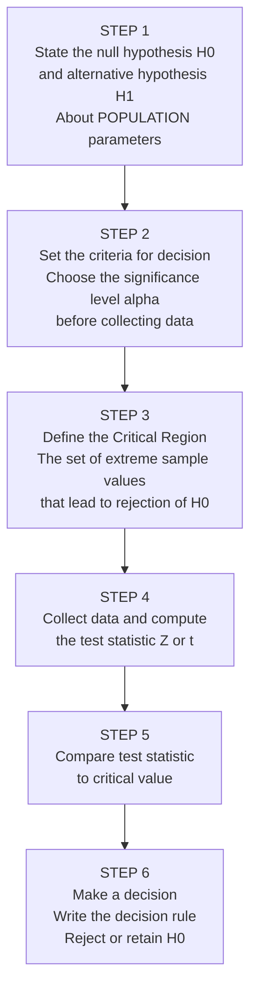
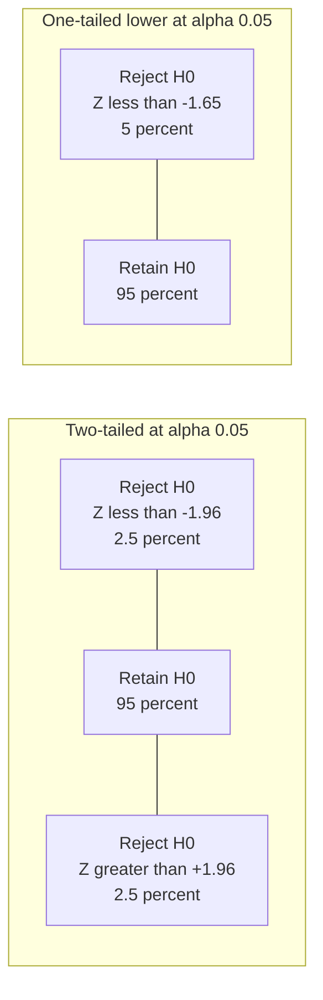

# Setting Up Levels of Significance: Steps, Critical Region, and the p-value

## Introduction

Understanding the *concept* of significance levels is one thing — knowing the *procedure* for correctly setting them up before running a study is another. This file covers the full step-by-step process for establishing levels of significance, defining the critical region, and making statistical decisions. It also covers the memorable producer's/consumer's risk analogy and the correct procedure for formulating and stating hypotheses.

> 📄 **Source PDF**: [Block-1/Unit-4.pdf — Pages 59–63](/pdfs/MPC-006%20Statistics%20in%20Psychology/Block-1/Unit-4.pdf)  
> 📚 MPC-006 Statistics in Psychology, IGNOU

---

## The Core Decision: Setting α Before Data Collection

One of the most important procedural rules in hypothesis testing is that **the significance level (α) must be set before data collection begins** — not after seeing the results.

This is not merely a convention; it is a safeguard against **p-hacking** (manipulating analysis until a significant result appears). When a researcher sets α = .05 in advance, they commit to rejecting H₀ only if the probability of the result under H₀ is 5% or less — regardless of what the data show.

The two standard choices:
- **α = .05 (5%)**: 95 out of 100 such experiments would not produce this extreme result by chance → 5% chance of Type I error
- **α = .01 (1%)**: 99 out of 100 would not produce this result by chance → 1% chance of Type I error

**Interpretation of α = .05**: If a null hypothesis is rejected at this level, the chances are 95 out of 100 that the hypothesis is not true, and only 5 out of 100 that it is. This level is established *before* doing the actual experiment and must be adhered to afterward.

---

## Step-by-Step Procedure for Setting Up Level of Significance

The IGNOU curriculum specifies six clear steps:

### Step 1: State the Null and Alternative Hypotheses

**Recommended formulation procedure** (IGNOU text):

1. State the **research question** as the **alternative hypothesis (H₁)**
2. The **null hypothesis (H₀)** will be the opposite of H₁ and will contain an equality sign
3. H₀ is what is actually tested — not H₁

**Example — the defendant analogy** (from the IGNOU text):  
Under a judicial system, the defendant is *"innocent until proven guilty"*. The court must collect evidence to support guilt:

| Hypothesis | Statement |
|-----------|-----------|
| H₀ (null) | Defendant is innocent |
| H₁ (alternative) | Defendant is guilty |

- **Type I error**: Convicting an innocent person (rejecting true H₀) → most serious error → α kept very small
- **Type II error**: Acquitting a guilty person (retaining false H₀)

This analogy powerfully illustrates why we always try to keep α small — the consequences of a Type I error (convicting the innocent; claiming an effect that does not exist) are generally more serious.

### Step 2: Set the Criteria — Choose α

Choose α = .05 or α = .01 based on:
- **Consequences of Type I error**: How serious is a false positive? → choose lower α
- **Consequences of Type II error**: How serious is a missed effect? → may choose higher α
- **Convention in the field**: Most psychology research uses α = .05

**Rule**: The α level must be set before looking at the data.

### Step 3: Define the Critical Region

The **critical region** is the area of the comparison distribution containing the extreme sample values that would lead to rejection of H₀. Its boundaries are determined by the chosen α level.

**For a two-tailed test at α = .05**:
- Critical region = Z < −1.96 OR Z > +1.96
- This represents the most extreme 5% of the normal distribution (2.5% in each tail)

**For a one-tailed test at α = .05 (lower tail)**:
- Critical region = Z < −1.65
- This represents the most extreme 5% in the lower tail only

### Step 4: Collect Data and Compute the Test Statistic

The **test statistic** (Z or t) is computed from the sample data using:

$$Z = \frac{\bar{x} - \mu}{\sigma_{\bar{x}}} = \frac{\text{Obtained difference}}{\text{Difference due to chance}}$$

The denominator (SE) represents the amount of variability expected by chance alone. The test statistic answers: *how many standard errors is my result from the hypothesised mean?*

### Step 5: Compare Test Statistic to Critical Value

- If the computed Z (or t) **falls in the critical region** → Reject H₀
- If it **does not fall in the critical region** → Retain H₀

### Step 6: Make a Decision and State the Conclusion

**If H₀ is rejected**:  
"The results are statistically significant at the .05 (or .01) level. H₀ is rejected in favour of H₁."  
(Do NOT say "proved" or "the hypothesis is true")

**If H₀ is not rejected**:  
"The results are not statistically significant at the .05 level. H₀ cannot be rejected on the basis of this sample."  
(Do NOT say "H₀ is proved" or "there is no effect")

---

## The p-value as the Observed Level of Significance

Modern statistics reporting centres on the **p-value** — the exact probability of obtaining a result as extreme as (or more extreme than) the one observed, if H₀ were true:

- **p = .03** → If H₀ were true, only 3% of experiments would produce this result by chance. Reject H₀ at α = .05 (since .03 < .05), but not at α = .01 (since .03 > .01).
- **p = .001** → Extremely unlikely under H₀. Reject at both .05 and .01 levels.
- **p = .23** → Plausible under H₀. Cannot reject at any standard level.

The p-value is the **observed significance level** — it replaces the need for rigid cutoffs and provides richer information about the strength of evidence against H₀.

---

## Producer's Risk and Consumer's Risk

The IGNOU text introduces a practical analogy from quality control that illuminates the two error types:

**Scenario**: A manufacturer produces goods. A consumer randomly selects a sample to test quality.

| Error Type | Who Suffers | What Happened |
|------------|-------------|---------------|
| **Type I Error = Producer's Risk** | Manufacturer suffers | Good product rejected because the sample *happened* to contain many defective items (bad luck in sampling) |
| **Type II Error = Consumer's Risk** | Consumer suffers | Bad product accepted because the sample *happened* to look good (bad luck in sampling) |

**The parallel to psychology**:
- **Producer's risk** (Type I) = Researcher falsely claims an effect → wastes resources on a non-existent finding
- **Consumer's risk** (Type II) = Researcher misses a real effect → potential benefits are never realised

In practical quality control situations, both risks are explicitly weighed against each other. The tolerance for each type of error is agreed upon by both parties *before* sampling — exactly as α should be set before data collection.

---

## Key Procedural Principles

The IGNOU text summarises important principles:

1. **Rejection of H₀ does not disprove it** — it means the sample value does not support H₀; it may still be true (Type I error possible)

2. **Acceptance does not prove H₀** — it means the sample supports H₀, but H₀ may still be false (Type II error possible)

3. **The α–β relationship**: As α increases, β decreases; as β increases, α decreases. The only way to reduce both simultaneously is to increase sample size.

4. **"Do not reject" is preferred over "accept"** — because "accept" implies we have measured β, which we often have not. "Do not reject" is epistemically more honest.

5. **Formulate H₀ so that Type I error is more serious**: By convention, the null hypothesis is stated so that the error of wrongly rejecting it (Type I) is the one we control most strictly.

---

## Comparing Experimental Designs: One vs Two Samples

The hypothesis testing steps apply across a range of experimental designs. The key differences are in how the test statistic and degrees of freedom are computed:

| Design | H₀ | Test Statistic | df |
|--------|-----|---------------|-----|
| **Single sample** (compare to known μ) | μ = μ₀ | Z or t = (x̄ − μ₀)/SE | N − 1 |
| **Two independent samples** | μ₁ = μ₂ | t = (x̄₁ − x̄₂)/SE_diff | N₁ + N₂ − 2 |
| **Paired samples** (pre/post) | μ_D = 0 | t = D̄/SE_D | N_pairs − 1 |

🔗 **Further Reading**:
- [Wikipedia: Hypothesis Testing Procedure](https://en.wikipedia.org/wiki/Statistical_hypothesis_testing)
- [Wikipedia: Critical Region](https://en.wikipedia.org/wiki/Critical_region)
- [Simply Psychology: Steps of Hypothesis Testing](https://www.simplypsychology.org/hypothesis-testing.html)

---

## Indian Context: Hypothesis Formulation in Indian Research

Indian psychologists working in applied settings follow slightly different conventions depending on the context:

**Clinical trials** (ICMR-registered): H₀ is formulated as "no difference between treatments" following international trial protocols. α = .05 is standard; α = .01 used for primary outcomes in Phase III trials.

**Educational research** (NCERT/SCERT): H₀ commonly states no difference between experimental and control groups on achievement measures.

**Occupational psychology** (companies, DRDO, ISRO): Often uses one-tailed tests when the direction of the effect is clear from operational requirements (e.g., "training will improve performance").

The **Indian Psychological Association** guidelines recommend explicit reporting of both the α level used and the exact p-value obtained, not just "p < .05."

🔗 **Further Reading**:
- [Indian Psychological Association](https://www.ipaindia.net/)
- [UGC-CARE Journal List for Psychology](https://ugccare.unipune.ac.in/)

---

## Recent Research Spotlight

**Moving Beyond Rigid Significance Rules (2019–2024)**

- **Lakens, D. (2021)**. The practical alternative to the p-value is the correctly used p-value. *Perspectives on Psychological Science*, 16(3), 639–648. Argues for disciplined use of pre-set α rather than abandoning significance testing. [DOI: 10.1177/1745691620958012](https://doi.org/10.1177/1745691620958012)

- **Cumming, G. (2014)**. The new statistics: Why and how. *Psychological Science*, 25(1), 7–29. Advocates for replacing binary significance decisions with effect sizes, confidence intervals, and meta-analytic thinking. [DOI: 10.1177/0956797613504966](https://doi.org/10.1177/0956797613504966)

---

## Self-Assessment Questions

### Level 1 — Knowledge

1. Elucidate the steps in setting up the level of significance (list all 6 steps).

2. What is the Critical Region? How is it determined?

3. In the producer's/consumer's risk analogy, which error corresponds to Type I and which to Type II? Who suffers from each?

### Level 2 — Comprehension

4. A researcher formulates H₁: "Children who receive the enrichment programme will score higher than control children on a creativity test." Write the corresponding H₀. Which test (one-tailed or two-tailed) is appropriate? What is the critical Z at α = .05?

5. A study yields Z = 1.70. Is this significant at (a) α = .05 one-tailed upper? (b) α = .05 two-tailed? Explain what each answer means for the conclusion.

### Level 3 — Application/Analysis

6. *Scenario*: A pharmaceutical company researcher obtains p = .048 for a new antidepressant vs placebo. She set α = .05. She rejects H₀ and reports the drug is effective. Six months later, a large replication study with N = 500 finds p = .38.
   - a) What decision error may the original study have committed?
   - b) What does the replication finding suggest?
   - c) How could the original researcher have reduced the risk of this error?

---

## Memory Aids

### Mnemonic 1: Six Steps of Significance Setup
**"Stated Criteria Define Compute Compare Conclude"** → S-C-D-C-C-C  
(State H₀/H₁ → Set criteria → Define critical region → Compute test statistic → Compare → Conclude)

### Mnemonic 2: Producer vs Consumer Risk
- **Producer's risk = Type I** → Good product (true H₀) was wrongly rejected
- **Consumer's risk = Type II** → Bad product (false H₀) was wrongly accepted

### Mnemonic 3: The Defendant Analogy
- H₀ = Innocence (presumed true until evidence disproves)
- H₁ = Guilt (what the court is trying to establish)
- Type I = Convicting the innocent (worst error — α kept smallest)
- Type II = Acquitting the guilty (serious but harder to control without more evidence)

---

## Key Terms Glossary

| Term | Definition |
|------|-----------|
| **Critical region** | Set of extreme sample values that lead to rejection of H₀ |
| **Critical value** | The Z or t boundary that separates retention from rejection of H₀ |
| **α level** | Pre-set probability threshold for rejecting H₀; must be fixed before data collection |
| **p-value** | Observed probability of the result under H₀; compared to α for the decision |
| **Producer's risk** | Type I error — good product (true H₀) wrongly rejected |
| **Consumer's risk** | Type II error — bad product (false H₀) wrongly accepted |
| **Decision rule** | Explicit statement of when H₀ will be rejected based on the test statistic |
| **Test statistic** | Computed value (Z, t, F, etc.) summarising the sample result for significance testing |
| **Goodness-of-fit test** | Hypothesis test that H₀ is that the population follows a specified distribution |
| **Sampling error** | The difference between a sample statistic and the population parameter due to chance |

---

## Video Resources

- 🎥 [Crash Course Statistics: Hypothesis Testing](https://www.youtube.com/watch?v=bf3egy7TQ2Q) — Accessible overview of the full process
- 🎥 [Khan Academy: Critical Region](https://www.khanacademy.org/math/statistics-probability/significance-tests-one-sample/idea-of-significance-tests/v/idea-behind-hypothesis-testing) — Visual explanation of critical regions
- 🎥 [StatQuest: p-values](https://www.youtube.com/watch?v=5Z9OIYA8He8) — Josh Starmer's definitive explanation

---

## Cross-References

- 👉 [Levels of Significance & Confidence Limits](/mpc-006/block-1/levels-of-significance-confidence-limits) — Foundation: what the significance threshold means
- 👉 [Standard Error & Z vs t](/mpc-006/block-1/standard-error-sample-size-z-t-decision) — Previous: the statistical building blocks for the test statistic
- 👉 [One-Tailed vs Two-Tailed Tests](/mpc-006/block-1/one-tailed-two-tailed-decision-errors) — Unit 3: choosing the right test tail
- 👉 [Type I and Type II Errors](/mpc-006/block-1/type-i-type-ii-errors-alpha-beta) — Unit 3: the errors these procedures guard against
