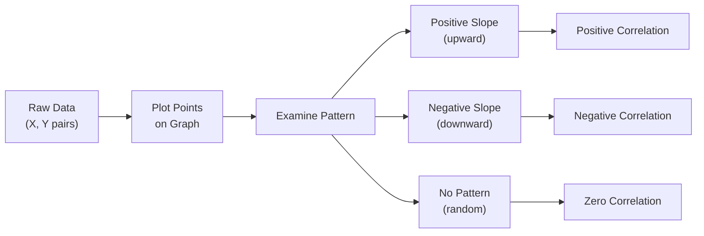
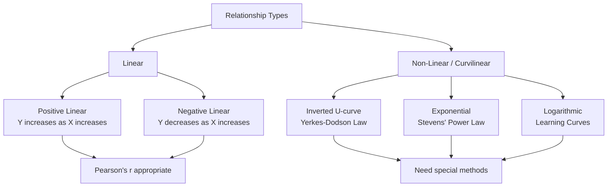

# Correlation: Meaning, Interpretation, and Scatter Diagrams

## Introduction

When psychologists study human behaviour, they often notice that different attributes tend to move together. Optimistic individuals tend to be happier. People who score high on intelligence often perform better on reasoning tasks. Those who experience greater anxiety often struggle more with stress. These observations all point to a fundamental statistical concept: **correlation**.

Correlation is a measure of association between two variables. It tells us **how strongly** and in **which direction** two variables are related. Understanding correlation is the gateway to a wide range of advanced statistical methods — regression, factor analysis, structural equation modelling, and more — making it one of the most essential tools in psychological research.

In this unit (Block 2, Unit 1 of MPC-006), we explore the meaning of correlation, how to represent it graphically through scatter diagrams, the types of relationships (linear vs. curvilinear), the direction of correlation (positive, negative, zero), and the strength of the relationship. Specific attention is given to Pearson's Product Moment Coefficient of Correlation, the most widely used correlation measure in psychology.

---

**Source PDFs**:
- 📄 [Block-2/Unit-1.pdf — Pages 5–28](/pdfs/MPC-006%20Statistics%20in%20Psychology/Block-2/Unit-1.pdf)
- 📚 MPC-006 Statistics in Psychology, Block 2: Correlation and Regression

---

## What is Correlation?

In statistical language, correlation describes the **relationship or association between two variables**. Typically, one variable is denoted as **X** and the other as **Y**. The relationship between them is expressed through a **correlation coefficient** — a single number that summarises both the direction and strength of the relationship.

### Everyday Examples of Correlation in Psychology

| Variable X | Variable Y | Expected Direction |
|---|---|---|
| Intelligence (IQ) | Marks obtained | Positive |
| Introversion | Number of friends | Negative |
| Anxiety | Adjustment to stress | Negative |
| Openness to experience | Creativity scores | Positive |
| Income | Expenditure | Positive |
| Accuracy on task | Speed on task | Negative |
| Age of child | Problem-solving capacity | Positive |
| Practice | Performance | Positive |

These examples illustrate that correlation permeates everyday psychological phenomena. Understanding and quantifying these associations is the very foundation of empirical psychology.

> 💡 **Key Point**: Correlation captures **co-variation** — how changes in one variable are systematically associated with changes in another. It does NOT, by itself, establish causation.

---

## Scatter Diagrams: Visualising Relationships

A **scatter diagram** (also called a scatterplot, scattergram, or scatter) is a graphical technique for studying the relationship between two variables. Each data point on the graph represents one observation (one subject), plotted using their pair of scores on X and Y.

### How to Draw a Scatter Diagram — Step-by-Step

```
Step 1: Draw the X and Y axes
  → Plot the causal (independent) variable on X-axis
  → Plot the outcome (dependent) variable on Y-axis

Step 2: Decide the range of values
  → Start slightly below your lowest data value
  → Conventionally, the plot is square (X and Y axes same length)

Step 3: Identify pairs of values
  → Each subject has two scores: one on X, one on Y
  → These form a coordinate pair (X, Y)

Step 4: Plot each pair
  → Find the intersection of X and Y values for each subject
  → Mark it with a dot or symbol

Step 5: Examine the pattern
  → Direction? (upward = positive, downward = negative)
  → Spread? (tight cluster = strong, wide scatter = weak)
  → Shape? (straight = linear, curved = nonlinear)
```

### Example: Intelligence and Reasoning

Consider the following data on 5 subjects:

| Subject | Intelligence (X) | Reasoning Score (Y) |
|---|---|---|
| A | 104 | 12 |
| B | 127 | 25 |
| C | 109 | 18 |
| D | 135 | 31 |
| E | 116 | 19 |

When these pairs are plotted, you observe that higher intelligence scores (on X) are paired with higher reasoning scores (on Y), and the data points cluster roughly along an upward-sloping line — indicating a **positive linear relationship**.



---

## Linear vs. Non-Linear Relationships

### Linear Relationship

A **linear relationship** is one that can be expressed as a straight line. Its equation is:

$$Y = \alpha + \beta X$$

Where:
- **Y** = dependent variable (Y-axis)
- **α (alpha)** = Y-intercept (constant — where the line crosses the Y-axis)
- **β (beta)** = slope of the line (rate of change)
- **X** = independent variable (X-axis)

Most correlation measures in psychology — including Pearson's r and Spearman's rho — are designed for **linear** relationships. When scatter points cluster around a straight line, the relationship is linear.

### Non-Linear (Curvilinear) Relationships

Not all relationships in psychology are straight lines. **Curvilinear relationships** change direction or shape across the range of variables. Famous examples include:

| Law / Phenomenon | Variables | Shape |
|---|---|---|
| **Yerkes-Dodson Law** | Arousal/Stress ↔ Performance | Inverted U-curve |
| **Steven's Power Law** | Stimulus ↔ Sensation | Power function |
| **Ebbinghaus Forgetting Curve** | Time ↔ Memory retention | Exponential decay |
| **Learning Curves** | Practice ↔ Skill | Logarithmic growth |

**The Yerkes-Dodson Law** is particularly important in psychology: performance is poor when arousal is too low (boredom) or too high (panic), but optimal at moderate arousal. This creates an **inverted U-shape** that linear correlation cannot adequately capture.



> ⚠️ **Important**: Pearson's product-moment correlation is **only appropriate for linear relationships**. If the relationship is curvilinear, Pearson's r will underestimate the true degree of association.

---

## Direction of Correlation

### Positive Correlation

In a **positive correlation**, the two variables move in the **same direction**:
- As X increases → Y increases
- As X decreases → Y decreases

**Examples**:
- Higher IQ → Higher marks
- More income → More expenditure
- More practice → Better performance

On a scatterplot, positive correlation appears as an **upward-sloping** pattern of points from left to right.

### Negative Correlation

In a **negative correlation**, the two variables move in **opposite directions**:
- As X increases → Y decreases
- As X decreases → Y increases

**Examples**:
- Higher IQ → Fewer errors on reasoning task
- More hope → Less depression
- More anxiety → Weaker stress adjustment
- Greater accuracy → Lower speed (speed-accuracy trade-off)

On a scatterplot, negative correlation appears as a **downward-sloping** pattern from left to right.

### Zero Correlation (No Relationship)

When two variables share **no systematic relationship**, the correlation is **zero**. Scatterplot points appear as a random, horizontal cloud with no discernible slope.

**Example**: Shoe size and intelligence. There is no theoretical or empirical reason to expect these to be related.

> 📝 **Note**: "Zero correlation" and "zero-order correlation" are **different terms**. Zero-order correlation refers to a bivariate correlation without controlling for any third variable — it does NOT mean the correlation is zero.

---

## Strength of Correlation

### The Correlation Coefficient

The **correlation coefficient** is a number that summarises the strength and direction of a relationship. For Pearson's r, the **range is −1.00 to +1.00**.

| Correlation Value | Interpretation |
|---|---|
| r = +1.00 | Perfect positive correlation |
| r = +0.70 to +0.99 | Strong positive correlation |
| r = +0.40 to +0.69 | Moderate positive correlation |
| r = +0.10 to +0.39 | Weak positive correlation |
| r = 0.00 | No relationship |
| r = −0.10 to −0.39 | Weak negative correlation |
| r = −0.40 to −0.69 | Moderate negative correlation |
| r = −0.70 to −0.99 | Strong negative correlation |
| r = −1.00 | Perfect negative correlation |

As the correlation coefficient moves **nearer to +1 or −1**, the strength of relationship **increases**. As it moves toward 0, the relationship weakens.

### Coefficient of Determination (r²)

The **percentage of shared variance** between X and Y is calculated by squaring the correlation coefficient:

$$\text{Common Variance} = r_{xy}^2 \times 100$$

**Examples**:
- If r = 0.50 → r² = 0.25 → **25% shared variance**
- If r = −0.81 → r² = 0.6561 → **65.61% shared variance**
- If r = 0.77 → r² = 0.5929 → **59.29% shared variance**

> 💡 **Key Insight**: Correlation is NOT a percentage. But r² (coefficient of determination) IS a percentage — it tells us how much of the variation in Y is explained by X.

---

## Measurements of Correlation

Multiple methods exist for computing correlation, each suited to different data types:

| Measure | Symbol | Data Type | When to Use |
|---|---|---|---|
| **Pearson's Product Moment** | r | Interval / Ratio | Continuous, normally distributed data |
| **Spearman's Rank Order** | rₛ | Ordinal | Rank data or non-normal distributions |
| **Kendall's Tau** | τ | Ordinal | Small samples, tied ranks |
| **Point Biserial** | rpb | One continuous + one dichotomous | e.g., gender and test score |
| **Biserial** | rb | One continuous + one artificial dichotomy | Artificially dichotomised variable |
| **Tetrachoric** | rt | Two dichotomous (underlying continuous) | Two artificial dichotomies |
| **Phi Coefficient** | φ | Two genuine dichotomies | True binary variables |
| **Multiple Correlation** | R | Multiple predictors → one outcome | Multiple regression |
| **Partial Correlation** | rxy.z | Controlling a third variable | Removing confound |

> 📌 The descriptive use of a correlation coefficient requires **no distributional assumptions**. Distributional assumptions (normality, bivariate normal distribution) are only required when using correlation as an **inferential statistic** to estimate population parameters.

---

## Correlation and Causality

A correlation between X and Y tells us they are associated — but **not** that one causes the other. If X and Y are correlated, there are three possibilities:

```
1. X causes Y
2. Y causes X
3. Both X and Y are caused by a third variable Z (spurious correlation)
```

**Classic example**: Ice cream sales and drowning deaths correlate positively — but ice cream doesn't cause drowning. Both are caused by a third variable: **hot weather**. People buy more ice cream and swim more in summer.

**Advanced methods for inferring causality from correlations:**
- Regression analysis
- Path analysis
- Structural equation modelling (SEM)
- Randomised controlled experiments (gold standard)

> ⚠️ **Remember**: Correlation ≠ Causation. This is one of the most important principles in all of scientific reasoning.

---

## Memory Aids 🧠

### DUSK — What Correlation Tells You
- **D**irection (positive or negative)
- **U**nit-free (no units, just a number from −1 to +1)
- **S**trength (closer to ±1 = stronger)
- **K**nowledge of shared variance (r² × 100 = %)

### Scatter Diagram Checklist: "DRES"
- **D**raw axes (X = independent, Y = dependent)
- **R**ange (set appropriate scale)
- **E**xtract pairs (each subject = one dot)
- **S**can pattern (slope direction and tightness)

### Positive vs. Negative — Quick Rule
- **Positive**: Same direction (both UP or both DOWN) — like a rising tide lifting all boats
- **Negative**: Opposite directions — like a seesaw (one up, other down)

---

## Indian Psychological Context 🇮🇳

Correlation analysis has been widely used in Indian psychological and educational research:

- **Intelligence and Academic Achievement**: Studies at institutions like the National Council of Educational Research and Training (NCERT) consistently report positive correlations between intelligence test scores and school performance across Indian student populations.
- **Socioeconomic Status and Mental Health**: The National Mental Health Survey of India (2015–16) conducted by NIMHANS found significant negative correlations between socioeconomic status and prevalence of common mental disorders.
- **Yoga and Psychological Well-being**: Indian researchers have documented significant negative correlations between yoga practice frequency and stress/anxiety scores, contributing to the global evidence base for yoga-based interventions.
- **Personality and Academic Performance**: Studies using adaptations of Western personality measures (like the NEO-PI) in Indian college students show moderate positive correlations between conscientiousness and GPA.

---

## External Resources 🔗

### Wikipedia Articles
- 📖 [Correlation and Dependence](https://en.wikipedia.org/wiki/Correlation) — Comprehensive overview of correlation types and mathematics
- 📖 [Scatter Plot](https://en.wikipedia.org/wiki/Scatter_plot) — Visual representation of bivariate data
- 📖 [Pearson Correlation Coefficient](https://en.wikipedia.org/wiki/Pearson_correlation_coefficient) — Full mathematical treatment

### Educational Videos
- 🎥 [Correlation — CrashCourse Statistics #10](https://www.youtube.com/watch?v=GtV-VYdNt_g) — Excellent introduction to correlation concepts
- 🎥 [Scatter Plots & Correlation (Khan Academy)](https://www.khanacademy.org/math/cc-eighth-grade-math/cc-8th-data/cc-8th-scatter-plots/v/scatter-plot-interpreting) — Step-by-step scatter diagram construction

### Research Articles
- 📄 [Correlation and Regression in Clinical Research (2019)](https://www.ncbi.nlm.nih.gov/pmc/articles/PMC6528106/) — Practical guide for medical/psychological researchers
- 📄 [Understanding Correlation and Its Use in Psychology (APA)](https://www.apa.org/education/k12/correlation) — APA explainer for students
- 📄 [Correlation in Psychological Research: Common Misconceptions](https://www.frontiersin.org/articles/10.3389/fpsyg.2016.00037/full) — Critical analysis of misuse of correlation in psychology

### Online Tools & Calculators
- 🔧 [Desmos Scatter Plot Builder](https://www.desmos.com/calculator) — Interactive scatter diagram creation
- 🔧 [Social Science Statistics — Correlation Calculator](https://www.socscistatistics.com/tests/pearson/default2.aspx) — Compute Pearson's r online
- 🔧 [GeoGebra Correlation Explorer](https://www.geogebra.org/m/p5zz6hzj) — Visual exploration of correlation
- 🔧 [StatTrek Correlation Guide](https://stattrek.com/statistics/correlation.aspx) — Theory and worked examples

### Books
- 📚 Aron, A., Aron, E.N., & Coups, E.J. (2007). *Statistics for Psychology*. Pearson Education, Delhi
- 📚 Minium, E.W., King, B.M., & Bear, G. (2001). *Statistical Reasoning in Psychology and Education*. John-Wiley, Singapore

---

## Self-Assessment Questions ✅

### Recall Level
1. Define correlation. What does it measure?
2. What is the range of the Pearson's correlation coefficient?
3. Draw a labelled scatter diagram showing: (a) strong positive, (b) strong negative, (c) zero correlation.

### Understanding Level
4. If the correlation between optimism and happiness is r = +0.65, what percentage of variance in happiness is explained by optimism? Show your calculation.
5. A researcher finds r = +0.40 between shoe size and height in a sample of adults. Another finds r = −0.40 between anxiety and performance. Which relationship is "stronger"? Explain.
6. Why can Pearson's r NOT be used for the relationship between stress and performance described by the Yerkes-Dodson Law?

### Application Level
7. A NIMHANS researcher studies the relationship between number of therapy sessions attended and depression scores. She expects a negative correlation. Draw a hypothetical scatter diagram consistent with this expectation and explain the pattern.
8. In an Indian school study, the correlation between study hours and exam scores is +0.75 for Class 12 students overall, but drops to +0.30 when only top-performing students (marks > 90%) are included. Why might this happen? (Hint: Think about one of the interpretive issues in correlation.)

### Critical Thinking Level
9. A newspaper headline reads: "Research finds that people who eat more chocolate have fewer heart attacks — chocolate prevents heart disease!" What are the alternative explanations for this correlation? How would you design a study to test causality?
10. Two variables, X and Y, have a correlation of r = 0.00. Does this necessarily mean they are unrelated? Explain with an example.

---

## Key Formulas Summary

| Formula | Name | Use |
|---|---|---|
| $r_{xy} = \frac{Cov_{XY}}{S_X \cdot S_Y}$ | Pearson's r (covariance form) | Core formula |
| $r^2_{xy} \times 100$ | Coefficient of determination | % shared variance |
| $Y = \alpha + \beta X$ | Linear equation | Defines linear relationship |

---

## Summary

Correlation is a measure of the association between two variables, expressed as a number from −1.00 to +1.00. A **scatter diagram** is the graphical tool for visualising this relationship. Relationships can be **linear** (straight line) or **curvilinear** (Yerkes-Dodson, Stevens' Power Law). The **direction** of correlation is either positive (same direction), negative (opposite directions), or zero (no systematic relationship). The **strength** is indicated by how close the coefficient is to ±1. Squaring r gives the **coefficient of determination** (r²), which expresses the percentage of shared variance. Multiple methods exist for computing correlation, each suited to different data types. Critically, correlation does not imply causation — even a strong correlation can reflect reverse causality or the influence of a third variable.

➡️ *Next: [Pearson's Product Moment Correlation — Computation and Significance Testing](/mpc-006/block-2/pearson-correlation-computation-significance)*
