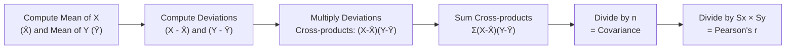
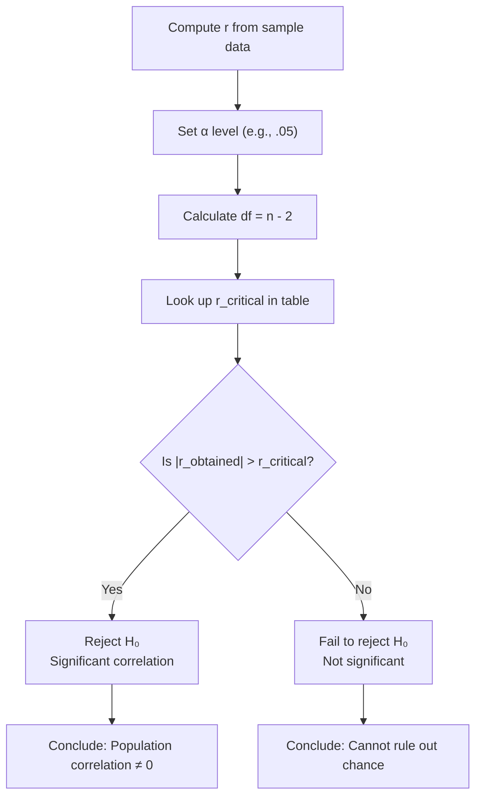

# Pearson's Product Moment Correlation: Computation and Significance Testing

## Introduction

The **Pearson's Product Moment Coefficient of Correlation** (denoted **r**) is the most widely used measure of the linear association between two continuous variables in psychological research. Developed by **Karl Pearson** in 1886 — in collaboration with Sir Francis Galton — it remains the cornerstone of bivariate statistical analysis more than 130 years later.

This unit covers the mathematical foundations of Pearson's r (variance and covariance), two computational methods (deviation score method and raw score method), statistical significance testing, the adjusted r statistic, underlying assumptions, and critical interpretive issues including restricted range, outliers, and curvilinearity.

---

**Source PDFs**:
- 📄 [Block-2/Unit-1.pdf — Pages 15–28](/pdfs/MPC-006%20Statistics%20in%20Psychology/Block-2/Unit-1.pdf)
- 📚 MPC-006 Statistics in Psychology, Block 2: Correlation and Regression

---

## Historical Background

| Person | Contribution |
|---|---|
| **Sir Francis Galton** (1880s) | First systematic study of correlation between variables; introduced regression to the mean |
| **Karl Pearson** (1886) | Developed the formal product moment correlation formula; editor of *Biometrica* |
| **Sir Ronald Fisher** | Developed the t-test for significance of r; introduced the sampling distribution of r |

> 💡 Pearson was closely associated with Galton, and the collaboration between these two statisticians produced the mathematical foundations for much of modern quantitative psychology.

---

## Building Blocks: Mean, Variance, and Covariance

To understand Pearson's r, we must first master three foundational concepts.

### 1. Mean

The **mean** of variable X (symbolised as $\bar{X}$) is the sum of all scores divided by the number of observations:

$$\bar{X} = \frac{\sum_{i=1}^{n} X_i}{n}$$

### 2. Variance

The **variance** of X ($S_X^2$) is the average of squared deviations from the mean:

$$S_X^2 = \frac{\sum(X - \bar{X})^2}{n}$$

The **standard deviation** ($S_X$) is the square root of variance:

$$S_X = \sqrt{\frac{\sum(X - \bar{X})^2}{n}}$$

### 3. Covariance

The **covariance** between X and Y ($Cov_{XY}$ or $S_{XY}$) measures how the two variables vary together:

$$Cov_{XY} = \frac{\sum(X - \bar{X})(Y - \bar{Y})}{n}$$

**How covariance works:**
1. Compute deviation of each X from its mean: $(X - \bar{X})$
2. Compute deviation of each Y from its mean: $(Y - \bar{Y})$
3. Multiply these deviations for each subject (cross-products)
4. Sum all cross-products
5. Divide by n

If high X scores are paired with high Y scores, the cross-products will mostly be positive (+ × + = +), giving positive covariance → **positive correlation**.

If high X scores are paired with low Y scores, the cross-products will mostly be negative (+ × − = −), giving negative covariance → **negative correlation**.

---

## Formula for Pearson's r

### Core Formula (Covariance Form)

$$r_{XY} = \frac{Cov_{XY}}{S_X \cdot S_Y}$$

This formula shows that Pearson's r is simply the **standardised covariance** — covariance divided by the product of the two standard deviations.

Since $Cov_{XY}$ is always ≤ $S_X \cdot S_Y$, the maximum value of r is bounded at 1.

### Deviation Score Formula (Expanded)

$$r_{XY} = \frac{\sum(X - \bar{X})(Y - \bar{Y})}{n \cdot S_X \cdot S_Y}$$

The **sign** of r depends entirely on the sign of the covariance (numerator). The denominator ($S_X \cdot S_Y$) is always positive. This is why r ranges from −1 to +1.

---

## Method 1: Deviation Score Method — Worked Example

### Data: Beck Hopelessness Scale (BHS) and Beck Depression Inventory (BDI)

The cognitive theory of depression (Aaron Beck) argues that **hopelessness predicts depression**. Let's test this on hypothetical data from 10 subjects.

| Subject | BHS (X) | BDI (Y) | X−X̄ | Y−Ȳ | (X−X̄)² | (Y−Ȳ)² | (X−X̄)(Y−Ȳ) |
|---|---|---|---|---|---|---|---|
| 1 | 11 | 13 | 0 | 1 | 0 | 1 | 0 |
| 2 | 13 | 16 | 2 | 4 | 4 | 16 | 8 |
| 3 | 16 | 14 | 5 | 2 | 25 | 4 | 10 |
| 4 | 9 | 10 | −2 | −2 | 4 | 4 | 4 |
| 5 | 6 | 8 | −5 | −4 | 25 | 16 | 20 |
| 6 | 17 | 16 | 6 | 4 | 36 | 16 | 24 |
| 7 | 7 | 9 | −4 | −3 | 16 | 9 | 12 |
| 8 | 12 | 12 | 1 | 0 | 1 | 0 | 0 |
| 9 | 5 | 7 | −6 | −5 | 36 | 25 | 30 |
| 10 | 14 | 15 | 3 | 3 | 9 | 9 | 9 |
| **Σ** | **110** | **120** | **0** | **0** | **156** | **100** | **117** |

**Step-by-step calculations:**

**Step 1**: Means
$$\bar{X} = 110/10 = 11, \quad \bar{Y} = 120/10 = 12$$

**Step 2**: Standard deviations
$$S_X = \sqrt{156/10} = \sqrt{15.6} = 4.16$$
$$S_Y = \sqrt{100/10} = \sqrt{10} = 3.33$$

**Step 3**: Compute r
$$r = \frac{\sum(X-\bar{X})(Y-\bar{Y})}{n \cdot S_X \cdot S_Y} = \frac{117}{10 \times 4.16 \times 3.33} = \frac{117}{138.53} = +0.937$$

**Interpretation**: There is a **strong positive correlation** (r = +0.937) between hopelessness and depression. As hopelessness increases, depression increases. They share r² = 0.878 → **87.8% of common variance**.

> ✅ **Check**: The sum of deviation columns (X−X̄) and (Y−Ȳ) must always equal zero. This is a useful way to verify your arithmetic.

---

## Method 2: Raw Score Formula

The raw score method is computationally equivalent but avoids computing deviations first. It works directly with raw data.

### Raw Score Formula

$$r_{XY} = \frac{\sum XY - \frac{\sum X \cdot \sum Y}{n}}{\sqrt{\left[\sum X^2 - \frac{(\sum X)^2}{n}\right] \cdot \left[\sum Y^2 - \frac{(\sum Y)^2}{n}\right]}}$$

Or more compactly:

$$r = \frac{SS_{XY}}{\sqrt{SS_X \cdot SS_Y}}$$

Where:
- $SS_X = \sum X^2 - \frac{(\sum X)^2}{n}$ (Sum of Squares for X)
- $SS_Y = \sum Y^2 - \frac{(\sum Y)^2}{n}$ (Sum of Squares for Y)
- $SS_{XY} = \sum XY - \frac{\sum X \cdot \sum Y}{n}$ (Sum of Cross-products)

### Worked Example Using Raw Score Method

| Subject | X | Y | X² | Y² | XY |
|---|---|---|---|---|---|
| 1 | 11 | 13 | 121 | 169 | 143 |
| 2 | 13 | 16 | 169 | 256 | 208 |
| 3 | 16 | 14 | 256 | 196 | 224 |
| 4 | 9 | 10 | 81 | 100 | 90 |
| 5 | 6 | 8 | 36 | 64 | 48 |
| 6 | 17 | 16 | 289 | 256 | 272 |
| 7 | 7 | 9 | 49 | 81 | 63 |
| 8 | 12 | 12 | 144 | 144 | 144 |
| 9 | 5 | 7 | 25 | 49 | 35 |
| 10 | 14 | 15 | 196 | 225 | 210 |
| **Σ** | **110** | **120** | **1366** | **1540** | **1437** |

**Calculations:**

$$SS_X = 1366 - \frac{110^2}{10} = 1366 - 1210 = 156$$

$$SS_Y = 1540 - \frac{120^2}{10} = 1540 - 1440 = 100$$

$$SS_{XY} = 1437 - \frac{110 \times 120}{10} = 1437 - 1320 = 117$$

$$r = \frac{117}{\sqrt{156 \times 100}} = \frac{117}{\sqrt{15600}} = \frac{117}{124.9} = +0.937$$

✅ Same result as the deviation method — r = **+0.937**

> 💡 **Which method to use?** Both give identical results. The **deviation score method** is more conceptually transparent (shows what's actually being computed). The **raw score method** is often faster in practice, especially with large datasets or calculators.

---

## Significance Testing of Pearson's r

### Why Test Significance?

When Pearson's r is used as a **descriptive statistic** (simply describing the relationship in the sample), no significance test is needed — the value and direction are interpreted directly.

When r is used as an **inferential statistic** (to estimate the population correlation ρ from sample data), we need to test whether the obtained r is greater than what could occur by chance.

### Notation

| Symbol | Meaning |
|---|---|
| r | Sample correlation coefficient |
| ρ (rho) | Population correlation coefficient (always unknown) |
| ρ_xy | Population correlation between X and Y |

### Hypotheses

For a **two-tailed test** (non-directional):
$$H_0: \rho_{XY} = 0 \quad \text{(no correlation in population)}$$
$$H_A: \rho_{XY} \neq 0 \quad \text{(some correlation exists)}$$

For a **one-tailed test** (directional):
$$H_A: \rho_{XY} > 0 \quad \text{(positive correlation expected)}$$
$$H_A: \rho_{XY} < 0 \quad \text{(negative correlation expected)}$$

### Degrees of Freedom

$$df = n - 2$$

Two degrees of freedom are lost because we estimate both means ($\bar{X}$ and $\bar{Y}$) from the data.

### Decision Procedure

1. Compute r from the sample data
2. Calculate df = n − 2
3. Choose significance level (α = .05 or .01)
4. Look up **critical value** of r in the correlation table (Appendix C)
5. Compare: If |r_obtained| > r_critical → Reject H₀

### Worked Example

For the BHS-BDI example: r = +0.937, n = 10

$$df = 10 - 2 = 8$$

At α = .05, two-tailed, df = 8: **r_critical = 0.632**

Since |0.937| > 0.632 → **Reject H₀**

**Conclusion**: The correlation between hopelessness and depression is statistically significant at the 0.05 level. We conclude that there is a genuine correlation between these variables in the population.

> ⚠️ **Note on One-Tailed vs. Two-Tailed Tests**: Use a two-tailed test when you have no directional hypothesis (r could be + or −). Use a one-tailed test when your theory specifically predicts the direction (e.g., "hopelessness positively correlates with depression"). When using two-tailed test, ignore the sign of r and compare absolute values with critical value.

---

## Adjusted r (r_adj)

The sample r is a **biased estimator** of population ρ, especially in small samples. To correct for this bias, we compute the **adjusted correlation coefficient**:

$$r_{adj} = \sqrt{1 - \frac{(1 - r^2)(n-1)}{n-2}}$$

### Example

For r = +0.937, n = 10:

$$r_{adj} = \sqrt{1 - \frac{(1 - 0.937^2)(10-1)}{10-2}} = \sqrt{1 - \frac{(1 - 0.878)(9)}{8}} = \sqrt{1 - \frac{0.122 \times 9}{8}} = \sqrt{1 - 0.137} = \sqrt{0.863} = 0.929$$

The adjusted r (0.929) is the **unbiased estimate** of the population correlation. It is slightly lower than the sample r (0.937) because it corrects for sample-size bias.

> 📌 Always report adjusted r when sample sizes are small (n < 50).

---

## Assumptions for Significance Testing

When using Pearson's r as an **inferential statistic**, the following assumptions must hold:

| Assumption | Description |
|---|---|
| **Independence** | Each pair of scores (X_i, Y_i) is independent of all other pairs. Different subjects provide different observations. |
| **Bivariate normality** | Both X and Y follow normal distributions in the population; their joint distribution is bivariate normal. |
| **Linearity** | The relationship between X and Y is linear (not curvilinear). |
| **Homoscedasticity** | The variance of Y is constant across all levels of X. |

> 💡 **Robustness**: Pearson's r is a **robust statistic** — minor violations of these assumptions (especially normality) generally do not severely distort significance test results, particularly with larger samples.

---

## Self-Assessment Questions ✅

### Recall Level
1. What is the formula for Pearson's r using the covariance form?
2. What does the covariance between X and Y measure?
3. What is the degrees of freedom formula for testing significance of r?

### Understanding Level
4. In the BHS-BDI example, why does the sum of the deviation column (X − X̄) always equal zero? What does this tell you about the properties of the mean?
5. Compare the deviation score method and raw score method for computing Pearson's r. Under what circumstances would you prefer one over the other?
6. A researcher obtains r = +0.45 on a sample of n = 20. Is this significant at α = .05, two-tailed? (Hint: Critical value at df = 18 is approximately 0.444.)

### Application Level
7. A psychology student collects data on stress levels (X) and sleep quality (Y) from 12 IGNOU MAPC students. ΣX = 84, ΣY = 96, ΣX² = 672, ΣY² = 864, ΣXY = 624. Compute Pearson's r using the raw score formula and interpret the result.
8. Using the BHS-BDI data: (a) Compute the coefficient of determination (r²). (b) Interpret what this means for the relationship between hopelessness and depression. (c) Compute the adjusted r and explain why it differs from r.

### Critical Thinking Level
9. A researcher publishes a study with n = 200 and r = +0.15, p < .05. Another publishes n = 20 and r = +0.50, p < .05. Which finding is practically more meaningful? Discuss the difference between statistical significance and practical significance in the context of correlation.
10. Why does Pearson's r require interval or ratio scale data? What happens if you try to apply it to ordinal data (e.g., ranks)?

---

## Memory Aids 🧠

### Steps for Computing r — "MSD-CPR"
- **M**eans (compute X̄ and Ȳ)
- **S**quared deviations (for Sx and Sy)
- **D**eviations (X − X̄ and Y − Ȳ)
- **C**ross-products (multiply deviations)
- **P**lug in the formula
- **R**eport and interpret

### Significance Testing — "HDCR"
- **H**ypothesis (write H₀ and H_A)
- **D**egrees of freedom (n − 2)
- **C**ritical value (from table)
- **R**eject or retain H₀

### r vs. r_adj — "When small, adjust all"
The adjusted r is important when **n is small** (< 50). For large samples, the difference between r and r_adj becomes negligible.

---

## External Resources 🔗

### Wikipedia Articles
- 📖 [Pearson Correlation Coefficient](https://en.wikipedia.org/wiki/Pearson_correlation_coefficient) — Full mathematical derivation
- 📖 [Covariance](https://en.wikipedia.org/wiki/Covariance) — Building block of correlation

### Educational Videos
- 🎥 [Computing Pearson's r by Hand (Step-by-step)](https://www.youtube.com/watch?v=2SCg pYX2ug) — Visual walkthrough of deviation score method
- 🎥 [Significance Testing for Correlation (StatQuest)](https://www.youtube.com/watch?v=xZ_z8KWkhXE) — Fisher's t-distribution approach

### Research Resources
- 📄 [Reporting Correlations in APA Style](https://apastyle.apa.org/instructional-aids/numbers-statistics-guide.pdf) — How to present correlation results
- 📄 [Cohen's Guidelines for Interpreting r](https://www.simplypsychology.org/correlation.html) — Small (0.1), Medium (0.3), Large (0.5) benchmarks
- 📄 [Effect Size in Psychological Research (Lakens, 2013)](https://www.frontiersin.org/articles/10.3389/fpsyg.2013.00863/full) — Statistical vs. practical significance

### Online Calculators
- 🔧 [Pearson Correlation Calculator — GraphPad](https://www.graphpad.com/quickcalcs/correlation1/) — Fast online computation with significance
- 🔧 [Correlation Critical Values Table](https://www.statisticshowto.com/tables/correlation-coefficient-table/) — Look up r_critical for any df
- 🔧 [Adjusted R Calculator](https://www.socscistatistics.com/effectsize/default3.aspx) — Compute adjusted r online
- 🔧 [VassarStats Correlation Tool](http://vassarstats.net/corr_stats.html) — Full correlation analysis with significance

---

## Key Formulas Summary

| Formula | Name |
|---|---|
| $r = Cov_{XY} / (S_X \cdot S_Y)$ | Pearson's r (covariance form) |
| $r = \frac{\Sigma(X-\bar{X})(Y-\bar{Y})}{n \cdot S_X \cdot S_Y}$ | Deviation score formula |
| $r = \frac{SS_{XY}}{\sqrt{SS_X \cdot SS_Y}}$ | Raw score formula |
| $df = n - 2$ | Degrees of freedom for r |
| $r_{adj} = \sqrt{1 - \frac{(1-r^2)(n-1)}{n-2}}$ | Adjusted r |
| $r^2 \times 100$ | Coefficient of determination (%) |

---

## Summary

Pearson's Product Moment Correlation Coefficient (r) measures the linear association between two continuous variables. It is built from three concepts: **mean**, **variance**, and **covariance**. Two methods yield identical results: the **deviation score method** and the **raw score method**. Statistical significance of r is tested by comparing the obtained value against a **critical value** from a correlation table using df = n − 2. The **adjusted r** corrects for small-sample bias. Four assumptions underlie significance testing: independence, bivariate normality, linearity, and homoscedasticity. Pearson's r is robust to minor violations of normality.

➡️ *Next: [Ramifications in the Interpretation of Pearson's r — Restricted Range, Outliers, and Curvilinearity](/mpc-006/block-2/pearson-r-interpretation-issues)*
