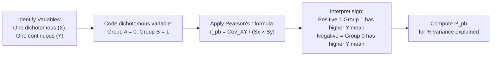
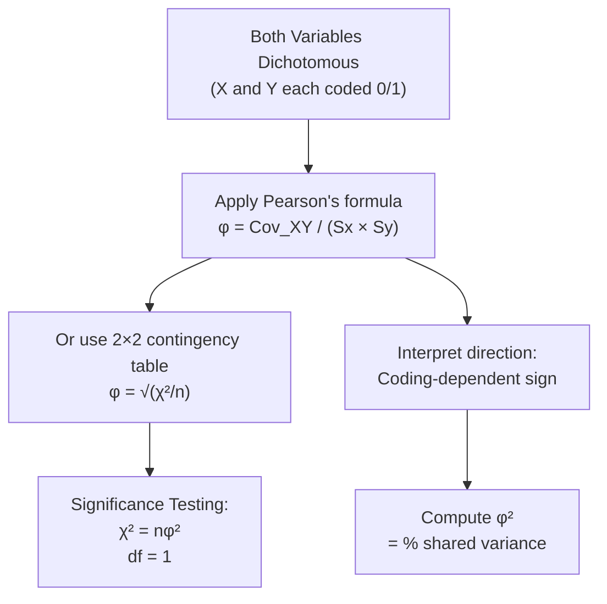

# Special Correlations: Point Biserial and Phi Coefficient

## Introduction

Pearson's product moment correlation (r) is the workhorse of psychological statistics — but it requires **continuous variables** that ideally follow a normal distribution. What happens when one or both of your variables are **dichotomous** (taking only two values, like male/female, yes/no, pass/fail)?

This is where **special types of correlation** come in. Some of these are simply Pearson's r applied to dichotomously-coded data — they produce mathematically equivalent results but are given distinct names to reflect the nature of the data. Others are fundamentally different in their computational approach.

This unit introduces the first two such special correlations: **Point Biserial Correlation (r_pb)** and **Phi Coefficient (φ)** — both are Pearson's correlations adapted for dichotomous data. The distinction between these methods and when to apply each is critical for psychological research involving group comparisons, binary outcomes, and categorical predictors.

---

**Source PDFs**:
- 📄 [Block-2/Unit-2.pdf — Pages 29–35](/pdfs/MPC-006%20Statistics%20in%20Psychology/Block-2/Unit-2.pdf)
- 📚 MPC-006 Statistics in Psychology, Block 2: Correlation and Regression

---

## Special Types of Correlation: Overview

When Pearson's standard assumptions are not met, alternative correlation methods are needed. These fall into three categories:

| Category | Methods | When Used |
|---|---|---|
| **Pearson-type special correlations** | Point Biserial (r_pb), Phi (φ) | One or both variables are truly dichotomous |
| **Non-Pearson correlations** | Biserial (r_b), Tetrachoric (r_tet) | Dichotomous variables that have an underlying continuous distribution |
| **Rank-order correlations** | Spearman's rho (r_s), Kendall's tau (τ) | Ordinal/rank data, or when Pearson's assumptions fail |

### Correlation vs. Association: An Important Distinction

Following Howell (2002), there is a useful conceptual distinction:

- **Measures of correlation**: Variables have an inherent order — higher scores represent more (or less) of something. Examples: number of friends, hopelessness scores, time taken to complete a task.
- **Measures of association**: Variables are categorical/nominal with no inherent order. Examples: gender (male/female) × property ownership (own/don't own).

Despite this distinction, correlation formulas like phi coefficient are often used for dichotomous categorical variables in practice.

---

## Dichotomous Variables: What Are They?

A **dichotomous variable** can be divided into exactly two sharply distinguished, mutually exclusive categories. No underlying continuum is assumed.

**True dichotomies** (genuinely binary):
- Gender: male / female
- Diagnosis: diagnosed / not diagnosed with an illness
- Location: rural / urban
- Nationality: Indian / American
- Group: experimental / control

**Artificial dichotomies** (underlying continuous variable, forcibly split):
- Mood: classified as "low mood" or "normal mood" (actually a continuum)
- Pass/fail: derived from a continuous marks scale
- High anxiety / low anxiety: split at median from a scale

This distinction matters because:
- **True dichotomies** → use Point Biserial or Phi Coefficient
- **Artificial dichotomies** → use Biserial or Tetrachoric Correlation

---

## Point Biserial Correlation (r_pb)

### Definition

**Point Biserial Correlation** is the Pearson's product moment correlation computed between:
- **One truly dichotomous variable** (coded as 0 and 1)
- **One continuous variable**

The algebraic result is identical to Pearson's r:
$$r_{pb} = r$$

So r_pb is not a different formula — it IS Pearson's r, just applied to data where one variable is dichotomous. The name "point biserial" signals the nature of the data.

### Coding the Dichotomous Variable

When coding the dichotomous variable:
- Assign any two distinct values (typically 0 and 1)
- The **specific values chosen (0 & 1, or 5 & 11) do not change the magnitude** of r_pb
- Only the **sign** changes depending on which group is coded as 0 vs. 1

> 💡 **Interpretation of sign**: The group coded as 1 has a higher mean on the continuous variable when r_pb is positive. When r_pb is negative, the group coded as 0 has the higher mean.

### Calculating r_pb

The formula is exactly Pearson's r:

$$r_{pb} = \frac{Cov_{XY}}{S_X \cdot S_Y}$$

Where X is the dichotomous variable (0/1 coded) and Y is the continuous variable.

### Worked Example: Gender and Marks

**Research question**: Is gender related to examination marks?

Data: 20 subjects (9 male, 11 female) with marks in final exam.
- Males coded as X = 0; Females coded as X = 1

**Summary statistics from calculation:**

| Statistic | Value |
|---|---|
| Mean (sex variable) | 0.55 |
| Mean (marks) | 64.8 |
| Mean marks (males, coded 0) | 60.88 |
| Mean marks (females, coded 1) | 68.0 |
| S_sex | 0.497 |
| S_marks | 9.17 |
| Cov_XY | 1.76 |

$$r_{pb} = \frac{Cov_{XY}}{S_X \cdot S_Y} = \frac{1.76}{0.497 \times 9.17} = \frac{1.76}{4.557} = +0.386$$

**Interpretation**:
- r_pb = +0.386 → Moderate positive correlation
- Since females are coded as 1 and r_pb is positive → females scored higher on average (68.0 vs 60.88)
- Coefficient of determination: r_pb² = 0.386² = 0.149 → **14.9% of variance in marks is accounted for by gender**

### Significance Testing of r_pb

Since r_pb IS Pearson's r, significance testing follows the same procedure — using the **t-distribution** with **df = n − 2**:

$$t = \frac{r_{pb}\sqrt{n-2}}{\sqrt{1 - r_{pb}^2}}$$

**Example (gender and marks data)**:
$$t = \frac{0.386\sqrt{20-2}}{\sqrt{1-0.386^2}} = \frac{0.386 \times 4.243}{\sqrt{0.851}} = \frac{1.638}{0.922} = 1.775$$

$$df = 20 - 2 = 18$$

**Decision**: At α = .05, two-tailed, critical t at df = 18 is approximately 2.101. Since 1.775 < 2.101, we **fail to reject H₀**.

**Conclusion**: The correlation between gender and marks is not statistically significant at the 0.05 level. (Note: this is largely due to the small sample of n = 20.)

**Hypotheses**:
$$H_0: \rho = 0 \quad \text{(no relationship in population)}$$
$$H_A: \rho \neq 0 \quad \text{(relationship exists in population)}$$

> 📌 With small samples, even a moderate correlation may not reach significance. Larger samples are needed to reliably detect the effect.

---

## Phi Coefficient (φ)

### Definition

The **Phi Coefficient** is the Pearson's product moment correlation computed when **both variables are truly dichotomous** (each coded 0/1).

Like r_pb, φ is algebraically identical to Pearson's r:
$$\varphi = r_{XY} \quad \text{(when both X and Y are dichotomous)}$$

### Example: Gender and Property Ownership

**Research question**: Is gender related to property ownership?

- X: Gender (0 = Male, 1 = Female)
- Y: Ownership (0 = No ownership, 1 = Ownership)

**Data**: 12 subjects (dichotomous scores on both variables)

**Summary calculations:**

| Statistic | Value |
|---|---|
| Mean(X) = Mean(sex) | 0.50 |
| S_X | 0.52 |
| Mean(Y) = Mean(ownership) | 0.58 |
| S_Y | 0.51 |
| Cov_XY | −0.13 |

$$\varphi = \frac{Cov_{XY}}{S_X \cdot S_Y} = \frac{-0.13}{0.52 \times 0.51} = \frac{-0.13}{0.265} = -0.465$$

**Interpretation**:
- φ = −0.465 → Moderate negative correlation
- Males (coded 0) → more ownership; Females (coded 1) → less ownership
- r² = φ² = 0.465² = **0.216 → 21.6% shared variance between gender and ownership**

> ⚠️ The **sign** of φ depends entirely on which group is coded as 0 vs. 1. Once coding is fixed, the sign IS interpretable: here, "as we move from male to female (0→1), we move in the negative direction on ownership (1→0), meaning males have more ownership."

### Significance Testing of Phi (φ): Chi-Square Method

Unlike r_pb (which uses t-distribution), the significance of φ is tested using the **Chi-Square (χ²) distribution**:

$$\chi^2 = n\varphi^2$$

This Chi-Square has **df = 1**.

**Example:**
$$\chi^2 = n\varphi^2 = 12 \times 0.216 = 2.59$$

**Decision**: At df = 1, critical χ² = 3.84 (α = .05). Since 2.59 < 3.84, we **fail to reject H₀**.

**Conclusion**: The relationship between gender and property ownership is not statistically significant — but this is primarily due to the small sample (n = 12). With a larger sample, the same φ of −0.465 would likely reach significance.

### Relationship Between φ and χ²

$$\varphi = \sqrt{\frac{\chi^2}{n}}$$

This means you can compute φ from a Chi-Square test result — a common practice in psychological research using 2×2 contingency tables.

---

## Comparing Point Biserial and Phi Coefficient

| Feature | Point Biserial (r_pb) | Phi Coefficient (φ) |
|---|---|---|
| **Variable types** | One dichotomous + one continuous | Both dichotomous |
| **Formula** | Pearson's r | Pearson's r |
| **Range** | −1.00 to +1.00 | −1.00 to +1.00 |
| **Significance test** | t-distribution, df = n−2 | Chi-square, df = 1 |
| **% variance** | r_pb² × 100 | φ² × 100 |
| **Example** | Gender × GPA | Gender × Pass/Fail |
| **Sign interpretation** | Group coded 1 has higher mean | Depends on coding |
| **IGNOU MAPC relevance** | Comparing groups on scale scores | 2×2 categorical relationships |

---

## Practical Applications in Psychology

### Point Biserial — Common Uses

1. **Item-total correlation** in psychometric scale development: correlating each dichotomous item (correct/incorrect) with the total test score — a key step in item analysis
2. **Group comparisons with continuous outcomes**: clinical vs. control group on a symptom scale; trained vs. untrained on a performance measure
3. **Diagnostic validity studies**: does a binary diagnosis (yes/no) correlate with severity score?

### Phi Coefficient — Common Uses

1. **2×2 contingency table analysis** in epidemiology and clinical psychology
2. **Correlation between two binary personality traits**: introverted/extraverted × anxious/calm
3. **Survey research**: agreement (yes/no) on two binary attitude items
4. **Genetic and diagnostic studies**: presence/absence of two risk factors

### Indian Research Context 🇮🇳

- **NEET/entrance exam research**: Point biserial correlation is the standard method for **item analysis** in competitive exam question banks in India — each MCQ item (correct = 1, incorrect = 0) is correlated with the total score to assess item discrimination
- **NIMHANS clinical studies**: Phi coefficient used to assess co-occurrence of two binary diagnoses (e.g., depression and anxiety disorder) in clinical samples
- **NCERT assessments**: Educational psychologists at NCERT use r_pb to evaluate the effectiveness of individual test items in standardised achievement tests

---

## Memory Aids 🧠

### "PDCP" — When to Use Which Special Correlation
- **P**earson: both variables continuous
- **D**ichotomous + Continuous → **Point Biserial**
- **C**ategorical + Categorical (both dichotomous) → **Phi Coefficient**
- **P**seudo-dichotomous (underlying continuum) → **Biserial or Tetrachoric**

### Point Biserial Sign Rule: "1 is Higher"
If r_pb is **positive**, the group coded **1** has the **higher** mean on the continuous variable.

### Phi and Chi-Square: "Square Root of Chi Over n"
$$\varphi = \sqrt{\frac{\chi^2}{n}}$$
This formula links phi to the Chi-Square test — both assess independence of two categorical variables.

### Significance Tests: "r_pb uses t; φ uses chi"
- Point biserial → **t-test** (like Pearson's r)
- Phi → **Chi-square test** (like contingency table analysis)

---

## External Resources 🔗

### Wikipedia Articles
- 📖 [Point-Biserial Correlation Coefficient](https://en.wikipedia.org/wiki/Point-biserial_correlation_coefficient) — Mathematical treatment and SPSS instructions
- 📖 [Phi Coefficient](https://en.wikipedia.org/wiki/Phi_coefficient) — Derivation from contingency tables and chi-square
- 📖 [Correlation and Dependence](https://en.wikipedia.org/wiki/Correlation) — Overview of all correlation types

### Educational Videos
- 🎥 [Point Biserial Correlation Explained (StatQuest)](https://www.youtube.com/watch?v=2hBBEEjSv8U) — Visual introduction with examples
- 🎥 [Phi Coefficient and Chi-Square (Statology)](https://www.youtube.com/watch?v=N4PJxhpBGGY) — Relationship between phi and chi-square

### Research Articles
- 📄 [Item Analysis Using Point Biserial Correlation (2021)](https://www.ncbi.nlm.nih.gov/pmc/articles/PMC7890807/) — Application in medical education assessment
- 📄 [Phi Coefficient in Psychological Research (Field, 2013)](https://www.discoveringstatistics.com) — Andy Field's comprehensive discussion
- 📄 [Correlation Coefficients for Mixed Data Types (2020)](https://www.tandfonline.com/doi/full/10.1080/00273171.2019.1667495) — Modern overview of correlation choices for different variable types

### Online Tools
- 🔧 [Point Biserial Correlation Calculator](https://www.socscistatistics.com/tests/pointbiserial/default.aspx) — Free online calculator
- 🔧 [Phi Coefficient Calculator](https://www.socscistatistics.com/tests/phi/default.aspx) — 2×2 table phi coefficient
- 🔧 [GraphPad Contingency Table Analysis](https://www.graphpad.com/quickcalcs/contingency2/) — Chi-square and phi from 2×2 tables
- 🔧 [Statistics How To — Point Biserial](https://www.statisticshowto.com/point-biserial-correlation/) — Step-by-step worked examples

---

## Self-Assessment Questions ✅

### Recall Level
1. What is the key difference between Point Biserial Correlation and Phi Coefficient?
2. Name three examples of truly dichotomous variables in psychology.
3. What formula is used to test the significance of the Phi Coefficient?

### Understanding Level
4. A researcher codes "pass" as 1 and "fail" as 0, and finds r_pb = +0.55 between exam outcome and study hours. What does this mean? If the researcher had coded pass = 0, fail = 1, what would r_pb be?
5. Why does the choice of 0/1 coding affect the sign but not the magnitude of Point Biserial Correlation?
6. A chi-square test on a 2×2 table yields χ² = 8.40 with n = 120. Compute the phi coefficient and interpret its meaning.

### Application Level
7. A clinical psychologist wants to know if a diagnosis of ADHD (yes=1, no=0) predicts attention test scores (continuous scale). Which correlation method should she use, and why? Write out the null hypothesis and describe the significance testing procedure.
8. In an Indian school study, 50 students' pass/fail status (dichotomous) is correlated with their attendance category (regular=1, irregular=0). n = 50, φ = +0.42. (a) What is the percentage of shared variance? (b) Test significance using χ². (c) What does this finding imply for school administrators?

### Critical Thinking Level
9. A psychologist uses Point Biserial Correlation to relate gender (male=0, female=1) to a clinical anxiety scale in n = 200 adults, obtaining r_pb = +0.25, p < .01. A newspaper headline reads "Women Are 25% More Anxious Than Men." What is wrong with this interpretation?
10. Discuss the conditions under which the Phi Coefficient would be preferred over Pearson's r for two genuinely dichotomous variables. Would there ever be a reason to use Pearson's r instead? Explain.

---

## Summary

When one or both variables in a correlation analysis are **truly dichotomous**, standard Pearson's r is modified — but not fundamentally altered. **Point Biserial Correlation (r_pb)** is used when one variable is dichotomous and the other is continuous; it IS Pearson's r and uses the t-distribution for significance testing. **Phi Coefficient (φ)** is used when both variables are dichotomous; it IS also Pearson's r, but its significance is tested using Chi-Square with df = 1. Both are Pearson-type correlations, both share the −1 to +1 range, and both yield a coefficient of determination (r²) for percentage of shared variance. The sign in both cases depends on how the 0/1 coding is assigned and must be interpreted accordingly.

➡️ *Next: [Biserial and Tetrachoric Correlations — Non-Pearson Methods for Underlying Continuous Distributions](/mpc-006/block-2/biserial-tetrachoric-correlations)*
