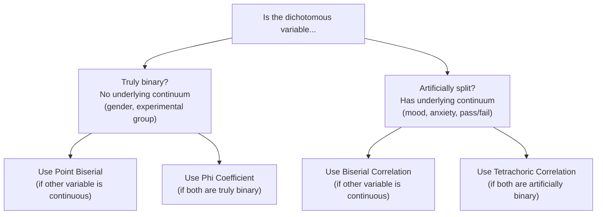
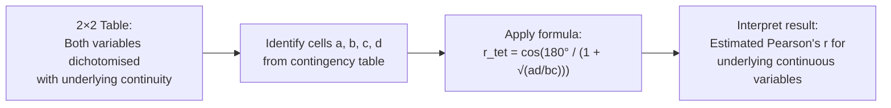
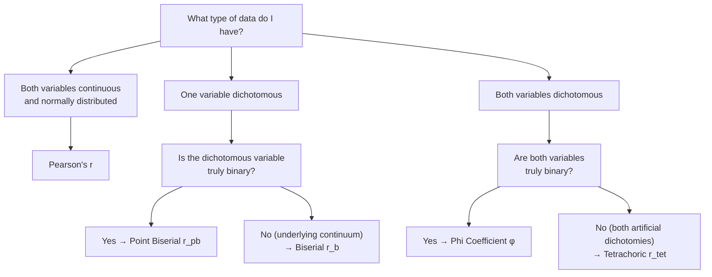

# Biserial and Tetrachoric Correlations: Non-Pearson Methods

## Introduction

In the previous section, we examined **Point Biserial (r_pb)** and **Phi (φ)** coefficients — both of which are Pearson's r applied to truly dichotomous variables. However, many variables in psychology that appear dichotomous in measurement actually have a **continuous underlying distribution** — they have simply been artificially split into two categories.

For example:
- **Mood** may be measured as "happy vs. sad" (two categories), but mood is actually a continuous spectrum
- **Pass/fail** is derived from a continuous marks distribution
- **Attitude** (positive vs. negative) is usually a continuous latent trait

When this is the case, using Point Biserial or Phi would **underestimate** the true correlation because we're losing information by treating a continuous variable as binary. The appropriate methods are **Biserial Correlation** and **Tetrachoric Correlation** — which estimate what the correlation *would be* if we had measured the underlying continuous variables directly.

---

**Source PDFs**:
- 📄 [Block-2/Unit-2.pdf — Pages 34–36](/pdfs/MPC-006%20Statistics%20in%20Psychology/Block-2/Unit-2.pdf)
- 📚 MPC-006 Statistics in Psychology, Block 2: Correlation and Regression

---

## The Central Concept: Artificial Dichotomy

An **artificial dichotomy** (also called a forced or imposed dichotomy) occurs when a fundamentally continuous variable is split into two categories for measurement convenience.

### Examples of Artificial Dichotomies

| Variable | How Measured | Underlying Continuity |
|---|---|---|
| Mood | Happy (1) / Sad (0) | Continuous mood spectrum |
| Anxiety | High (1) / Low (0) | Continuous anxiety scale |
| Academic performance | Pass (1) / Fail (0) | Continuous marks distribution |
| Attitude | Positive (1) / Negative (0) | Continuous attitude continuum |
| Depression severity | Clinical (1) / Non-clinical (0) | Continuous symptom score |

When both variables are artificially dichotomised, the true association between the underlying continuous variables is **greater than** what phi or point biserial would reveal.

---

## Biserial Correlation (r_b)

### What It Is

**Biserial Correlation** estimates the correlation between two continuous variables when one of them has been **measured dichotomously** (artificially split into two categories).

The formula corrects for the fact that dichotomising a continuous variable loses information, and therefore estimates what the Pearson's r would be if the artificially dichotomised variable had been measured on its true continuous scale.

### Formula

$$r_b = \frac{\bar{Y}_1 - \bar{Y}_0}{S_Y} \cdot \frac{P_0 \cdot P_1}{h}$$

Where:
- $\bar{Y}_1$ = mean of Y scores for cases with X = 1
- $\bar{Y}_0$ = mean of Y scores for cases with X = 0
- $S_Y$ = standard deviation of Y (the continuous variable)
- $P_0$ = proportion of cases with X = 0
- $P_1$ = proportion of cases with X = 1
- $h$ = the **ordinate** (height) of the standard normal distribution at the point that divides the distribution at the proportion P₀ / P₁

The ordinate h is found from the standard normal distribution table — it is the y-value of the normal curve at the z-value that separates the two groups.

### Relationship with Point Biserial

The biserial correlation and point biserial are related:

$$r_b = \frac{r_{pb}\sqrt{P_0 \cdot P_1}}{h}$$

This is useful because once you compute r_pb (simpler), you can easily derive r_b.

### Important Properties

| Property | Value |
|---|---|
| **Range** | Theoretically −1.00 to +1.00 (but can exceed ±1 in practice with extreme splits) |
| **Interpretation** | Like Pearson's r — direction and strength |
| **When r_pb is known** | Use the conversion formula above |

### Example: Mood and Hope

Suppose we measure:
- **Y (continuous)**: Hope scores on BHS (Beck Hopelessness Scale)
- **X (artificially dichotomous)**: Mood classified as low (0) or normal (1)

We assume mood is normally distributed in the population, but we've only measured it as a binary variable.

Using the biserial formula (or converting from r_pb), we get an estimate of the correlation between hope and mood **as if mood had been measured on its full continuous scale** — a more accurate reflection of the true relationship.

> 💡 **Key Insight**: Biserial correlation is always **larger in absolute value** than the corresponding point biserial. This is because dichotomising a continuous variable reduces variance and thus attenuates (lowers) the correlation. Biserial corrects for this attenuation.

---

## Tetrachoric Correlation (r_tet)

### What It Is

**Tetrachoric Correlation** estimates the correlation between two continuous underlying variables when **both have been measured dichotomously** (artificially split).

It answers the question: "If we had measured both variables on their true continuous scales, what would the Pearson's r be?"

### Formula

The tetrachoric correlation is based on the angle between two vectors in multivariate normal space:

$$r_{tet} = \cos\left(\frac{180°}{1 + \sqrt{\frac{ad}{bc}}}\right)$$

Where a, b, c, d are the cell frequencies in a 2×2 contingency table:

| | X = 0 | X = 1 |
|---|---|---|
| **Y = 0** | a | b |
| **Y = 1** | c | d |

### Worked Example: Attitude Towards Women and Liberalisation

**Research question**: Are attitudes towards women's rights and attitudes towards economic liberalisation related?

Both variables measured as: 0 = negative attitude, 1 = positive attitude.

**Contingency table** (n = 200):

| | Attitude towards Women (X=0 negative) | Attitude towards Women (X=1 positive) | Row Sum |
|---|---|---|---|
| **Attitude towards Liberalisation (Y=0 negative)** | 68 (a) | 32 (b) | 100 |
| **Attitude towards Liberalisation (Y=1 positive)** | 30 (c) | 70 (d) | 100 |
| **Column Sum** | 98 | 102 | 200 |

**Calculation:**

$$r_{tet} = \cos\left(\frac{180°}{1 + \sqrt{\frac{ad}{bc}}}\right) = \cos\left(\frac{180°}{1 + \sqrt{\frac{68 \times 70}{30 \times 32}}}\right)$$

$$= \cos\left(\frac{180°}{1 + \sqrt{\frac{4760}{960}}}\right) = \cos\left(\frac{180°}{1 + \sqrt{4.958}}\right) = \cos\left(\frac{180°}{1 + 2.227}\right)$$

$$= \cos\left(\frac{180°}{3.227}\right) = \cos(55.78°) = 0.562$$

**Interpretation**: There is a **moderate positive correlation** (r_tet = +0.562) between the underlying continuous latent attitudes towards women and liberalisation. People who tend to be more liberal on women's issues also tend to be more liberal on economic issues.

---

## Biserial vs. Tetrachoric: A Comparison

| Feature | Biserial (r_b) | Tetrachoric (r_tet) |
|---|---|---|
| **Data type** | One continuous + one artificial dichotomy | Both artificial dichotomies |
| **Assumption** | One underlying normal distribution | Both variables underlying normal distributions |
| **What it estimates** | Pearson's r for continuous × continuous | Pearson's r for continuous × continuous |
| **Range** | Can exceed ±1 in extreme cases | −1.00 to +1.00 |
| **Computation** | Based on means and proportions | Based on 2×2 contingency table cell frequencies |
| **Relationship to Pearson-type** | Related to r_pb via conversion | Related to φ but estimates true underlying r |

---

## Choosing the Right Correlation: Complete Decision Tree

---

## Practical Applications in Psychology

### Biserial Correlation

1. **Psychometric item analysis**: Dichotomous items (correct/incorrect) correlated with ability scores when ability is assumed continuous — though r_pb is often used in practice for its simpler computation, r_b provides the theoretically correct estimate
2. **Medical decision thresholds**: A clinical "case/non-case" classification derived from a continuous severity measure, correlated with another continuous outcome
3. **Developmental psychology**: Age-based dichotomies (e.g., "reached developmental milestone: yes/no") correlated with cognitive test scores

### Tetrachoric Correlation

1. **Factor analysis of binary data**: Tetrachoric correlations form the input correlation matrix when factor-analysing dichotomous survey items — crucial for attitude and personality scale development
2. **Twin and genetic studies**: Concordance data (both twins affected: yes/no) used with tetrachoric correlation to estimate genetic contributions
3. **Educational measurement**: Correlating pass/fail on two tests when both are cut-offs from continuous ability distributions

### Indian Research Context 🇮🇳

- **Attitude research at Indian universities**: Tetrachoric correlation is used to compute factor structures when attitude survey items are dichotomous (agree/disagree format), helping establish the dimensionality of attitudes in Indian populations
- **NIMHANS binary diagnostic outcomes**: When two clinical diagnoses (yes/no) are thought to reflect underlying continuous dimensional pathology, tetrachoric correlation provides a more appropriate association measure than phi
- **Agricultural extension and health research**: Studies in rural India often measure outcomes as binary (adopted practice: yes/no; recovered: yes/no) — biserial or tetrachoric correlations correct for the artificial dichotomisation of what are fundamentally continuous outcomes

---

## Memory Aids 🧠

### "BINA" Rule for Biserial
- **B**iserial is used when one variable is a **B**inary disguise of a continuous variable
- **I**ts estimate is **I**nflated compared to r_pb (which is attenuated by dichotomisation)
- **N**ormal distribution assumed for the underlying variable
- **A**lways larger (in absolute value) than r_pb

### "TETRA" for Tetrachoric
- **T**wo variables, **E**ach **T**ruly continuous but **R**ecoded as binary → need **A**correction
- Uses cell frequencies a, b, c, d from 2×2 table
- Estimates the Pearson r that would exist if both were measured continuously

---

## External Resources 🔗

### Wikipedia Articles
- 📖 [Biserial Correlation](https://en.wikipedia.org/wiki/Biserial_correlation) — Mathematical derivation and comparison with r_pb
- 📖 [Tetrachoric Correlation Coefficient](https://en.wikipedia.org/wiki/Tetrachoric_correlation_coefficient) — History, formula, and use in factor analysis

### Educational Resources
- 🎥 [Tetrachoric Correlation in Factor Analysis (YouTube)](https://www.youtube.com/watch?v=6SfMYQbEjds) — Application in scale development
- 📄 [Tetrachoric and Polychoric Correlations in Item Analysis (Uebersax, 2000)](https://www.john-uebersax.com/stat/tetra.htm) — Comprehensive applied reference

### Research Articles
- 📄 [Tetrachoric vs. Pearson Correlation in Binary Data (Muthen, 1984)](https://www.jstor.org/stable/2336267) — Seminal comparison study
- 📄 [When to Use Tetrachoric Correlation (Greer et al., 2006)](https://link.springer.com/article/10.1007/s11135-004-1970-7) — Practical guidelines for researchers

### Online Tools
- 🔧 [Tetrachoric Correlation Calculator (VassarStats)](http://vassarstats.net/tet.html) — Free online computation
- 🔧 [Biserial Correlation Calculator](https://www.statmethods.net/stats/correlations.html) — R package psych documentation
- 🔧 [R psych package — polychoric/tetrachoric](https://www.rdocumentation.org/packages/psych/versions/2.0.9/topics/tetrachoric) — Tetrachoric correlation in R

---

## Self-Assessment Questions ✅

### Recall Level
1. What is an "artificial dichotomy"? Give three examples from psychology.
2. What is the main assumption underlying biserial correlation that distinguishes it from point biserial?
3. When would you use tetrachoric rather than phi coefficient?

### Understanding Level
4. A researcher measures depression as "clinically depressed" (1) vs. "not depressed" (0) by applying a cut-off to a continuous depression scale. She wants to correlate this with a continuous anxiety score. Should she use point biserial or biserial correlation? Why will these give different values?
5. Why is biserial correlation always larger in absolute value than the corresponding point biserial on the same data?
6. In what type of research is tetrachoric correlation particularly important, and why?

### Application Level
7. A personality scale developer creates 20 yes/no items and wants to perform factor analysis. She needs a correlation matrix. Should she use Pearson's r, phi, or tetrachoric correlations as input? Justify your answer.
8. Given the contingency table below, calculate the tetrachoric correlation and interpret the result:

| | High Stress (X=1) | Low Stress (X=0) |
|---|---|---|
| Poor sleep (Y=1) | 45 (a) | 15 (b) |
| Good sleep (Y=0) | 20 (c) | 70 (d) |

### Critical Thinking Level
9. A researcher computes both phi and tetrachoric correlation on the same 2×2 data. She finds φ = 0.35 and r_tet = 0.52. Why are these different, and which should she report if her research question is about the "true" relationship between the two underlying constructs?
10. Discuss the limitations of tetrachoric correlation. What assumptions must hold for it to give an accurate estimate of the true correlation?

---

## Summary

**Biserial correlation** and **Tetrachoric correlation** are non-Pearson methods that correct for the artificial dichotomisation of variables that have underlying continuous distributions. Biserial (r_b) is used when one variable is continuous and the other is an artificial dichotomy; it is related to point biserial (r_pb) and always yields a larger absolute value. **Tetrachoric correlation** (r_tet) is used when both variables are artificial dichotomies; it estimates the Pearson's r that would exist if both were measured on their true continuous scales. Both are particularly important in factor analysis of binary data, attitude scale development, and clinical research where continuous constructs are force-categorised for practical reasons.

➡️ *Next: [Spearman's Rho and Kendall's Tau — Rank Order Correlations](/mpc-006/block-2/spearman-rho-kendall-tau)*
