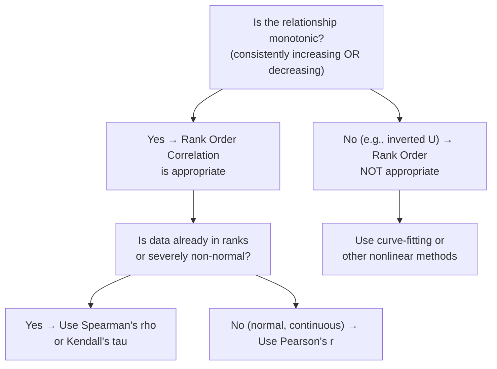
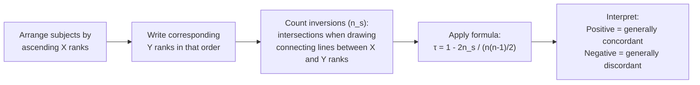
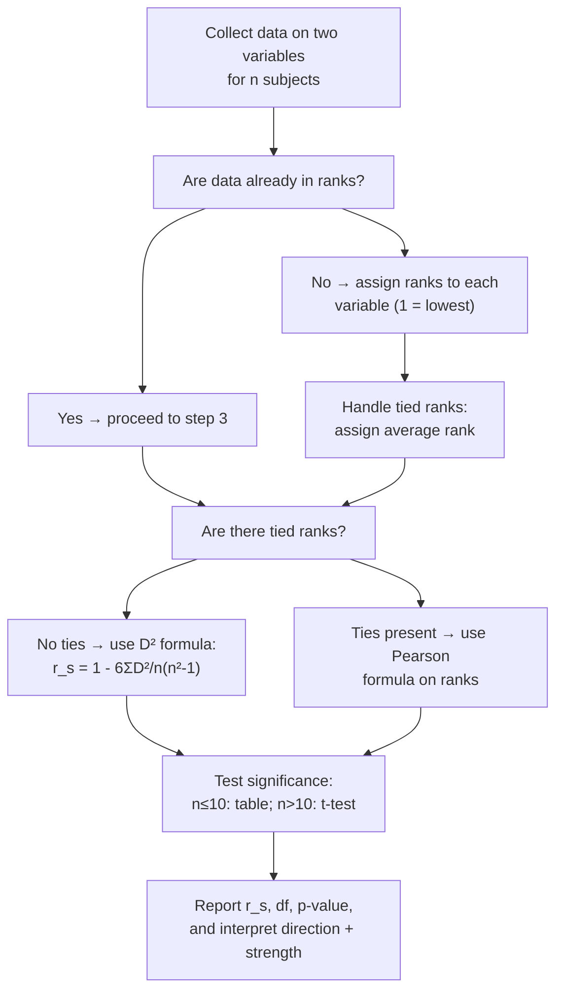

# Rank Order Correlations: Spearman's Rho and Kendall's Tau

## Introduction

Pearson's r is a powerful and versatile correlation coefficient — but it has requirements: continuous variables, approximately normal distributions, and a linear relationship. What do we do when the data is in **rank order**, when the distribution is **severely non-normal**, or when the relationship is **monotonic but not linear**?

The answer lies in **rank order correlations** — a family of nonparametric correlation methods that make fewer assumptions about the data. The two most important rank order correlations in psychological statistics are:

1. **Spearman's Rank Order Correlation (r_s)** — developed by the intelligence theorist Charles Spearman in 1904
2. **Kendall's Tau (τ)** — developed by Maurice Kendall in 1938

Both methods operate on the **ranks** of scores rather than the scores themselves. This makes them robust to outliers, usable with ordinal data, and appropriate when Pearson's assumptions are violated.

---

**Source PDFs**:
- 📄 [Block-2/Unit-2.pdf — Pages 35–48](/pdfs/MPC-006%20Statistics%20in%20Psychology/Block-2/Unit-2.pdf)
- 📚 MPC-006 Statistics in Psychology, Block 2: Correlation and Regression

---

## When to Use Rank Order Correlations

Two main situations call for rank order correlations instead of Pearson's r:

### 1. Rank-Order Data

When scores are already in **rank format** (ordinal scale), Pearson's r is not optimal. Examples:
- Merit list positions in an exam
- Judges' rankings of candidates or performances
- Birth order
- Class rank in a competition

### 2. Pearson's Assumptions Violated

When the underlying Pearson assumptions are seriously violated:
- **Non-normality**: Highly skewed distributions, heavy tails
- **Outliers**: Extreme scores that would distort Pearson's r
- **Non-linear but monotonic relationships**

### The Monotonic Relationship Requirement

Rank order correlations assess **monotonic** relationships — those where Y consistently increases (or consistently decreases) as X increases. This is broader than linearity:

| Relationship Type | Spearman/Tau Appropriate? | Pearson Appropriate? |
|---|---|---|
| Linear | ✅ Yes | ✅ Yes |
| Monotonic non-linear (e.g., power function) | ✅ Yes | ⚠️ Underestimates |
| Inverted U-curve (Yerkes-Dodson) | ❌ No | ❌ No |
| Non-monotonic curvilinear | ❌ No | ❌ No |

> ⚠️ **Critical Warning**: The Yerkes-Dodson Law (stress-performance relationship) is a classic **non-monotonic** relationship — performance first increases, then decreases with arousal. Neither Pearson's r nor Spearman's rho should be used for such data. The relationship goes "up then down," violating the monotonic assumption.

---

## Spearman's Rank Order Correlation (r_s)

### Background

**Charles Spearman** (1904) developed this correlation procedure to measure association when data is in rank order. He is also famous for his **two-factor theory of intelligence** (g + s factors). His rank order correlation was designed specifically for:
- Rank data on two variables for n subjects
- Inter-judge reliability (two judges ranking the same subjects)
- Situations where Pearson's assumptions don't hold

### Properties of Spearman's r_s

| Property | Value |
|---|---|
| **Range** | −1.00 to +1.00 |
| **Positive r_s** | Higher X ranks associated with higher Y ranks |
| **Negative r_s** | Higher X ranks associated with lower Y ranks |
| **r_s = 0** | No monotonic relationship |
| **r_s = ±1.00** | Perfect monotonic relationship |
| **Relationship to Pearson's r** | Pearson's r applied to ranks = Spearman's rho |

> 💡 **Key Insight**: Spearman's rho IS a special case of Pearson's r. If you apply Pearson's formula to the ranks of X and Y (instead of the raw scores), you get Spearman's rho. This is why the interpretation (direction, strength) is identical to Pearson's r.

### Formula: Without Tied Ranks

For data without ties (each subject has a unique rank), the shortcut formula is:

$$r_s = 1 - \frac{6\sum D^2}{n(n^2-1)}$$

Where:
- D = difference between the pair of ranks for each subject (R_X − R_Y)
- n = number of pairs of ranks

### Worked Example 1: Untied Ranks

**Research question**: Is rank in undergraduate examination related to rank in entrance test?

**Data** (10 students — already in rank format):

| Student | Rank in UG (X) | Rank in Entrance (Y) | D = X−Y | D² |
|---|---|---|---|---|
| A | 1 | 4 | −3 | 9 |
| B | 5 | 6 | −1 | 1 |
| C | 3 | 2 | 1 | 1 |
| D | 6 | 7 | −1 | 1 |
| E | 9 | 10 | −1 | 1 |
| F | 2 | 1 | 1 | 1 |
| G | 4 | 3 | 1 | 1 |
| H | 10 | 9 | 1 | 1 |
| I | 8 | 8 | 0 | 0 |
| J | 7 | 5 | 2 | 4 |
| **Σ** | | | | **ΣD² = 20** |

$$r_s = 1 - \frac{6 \times 20}{10(100-1)} = 1 - \frac{120}{990} = 1 - 0.121 = +0.818 ≈ +0.818$$

**Interpretation**: r_s = +0.818 → Strong positive monotonic relationship. Students who rank high in undergraduate examination tend to also rank high in entrance tests.

### Tied Ranks

**Tied ranks** occur when two or more subjects have the same score. When ties exist, the D-formula (eq above) overestimates r_s and should not be used. Instead, the **Pearson's formula on the ranks** is used:

$$r_s = \frac{\sum R_X R_Y - \frac{\sum R_X \cdot \sum R_Y}{n}}{\sqrt{\left[\sum R_X^2 - \frac{(\sum R_X)^2}{n}\right]\left[\sum R_Y^2 - \frac{(\sum R_Y)^2}{n}\right]}}$$

This is simply Pearson's raw score formula applied to the ranks — which is exactly what Spearman's rho is conceptually.

**Assigning tied ranks**: When two or more subjects share a score, they receive the **average rank** for their positions.

*Example*: If subjects rank 3rd and 4th both score 7, each receives rank 3.5 ((3+4)/2).

### Worked Example 2: Tied Ranks (BHS and BDI data)

| Subject | BHS (X) | BDI (Y) | Rank X | Rank Y | (Rank X)² | (Rank Y)² | (Rank X)(Rank Y) |
|---|---|---|---|---|---|---|---|
| 1 | 7 | 8 | 3.5 | 2.5 | 12.25 | 6.25 | 8.75 |
| 2 | 11 | 16 | 6.5 | 9.5 | 42.25 | 90.25 | 61.75 |
| 3 | 16 | 14 | 9 | 7 | 81 | 49 | 63 |
| 4 | 9 | 12 | 5 | 5.5 | 25 | 30.25 | 27.5 |
| 5 | 6 | 8 | 2 | 2.5 | 4 | 6.25 | 5 |
| 6 | 17 | 16 | 10 | 9.5 | 100 | 90.25 | 95 |
| 7 | 7 | 9 | 3.5 | 4 | 12.25 | 16 | 14 |
| 8 | 11 | 12 | 6.5 | 5.5 | 42.25 | 30.25 | 35.75 |
| 9 | 5 | 7 | 1 | 1 | 1 | 1 | 1 |
| 10 | 14 | 15 | 8 | 8 | 64 | 64 | 64 |
| **Σ** | | | **55** | **55** | **384** | **383.5** | **375.75** |

$$r_s = \frac{375.75 - \frac{55 \times 55}{10}}{\sqrt{\left[384 - \frac{55^2}{10}\right]\left[383.5 - \frac{55^2}{10}\right]}} = \frac{375.75 - 302.5}{\sqrt{[384 - 302.5][383.5 - 302.5]}} = \frac{73.25}{\sqrt{81.5 \times 81}} = \frac{73.25}{81.24} = +0.902$$

**Interpretation**: r_s = +0.902 → Very strong positive association. The rank on BHS (hopelessness) and rank on BDI (depression) are highly concordant — people who rank high on hopelessness tend to rank high on depression.

### Significance Testing of Spearman's rho

**For n ≤ 10**: Use the critical values table for Spearman's rho directly.

**For n > 10**: Convert to t-distribution:

$$t = \frac{r_s\sqrt{n-2}}{\sqrt{1-r_s^2}}, \quad df = n-2$$

**Example** (r_s = 0.818, n = 10):
$$t = \frac{0.818\sqrt{10-2}}{\sqrt{1-0.818^2}} = \frac{0.818 \times 2.828}{\sqrt{1-0.669}} = \frac{2.314}{\sqrt{0.331}} = \frac{2.314}{0.575} = 4.024$$

At df = 8, critical t at α = .01 (two-tailed) = 3.355. Since 4.024 > 3.355, **reject H₀ at .01 level**.

**Hypotheses**:
$$H_0: \rho_s = 0 \quad \text{(no monotonic relationship in population)}$$
$$H_A: \rho_s \neq 0 \quad \text{(two-tailed)}$$

---

## Kendall's Tau (τ)

### Background

**Maurice Kendall** (1938) developed this correlation measure as an alternative to Spearman's rho. While Spearman's rho looks at the **correspondence between ranks**, Kendall's tau is based on the concept of **concordance and discordance** — examining all possible pairs of subjects and asking whether they maintain the same order on both variables.

### Properties

| Property | Value |
|---|---|
| **Range** | −1.00 to +1.00 |
| **τ = +1** | Perfect agreement (every pair concordant) |
| **τ = −1** | Perfect disagreement (every pair discordant) |
| **τ = 0** | Equal concordant and discordant pairs |
| **Interpretation of magnitude** | τ = 0.778 means: among randomly sampled pairs, P(same order on both variables) is 0.778 higher than P(opposite order) |

> 💡 **Important Note**: Kendall's tau is **not directly comparable** to Spearman's rho. For the same data, tau is typically **smaller in magnitude** than rho (approximately τ ≈ (2/3) r_s for the same data). But tau has a more direct probabilistic interpretation.

### Concordance and Discordance

To understand Kendall's tau, we must understand **concordant** and **discordant** pairs:

**For subjects A (R_X = 1, R_Y = 1) and B (R_X = 2, R_Y = 3)**:
- R_X_A − R_X_B = 1 − 2 = −1 (A ranks lower than B on X)
- R_Y_A − R_Y_B = 1 − 3 = −2 (A ranks lower than B on Y)
- Both differences have the **same sign** → **Concordant pair** ✅

**For subjects B (R_X = 2, R_Y = 3) and C (R_X = 3, R_Y = 2)**:
- R_X_B − R_X_C = 2 − 3 = −1 (B ranks lower than C on X)
- R_Y_B − R_Y_C = 3 − 2 = +1 (B ranks higher than C on Y)
- Differences have **opposite signs** → **Discordant pair** ✗

### Formula

$$\tau = \frac{n_C - n_D}{\frac{n(n-1)}{2}}$$

Where:
- n_C = number of concordant pairs
- n_D = number of discordant pairs
- n(n−1)/2 = total number of pairs

### Method 1: Direct Concordance Counting (Small Samples)

For the small data example (4 subjects):

| Subject | R_X | R_Y |
|---|---|---|
| A | 1 | 1 |
| B | 2 | 3 |
| C | 3 | 2 |
| D | 4 | 4 |

Total pairs = 4(3)/2 = 6 pairs: AB, AC, AD, BC, BD, CD

By systematic comparison, n_C = 5, n_D = 1.

$$\tau = \frac{5-1}{\frac{4 \times 3}{2}} = \frac{4}{6} = 0.667$$

### Method 2: Counting Inversions (Larger Samples — More Efficient)

A practical shortcut: arrange subjects by ranks on X (ascending), then write their corresponding Y ranks. **Count the number of inversions** — instances where a later Y rank is smaller than an earlier one.

**Example** (10 sportspersons):

| Subjects (ordered by X rank) | A | B | C | D | E | F | G | H | I | J |
|---|---|---|---|---|---|---|---|---|---|---|
| **Rank in Practice (X)** | 1 | 2 | 3 | 4 | 5 | 6 | 7 | 8 | 9 | 10 |
| **Rank in Competition (Y)** | 2 | 1 | 5 | 3 | 4 | 6 | 10 | 8 | 7 | 9 |

Number of inversions (n_s) = 5 (counted by drawing connecting lines between X and Y ranks and counting intersections).

$$\tau = 1 - \frac{2n_s}{\frac{n(n-1)}{2}} = 1 - \frac{2 \times 5}{\frac{10 \times 9}{2}} = 1 - \frac{10}{45} = 1 - 0.222 = +0.778$$

**Interpretation**: τ = +0.778. Among randomly sampled pairs of sportspersons, the probability that their order in practice corresponds to their order in competition is 0.778 higher than the probability that it would be reversed.

### Significance Testing of τ

**For small n**: Use Appendix E critical values for Kendall's tau.

**For larger n**: Convert to z-distribution:

$$z = \frac{\tau}{\sqrt{\frac{2(2n+5)}{9n(n-1)}}}$$

The denominator is the standard error of τ.

**Example** (τ = 0.778, n = 10):
$$z = \frac{0.778}{\sqrt{\frac{2(2 \times 10+5)}{9 \times 10 \times (10-1)}}} = \frac{0.778}{\sqrt{\frac{2 \times 25}{810}}} = \frac{0.778}{\sqrt{0.0617}} = \frac{0.778}{0.248} = 3.313$$

At z = 1.96 (α = .05) and z = 2.58 (α = .01): Since 3.313 > 2.58, **reject H₀ at .01 level**.

---

## Spearman's Rho vs. Kendall's Tau: A Full Comparison

| Feature | Spearman's rho (r_s) | Kendall's tau (τ) |
|---|---|---|
| **Developer** | Charles Spearman (1904) | Maurice Kendall (1938) |
| **Based on** | Rank differences (D² formula) or Pearson on ranks | Concordant and discordant pairs |
| **Range** | −1.00 to +1.00 | −1.00 to +1.00 |
| **Typical magnitude** | Higher for same data | Lower for same data (≈ 2/3 of r_s) |
| **Tied ranks** | Needs Pearson formula (not D² formula) | Requires modification |
| **Significance (small n)** | Critical value table for r_s | Critical value table for τ |
| **Significance (large n)** | t-distribution, df = n−2 | z-distribution |
| **Interpretation** | Similar to Pearson's r | Direct probability interpretation |
| **Advantage with ties** | Straightforward (use Pearson on ranks) | Theoretically superior |
| **Conceptual transparency** | Easier to compute | More directly interpretable |
| **When preferred** | General-purpose rank correlation | Tied ranks or when probabilistic interpretation needed |

> 📌 **Practical guidance**: Both Spearman's rho and Kendall's tau are appropriate for most rank data. Spearman's rho is more commonly taught and used in Indian psychology courses (IGNOU, DU, etc.). Kendall's tau is theoretically preferred for tied data and when a probabilistic interpretation is needed.

---

## Steps for Computing Spearman's Rho: Summary Flowchart

---

## Memory Aids 🧠

### Spearman — "RANK-DIFF"
- **R**ank both variables (1 = lowest)
- **A**ssign average ranks for ties
- **N**ote differences D = R_X − R_Y
- **K**alculate ΣD²
- **D**ivide: 6ΣD² / n(n²−1)
- **I**nvert: r_s = 1 − result
- **F**inally test significance
- **F**or ties: switch to Pearson formula on ranks

### Kendall's Tau — "CON-DIS"
- **CON**cordant pairs = same order on both variables (+ × + or − × −)
- **DIS**cordant pairs = opposite order (+ × − or − × +)
- **Formula**: τ = (n_C − n_D) / total pairs

### Tau vs. Rho: "Tau is Tighter"
- Tau is numerically **smaller** than rho for the same data
- Tau is more **tightly** tied to a direct probability interpretation
- When they disagree, it's often because of **tied ranks**

---

## Indian Psychological Research Context 🇮🇳

Rank order correlations are widely used in Indian psychological and educational research:

- **Competitive exam research**: UPSC, IIT-JEE, NEET ranklists — Spearman's rho is used to study whether ranks in preliminary rounds predict ranks in final rounds, or whether coaching class performance predicts exam outcomes
- **Inter-rater reliability**: In qualitative assessments at IGNOU itself, when multiple evaluators rank student responses, Spearman's rho measures agreement between raters
- **Clinical psychology at NIMHANS**: When comparing pre- and post-intervention ranks on symptom severity (rather than raw scores) for small samples, Spearman's rho avoids the normality assumption
- **Occupational psychology**: Studies correlating job performance rankings with personality test scores, particularly when job performance is assessed by supervisors' rankings
- **Sports psychology research**: Indian sports universities (like LNIPE, Gwalior) use Spearman's rho to correlate coaching effectiveness rankings with athlete performance rankings

---

## External Resources 🔗

### Wikipedia Articles
- 📖 [Spearman's Rank Correlation Coefficient](https://en.wikipedia.org/wiki/Spearman%27s_rank_correlation_coefficient) — Full mathematical derivation, tied ranks, examples
- 📖 [Kendall Rank Correlation Coefficient](https://en.wikipedia.org/wiki/Kendall_rank_correlation_coefficient) — Tau-a, tau-b, tau-c variants and computation
- 📖 [Nonparametric Statistics](https://en.wikipedia.org/wiki/Nonparametric_statistics) — Overview of assumption-free methods

### Educational Videos
- 🎥 [Spearman's Rank Correlation — CrashCourse Statistics](https://www.youtube.com/watch?v=JexU-ysMDnk) — Clear introduction to rank correlations
- 🎥 [Kendall's Tau Explained (StatQuest)](https://www.youtube.com/watch?v=oXVxaSoY94k) — Concordance/discordance visual explanation

### Research Articles
- 📄 [Spearman vs. Kendall: When Do They Disagree? (Croux & Dehon, 2010)](https://link.springer.com/article/10.1007/s10260-010-0142-z) — Statistical comparison of both measures
- 📄 [Rank Correlations in Psychological Research (2021)](https://www.ncbi.nlm.nih.gov/pmc/articles/PMC7890807/) — Applied guidance for choosing between Pearson, Spearman, and Kendall
- 📄 [Comparing Parametric and Nonparametric Correlations in Small Samples](https://www.frontiersin.org/articles/10.3389/fpsyg.2020.02236/full) — Monte Carlo study with practical recommendations

### Online Tools
- 🔧 [Spearman Correlation Calculator (SocSciStats)](https://www.socscistatistics.com/tests/spearman/default.aspx) — Free with significance testing
- 🔧 [Kendall's Tau Calculator (VassarStats)](http://vassarstats.net/tau.html) — Kendall's tau with p-values
- 🔧 [JASP (Free Statistical Software)](https://jasp-stats.org/) — Nonparametric correlations with point-and-click interface — popular in Indian psychology departments
- 🔧 [Spearman Critical Values Table](https://www.statisticshowto.com/spearman-rank-correlation-table/) — For looking up critical r_s values

---

## Self-Assessment Questions ✅

### Recall Level
1. Name two situations when Spearman's rho should be used instead of Pearson's r.
2. What is a "monotonic relationship"? Give an example of a monotonic and a non-monotonic relationship in psychology.
3. What is the difference between a concordant and a discordant pair in Kendall's tau?

### Understanding Level
4. A researcher uses the D² formula for Spearman's rho but some ranks are tied. What problem arises and how should it be corrected?
5. For the same dataset, Spearman's rho = 0.72 and Kendall's tau = 0.54. Why are these different? Which should be reported and under what circumstances would you prefer each?
6. Why is Spearman's rho described as "a special case of Pearson's r"? What changes and what stays the same?

### Application Level
7. The following data shows ranks assigned by two judges to 8 student psychology projects:

| Student | Judge A rank | Judge B rank |
|---|---|---|
| 1 | 3 | 2 |
| 2 | 1 | 1 |
| 3 | 5 | 6 |
| 4 | 2 | 4 |
| 5 | 7 | 5 |
| 6 | 4 | 3 |
| 7 | 8 | 8 |
| 8 | 6 | 7 |

Compute Spearman's rho, test significance at α = .05 (two-tailed), and interpret the inter-rater reliability.

8. An IGNOU MAPC researcher ranks 10 students on academic performance and social support. They obtain r_s = +0.65, n = 10. (a) Test significance using the critical value table (critical r_s at n=10, α=.05, two-tailed = 0.648). (b) Write the conclusions in APA style. (c) What does this finding suggest about the relationship between social support and academic performance?

### Critical Thinking Level
9. A researcher wants to study the relationship between birth order (ranked 1st, 2nd, 3rd child, etc.) and introversion scores. She considers using Spearman's rho. (a) Is birth order truly ordinal, or is it a nominal variable being treated as ordinal? (b) What assumptions must hold for Spearman's rho to be valid here? (c) What alternative approaches might she consider?
10. Compare Spearman's rho and Kendall's tau in terms of their sensitivity to outliers, tied ranks, and small samples. Under what conditions would a researcher make a different conclusion using one vs. the other?

---

## Key Formulas Summary

| Formula | Name | Notes |
|---|---|---|
| $r_s = 1 - \frac{6\Sigma D^2}{n(n^2-1)}$ | Spearman's rho (no ties) | Use when no tied ranks |
| Pearson's formula on ranks | Spearman's rho (with ties) | Use when tied ranks present |
| $\tau = \frac{n_C - n_D}{n(n-1)/2}$ | Kendall's tau | Direct concordance method |
| $\tau = 1 - \frac{2n_s}{n(n-1)/2}$ | Kendall's tau (inversion method) | Count inversions in Y sequence |
| $t = \frac{r_s\sqrt{n-2}}{\sqrt{1-r_s^2}}$ | t-test for r_s (n > 10) | df = n−2 |
| $z = \frac{\tau}{\sqrt{\frac{2(2n+5)}{9n(n-1)}}}$ | z-test for τ | Standard normal |

---

## Summary

**Rank order correlations** are nonparametric alternatives to Pearson's r, appropriate when data is in rank format, when Pearson's assumptions are seriously violated, or when the relationship is monotonic but not necessarily linear. **Spearman's rho (r_s)** is the most commonly used — it is Pearson's r applied to ranks, using the D² shortcut formula when there are no ties and the Pearson formula on ranks when ties are present. Significance is tested using the t-distribution (df = n−2) for n > 10. **Kendall's tau (τ)** is based on counting concordant and discordant pairs; it is smaller in magnitude than r_s for the same data but has a direct probabilistic interpretation. Both methods require that the relationship be monotonic — consistently increasing or consistently decreasing — and neither is appropriate for non-monotonic relationships like the Yerkes-Dodson inverted U-curve.
