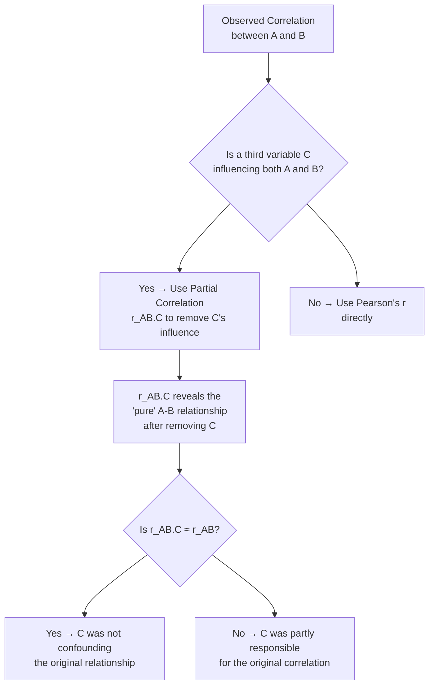
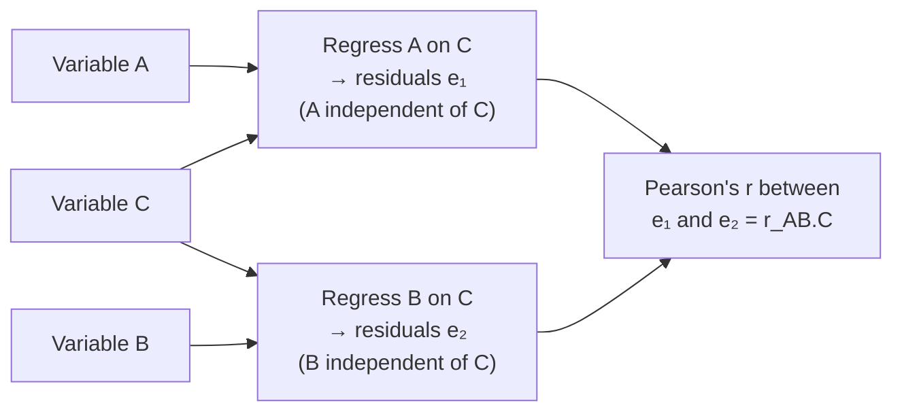

# Partial Correlation: Controlling for a Third Variable

## Introduction

Suppose a researcher finds a positive correlation between **cholesterol level** and **bank balance** in a sample of adults. Does this mean wealth causes cholesterol? Or that high cholesterol makes people wealthy? Neither makes biological sense. The real explanation is that **age** influences both — older people tend to have higher bank balances (decades of savings) AND higher cholesterol (age-related metabolic changes). Age is a **confounding variable** creating a spurious correlation between cholesterol and wealth.

**Partial correlation** is the statistical technique that lets us remove the influence of one (or more) confounding variables from a bivariate relationship. It answers: **"What is the true correlation between A and B, after statistically controlling for the effect of C?"**

This is one of the most powerful tools in psychological research — it allows us to test whether observed relationships are genuine or artifacts of a third variable, without requiring experimental control.

---

**Source PDFs**:
- 📄 [Block-2/Unit-3.pdf — Pages 49–56](/pdfs/MPC-006%20Statistics%20in%20Psychology/Block-2/Unit-3.pdf)
- 📚 MPC-006 Statistics in Psychology, Block 2: Correlation and Regression

---

## What Is Partial Correlation?

**Partial correlation** (r_p or r_AB.C) is the correlation between variables A and B after the influence of a third variable C has been statistically removed from **both** A and B.

**Notation**: r_AB.C

- Read as: "correlation between A and B, partialled out for C"
- The variable after the dot (C) is the one being controlled
- A and B are the two variables whose relationship we want to examine

### Why Do We Need It?

In observational (non-experimental) research, we cannot randomly assign participants to groups or physically hold variables constant. Partial correlation provides **statistical control** — a mathematical way to remove the influence of confounds.

---

## The Formula

$$r_{AB.C} = \frac{r_{AB} - r_{AC} \cdot r_{BC}}{\sqrt{(1-r_{AC}^2)(1-r_{BC}^2)}}$$

Where:
- r_AB = Pearson's correlation between A and B
- r_AC = Pearson's correlation between A and C
- r_BC = Pearson's correlation between B and C
- r_AB.C = partial correlation between A and B, controlling for C

**What this formula does**: It removes from r_AB the portion that is attributable to both A and B's mutual relationship with C, then re-standardises the result.

---

## Worked Example 1: Anxiety, Academic Achievement, and Intelligence

### Research Question

Is anxiety related to academic achievement, **after controlling for intelligence**?

**Logic**: Both intelligence and anxiety may relate to academic achievement. If intelligent students are also less anxious (e.g., they feel confident about their performance), then the observed anxiety-achievement correlation might partly reflect the intelligence-achievement relationship, not a direct anxiety effect.

### Data (10 students)

| Subject | Academic Achievement (A) | Anxiety (B) | Intelligence (C) |
|---|---|---|---|
| 1 | 15 | 6 | 25 |
| 2 | 18 | 3 | 29 |
| 3 | 13 | 8 | 27 |
| 4 | 14 | 6 | 24 |
| 5 | 19 | 2 | 30 |
| 6 | 11 | 3 | 21 |
| 7 | 17 | 4 | 26 |
| 8 | 20 | 4 | 31 |
| 9 | 10 | 5 | 20 |
| 10 | 16 | 7 | 25 |

### Step 1: Compute Pearson's r for All Three Pairs

| Pair | Correlation |
|---|---|
| Anxiety (B) × Academic Achievement (A): r_AB | −0.369 |
| Intelligence (C) × Academic Achievement (A): r_AC | +0.918 |
| Anxiety (B) × Intelligence (C): r_BC | −0.245 |

### Step 2: Compute Partial Correlation

$$r_{AB.C} = \frac{r_{AB} - r_{AC} \cdot r_{BC}}{\sqrt{(1-r_{AC}^2)(1-r_{BC}^2)}}$$

$$= \frac{-0.369 - (0.918 \times -0.245)}{\sqrt{(1-0.918^2)(1-(-0.245)^2)}}$$

$$= \frac{-0.369 - (-0.225)}{\sqrt{(1-0.843)(1-0.060)}} = \frac{-0.369 + 0.225}{\sqrt{0.157 \times 0.940}} = \frac{-0.144}{\sqrt{0.148}} = \frac{-0.144}{0.384} = -0.375$$

**Result**: r_AB.C = **−0.375**

### Interpretation

| Correlation | Value | Meaning |
|---|---|---|
| r_AB (before controlling) | −0.369 | Simple anxiety-achievement relationship |
| r_AB.C (after controlling for intelligence) | −0.375 | Anxiety-achievement with intelligence held constant |

In this example, the partial correlation (−0.375) is almost identical to the original correlation (−0.369). This means intelligence was NOT substantially confounding the anxiety-achievement relationship — the relationship between anxiety and academic achievement is genuine, not a spurious product of intelligence.

### Step 3: Significance Testing

$$t = \frac{r_P\sqrt{n-v}}{\sqrt{1-r_P^2}}$$

Where v = total number of variables in the analysis (here, v = 3).

$$df = n - v = 10 - 3 = 7$$

$$t = \frac{-0.375\sqrt{10-3}}{\sqrt{1-(-0.375)^2}} = \frac{-0.375 \times 2.646}{\sqrt{1-0.141}} = \frac{-0.992}{\sqrt{0.859}} = \frac{-0.992}{0.927} = -1.07$$

At df = 7, critical t = 2.365 (α = .05, two-tailed). Since |−1.07| < 2.365 → **fail to reject H₀**.

The partial correlation is not statistically significant — likely because the sample (n = 10) is too small to provide sufficient statistical power.

---

## Worked Example 2: Study Skills, Marks, and Belief (Large Sample)

### Research Question

A counselling psychologist wants to know: Do study skills genuinely improve marks, or is the effect simply a placebo — students believing the skills will help?

**Variables**:
- A: Hours practicing study skills
- B: Unit test marks
- C: Belief about usefulness of study skills (placebo)

**Correlations from n = 100 students**:

| Pair | Correlation |
|---|---|
| r_AB (study skills × marks) | +0.69 |
| r_AC (study skills × belief) | +0.46 |
| r_BC (marks × belief) | +0.39 |

### Calculation

$$r_{AB.C} = \frac{0.69 - (0.46 \times 0.39)}{\sqrt{(1-0.46^2)(1-0.39^2)}} = \frac{0.69 - 0.179}{\sqrt{0.788 \times 0.848}} = \frac{0.511}{\sqrt{0.668}} = \frac{0.511}{0.817} = +0.625$$

### Significance Test

$$t = \frac{0.625\sqrt{100-3}}{\sqrt{1-0.625^2}} = \frac{0.625 \times 9.849}{\sqrt{0.609}} = \frac{6.156}{0.780} = 7.89$$

At df = n − v = 97, the critical t at α = .05 is ~1.98. Since 7.89 >> 1.98 → **reject H₀**.

### Conclusion

Even after controlling for the belief/placebo effect, the partial correlation between study skills and marks is +0.625 and highly significant. The study skills work through genuine cognitive mechanisms, not just placebo. The researcher's skepticism was unwarranted.

---

## Alternative Use: Controlling for Group Membership

Partial correlation has an elegant application for controlling **group membership** when comparing correlations across groups.

### Example: Simpson's Paradox in IOA and Neuroticism

A researcher collects data on **Intolerance of Ambiguity (IOA)** and **Neuroticism (N)** from a mixed-gender sample (9 males + 9 females = 18 total).

**Unexpected finding**: When correlating IOA and N for the **combined** sample, the correlation is **r = −0.462** (negative — more neuroticism, less intolerance of ambiguity). This is counterintuitive.

**Within-group correlations**:
- Males only: r = +0.64
- Females only: r = +0.41

Both within-gender correlations are positive — consistent with expectations! The combined negative correlation is a classic case of **Simpson's Paradox** — the direction reverses when groups are combined.

**Solving with partial correlation**: Compute r_IOA-N partialled for sex (coded 0/1):

Given:
- r_AB = −0.462 (IOA × N)
- r_AC = +0.837 (IOA × sex)
- r_BC = −0.782 (N × sex)

$$r_{AB.C} = \frac{-0.462 - (0.837 \times -0.782)}{\sqrt{(1-0.837^2)(1-0.782^2)}} = \frac{-0.462 + 0.654}{\sqrt{0.300 \times 0.389}} = \frac{0.192}{\sqrt{0.117}} = \frac{0.192}{0.342} = +0.566$$

The partial correlation (controlling for sex) is **+0.566** — now correctly positive and significant (t = 2.66, df = 15, p < .05). The true relationship between IOA and neuroticism is positive; the apparent negative correlation in the combined sample was entirely due to gender differences.

---

## Partial Correlation as Correlation Between Residuals

There is an elegant alternative interpretation of partial correlation using regression:

1. Regress **A** on **C** → obtain residuals e₁ (what's left in A after removing C's influence)
2. Regress **B** on **C** → obtain residuals e₂ (what's left in B after removing C's influence)
3. **r_AB.C = Pearson's r between e₁ and e₂**

This shows that partial correlation is literally the correlation between the parts of A and B that are **independent of** C. This connects partial correlation to regression in a profound way.

---

## Venn Diagram: Understanding Partial Correlation

The Venn diagram below shows the variance in academic achievement (A), anxiety (B), and intelligence (C) as overlapping circles:

- The **a+b** region represents variance in A shared with B (but not C)
- The **b+c** region represents variance shared among all three
- **Partial correlation** isolates region **a** — variance uniquely shared by A and B, with C removed

This visual framework helps understand why partial correlation is described as the correlation between the "unique" portions of each variable not accounted for by the control variable.

---

## Indian Research Context 🇮🇳

Partial correlation is widely used in Indian psychological and social science research:

- **NCERT educational research**: Studies examining the relationship between motivation and academic performance use partial correlation to control for socioeconomic status (SES) — a known confound in Indian school performance data
- **NIMHANS clinical studies**: Research on depression-anxiety comorbidity uses partial correlation to control for physical illness, which independently affects both depression and anxiety in Indian clinical samples
- **Family structure research**: Studies on parent-child relationships in Indian families often use partial correlation to control for extended family influence (joint family system) when examining parent–child communication × child adjustment correlations
- **ICSSR-funded sociological research**: Studies on religiosity and prosocial behaviour control for caste and community variables using partial correlation, since these are significant confounds in Indian social data

---

## Memory Aids 🧠

### "PAIR-CONTROL" for Partial Correlation
- **PA**rtial = **PA**rtially controlling
- **I**dentify the confound (C)
- **R**emove C's influence from BOTH A and B
- **C**orrelate the residuals
- **O**btain r_AB.C
- **N**ull hypothesis: ρ_P = 0
- **T**est with t-distribution, df = n − v
- **R**eport with controlled interpretation
- **O**bserve if r_AB ≈ r_AB.C (if yes, C was not confounding)
- **L**ook for Simpson's Paradox signs (reversal of direction)

### Formula Mnemonic: "AB minus AC-times-BC"
$$r_{AB.C} = \frac{r_{AB} - r_{AC} \cdot r_{BC}}{\sqrt{(1-r_{AC}^2)(1-r_{BC}^2)}}$$
Numerator: "AB minus the AC-BC product" → removes C's indirect contribution
Denominator: "square root of (1 minus AC squared) times (1 minus BC squared)" → re-standardises

### Partial vs. Semipartial in one sentence:
- **Partial**: Remove C from **both** A and B
- **Semipartial**: Remove C from **only one** of the variables

---

## External Resources 🔗

### Wikipedia Articles
- 📖 [Partial Correlation](https://en.wikipedia.org/wiki/Partial_correlation) — Full derivation, matrix form, and applications
- 📖 [Confounding Variable](https://en.wikipedia.org/wiki/Confounding) — Why controlling for third variables matters
- 📖 [Simpson's Paradox](https://en.wikipedia.org/wiki/Simpson%27s_paradox) — The reversal of correlations when groups are combined

### Educational Videos
- 🎥 [Partial Correlation Explained (StatQuest)](https://www.youtube.com/watch?v=4u5SLfGaB3o) — Visual and intuitive introduction
- 🎥 [Partial Correlation vs. Multiple Regression (YouTube)](https://www.youtube.com/watch?v=M9QL1fBOb6c) — How they connect

### Research Articles
- 📄 [When and How to Use Partial Correlation in Psychology (2020)](https://www.frontiersin.org/articles/10.3389/fpsyg.2020.01050/full) — Applied guidelines for researchers
- 📄 [Partial Correlation Network Models in Psychopathology (Epskamp & Fried, 2018)](https://www.ncbi.nlm.nih.gov/pmc/articles/PMC5829025/) — Modern use in clinical psychology
- 📄 [Understanding Simpson's Paradox](https://ftp.cs.ucla.edu/pub/stat_ser/r414.pdf) — Judea Pearl's accessible explanation

### Online Tools
- 🔧 [Partial Correlation Calculator (SocSciStats)](https://www.socscistatistics.com/tests/partialcorrelation/default.aspx) — Free partial correlation with significance
- 🔧 [JASP — Free Statistics Software](https://jasp-stats.org/) — Compute partial and multiple correlations easily
- 🔧 [R: pcor() function in psych package](https://www.rdocumentation.org/packages/psych/versions/2.2.9/topics/partial.r) — Partial correlations in R
- 🔧 [SPSS Partial Correlation Guide (IBM)](https://www.ibm.com/support/knowledgecenter/SSLVMB_26.0.0/statistics_mainhelp_ddita/spss/base/idh_pcor.html) — Step-by-step SPSS instructions

---

## Self-Assessment Questions ✅

### Recall Level
1. Define partial correlation. How does it differ from Pearson's r?
2. What does the notation r_AB.C mean? What do the letters represent?
3. What is the degrees of freedom formula for significance testing of partial correlation?

### Understanding Level
4. In the anxiety-academic achievement-intelligence example, the partial correlation (−0.375) was nearly equal to the simple correlation (−0.369). What does this tell us about intelligence as a confound in this relationship?
5. In the IOA-Neuroticism-Gender example, the combined correlation was −0.462 but the partial correlation controlling for gender was +0.566. Explain this reversal using the concept of Simpson's Paradox.
6. Explain the "residuals" interpretation of partial correlation. Why is this equivalent to the formula-based computation?

### Application Level
7. A health psychologist finds r = +0.52 between stress and illness, r = +0.38 between age and stress, and r = +0.61 between age and illness in a sample of n = 80. Compute the partial correlation between stress and illness controlling for age. Does this change your interpretation of the stress-illness relationship?
8. In an IGNOU MAPC research project on academic performance (A), conscientiousness (B), and family support (C), the correlations are: r_AB = +0.68, r_AC = +0.45, r_BC = +0.33, n = 50. (a) Compute r_AB.C (b) Test significance (c) What does this finding suggest about the independent contribution of conscientiousness to performance?

### Critical Thinking Level
9. A researcher finds that the correlation between childhood trauma and adult anxiety drops from r = +0.65 to r_AB.C = +0.18 after controlling for adult social support. What does this suggest about the mechanism linking trauma to anxiety? What type of variable is social support in this context?
10. Can partial correlation ever be larger than the original Pearson's r between the same two variables? Under what conditions would this happen, and what would it mean theoretically?

---

## Summary

**Partial correlation** (r_AB.C) is the correlation between two variables A and B after statistically removing the influence of a third variable C from both. It is computed from the three bivariate correlations (r_AB, r_AC, r_BC) using a specific formula. Significance is tested using the t-distribution with df = n − v (where v = number of variables). Partial correlation can also be understood as the Pearson's correlation between the residuals from regressing A on C and B on C. It has important applications in detecting and removing confounds, resolving Simpson's Paradox, and controlling for group membership. It differs from semipartial correlation in that partial correlation removes C from **both** variables, while semipartial removes C from **only one**.

➡️ *Next: [Semipartial Correlation and Multiple Correlation Coefficient (R)](/mpc-006/block-2/semipartial-multiple-correlation)*
