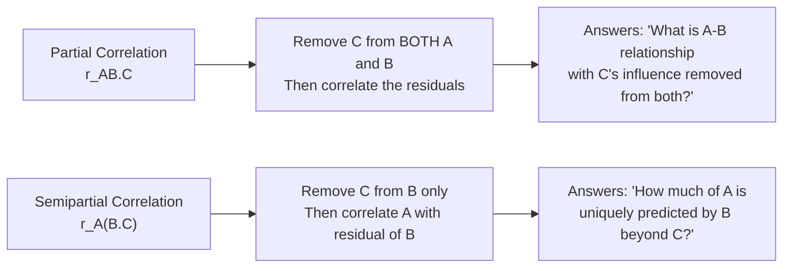
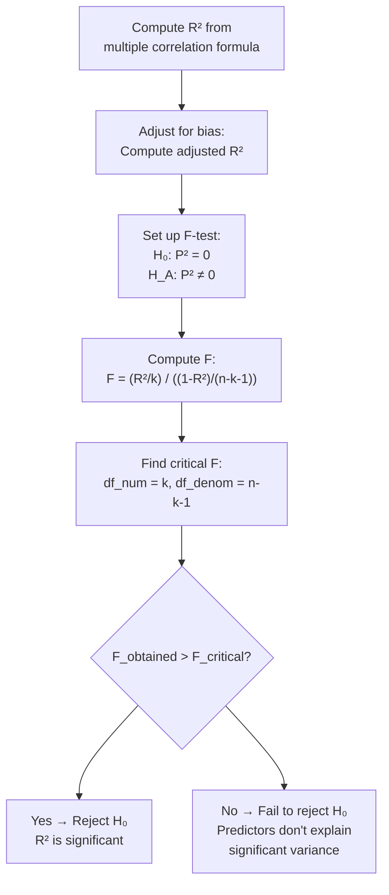

# Semipartial Correlation and Multiple Correlation Coefficient (R)

## Introduction

In the previous section, we learned that **partial correlation** removes the influence of a third variable C from **both** A and B. But sometimes this is more than we want — what if C logically should only be removed from one of the variables?

**Semipartial (part) correlation** answers this need. And when we want to understand how well a **combination** of multiple variables predicts a single outcome, we turn to the **Multiple Correlation Coefficient (R)** — one of the most important concepts in psychological research methods.

Together, partial correlation, semipartial correlation, and multiple correlation form an interconnected family of techniques for understanding complex, multivariate relationships. They are the conceptual foundation of **multiple regression** — the dominant analytical method in contemporary psychological research.

---

**Source PDFs**:
- 📄 [Block-2/Unit-3.pdf — Pages 57–64](/pdfs/MPC-006%20Statistics%20in%20Psychology/Block-2/Unit-3.pdf)
- 📚 MPC-006 Statistics in Psychology, Block 2: Correlation and Regression

---

## Semipartial Correlation (Part Correlation) r_sp

### What It Is

**Semipartial correlation** (also called **part correlation**) is the correlation between variable A and variable B, where the influence of C has been removed from **only one** of the variables — typically from B.

**Notation**: r_A(B.C)

- Read as: "the correlation of A with B-partialled-for-C"
- A is the criterion (not partialled)
- B is the predictor (C's influence removed from B only)
- C is the control variable

### Partial vs. Semipartial: The Critical Distinction

| Feature | Partial Correlation r_AB.C | Semipartial Correlation r_A(B.C) |
|---|---|---|
| C removed from | **Both** A and B | **Only** B (or only A) |
| Interpretation | Pure A-B relation, both "de-confounded" | A's relation with the unique portion of B |
| Formula denominator | $\sqrt{(1-r_{AC}^2)(1-r_{BC}^2)}$ | $\sqrt{1-r_{BC}^2}$ |
| Common use | Removing common confounds | Unique variance contribution in regression |
| Venn diagram region | Shared by A and B only (excluding C) | Unique to B, not shared with C |

### Formula

$$r_{A(B.C)} = \frac{r_{AB} - r_{AC} \cdot r_{BC}}{\sqrt{1 - r_{BC}^2}}$$

Compared to the partial correlation formula, the denominator here only includes the term for B's relationship with C — not A's.

$$\text{Partial: } r_{AB.C} = \frac{r_{AB} - r_{AC} \cdot r_{BC}}{\sqrt{(1-r_{AC}^2)(1-r_{BC}^2)}}$$

$$\text{Semipartial: } r_{A(B.C)} = \frac{r_{AB} - r_{AC} \cdot r_{BC}}{\sqrt{1-r_{BC}^2}}$$

Same numerator — the denominator is what distinguishes them.

---

## Worked Example: Academic Achievement, Anxiety, and Intelligence

Using the same data as in the partial correlation section:

| Pair | Correlation |
|---|---|
| r_AB (Anxiety × Academic Achievement) | −0.369 |
| r_AC (Anxiety × Intelligence) | −0.245 |
| r_BC (Academic Achievement × Intelligence) | +0.918 |

We want: The semipartial correlation of **Anxiety (A)** with **Academic Achievement (B)**, where **Intelligence (C)** has been removed only from Academic Achievement (B).

### Why This Version?

The researcher argues: Intelligence primarily affects academic achievement (B), not anxiety (A). So it only makes sense to partial out intelligence from achievement, not from anxiety.

### Calculation

$$r_{A(B.C)} = \frac{r_{AB} - r_{AC} \cdot r_{BC}}{\sqrt{1 - r_{BC}^2}}$$

$$= \frac{-0.369 - (-0.245 \times 0.918)}{\sqrt{1 - 0.918^2}} = \frac{-0.369 - (-0.225)}{\sqrt{1 - 0.843}} = \frac{-0.369 + 0.225}{\sqrt{0.157}} = \frac{-0.144}{0.396} = -0.363$$

**Semipartial correlation r_A(B.C) = −0.363**

### Comparison of Results

| Method | Value | What it controls |
|---|---|---|
| Pearson's r_AB | −0.369 | Nothing |
| Partial r_AB.C | −0.375 | Intelligence removed from both |
| Semipartial r_A(B.C) | −0.363 | Intelligence removed from achievement only |

All three values are quite similar in this example, suggesting the underlying relationships are stable and not greatly distorted by intelligence.

### Significance Testing

$$t = \frac{r_{SP}\sqrt{n-v}}{\sqrt{1-r_{SP}^2}}, \quad df = n - v$$

With v = 3 (three variables in analysis), df = 10 − 3 = 7:

$$t = \frac{-0.363\sqrt{7}}{\sqrt{1-0.363^2}} = \frac{-0.363 \times 2.646}{\sqrt{0.868}} = \frac{-0.961}{0.931} = -1.032$$

At df = 7, critical t = 2.364 (α = .05). Since |−1.032| < 2.364 → **fail to reject H₀**.

**Interpretation**: With this small sample, the semipartial correlation is not statistically significant. However, with a larger sample (like the study skills example with n = 100), the same magnitude of correlation would reach significance.

### Semipartial Correlation as Correlation with Residuals

Like partial correlation, semipartial correlation can be understood through regression:

1. Regress **B (Academic Achievement)** on **C (Intelligence)** → get residuals e₁
2. **r_A(B.C) = Pearson's r between A (Anxiety) and e₁**

Here, only B is regressed on C — A is kept in its original form. The semipartial correlation answers: "How much does A correlate with the unique portion of B that is not already explained by C?"

---

## Multiple Correlation Coefficient (R)

### What It Is

The **Multiple Correlation Coefficient (R)** is the correlation between one variable and a **linear combination of multiple other variables**.

$$R_{A.BC}$$ denotes the multiple correlation between A and the optimal linear combination of B and C.

### What It Represents

- R tells us how well we can predict A using B and C **together**
- R² (coefficient of multiple determination) tells us what **proportion of variance in A** is explained by the combined linear prediction from B and C
- R is always **between 0 and +1** (unlike Pearson's r, it is never negative)

> 💡 **Why never negative?** Because R represents the correlation with the *optimal linear combination* of predictors — by definition, the combination is chosen to maximise prediction, so it can't be inversely related to A.

### Formula (Two Predictors)

$$R_{A.BC} = \sqrt{\frac{r_{AB}^2 + r_{AC}^2 - 2 \cdot r_{AB} \cdot r_{AC} \cdot r_{BC}}{1 - r_{BC}^2}}$$

Where:
- r_AB = correlation between criterion A and predictor B
- r_AC = correlation between criterion A and predictor C
- r_BC = correlation between the two predictors B and C

---

## Worked Example: Multiple Correlation

**Research question**: How well can **Academic Achievement (A)** be predicted from the linear combination of **Anxiety (B)** and **Intelligence (C)**?

Using the same correlations:
- r_AB = −0.369
- r_AC = +0.918
- r_BC = −0.245

$$R_{A.BC} = \sqrt{\frac{(-0.369)^2 + (0.918)^2 - 2 \times (-0.369) \times (0.918) \times (-0.245)}{1 - (-0.245)^2}}$$

$$= \sqrt{\frac{0.136 + 0.843 - 2 \times 0.083}{1 - 0.060}} = \sqrt{\frac{0.136 + 0.843 - 0.166}{0.940}} = \sqrt{\frac{0.813}{0.940}} = \sqrt{0.865} = 0.929$$

**R = 0.929 ≈ 0.93**

### Coefficient of Multiple Determination (R²)

$$R^2 = 0.929^2 = 0.863$$

**Interpretation**: The linear combination of intelligence and anxiety explains **86.3% of the variance** in academic achievement. This is extremely high for psychological research, largely driven by the very strong intelligence-achievement correlation (0.918).

---

## Adjusted R² (R̄²)

Like adjusted r in simple correlation, the sample R² is a **biased overestimate** of the population R². The bias is larger when:
- The sample is small
- The number of predictors is large

The **adjusted R²** corrects for this:

$$\bar{R}^2 = 1 - \frac{(1-R^2)(n-1)}{n-k-1}$$

Where:
- k = number of predictor variables
- n = sample size

### Calculation

For our example (R² = 0.863, n = 10, k = 2):

$$\bar{R}^2 = 1 - \frac{(1-0.863)(10-1)}{10-2-1} = 1 - \frac{0.137 \times 9}{7} = 1 - \frac{1.233}{7} = 1 - 0.176 = 0.824$$

The **adjusted R² = 0.824** — lower than the unadjusted R² = 0.863, as expected.

> 📌 **Rule of thumb**: Always report adjusted R² (especially with small samples or many predictors). In published research, R² without adjustment inflates the apparent explanatory power of a model.

---

## Significance Testing of R²: The F-Test

**Hypotheses**:
$$H_0: P^2 = 0 \quad \text{(population R² is zero — no predictive power)}$$
$$H_A: P^2 \neq 0 \quad \text{(population R² is non-zero)}$$

**F formula**:
$$F = \frac{R^2/k}{(1-R^2)/(n-k-1)}$$

Or using adjusted R²:
$$F = \frac{\bar{R}^2/k}{(1-\bar{R}^2)/(n-k-1)}$$

**Degrees of freedom**:
- df_numerator = k (number of predictors)
- df_denominator = n − k − 1

### Worked Example

Using adjusted R² = 0.824, n = 10, k = 2:

$$F = \frac{0.824/2}{(1-0.824)/(10-2-1)} = \frac{0.412}{0.176/7} = \frac{0.412}{0.025} = 16.48$$

**Critical values** at F_(2,7):
- F_critical at α = .05 = 4.74
- F_critical at α = .01 = 9.55

Since F = 16.48 > 9.55 → **Reject H₀ at .01 level**

**Conclusion**: The multiple correlation is highly significant. Intelligence and anxiety together significantly predict academic achievement in the population.

---

## The Venn Diagram of R, r_p, and r_sp

The relationship between these three measures can be visualised:

Imagine three overlapping circles: A (criterion), B (predictor 1), C (predictor 2).

| Region | Represents | Related to |
|---|---|---|
| a | Unique to A only | Unexplained variance in A |
| b | A∩B only (not C) | Unique contribution of B to A |
| c | A∩C only (not B) | Unique contribution of C to A |
| d | A∩B∩C | Shared by all three |
| e | B∩C only (not A) | Shared variance between predictors |

- **R² = b + c + d** (all variance in A explained by B and/or C)
- **r²_A(B.C)** (semipartial²) = region **b** alone (unique contribution of B)
- **Partial r²_AB.C** = b/(a+b) (B's contribution relative to what's left after removing C)
- The difference R² − r²_AC = region **b** = semipartial r²

This Venn diagram perspective is especially valuable for understanding the **unique contributions** of each predictor in a regression model.

---

## Relationships Between r, r_p, r_sp, and R

| Correlation | What It Measures | When to Use |
|---|---|---|
| Pearson's r_AB | Simple bivariate association | Two variables, no controls |
| Partial r_AB.C | A-B relationship with C removed from both | Testing if A-B is spurious due to C |
| Semipartial r_A(B.C) | Unique A-B relationship (C removed from B) | Unique variance contribution of B |
| Multiple R_A.BC | Correlation of A with best linear combo of B+C | Predicting A from multiple variables |

$$r_{sp}^2 \leq r_p^2 \leq R^2$$

This inequality always holds: semipartial correlation squared ≤ partial correlation squared ≤ R² for the same variables.

---

## Indian Research Context 🇮🇳

Multiple and semipartial correlations are foundational to Indian psychological research:

- **Doctoral research in Indian universities**: Multiple regression with R and R² is the dominant statistical method for PhD dissertations in psychology at Delhi University, Pune University, NIMHANS, and IGNOU programmes
- **Educational achievement studies**: Large-scale studies by NCERT and CBSE use multiple correlation to examine how intelligence, motivation, SES, and school quality jointly predict board examination performance
- **Mental health research**: Studies from NIMHANS use multiple R to show that various risk factors together (trauma, substance use, family history) predict clinical outcomes better than any single factor
- **Organisational psychology in Indian IT sector**: Competency models developed for Indian IT companies use multiple correlation to establish the relationship between multiple competencies (communication, technical skill, teamwork) and job performance

---

## Memory Aids 🧠

### Partial vs. Semipartial: "BOTH vs. ONE"
- **Partial**: C removed from **BOTH** A and B
- **Semipartial**: C removed from **ONE** (typically the predictor, B)

### Multiple R: "COMBO-CORRELATION"
- R = correlation of one variable with a **COMBO** of others
- R is always **positive** (optimal combo always maximises prediction)
- R² = percentage of variance in criterion explained by ALL predictors together

### Adjusted R²: "Shrink for Small Samples"
- Adjusted R² is always **smaller** than R²
- The smaller your sample, the more it shrinks
- Adjusted R² is the **honest** estimate for the population

### Formula Summary in Plain English

| Formula | Plain Language |
|---|---|
| $r_{A(B.C)} = \frac{r_{AB} - r_{AC} \cdot r_{BC}}{\sqrt{1 - r_{BC}^2}}$ | Same numerator as partial; smaller denominator |
| $R_{A.BC} = \sqrt{\frac{r_{AB}^2 + r_{AC}^2 - 2r_{AB}r_{AC}r_{BC}}{1-r_{BC}^2}}$ | Combines both predictors optimally |
| $\bar{R}^2 = 1 - \frac{(1-R^2)(n-1)}{n-k-1}$ | Adjusts R² downward for sample size |
| $F = \frac{R^2/k}{(1-R^2)/(n-k-1)}$ | Tests if R² is significant |

---

## External Resources 🔗

### Wikipedia Articles
- 📖 [Semipartial Correlation](https://en.wikipedia.org/wiki/Partial_correlation#Semipartial_correlation) — Mathematical treatment
- 📖 [Coefficient of Multiple Determination](https://en.wikipedia.org/wiki/Coefficient_of_determination) — R² and adjusted R² explained
- 📖 [Multiple Correlation](https://en.wikipedia.org/wiki/Multiple_correlation) — Relationship to multiple regression

### Educational Videos
- 🎥 [R-Squared Explained (StatQuest)](https://www.youtube.com/watch?v=2AQKmw14mHM) — Intuitive visual explanation of R²
- 🎥 [Multiple Regression and Multiple Correlation (Khan Academy)](https://www.khanacademy.org/math/statistics-probability/describing-relationships-quantitative-data/more-on-regression/v/r-squared-or-coefficient-of-determination) — Foundation video

### Research Articles
- 📄 [Semi-partial Correlation in Multiple Regression (Cohen et al., 2003)](https://www.routledge.com/Applied-Multiple-RegressionCorrelation-Analysis-for-the-Behavioral-Sciences/Cohen-Cohen-West-Aiken/p/book/9780805822236) — Cohen's classic treatment
- 📄 [Adjusted R² and Its Interpretations (2021)](https://www.ncbi.nlm.nih.gov/pmc/articles/PMC7897127/) — Modern guidance for reporting
- 📄 [Partitioning Variance in Multiple Regression (Nathans et al., 2012)](https://www.frontiersin.org/articles/10.3389/fpsyg.2012.00044/full) — Dominance analysis and relative importance

### Online Tools
- 🔧 [Multiple Correlation Calculator](https://www.socscistatistics.com/tests/multiplecorrelation/default.aspx) — Free online R computation
- 🔧 [JASP Free Statistics Software](https://jasp-stats.org/) — Multiple regression with R, R², adjusted R²
- 🔧 [R: lm() function for multiple regression](https://stat.ethz.ch/R-manual/R-devel/library/stats/html/lm.html) — Standard R function for multiple correlation
- 🔧 [Effect Size Calculator (Lakens)](https://lakens.shinyapps.io/p-curve/) — Compute R² effect sizes

---

## Self-Assessment Questions ✅

### Recall Level
1. What is the key distinction between partial and semipartial correlation?
2. Write the formula for semipartial correlation and identify what each term represents.
3. Why is the Multiple Correlation Coefficient R always between 0 and +1 (never negative)?

### Understanding Level
4. In the academic achievement example: r_partial = −0.375 and r_semipartial = −0.363. Why is the semipartial slightly smaller in magnitude? What does this difference reflect conceptually?
5. R² = 0.865 means that "86.5% of variance in academic achievement is explained by the linear combination of anxiety and intelligence." Why is the adjusted R² (0.826) more appropriate to report for a sample of n = 10?
6. Semipartial correlation squared (r_sp²) represents the "unique contribution of B to predicting A." How is this related to R² in the Venn diagram framework?

### Application Level
7. Using the following correlations (n = 80), compute (a) partial correlation r_AB.C, (b) semipartial correlation r_A(B.C), and (c) multiple correlation R_A.BC:
   - r_AB = +0.58 (job performance × conscientiousness)
   - r_AC = +0.42 (job performance × intelligence)
   - r_BC = +0.31 (conscientiousness × intelligence)

8. A sports psychologist finds:
   - R² = 0.72 (athletic performance predicted by training hours and sleep quality)
   - Adjusted R² = 0.65
   - n = 30, k = 2
   Test the significance of R² using the F-test at α = .01. What do you conclude?

### Critical Thinking Level
9. A researcher reports R² = 0.85 for a multiple regression predicting depression from 15 variables in n = 40 participants. Why is this R² likely to be misleading? What should be reported and why?
10. In a study with three predictors (B, C, D) predicting outcome A: r_AB = 0.60, r_AC = 0.60, r_AD = 0.60, and all three predictors are correlated r_BC = r_BD = r_CD = 0.90. Would the multiple R be much larger than any single correlation? Why or why not? (Hint: Think about what the Venn diagram regions look like when predictors are highly intercorrelated.)

---

## Summary

**Semipartial (part) correlation** r_A(B.C) controls C from **only one** variable (B), unlike partial correlation which controls C from both. Its square represents the **unique variance contribution** of B to predicting A, after accounting for C. The **Multiple Correlation Coefficient (R)** measures the correlation between one variable and the optimal linear combination of multiple predictors. R is always positive (0 to 1), and R² is the proportion of variance in the criterion explained by the predictor set. The **adjusted R²** corrects for small-sample bias and is always lower than R². Significance of R² is tested using the **F-distribution** with df_num = k and df_denom = n − k − 1. These concepts are the foundation of multiple regression analysis.
