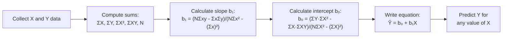

# Introduction to Linear Regression: Prediction and the Regression Equation

## Introduction

Correlation tells us the **strength and direction** of a relationship between two variables. But what if we want to go further — to actually **predict** the value of one variable from another?

**Linear regression** is the statistical method that transforms a correlation into a predictive equation. While correlation answers "How strongly are X and Y related?", regression answers "Given a specific value of X, what value of Y can I predict?"

Regression is the natural next step beyond correlation, and it serves as the conceptual bridge to **multiple regression** — the most widely used statistical method in contemporary psychological research. Understanding simple linear regression is essential for interpreting research findings in journals, conducting your own research, and building toward more complex multivariate analyses.

---

**Source PDFs**:
- 📄 [Block-2/Unit-3.pdf — Pages 53–56](/pdfs/MPC-006%20Statistics%20in%20Psychology/Block-2/Unit-3.pdf)
- 📚 MPC-006 Statistics in Psychology, Block 2: Correlation and Regression

---

## From Scatter Plot to Regression Line

Recall from Unit 1 that a scatter diagram plots pairs of scores (X, Y) for each subject. In a positive correlation, higher X values tend to pair with higher Y values. In a negative correlation, the opposite.

We can draw a line through these scattered points — but which line? The **regression line** (also called the **best-fit line** or **line of least squares**) is the one that comes as close as possible to all the data points simultaneously.

Formally, the regression line minimises the **sum of squared residuals** — the differences between each observed Y value and the Y value predicted by the line. This criterion is called the **method of least squares** (OLS — Ordinary Least Squares).

### Guidelines for Using Regression Lines

1. **Use regression only when there is a significant correlation** — if X and Y aren't related, a regression line has no predictive meaning
2. **Do not extrapolate beyond the data range** — if data runs from X = 10 to X = 60, don't predict for X = 400; the linear relationship may not hold outside that range
3. **Don't apply one population's regression line to another** — a regression equation from urban Indian students may not apply to rural students
4. **Regression ≠ causation** — even a perfect regression equation doesn't establish that X causes Y

---

## The Regression Equation

The equation for a **simple linear regression** (one predictor X, one outcome Y) is:

$$\hat{Y} = a + bX$$

Or at the population level:
$$Y = \alpha + \beta X + \varepsilon$$

Where:
| Symbol | Name | Meaning |
|---|---|---|
| $\hat{Y}$ | Predicted Y | The value of Y predicted from a given X |
| Y | Observed Y | Actual score on the outcome variable |
| a | Y-intercept (sample) | Value of $\hat{Y}$ when X = 0; estimator of α |
| b | Slope (sample) | Rate of change in Y per unit increase in X; estimator of β |
| α (alpha) | Population intercept | True population Y-intercept |
| β (beta) | Population slope | True population regression coefficient |
| ε (epsilon) | Error / Residual | Difference between predicted and actual Y |

**Terminology note**:
- Y is the **criterion variable** (also called dependent variable or outcome)
- X is the **predictor variable** (also called independent variable)
- b is the **regression coefficient** (slope)
- a is the **regression constant** (intercept)

### The Slope Formula

The slope b can be calculated as:

$$b = r \times \frac{S_Y}{S_X}$$

This elegant formula shows that the regression slope is the correlation coefficient **scaled by the ratio of standard deviations** of Y to X. This connects regression directly to correlation.

---

## Computing the Regression Equation: Raw Score Formula

Using the sums of X, Y, X², Y², and XY:

**Slope (b₁)**:
$$b_1 = \frac{N\sum XY - \sum X \sum Y}{N\sum X^2 - (\sum X)^2}$$

**Intercept (b₀)**:
$$b_0 = \frac{\sum Y \cdot \sum X^2 - \sum X \cdot \sum XY}{N\sum X^2 - (\sum X)^2}$$

### Worked Example

Given data:

| X | Y |
|---|---|
| 1 | 4 |
| 3 | 2 |
| 4 | 1 |
| 5 | 0 |
| 8 | 0 |

**Compute sums**: ΣX = 21, ΣY = 7, ΣX² = 115, ΣY² = 21, ΣXY = 14, N = 5

**Slope**:
$$b_1 = \frac{5 \times 14 - 21 \times 7}{5 \times 115 - 21^2} = \frac{70 - 147}{575 - 441} = \frac{-77}{134} = -0.575$$

**Intercept**:
$$b_0 = \frac{7 \times 115 - 21 \times 14}{5 \times 115 - 21^2} = \frac{805 - 294}{134} = \frac{511}{134} = 3.81$$

**Regression equation**: $\hat{Y} = 3.81 - 0.575X$

**Using it for prediction**:
- If X = 2: $\hat{Y} = 3.81 - 0.575(2) = 3.81 - 1.15 = 2.66$
- If X = 6: $\hat{Y} = 3.81 - 0.575(6) = 3.81 - 3.45 = 0.36$

---

## Interpreting the Regression Equation

### The Slope (b)

The slope tells us: **For every one-unit increase in X, Y is predicted to change by b units**.

- **Positive slope**: As X increases, predicted Y increases
- **Negative slope**: As X increases, predicted Y decreases
- **Magnitude**: Larger |b| = steeper line = stronger rate of change

**Example**: b = −0.575 means for every additional unit of X, Y is predicted to decrease by 0.575 units.

### The Intercept (a)

The intercept is the predicted Y when X = 0. It anchors the regression line on the Y-axis.

**Important caveat**: If X = 0 is outside the range of observed data, the intercept has no meaningful real-world interpretation — it's merely a mathematical anchor for the line.

### The Residual (e)

The residual for each data point is:
$$e_i = Y_i - \hat{Y}_i$$

- Positive residual: Actual Y is higher than predicted
- Negative residual: Actual Y is lower than predicted
- Sum of all residuals: Always equals zero (property of OLS)
- Sum of squared residuals: The quantity minimised by OLS

---

## Regression and Partial Correlation: The Connection

The regression framework also provides an alternative interpretation of **partial correlation**:

For the academic achievement (A), anxiety (B), intelligence (C) example:

**Regression 1**: Academic Achievement = a₁ + b₁ × Intelligence + e₁
- e₁ = residual of academic achievement after removing intelligence's linear contribution

**Regression 2**: Anxiety = a₂ + b₂ × Intelligence + e₂
- e₂ = residual of anxiety after removing intelligence's linear contribution

**Partial correlation r_AB.C = Pearson's r between e₁ and e₂**

This shows that partial correlation literally compares the "leftover" variations in each variable once both have been purged of the confound's influence. The regression framework makes this conceptually concrete and computationally precise.

Similarly, **semipartial correlation** = Pearson's r between A (unchanged) and e₁ (residual of B after regressing on C).

---

## Standardised vs. Unstandardised Regression

In psychology, two forms of the regression coefficient are reported:

| Type | Symbol | Scale | Use |
|---|---|---|---|
| Unstandardised | b | Original units of X and Y | Practical interpretation (e.g., for each hour of study, marks increase by 2.3 points) |
| Standardised | β (beta weight) | Standard deviation units | Comparing predictors within a model (who predicts more?) |

The standardised regression coefficient β is related to correlation:
$$\beta = r \times \frac{S_X}{S_Y} \quad \text{(simple regression, one predictor)}$$

In simple regression (one predictor), β = r (the correlation coefficient). In multiple regression, each β reflects the unique contribution of that predictor while holding others constant.

---

## Practical Applications in Psychological Research

### Educational Psychology

**Admissions prediction**: Universities use regression equations to predict student GPA (Y) from entrance exam scores (X). The regression coefficient tells admissions officers: "For each 10-point increase in entrance score, expected GPA increases by 0.15 points."

### Clinical Psychology

**Treatment outcome prediction**: Regression models predict post-treatment depression scores (Y) from baseline severity (X). Residuals represent how much a patient's outcome differs from what their baseline would predict — a measure of "treatment response" above and beyond starting level.

### Occupational Psychology

**Performance prediction**: Job performance (Y) predicted from interview ratings, cognitive ability scores, and personality scores (X₁, X₂, X₃) using multiple regression. The regression equation becomes an empirically-derived selection tool.

### Indian Context 🇮🇳

- **NEET and JEE prediction models**: Educational consultancies in India build regression models predicting board exam performance from mock test scores, study hours, and coaching attendance
- **NIMHANS outcome research**: Predicting length of psychiatric hospitalisation from admission severity, family support, and treatment compliance
- **Rural development research (ICSSR)**: Regression used to predict agricultural yield from rainfall, fertiliser use, and technology adoption in rural Indian samples

---

## Memory Aids 🧠

### The Regression Equation: "ACE"
- **A** = **a** (intercept — where line hits Y-axis)
- **C** = **coefficient** (b — slope — rate of change)
- **E** = **error** (ε or e — residual — prediction miss)

$$\hat{Y} = a + bX \quad (+e \text{ for actual Y})$$

### Slope vs. Intercept: "SLOPE goes Slanting, INTERCEPT is where it Intersects Y"
- **Slope** (b): How steeply the line goes up or down
- **Intercept** (a): Where the line crosses the Y-axis (X = 0)

### Regression-Correlation Link: "b = r × (Sy/Sx)"
The slope is the correlation scaled by the standard deviation ratio. When both variables are standardised (mean = 0, SD = 1), b = r exactly — this is the standardised coefficient β.

---

## External Resources 🔗

### Wikipedia Articles
- 📖 [Simple Linear Regression](https://en.wikipedia.org/wiki/Simple_linear_regression) — Full mathematical derivation
- 📖 [Ordinary Least Squares](https://en.wikipedia.org/wiki/Ordinary_least_squares) — The minimisation principle
- 📖 [Regression Analysis](https://en.wikipedia.org/wiki/Regression_analysis) — Overview and history

### Educational Videos
- 🎥 [Linear Regression — CrashCourse Statistics #32](https://www.youtube.com/watch?v=WWqE7YHR4Jc) — Accessible visual introduction
- 🎥 [Regression Line Explained (Khan Academy)](https://www.khanacademy.org/math/statistics-probability/describing-relationships-quantitative-data/regression-library/v/introduction-to-residuals-and-least-squares-regression) — Residuals and least squares

### Research Articles
- 📄 [Regression in Psychological Research (Field, 2013)](https://www.discoveringstatistics.com) — Andy Field's comprehensive treatment
- 📄 [Understanding Regression Output in Psychology (2021)](https://www.frontiersin.org/articles/10.3389/fpsyg.2021.639355/full) — Guide to interpreting regression tables

### Online Tools
- 🔧 [Regression Calculator (SocSciStats)](https://www.socscistatistics.com/tests/regression/default.aspx) — Simple regression with output
- 🔧 [Desmos Regression Tool](https://www.desmos.com/calculator) — Visual regression line fitting
- 🔧 [Regression Line Simulator (GeoGebra)](https://www.geogebra.org/m/xC6zq7Zv) — Interactive slope and intercept exploration

---

## Self-Assessment Questions ✅

### Recall Level
1. What is the regression equation for simple linear regression? Define each term.
2. What is the "method of least squares" and why is it used?
3. Write the formula linking the slope (b) to the correlation coefficient (r).

### Understanding Level
4. A regression equation predicting exam marks (Y) from study hours (X) is: Ŷ = 40 + 3.5X. Interpret (a) the slope and (b) the intercept. What predicted marks would a student who studies 5 hours receive?
5. Why should we not use a regression line when the correlation between X and Y is not statistically significant?
6. How do regression residuals connect to the concept of partial correlation?

### Application Level
7. A researcher has: ΣX = 50, ΣY = 100, ΣX² = 350, ΣXY = 580, N = 10. Compute the regression equation Ŷ = a + bX. Use it to predict Y when X = 8.
8. An Indian educational researcher finds that for Class 10 students, the regression of board marks (Y) on hours of self-study (X) gives: Ŷ = 35 + 4.2X. (a) What does the slope mean in practical terms? (b) Predict marks for a student studying 8 hours. (c) Is it appropriate to predict marks for 20 hours of study? Why or why not?

---

## Summary

**Simple linear regression** extends correlation by creating a predictive equation: Ŷ = a + bX. The **slope (b)** tells us how much Y changes for each unit increase in X; it equals r × (S_Y/S_X). The **intercept (a)** is the predicted Y when X = 0. The **method of least squares** (OLS) determines the best-fit regression line by minimising the sum of squared residuals. Regression is only meaningful when the correlation is statistically significant, should not be extrapolated beyond the data range, and never implies causation. Regression residuals directly connect to partial and semipartial correlations, making regression the conceptual foundation for all multivariate methods in psychology.
