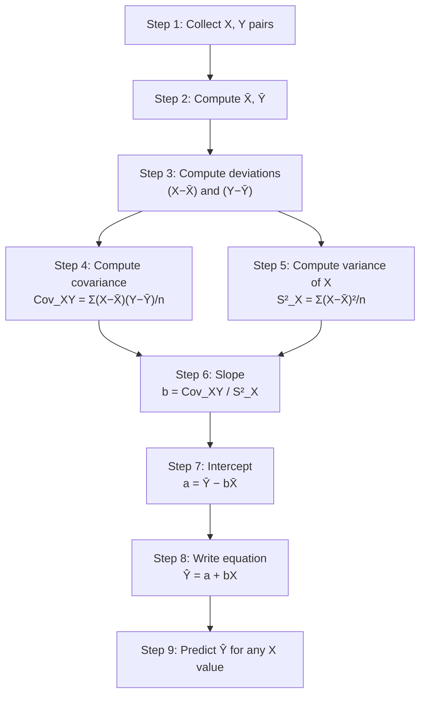
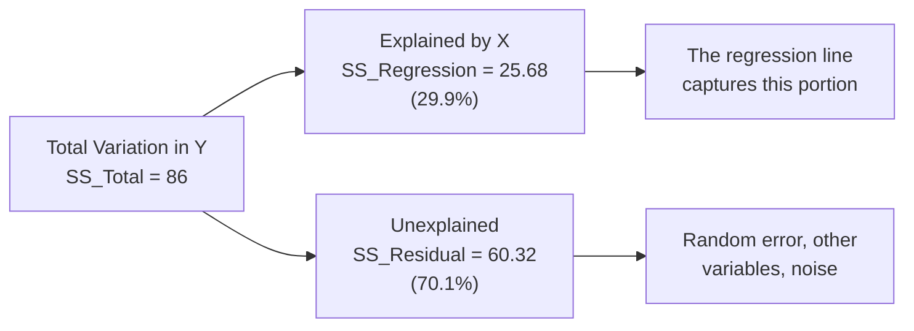

# Bivariate Regression: OLS Computation and the Regression Equation

## Introduction

Psychologists — like meteorologists, economists, and medical researchers — are deeply interested in **prediction**. Can we predict a patient's likelihood of missing therapy appointments? Can we forecast a student's academic performance from their anxiety scores? Can we estimate a person's coping ability from their level of social support?

**Regression analysis** is the statistical engine behind all such predictions. While correlation tells us the *strength and direction* of a relationship, regression gives us an actual **equation** to predict the value of one variable from another.

In this unit, we focus on **bivariate (simple linear) regression** — the foundational case with one predictor variable (X) and one outcome variable (Y). Understanding this thoroughly is the key to multiple regression, which adds multiple predictors to the equation.

Historically, regression was developed by **Carl Frederick Gauss** (method of least squares, 1809) and later named "regression" by **Sir Francis Galton** in the late 1800s through his work on heredity and the tendency of measurements to "regress toward the mean."

---

**Source PDFs**:
- 📄 [Block-2/Unit-4.pdf — Pages 65–76](/pdfs/MPC-006%20Statistics%20in%20Psychology/Block-2/Unit-4.pdf)
- 📚 MPC-006 Statistics in Psychology, Block 2: Correlation and Regression

---

## Terminology: Criterion and Predictor Variables

| Term | Symbol | Also Called | Role |
|---|---|---|---|
| **Criterion variable** | Y | Dependent variable, outcome | The variable being predicted |
| **Predictor variable** | X | Independent variable | The variable used to predict Y |

> ⚠️ **Note**: In experimental psychology, "independent variable" means a variable *manipulated* by the researcher. In regression, it simply means a variable used to predict — it may not be manipulated at all.

### Psychological Examples of Predictor → Criterion

| Predictor (X) | → | Criterion (Y) |
|---|---|---|
| Stress | → | Health deterioration |
| Openness to experience | → | Creativity |
| Extraversion | → | Social acceptance |
| Social support | → | Coping with mental health problems |
| Stigma about mental illness | → | Help-seeking behaviour |
| Parental intelligence | → | Child's intelligence |
| Affective commitment | → | Attitude to job |

---

## Perfect vs. Imperfect Relationships

### Perfect Linear Relationship

Consider five swimmers and their practice hours (X) vs. race time (Y):

| Swimmer | Hours of Practice (X) | Time Taken in seconds (Y) |
|---|---|---|
| A | 1 | 50 |
| B | 2 | 45 |
| C | 3 | 40 |
| D | 4 | 35 |
| E | 5 | 30 |

When plotted, **all five points fall exactly on a straight line**. The relationship is perfectly linear: for every additional hour of practice, time decreases by exactly 5 seconds.

**Slope calculation** (using any two points):
$$b = \frac{Y_2 - Y_1}{X_2 - X_1} = \frac{45 - 40}{2 - 3} = \frac{5}{-1} = -5$$

**Y-intercept**: Where the line crosses the Y-axis = 55.

**Regression equation**: $\hat{Y} = 55 - 5X$

**Prediction**: For X = 6 hours: $\hat{Y} = 55 - 5(6) = 55 - 30 = 25$ seconds (close to world records!)

### Imperfect (Real) Relationship

Real psychological data is **never** perfectly linear. Consider 10 mental health patients: their Stigma scale scores (X) and number of therapy appointments missed (Y). When plotted, the points scatter around an imaginary line — no single line passes through all points.

This is the norm in psychology. The challenge: **which line best represents this imperfect relationship?**

This is where **Ordinary Least Squares (OLS)** comes in.

---

## Building Blocks: Mean, Variance, and Covariance

Before computing regression, we need three key statistics:

### Mean

$$\bar{X} = \frac{\sum X_i}{n}, \quad \bar{Y} = \frac{\sum Y_i}{n}$$

### Variance

$$S_X^2 = \frac{\sum(X - \bar{X})^2}{n}$$

### Covariance

$$Cov_{XY} = \frac{\sum(X - \bar{X})(Y - \bar{Y})}{n}$$

These three are the **building blocks** of regression, just as they are for correlation.

---

## The Regression Equation

### Population Level

$$Y = \alpha + \beta X + \varepsilon$$

| Symbol | Meaning |
|---|---|
| Y | Actual observed Y value |
| α (alpha) | Population Y-intercept (unknown parameter) |
| β (beta) | Population slope (unknown parameter) |
| ε (epsilon) | Random error/residual |

Since α and β are **population parameters** that can never be directly calculated, we **estimate** them from sample data:

### Sample Level

$$Y = a + bX + e \quad \text{(actual)}$$
$$\hat{Y} = a + bX \quad \text{(predicted)}$$

| Symbol | Meaning | Estimates |
|---|---|---|
| a | Sample Y-intercept (regression constant) | α |
| b | Sample slope (regression coefficient) | β |
| e | Sample residual | ε |
| $\hat{Y}$ | Predicted Y value | — |

The **residual** for each subject is:
$$e_i = Y_i - \hat{Y}_i$$

It is the difference between the actual Y and the predicted Y for that observation.

---

## Ordinary Least Squares (OLS): Finding the Best-Fit Line

There are infinitely many lines that could be drawn through a scatter of points. OLS selects the **unique best-fit line** by minimising the sum of **squared residuals**:

$$\text{Minimise: } \sum(Y - \hat{Y})^2 = \sum e_i^2$$

Why square the residuals?
- Without squaring, positive and negative residuals cancel out (their sum is always zero)
- Squaring weights larger errors more heavily, penalising big prediction mistakes

The line that minimises $\sum(Y-\hat{Y})^2$ is the **best-fit regression line**, also called the **OLS line** or **line of least squares**.

### Formulas for a and b

**Slope (b)**:
$$b = \frac{Cov_{XY}}{S_X^2} = \frac{\sum(X-\bar{X})(Y-\bar{Y})}{n \cdot S_X^2}$$

Or equivalently: $b = r \cdot \frac{S_Y}{S_X}$

**Intercept (a)**:
$$a = \bar{Y} - b\bar{X}$$

The intercept formula follows directly from the fact that the regression line **always passes through the point** ($\bar{X}$, $\bar{Y}$) — the intersection of the two means.

---

## Worked Example: Stigma and Appointments Missed

### Research Question

Can **stigma scores** (X) predict the **number of therapy appointments missed** (Y)?

### Data (10 patients — King, Shwe et al. Stigma Scale)

| Patient | Stigma (X) | Appts Missed (Y) | X−X̄ | Y−Ȳ | (X−X̄)² | (Y−Ȳ)² | (X−X̄)(Y−Ȳ) |
|---|---|---|---|---|---|---|---|
| 1 | 60 | 5 | −1 | −1 | 1 | 1 | 1 |
| 2 | 50 | 2 | −11 | −4 | 121 | 16 | 44 |
| 3 | 70 | 9 | 9 | 3 | 81 | 9 | 27 |
| 4 | 73 | 6 | 12 | 0 | 144 | 0 | 0 |
| 5 | 64 | 9 | 3 | 3 | 9 | 9 | 9 |
| 6 | 68 | 4 | 7 | −2 | 49 | 4 | −14 |
| 7 | 56 | 3 | −5 | −3 | 25 | 9 | 15 |
| 8 | 54 | 8 | −7 | 2 | 49 | 4 | −14 |
| 9 | 49 | 3 | −12 | −3 | 144 | 9 | 36 |
| 10 | 66 | 11 | 5 | 5 | 25 | 25 | 25 |
| **Σ** | **610** | **60** | **0** | **0** | **648** | **86** | **129** |

**Step-by-step calculation**:

**Means**: $\bar{X} = 610/10 = 61$, $\bar{Y} = 60/10 = 6$

**Standard deviations**:
$$S_X = \sqrt{648/10} = \sqrt{64.8} = 8.05, \quad S_Y = \sqrt{86/10} = \sqrt{8.6} = 2.93$$

**Covariance**:
$$Cov_{XY} = 129/10 = 12.9$$

**Slope**:
$$b = \frac{Cov_{XY}}{S_X^2} = \frac{12.9}{64.8} = 0.199$$

**Intercept**:
$$a = \bar{Y} - b\bar{X} = 6 - (0.199 \times 61) = 6 - 12.14 = -6.14$$

**Regression equation**:
$$\hat{Y} = -6.14 + 0.199X$$

### Generating Predictions

| Patient | Stigma (X) | Actual Y | Predicted Ŷ = −6.14 + 0.199X | Residual (Y − Ŷ) |
|---|---|---|---|---|
| 1 | 60 | 5 | 5.80 | −0.80 |
| 2 | 50 | 2 | 3.81 | −1.81 |
| 3 | 70 | 9 | 7.79 | 1.21 |
| 4 | 73 | 6 | 8.39 | −2.39 |
| 5 | 64 | 9 | 6.60 | 2.40 |
| 6 | 68 | 4 | 7.39 | −3.39 |
| 7 | 56 | 3 | 5.00 | −2.00 |
| 8 | 54 | 8 | 4.61 | 3.39 |
| 9 | 49 | 3 | 3.61 | −0.61 |
| 10 | 66 | 11 | 7.00 | 4.00 |
| **Σ** | | **60** | **60** | **0** |

> ✅ **Verification**: The sum of all residuals always equals **zero** — this is a property of OLS. If your residuals don't sum to zero, there's a computation error.

---

## Variance Decomposition: Total, Explained, and Residual

A key concept in regression is **variance decomposition** — partitioning the total variation in Y into:

$$SS_{Total} = SS_{Regression} + SS_{Residual}$$

$$\sum(Y - \bar{Y})^2 = \sum(\hat{Y} - \bar{Y})^2 + \sum(Y - \hat{Y})^2$$

| Component | Symbol | Formula | Meaning |
|---|---|---|---|
| **Total** | SS_T | $\sum(Y-\bar{Y})^2$ | Total variation in Y |
| **Regression** (Explained) | SS_R | $\sum(\hat{Y}-\bar{Y})^2$ | Variation explained by X via the regression line |
| **Residual** (Error) | SS_e | $\sum(Y-\hat{Y})^2$ | Variation not explained — prediction error |

**For our example**:
- SS_Total = 86
- SS_Regression = 25.68
- SS_Residual = 60.32 ✅ (86 = 25.68 + 60.32)

---

## Interpreting the Regression Equation

### The Intercept (a = −6.14)

The intercept is the predicted Y when X = 0. In this case, it would predict **−6.14 appointments missed** when stigma = 0 — which is impossible (you can't miss negative appointments).

**Why is this interpretation invalid?**
1. The data range for stigma was 49–73; X = 0 is far outside this range
2. Stigma of 0 is theoretically impossible for these clinical patients
3. The intercept is a mathematical anchor, not always a meaningful value

> 💡 **Rule**: Only interpret the intercept when X = 0 is within the data range AND theoretically meaningful.

### The Slope (b = 0.199)

The slope has a direct, meaningful interpretation:

**"For every 1-unit increase in stigma score, the number of appointments missed increases by 0.199."**

Or equivalently: **"For every 5-point increase in stigma, approximately 1 additional appointment is missed."**

This is the most important parameter in regression — it captures the rate of change of Y with X.

---

## Memory Aids 🧠

### Computing a and b: "COV over VAR, then MEAN minus b-MEAN"
- **b = COVariance(XY) / VARiance(X)**
- **a = Ȳ − b × X̄**

### OLS Principle: "SMALLEST SQUARED ERRORS wins"
OLS finds the line where the **sum of squared errors is smallest**. No other line can have a smaller Σ(Y−Ŷ)².

### Residual Check: "Residuals SUM to ZERO"
If $\sum e_i \neq 0$, you made a computation error. Use this as a built-in quality check.

### Key Interpretations: "b is RATE, a is WHERE"
- **b** (slope): **RATE** of change in Y for each unit increase in X
- **a** (intercept): **WHERE** the regression line crosses the Y-axis (only meaningful if X=0 is in range)

---

## Indian Research Context 🇮🇳

Bivariate regression is used extensively across Indian psychological and educational research:

- **NIMHANS patient outcome research**: Predicting number of treatment sessions needed (Y) from baseline clinical severity scores (X). The regression equation helps clinicians estimate treatment burden before starting therapy
- **NCERT and school studies**: Predicting board exam performance (Y) from class participation scores (X), providing early warning systems for underperforming students
- **ICSSR labour market research**: Predicting job satisfaction (Y) from monthly income (X) in Indian blue-collar samples, with findings informing labour policy
- **Rural mental health programmes**: In community mental health outreach in Maharashtra and Rajasthan, regression models predict follow-up compliance (Y) from initial engagement scores (X) — critical for resource allocation in under-served areas

---

## External Resources 🔗

### Wikipedia Articles
- 📖 [Simple Linear Regression](https://en.wikipedia.org/wiki/Simple_linear_regression) — Derivation of OLS formulas
- 📖 [Ordinary Least Squares](https://en.wikipedia.org/wiki/Ordinary_least_squares) — Mathematical proof of the OLS principle
- 📖 [Regression toward the Mean](https://en.wikipedia.org/wiki/Regression_toward_the_mean) — Galton's original concept

### Educational Videos
- 🎥 [Regression and Residuals — CrashCourse Statistics #33](https://www.youtube.com/watch?v=yMgFHbjbAW8) — Visual intuition for OLS
- 🎥 [Computing Slope and Intercept by Hand (Khan Academy)](https://www.khanacademy.org/math/statistics-probability/describing-relationships-quantitative-data/regression-library/v/calculating-the-equation-of-a-regression-line) — Step-by-step worked example

### Research Articles
- 📄 [Simple Linear Regression in Medical Research (2010)](https://www.ncbi.nlm.nih.gov/pmc/articles/PMC3049417/) — Practical application guide
- 📄 [Regression Analysis in Psychology (Cohen et al., 2003)](https://www.routledge.com/Applied-Multiple-RegressionCorrelation-Analysis-for-the-Behavioral-Sciences/Cohen-Cohen-West-Aiken/p/book/9780805822236) — The definitive textbook
- 📄 [Understanding OLS Regression (Hutcheson, 2011)](https://methods.sagepub.com/book/the-multivariate-social-scientist/n2.xml) — Conceptual treatment for social scientists

### Online Tools
- 🔧 [Regression Line Calculator (SocSciStats)](https://www.socscistatistics.com/tests/regression/default.aspx) — Computes a, b, r², F with input data
- 🔧 [Desmos Regression Visualiser](https://www.desmos.com/calculator) — Interactive scatter and regression line
- 🔧 [GeoGebra Least Squares Demo](https://www.geogebra.org/m/xC6zq7Zv) — See OLS in action interactively
- 🔧 [Regression Applet (Rossman/Chance)](http://www.rossmanchance.com/applets/RegShuffle.htm) — Explore how removing points affects the regression line

---

## Self-Assessment Questions ✅

### Recall Level
1. What is the regression equation at the sample level? Define all terms.
2. Write the formulas for computing the OLS slope (b) and intercept (a).
3. What is the "ordinary least squares" (OLS) criterion? What quantity does it minimise?

### Understanding Level
4. In the stigma-appointments example, b = 0.199. Interpret this slope in plain language. What does it tell a mental health service manager?
5. Why is the intercept (a = −6.14) in the stigma example not a meaningful value? Under what conditions would the intercept be interpretable?
6. The sum of residuals always equals zero in OLS regression. Why? What does this property tell you about the regression line and the mean of Y?

### Application Level
7. A researcher collects data on social anxiety (X) and academic avoidance behaviour (Y) from n = 15 students. Key statistics: X̄ = 45, Ȳ = 12, S²_X = 36, Cov_XY = 18. (a) Compute the slope b. (b) Compute the intercept a. (c) Write the regression equation. (d) Predict Y for a student with X = 50.
8. Using the data from IGNOU MAPC research: marks obtained in entrance test (X) predicts first-year performance (Y), with X̄ = 65, Ȳ = 70, S²_X = 100, S²_Y = 144, r = +0.78. (a) Use b = r × (S_Y/S_X) to find b. (b) Find a. (c) Interpret the slope for an admissions committee.

### Critical Thinking Level
9. A regression equation predicts life satisfaction (Y) from income (X) in a sample of Indian urban professionals. The equation is Ŷ = 3.2 + 0.008X, where X is in rupees per month. A new employee earns ₹50,000/month. What is their predicted satisfaction? Now, a CEO earns ₹5,000,000/month. Is it appropriate to use this equation for the CEO? Why or why not?
10. Two regression equations are built for the same data using two different methods. Both give the same predicted values for all data points. Is this possible, or does OLS guarantee a unique solution? Explain.

---

## Summary

**Bivariate regression** uses one predictor variable (X) to predict a criterion variable (Y). The **regression equation** Ŷ = a + bX is found using **Ordinary Least Squares (OLS)** — the method that minimises the sum of squared residuals $\sum(Y-\hat{Y})^2$. The **slope (b)** is computed as Cov_XY / S²_X and represents the rate of change of Y per unit increase in X. The **intercept (a)** is $\bar{Y} - b\bar{X}$ and represents the predicted Y when X = 0. Total variance in Y decomposes into **SS_Regression** (explained) and **SS_Residual** (unexplained). Residuals always sum to zero. The intercept is only meaningful when X = 0 is within the data range and theoretically interpretable.

➡️ *Next: [Significance Testing and Accuracy of Regression — F-test, r², Standard Error, and PIP](/mpc-006/block-2/regression-significance-accuracy)*
